# Java 中的选择排序

> 原文：<https://www.educba.com/selection-sort-in-java/>

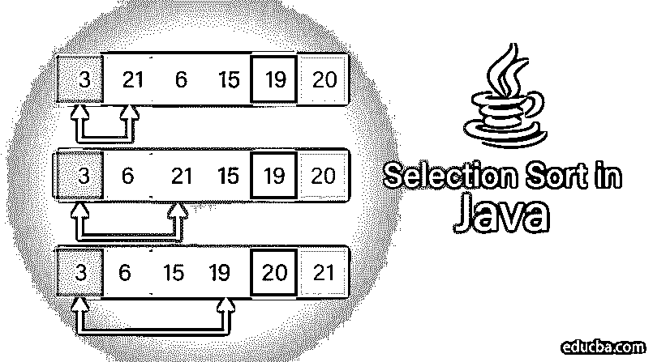


## Java 中的选择排序介绍

Java 中的选择排序(Selection Sort)是一种在未排序的部分不断寻找最小元素并保持在开头的排序方法(用于升序排序)。这个过程将一直重复，直到输入数组被排序。此外，在选择排序中，我们将把输入数组分成两个子数组，其中一个数组用于已排序的元素，另一个数组用于未排序的元素。开始时，排序后的子数组中不会有任何元素。让我们在下一节中详细了解选择排序的工作原理。

### 选择排序在 Java 中如何工作

选择排序以一种简单的方式工作，它从输入数组中保留两个子数组。它们是:

<small>网页开发、编程语言、软件测试&其他</small>

*   排序的子数组，用于保存排序的元素
*   未排序的子数组，用于保留未排序的元素。

#### 算法

以下是用于选择排序的[算法](https://www.educba.com/selection-sort-in-data-structure/)

1.  将最小(MIN)指针设置到位置 0。
2.  从数组的元素列表中找出最小的元素

*   将最小元素与位置 0 交换

1.  将最小指针移动到下一个位置
2.  重复该过程，直到输入数组被排序。

让我们用一个例子来理解选择排序。下面是需要排序的输入数组。蓝色粗体的元素将作为排序数组的一部分。


**步骤 1** :将最小指针设置到第一个位置。所以，MIN 指针指向 15。

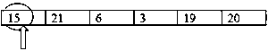


最小:= 15

**第二步**:通过与其余元素的比较，找到最小的元素。对比 15 和 21，15 是最小的。所以，最小的不会在这种情况下改变。

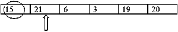


最小:= 15

比较 15 和 6，6 是最小的。

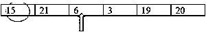


最小:= 6

比较 6 和 3，3 是最小的。

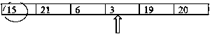


最小:= 3

在这种情况下，3 也会变小，因为 19 大于 3。

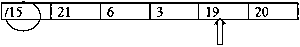


最小:= 3

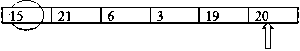


最小:= 3

最后，在这个迭代中，发现 3 是最小的。

**第三步**:将最小的元素与位置 0 的元素交换。


**步骤 4:** 将 MIN 指针递增至下一个位置。

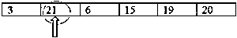


**第五步:**通过与其余元素进行比较，找到下一个最小的元素。

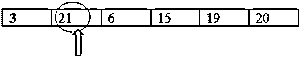


最小:= 21

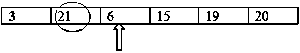


最小:= 6

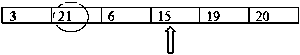


最小:= 6

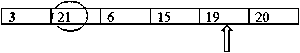


最小:= 6

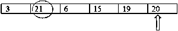


最小:= 6

**第六步:**将最小的元素与位置 1 的元素交换。


重复这个过程，直到形成一个排序的数组，如下所示。


### 用 Java 实现选择排序的例子

如上所述，选择排序是基于寻找最小值和[交换](https://www.educba.com/swapping-in-java/)。现在，让我们看看如何使用 Java 实现选择排序。

#### 使用选择排序对数组中的元素进行排序的 Java 程序

**代码:**

```
import java.util.*;
public class SelSortExample {
//Method that implements Selectionsort
public static void selsort(int[] arr)
{
int n=arr.length; //length of the array
for(int i=0;i<n-1;i++)
{
int MIN=i; //set the first position as minimum
System.out.println("Sorting based on Number "+(i+1));
//Find the smallest element by comparing with the element in MIN position
for(int j=i+1;j<n;j++)
{
System.out.println("Comparing "+ arr[MIN] + " and " + arr[j]);
if(arr[j]<arr[MIN])
{
System.out.println(arr[MIN] + " is greater than " + arr[j] );
MIN=j;
}
}
//Swap the smallest element with element in MIN position
int temp=arr[i];
arr[i]=arr[MIN];
arr[MIN]=temp;
}
}
public static void main(String[] args) {
int[] arr= {15,21,6,3,19,20}; // input array
System.out.println("Elements in the array before Sorting: "+ Arrays.*toString*(arr));
*selsort*(arr);//calling the selection sort method
System.out.println("Elements in the array after Sorting: "+Arrays.*toString*(arr));
}
}
```

**样本输出:**

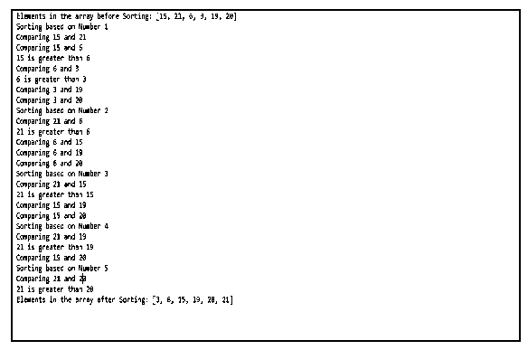


在上面的程序中，我们有两种方法——main 方法和 sell sort 方法。main 方法调用 sell sort 方法，将输入数组作为参数传递。最小元素将被识别并与 MIN 指向的元素交换。

当代码中没有定义输入数组时，也可以使用选择排序。让我们用下面的程序来看看它是如何工作的。

#### 使用选择排序对元素进行排序的 Java 程序

**代码:**

```
import java.util.*;
public class SelectionSortExample
{
public static void main(String args[])
{
int n, i, j, tempvar;
Scanner <u>sc</u> = new Scanner(System.in); //To take the input from user
System.out.print("Enter the size of array : \n");
n = sc.nextInt();
int array[] = new int[n]; //<u>initialising</u> the array
System.out.print("Enter the elements that need to be inserted in the array : \n");
//inserting the elements to the array
for(i=0; i<n; i++)
{
array[i] = sc.nextInt();
}
System.out.print("array before Sorting: \n"+ Arrays.toString(array));
System.out.print("\nSorting begins here..\n");
for(i=0; i<n; i++)
{
for(j=i+1; j<n; j++)
{
if(array[i] > array[j])
{
tempvar = array[i];
array[i] = array[j];
array[j] = tempvar;
}
}
}
System.out.print("Array after Sorting is :\n");
for(i=0; i<n; i++)
{
System.out.print(array[i]+ " ");
}
}
}
```

**样本输出:**

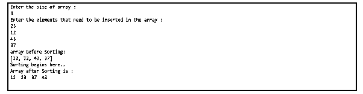


这里，用户给出的输入元素将与临时变量进行比较并交换。将重复该过程，直到形成排序的数组。

### 选择排序的性能

这种排序技术的使用是因为它的简单性以及相对于其他排序技术的某些其他性能优势。

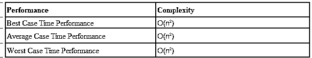


### 结论

选择排序在大型列表上不能有效地工作，因为它消耗更多的比较时间。选择排序是一种方法，在这种方法中，输入数组将被分成两个子数组，以保持它们是排序的和未排序的元素。数组中的最小元素将与第一个位置的元素交换，并且该过程继续，直到形成排序后的数组。

### 推荐文章

这是一个 Java 中选择排序的指南。这里我们讨论选择排序的介绍、工作和性能，并给出一些例子。您也可以阅读以下文章，了解更多信息——

1.  [Java 中的合并排序](https://www.educba.com/merge-sort-in-java/)
2.  [Java 中的堆排序](https://www.educba.com/heap-sort-in-java/)
3.  [复制 Java 中的构造函数](https://www.educba.com/copy-constructor-in-java/)
4.  [Java 中的星型模式](https://www.educba.com/star-patterns-in-java/)
5.  [Python 中的堆排序](https://www.educba.com/heap-sort-in-python/)


