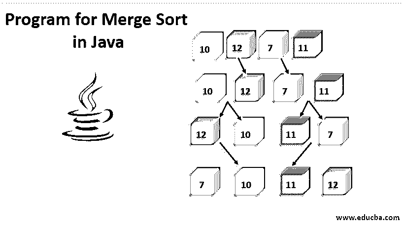
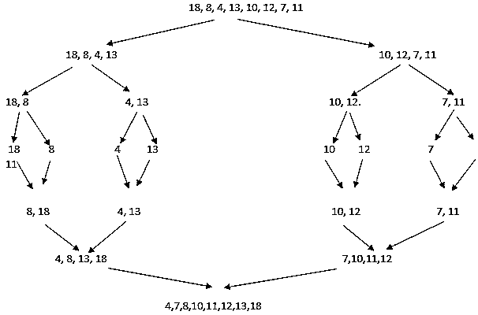
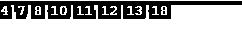

# Java 中的合并排序程序

> 原文：<https://www.educba.com/program-for-merge-sort-in-java/>




## Java 中的合并排序介绍

Java 中的归并排序程序是应用最广泛、最有效的算法之一。合并排序基于分治技术，它涉及到将给定的问题分成多个子问题并独立解决每个子问题。当子问题解决后，我们将它们的结果组合起来，得到问题的最终解。合并排序算法可以使用递归实现，因为它涉及处理子问题而不是主问题。

### 合并排序是如何工作的？

让我们考虑一个需要使用合并排序算法排序的未排序数组。以下是对值为 18、8、4、13、10、12、7 和 11 的数组进行排序的步骤:

<small>网页开发、编程语言、软件测试&其他</small>

*   第一步包括找到一个枢纽元素，在此基础上我们的输入数组将被划分为子数组。
*   让我们考虑选择元件 13 作为枢轴；因此，原始阵列将被分成两个子阵列。第一个子阵列将包含 18，8，4，13，第二个子阵列将包含剩余的元素 10，12，7，11。
*   在步骤 2 中获得的子阵列如在步骤 1 中一样被进一步细分，并且这继续。
*   一旦主数组被划分为具有单个元素的子数组，我们就开始再次合并这些子数组，使得合并后的元素是有序的。
*   下面是分而治之的实际运作方式:




### Java 中的合并排序程序

下面是一个代码示例，展示了合并排序在 java 中的实现:

**代码:**

```
package com.edubca.sorting;
public class MergeSort {
private int[] array;
private int[] tempMergedArr;
private int length;
public static void main(String a[]){
int[] inputArr = {18, 8, 4, 13, 10, 12, 7, 11};
MergeSort mergeSort = new MergeSort();
mergeSort.sort(inputArr);
for(int i:inputArr){
System.out.print(i + " ");
}
}
public void sort(int inputArr[]) {
this.array = inputArr;
this.length = inputArr.length;
this.tempMergedArr = new int[length];
performMergeSort(0, length - 1);
}
private void performMergeSort(int lowerIndex, int higherIndex) {
if (lowerIndex < higherIndex) {
int middle = lowerIndex + (higherIndex - lowerIndex) / 2;
// Sort the left side of the array call performMergeSort recursively
performMergeSort(lowerIndex, middle);
// Sort the right side of the array call performMergeSort recursively
performMergeSort(middle + 1, higherIndex);
// Merge subparts using a temporary array
mergeData(lowerIndex, middle, higherIndex);
}
}
private void mergeData (int lowerIndex, int middle, int higherIndex) {
for (int i = lowerIndex; i <= higherIndex; i++) {
tempMergedArr[i] = array[i];
}
int i = lowerIndex;
int j = middle + 1;
int k = lowerIndex;
while (i <= middle && j <= higherIndex) {
if (tempMergedArr[i] <= tempMergedArr[j]) {
array[k] = tempMergedArr[i];
i++;
} else {
array[k] = tempMergedArr[j];
j++;
}
k++;
}
while (i <= middle) {
array[k] = tempMergedArr[i];
k++;
i++;
}
}
}
```

上面的代码将产生一个排序后的数组作为输出。

**输出:**




### 我们什么时候应该使用合并排序？

合并排序可用于以下情况:

*   当要排序的数据结构不支持随机访问时，合并排序会很有帮助并且很有效。
*   当需要高水平的并行性时，可以使用[合并排序](https://www.educba.com/merge-sort-in-python/)，因为不同的子问题可以使用并行运行的多个进程独立解决。
*   使用链表时，合并排序更快，因为在合并列表时指针可以很容易地改变。
*   合并排序可以被认为是一种稳定排序，这意味着数组中的相同元素保持其相对于彼此的原始位置。在需要高稳定性的情况下，可以选择合并排序。

### 归并排序的复杂性分析

下面分分析合并排序的复杂性:

*   合并排序是一种递归算法，在所有三种情况(最坏、最好和平均)下，它的时间复杂度都是 O(n*log n ),因为合并排序将数组分成相等的两半，并花费线性时间来合并它们。
*   合并排序的空间复杂度是 O (n ),因为它在递归方法上操作。因此，合并排序可以被认为是一种快速、节省空间和时间的算法。

### 将合并排序与其他算法进行比较

以下几点比较了合并排序与其他算法:

*   堆排序与归并排序具有相同的时间复杂度，但它只需要 O (1)个辅助空间，而不是归并排序的 O (n)。因此，堆排序比合并排序更节省空间。
*   对于基于 RAM 的数组的排序，快速排序实现通常优于合并排序。
*   当使用链表时，合并排序优于快速排序和堆排序算法，因为指针很容易改变。

### 结论 Java 中的合并排序程序

文章的结论是，对于算法来说，合并排序是一个需要理解的重要概念。

### 推荐文章

这是一个 Java 中合并排序的编程指南。在这里我们讨论应该如何工作，它的用途，合并排序的程序等。您也可以浏览我们的其他相关文章，了解更多信息-

1.  [Java 中的合并排序](https://www.educba.com/merge-sort-in-java/)
2.  [Java 中的归并排序算法](https://www.educba.com/merge-sorting-algorithms-in-java/)
3.  [C 中的堆排序](https://www.educba.com/heap-sort-in-c/)
4.  [Java 中的堆排序](https://www.educba.com/heap-sort-in-java/)


