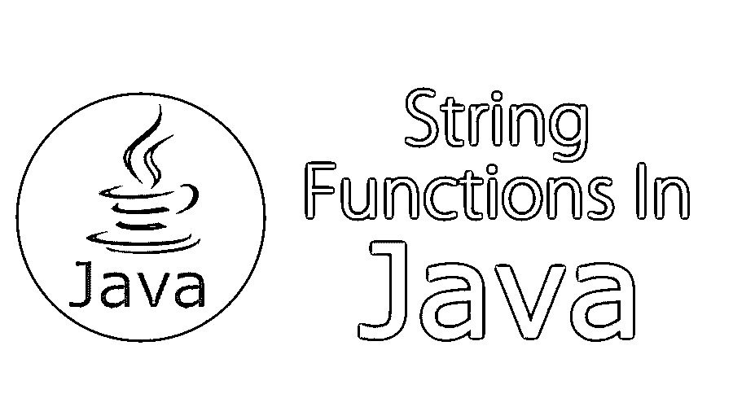
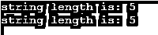

# java 中的字符串函数

> 原文：<https://www.educba.com/string-functions-in-java/>




## Java 中的字符串函数介绍

Java 中提供的许多在字符串中执行操作的方法被称为字符串函数。这些方法是 compare()、concat()、equals()、split()、length()、replace()、compareTo()等等。Java 中的字符串是不变的，它是用文字或关键字创建的。String literal 用于使 Java 内存高效，关键字在普通内存中创建 Java 字符串。该字符串表示一个字符值数组，该类由 Serializable、Comparable 和 CharSequence 接口等三个接口实现。它以序列化或可比较的方式表示字符序列。

### Java 中字符串函数的主要概念

以下是 java 中字符串函数的主要概念:

<small>网页开发、编程语言、软件测试&其他</small>

#### 1.创建字符串

在 Java 中有两种创建字符串对象的方法:

**使用字符串:**Java 中的字符串可以用双引号创建。

**举例:**

```
String s= "Hello World!";
```

**使用 new 关键字:**使用关键字“new”可以创建 Java 字符串。

**举例:**

```
String s=new String ("Hello World!");
```

#### 2.字符串长度

用于获取对象信息的方法在 Java 中称为访问器方法。length()方法就是这样一种与字符串相关的访问器方法。这将返回字符串对象中的字符数。

```
public class Exercise {
public static void main(String args[]){
String s1="Hello";
String s2="World";
System.out.println("string length is: "+s1.length());
System.out.println("string length is: "+s2.length());
}}
```

**输出:**




#### 3.串联字符串

这个方法返回一个新的字符串，它是 string1 和 string2 的组合。Concat()方法可以与字符串文字一起使用来实现这一点。字符串也通常使用+运算符连接。

```
public class ExerciseNew {
public static void main(String args[]){
String s1="Hello";
s1=s1.concat("What is your good name?");
System.out.println(s1);
}}
```

**输出:**


#### 4.创建格式字符串

我们有 printf()和 format()方法来打印带有格式化数字的输出。String 中有一个等价的类方法叫做 format()。它返回一个字符串对象。String 对象中可用的 Static format()方法允许创建可重用的格式化字符串，这与一次性打印语句相反。

### Java 中字符串函数的方法

以下是不同的方法:

| **方法** | **描述** |
| char charAt(int 索引) | 如上所述，它返回特定索引的 char 值。 |
| 整数长度() | 它返回字符串的长度 |
| 静态字符串格式(字符串格式，对象…参数) | 它返回一个适当格式化的字符串。 |
| 静态字符串格式(区域设置 l，字符串格式，对象…参数) | 它返回带有给定区域设置的格式化字符串。 |
| String substring(int beginIndex) | 它返回子串，从索引开始。 |
| 字符串 substring(int beginIndex，int endIndex) | 它返回给定起始索引位置和结束索引位置子字符串。 |
| 布尔包含(字符序列) | 在 char 值序列之间进行匹配后，它返回 true 或 false。 |
| 静态字符串连接(字符序列分隔符，字符序列…元素) | 它返回一个连接的字符串 |
| 静态字符串连接(字符序列分隔符，可重复的 extends CharSequence>元素) | 它返回一个连接的字符串，同上。 |
| 布尔等于(对象另一个) | 它检查字符串的相等性。它对给定的对象执行此操作。 |
| 布尔型 isEmpty() | 它检查给定的字符串是否为空。 |
| String concat(String str) | 它像上面的例子一样连接指定的字符串。 |
| 字符串替换(旧字符，新字符) | 它替换所有出现的指定旧字符值。具有新的价值。 |
| 字符串替换(旧字符序列，新字符序列) | 它用新的 CharSequence 替换给定的指定 char sequence 的所有匹配项。 |
| 静态字符串 equalsIgnoreCase(字符串另一个) | 它与另一个字符串进行比较，但不区分大小写。 |
| String[] split(字符串正则表达式) | 它根据匹配的正则表达式返回一个拆分字符串。 |
| String[] split(String regex，int limit) | 它返回匹配 regex 和 limit 的拆分字符串。 |
| String intern() | 它返回一个被拘留的字符串。 |
| int indexOf(int ch) | 它返回选定的字符值索引。 |
| int indexOf(int ch, int fromIndex) | 它返回指定的字符值索引，从给定的索引开始。 |
| int indexOf(String substring) | 它返回选定的子串索引。 |
| int indexOf(String substring, int fromIndex) | 它返回选定的子串索引，从给定的索引开始。 |
| String toLowerCase() | 它返回一个所有字符都是小写的字符串。 |
| 字符串到小写(区域设置 l) | 它返回具有指定区域设置的小写字符串。 |
| 字符串 toUpperCase() | 它返回一个所有字符都是大写的字符串。 |
| toUpperCase 字符串(本地 l) | 同上，但具有指定的区域设置。 |
| 字符串修剪() | 它移除该字符串的开始和结束空格。 |
| 静态字符串 valueOf(int value) | 它将另一种数据类型转换为字符串。它被称为重载方法。 |

### Java 中字符串函数的例子

在这一节中，我们讨论了 Java 中字符串函数的一些例子。

#### 示例 1:检查字符串是否为空

**代码:**

```
public class IsEmptyExercise{
public static void main(String args[]){
String s1="";
String s2="Hello";
System.out.println(s1.isEmpty());      // true
System.out.println(s2.isEmpty());      // false
}}
```

**输出:**


#### 示例 2:修剪字符串中的空白

**代码:**

```
public class StringTrimExercise{
public static void main(String args[]){
String s1="  HelloWorld   ";
System.out.println(s1+"How are you doing today");        // without trim()
System.out.println(s1.trim()+"How are you doing today"); // with trim()
}}
```

**输出:**


#### 示例 3:将字符串转换成小写

**代码:**

```
public class StringLowerExercise{
public static void main(String args[]){
String s1="HELLO HOW Are You TODAY?";
String s1lower=s1.toLowerCase();
System.out.println(s1lower);}
}
```

**输出:**


#### 例 4:替换字符串的一部分

**代码:**

```
public class ReplaceExercise{
public static void main(String args[]){
String s1="hello how are you today";
String replaceString=s1.replace('h','t');
System.out.println(replaceString); }}
```

**输出:**


#### 例 5:检查两个字符串是否相等

**代码:**

```
public class EqualsExercise{
public static void main(String args[]){
String s1="Hi";
String s2="Hey";
String s3="Hello";
System.out.println(s1.equalsIgnoreCase(s2));   // returns true
System.out.println(s1.equalsIgnoreCase(s3));   // returns false
}
}
```

**输出:**


### 结论

除了上面提到的特性、函数和方法，String 类还有其他一些特性。String 类是 final 类，这就是为什么 String 类对象本质上是不可变的。JVM 为字符串类保留了一个特殊的内存区域；这个区域称为字符串常量池。

在字符串库中，java 提供。Lang，重写字符串引用是可能的，但内容或文字不能被复制。任何用双引号括起来的数字也被视为字符串。

学生应该在 IDE 中测试这些代码，并进行必要的修改以进一步加深理解。在任何编程语言中，了解字符串操作都是非常重要的，开发人员每天都在使用它。

### 推荐文章

这是 Java 中字符串函数的指南。这里我们已经通过例子讨论了 java 中字符串函数的不同方法。您也可以阅读以下文章，了解更多信息——

1.  [Java 中的包装类](https://www.educba.com/wrapper-class-in-java/)
2.  [JavaScript 拆分字符串](https://www.educba.com/javascript-split-string/)
3.  [Java 中的数据类型](https://www.educba.com/data-types-in-java/)
4.  [Java 字符串操作符](https://www.educba.com/java-string-operators/)


