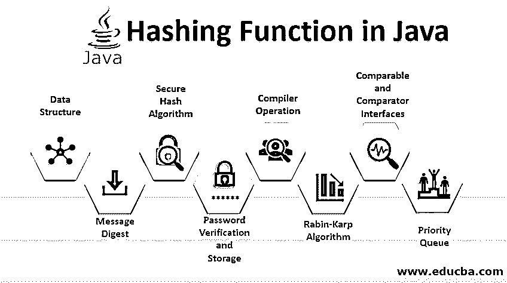

# Java 中的散列函数

> 原文：<https://www.educba.com/hashing-function-in-java/>




## Java 中散列函数的介绍

Java 中的散列函数是作为一种以整数形式定义和返回对象值的解决方案而创建的，并且作为散列函数的输出而获得的这个返回值被称为散列值。每个哈希函数返回一个 4 字节的整数作为对象的返回值。任何两个相同类型的对象将具有与散列函数输出相同的整数值，同样，不同的对象将具有不同的散列值。人们不能从散列值中导出对象，这使得散列函数成为不可逆函数。

什么是散列函数？

<small>网页开发、编程语言、软件测试&其他</small>

哈希函数可以定义为返回对应于对象的整数值的函数。哈希函数总是为同一个对象返回相同的整数值。哈希函数返回的整数值称为哈希值。以下是关于散列函数的要点:

*   总是为对象返回一个整数(4 字节)。
*   我们不能从散列值计算对象状态，因为散列函数本质上是不可逆的。
*   两个相等的对象将具有相同的哈希值。
*   两个不相等的对象并不总是具有不同的哈希值。

### 哈希函数的应用

以下是哈希函数的常见应用:

#### 1.数据结构

几乎每种编程语言都包含基于散列的数据结构。例如，java 包含基于[哈希函数](https://www.educba.com/hashing-function-in-c/)的哈希表、哈希映射、哈希集、树集数据结构。这些数据结构是键值设计，其中每个键都是唯一的，而相同的值可以存在于多个键中。

#### 2.消息摘要

该算法用于数据完整性检查。该算法将任意长度的消息作为输入，并产生固定长度(128 位)的数据作为输出。消息摘要算法的示例包括 MD2、MD4、MD5 和 MD6。

#### 3.安全哈希算法

该算法用于数据安全，并用于类似[安全套接字层(SSL)](https://www.educba.com/what-is-ssl/) 的应用和协议中。SHA-0、SHA-1、SHA-2 和 SHA-3 是安全哈希算法的常见类别。

#### 4.密码验证和存储

让我们考虑一个登录场景，在这个场景中，当输入密码来认证用户时，计算输入密码的哈希值，并通过网络将其发送到存储原始哈希值的服务器。这样做是为了确保当密码从客户端发送到服务器时，不会进行嗅探。

#### 5.编译操作

由于在[编程语言](https://www.educba.com/what-is-a-programming-language/)中使用了不同的关键字，为了区分这些关键字和标识符，编译器使用了一个哈希集，该哈希集是使用哈希表实现的，用于存储所有这些关键字和标识符。

#### 6.拉宾-卡普算法

它是一种搜索算法，利用哈希算法在给定的字符串中搜索一个或多个模式。它是最常用的算法之一。

#### 7.可比和比较器接口

这些接口包含用于一次比较两个对象的函数。根据给定对象是小于、等于还是大于我们要比较的对象，这些函数的返回值可能是负的、零或正的。内部比较器和可比接口使用散列函数来相互比较对象。

#### 8.优先队列

[优先级队列](https://www.educba.com/priority-queues-in-python/)不同于遵循 FIFO(先进先出)顺序的普通队列。In priority 队列元素根据它们的优先级以自定义顺序排列，这是内部的[使用 comparable](https://www.educba.com/comparable-in-java-example/) 和 comparator 实现的，interns 是基于哈希函数的。

### 设计哈希函数

以下是创建哈希函数的一些通用设计原则:

*   应该有效地评估散列函数。
*   从散列函数计算的散列值应该是均匀分布的；这有助于避免碰撞。
*   Java 编程语言用对象超类中的 hashCode()方法提供了一个通用的[散列函数。](https://www.educba.com/hashing-function-in-php/)

```
public int hashCode (){
//Logic goes here
}
```

### Java 中的哈希冲突

当两个或多个对象返回相同的哈希值时，就会发生哈希冲突。让我们以一个 java 哈希映射为例，它以键值对的形式存储数据。当我们将一个对象放入一个 hash map 中时，将计算键的 hash 值，并根据这个 hash 值找到存储值对象的存储桶位置。具有不同散列值的对象必须进入不同的桶。当两个或多个对象具有相同的哈希值时，它们使用称为链表的附加数据结构存储在相同的桶位置。所有具有相同哈希值的对象使用链表链接在一起。这种机制被称为链接。下面是哈希函数处理冲突的方法:

*   **链接:**如前所述，链接背后的思想是创建一个具有相同哈希值的对象的链表。链接是一种简单的技术，但是需要额外的内存开销。
*   **开放寻址:**在这种技术中，所有的元素都存储在一个哈希表中，其中每个条目包含一个记录或 NULL。当搜索一个元素时，在散列表中的每个条目中搜索所需的记录，直到找到所需的记录，或者断定该记录在表中不存在。

### 哈希的优势

以下是哈希的优点:

1.  轻松有效地比较两个文件的内容，而无需打开它们。
2.  哈希函数用于检查文件的完整性。
3.  在散列法的帮助下，数据结构中的搜索操作变得更快了。
4.  哈希函数在数据安全中起着至关重要的作用，因为大多数安全算法和协议都使用哈希。
5.  哈希将数据转换为较短的固定长度值或密钥，它代表可以通过网络发送的原始字符串。

### 哈希的缺点

除了优点之外，哈希还有一些限制:

1.  不能实现哈希来对数据进行排序。
2.  哈希冲突实际上是无法避免的，这反过来会导致效率低下。

### 推荐文章

这是一个 Java 杂凑函数的指南。这里我们讨论散列函数的应用及其优缺点。您也可以阅读以下文章，了解更多信息——

1.  [数据库管理系统中的散列](https://www.educba.com/hashing-in-dbms/)
2.  [Java DayOfWeek](https://www.educba.com/java-dayofweek/)
3.  [Java 编程中的数组](https://www.educba.com/arrays-in-java-programming/)
4.  [Java 中的 Hashmap](https://www.educba.com/hashmap-in-java/)


