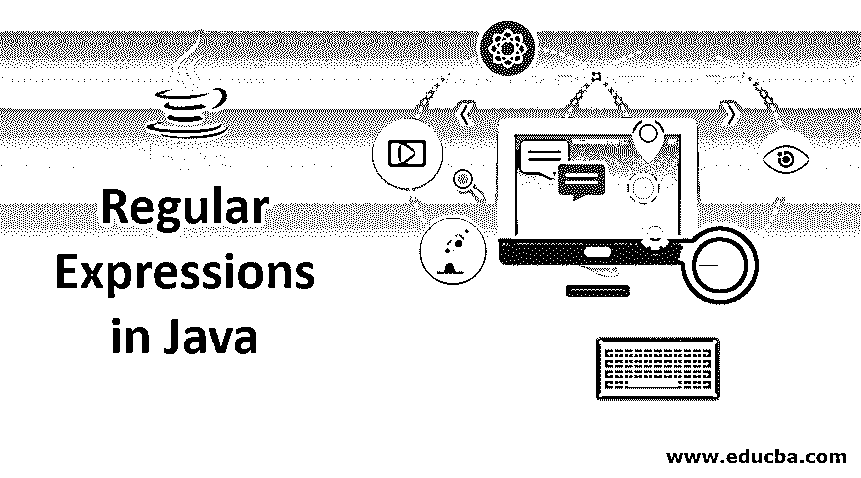
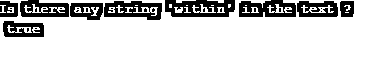

# Java 中的正则表达式

> 原文：<https://www.educba.com/regular-expressions-in-java/>




## Java 正则表达式简介

在 Java **，** Regex 或正则表达式是一个应用程序接口，它帮助定义搜索、操作和编辑字符串的模式。Java [正则表达式被广泛用于](https://www.educba.com/regular-expression-in-ruby/)密码和电子邮件的验证。这些表达式由 java.util.regex 包提供，由 1 个接口和 3 个类组成。

这三个类别是:

<small>网页开发、编程语言、软件测试&其他</small>

*   **模式:**帮助定义模式。
*   匹配器:使用模式有助于执行匹配操作。
*   **patternsynctaxexception:**有助于指出语法错误。

Java Regex 有一个名为 MatchResultInterface 的接口，[帮助确定正则表达式](https://www.educba.com/regular-expression-in-python/)的匹配操作结果。

### Java 中正则表达式的语法

让我们看看如何在程序的帮助下用 Java 写一个正则表达式。

**代码:**

```
//Java program to demonstrate regular expressions
import java.util.regex.*;
public class RegExamples {
public static void main(String args[]){
String A = " Happiness is " + " within yourself";
String B = ".*within.*";
// checks whether the string A contains the word 'within' and stores the result in matchcheck
boolean matchcheck = Pattern.matches(B, A);
//prints the result
System.out.println("Is there any string 'within' in the text ? \n " + matchcheck);
}   }
```

**输出:**




### 正则表达式中常用的方法

正则表达式中有 3 种常用的方法。

#### 1.指数方法

索引方法提供的索引值有助于精确显示在作为输入给出的字符串中找到匹配的位置。

| **方法** | **描述** |
| 开始() | 返回前一个匹配的起始索引。 |
| 开始(中间组) | 给定组的前一个匹配操作，子序列被捕获并返回。 |
| 结束() | 返回匹配最后一个字符后的偏移量。 |
| 结束(中间组) | 给定组的前一个匹配操作，子序列被捕获，并在匹配其返回的最后一个字符后进行偏移。 |

#### 2.学习方法

学习方法检查作为输入给出的字符串，并返回一个布尔值，表明是否找到了模式。

| **方法** | **描述** |
| lookingAt() | 将输入的序列与该区域开头的模式进行匹配。 |
| 查找() | 从区域的开头开始，根据模式查找作为输入给出的序列的下一个子序列。 |
| 查找(整数开始) | 重置匹配器，然后根据指定的索引模式查找作为输入给出的序列的下一个子序列。 |
| 匹配() | 根据模式匹配内容。 |

#### 3.替换方法

用于替换字符串中文本的方法。

| **方法** | **描述** |
| append replacement(String buffer s，字符串替换) | 将实现非终结附加和替换步骤。 |
| appendTail(字符串缓冲区) | 将实现终端附加和替换步骤。 |
| replaceAll(字符串替换) | 用替换字符串替换输入序列中与模式匹配的所有子序列。 |
| quoteReplacement(字符串 s) | 对于提到的字符串，将返回一个文字替换字符串。 |
| replaceFirst(字符串替换) | 用替换字符串替换输入序列中与模式匹配的第一个子序列。 |

### 如何在 Java 中定义正则表达式？

有几种方法可以定义正则表达式。

#### 1.文字

假设必须在文本“hai”中搜索字符串“hai”。

这可以使用语法来完成。

```
Pattern.matches("hai", "hai")
```

#### 2.字符类别

它将输入文本中的每个字符与字符类中允许的多个字符进行匹配。

下面是各种类结构。

| **人物类** | **解释** |
| [pqr] | 匹配包含 p、q 或 r 的文本，并且应该只匹配一次。 |
| [^pqr] | ^表示否定，由于这个原因，这里采用除 p、q 或 r 以外的单个字符。 |
| [一个接一个] | 考虑 A 到 Z 和 A 到 Z。 |
| [一般事务人员] | a 到 d，或者 p 到 s。 |
| [a-dm-p] | [两个范围的联合](https://www.educba.com/c-union/)。 |
| [a-z&&[pqr]] | a 到 z 和(p，q 或 r)。 |
| [a-z&&[^pq]] | 不考虑 a 到 z 以及 p 和 q。 |
| [ad-z] | 执行减法。 |
| [a-z&&[^m-p]] | a 到 z 而不是 m 到 p。 |

#### 3.元字符

元字符的作用类似于正则表达式中的短代码。

以下是一些常用的元字符。

| **正则表达式** | **解释** |
| \d | 从 0 到 9 的任何数字。也可以写成[0-9]。 |
| \D | 0 到 9 之间的任何非数字。也可以写成[^0-9]。 |
| \s | 空白字符或[\t\n\x0B\f\r]。 |
| \S | 非空白字符或[^\s]. |
| \w | 单词字符或[a-zA-Z_0-9]。 |
| \W | 非文字字符或[^\w]. |
| \b | 字界。 |
| \B | 非字界。 |

#### 4.量词

量词表示每个字符在字符串中出现的次数。

| **正则表达式** | **解释** |
| 答？ | 它出现一次或者根本不出现。 |
| A* | 出现 0 次或多次。 |
| A+ | 出现 1 次或多次。 |
| 答{n} | a 恰好出现 n 次。 |
| 一个{n，} | a 出现 n 次或更多次。 |
| 一个 | a 至少出现 n 次，但不应超过 m 次。 |

### 如何用 Java 创建正则表达式？

现在，让我们看一个带有上述正则表达式的 java 程序。

**代码:**

```
//Java program to demonstrate regular expressions
import java.util.regex.*;
public class RegExamples {
public static void main(String args[]){
String str="hai";
// Returns true if string 1 matches string 2
System.out.println("Returns true if 'hai' matches 'Hai' :"+
Pattern.matches(str, "Hai")); //False
//Returns true if Hai or hai matches parameter 2
System.out.println("Returns true if 'Hai' or 'hai' matches 'Hai' : "+
Pattern.matches("[Hh]ai", "Hai")); //True
// Returns true if the string matches exactly "ann" or "Ann" or "jak" or "Jak"
System.out.println("Returns true if the string matches exactly 'ann' or 'Ann' or 'jak' or 'Jak' with 'Ann' : "+
Pattern.matches("[aA]nn|[jJ]ak", "Ann"));//True
//returns true if the string contains "with" at any place in the string
System.out.println("returns true if the string contains 'with' in the string 'within' : " +
Pattern.matches(".*with.*", "within"));//True
// returns true if the '9448anna' does not have number in the beginning
System.out.println( "returns true if the '9448anna' does not have number in the beginning : "+
Pattern.matches("^[^\\d].*", "9448anna")); //False
System.out.println("returns true if the '9448anna' does not have number in the beginning : " +
Pattern.matches("^[^\\d].*", "anna9448")); //True
}
}
```

**输出:**


### 结论 Java 中的正则表达式

Java 正则表达式广泛用于实时应用，如密码和电子邮件验证。这些表达式是定义模式并提供搜索、编辑和字符串中其他操作的 API。

### 推荐文章

这是一本关于 Java 正则表达式的指南。这里我们讨论如何在 java 中创建和定义常用的正则表达式。您也可以阅读以下文章，了解更多信息——

1.  [Java 应用开发](https://www.educba.com/java-app-development/)
2.  [Java 中的数组方法](https://www.educba.com/array-methods-in-java/)
3.  [Java 文字](https://www.educba.com/java-literals/)
4.  [Java 瞬态](https://www.educba.com/java-transient/)


