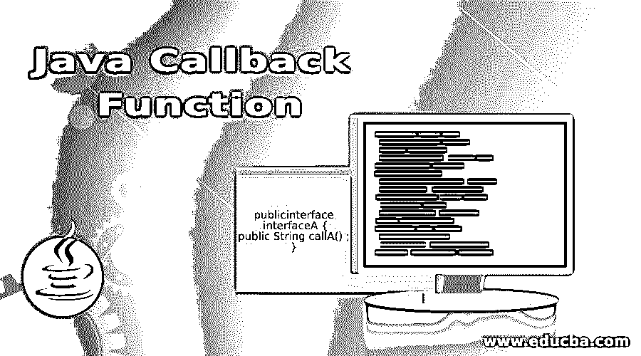

# Java 回调函数

> 原文：<https://www.educba.com/java-callback-function/>




## Java 回调函数介绍

回调是一种机制，当事件驱动编程中发生特定事件时，传递给函数的引用被调用。在 C、C++等编程语言中，回调是通过将 function1 指针传递给 function2 来实现的。由于 Java 不支持指针，回调不能这样实现。为此，在引用函数位置的地方创建并传递接口。在本文中，将讨论回调函数的更多细节。

**语法:**

<small>网页开发、编程语言、软件测试&其他</small>

下面是回调函数的语法，其中有一个带有回调函数的接口。这个方法将在后面的类中使用。

```
public interface interfaceA {
public String callA() ;
}
```

### Java 回调函数是如何工作的？

让我们以简单的方式看看回调函数是如何工作的。

*   只用一个方法 callA()创建一个接口。
*   创建一个以作为方法参数的方法 func 1。
*   在 func1 内部调用 callA()。
*   传递的新实例，并重写方法 callA()以调用 func1。
*   使用箭头符号代替关键字 news，这样代码看起来更整洁。

### 实现 Java 回调函数的例子

下面是一些关于 java 回调函数的示例程序。

#### 示例#1

点击按钮时打印文本的 Java 程序。

**代码:**

```
//Create an interface clickeventhandlrinterfce for the callback method 
interface clickeventhandlrinterfce {	
	//call method clickhndlr
   public void clickhndlr();
}
//Create a callback handler ClickHandler that implements the clickeventhandlrinterfce interface
class ClickHandler implements clickeventhandlrinterfce {	
	//call method clickhndlr
   public void clickhndlr() {

      System.out.println("Hey. . .  You have Clicked");
   } 
}
//Create  class for event generator
class Button {	
   public void onClick(clickeventhandlrinterfce chndlr)
   {
      chndlr.clickhndlr();
   }
}
public class CallBackFuncExample {	
   public static void main(String[] args) {	   
	  //create an object for btn2
      Button btn1 = new Button();      
      //create an object for ClickHandler
      ClickHandler chndlr = new ClickHandler();      
      //pass the object of  ClickHandler for performing the default operation
      btn1.onClick(chndlr);
	  //create an object for button2
      Button btn2 = new Button();      
      //For implementing own operation, pass the interface     
      btn2.onClick(new clickeventhandlrinterfce() {   	  
         @Override         
         //method clickhndlr that displays output on clicking
         public void clickhndlr() {       	 
            System.out.println("Hey. . .  You have clicked a button");
         }
      });
   } }
```

**输出:**


**说明:**首先为 button1、ClickHandler、button2 创建一个对象。然后传递 Click 处理程序的对象来执行默认操作。之后，为了实现自己的操作，使用 clickhndlr 方法传递接口，该方法在单击时显示输出。完成所有这些后，为回调方法创建一个接口 clickeventhandlrinterfce。然后，创建一个实现 clickeventhandlrinterfce 接口的回调处理程序 ClickHandler，最后，为事件生成器创建一个类。在执行代码时，将打印两行，如上面的示例输出所示。

#### 实施例 2

实现回调函数的简单 java 程序。

**代码:**

```
//class starts here
public class CallBackFuncExample {	
	//main method
    public static void main(String args[]) {

    //Function that passes interface name as parameter
      func1(new interfaceA()
      {
    	  //method callA
          public String callA() 
          {
              return "HI, I AM FIRST CALL ";
            }
      } ) ;

      // function that passes interface name as parameter
       func1(new interfaceA()
       {
     	  //method callA

        public String callA() {
          return "HI, I AM SECOND CALL";
        }
        } ) ;
        func1(() -> 
        {
                return "HI, I AM THIRD CALL";
        });
    }
    public static void func1(interfaceA intr)
    {
        System.out.println("Method called here: " + intr.callA());
    }  
    public interface interfaceA {
        public String callA();
    }
}
```

**输出:**


**解释:**在这个程序中，只使用一个方法 callA()创建一个接口。然后，使用 interfaceA 作为方法参数创建另一个方法 func1。之后在 func1 内部调用 interfaceA.callA()。完成这些步骤后，传递 interfaceA 的一个新实例，并覆盖调用 func1 的 callA()方法。这里用箭头符号代替关键字 new，这样代码看起来更整洁。在执行代码时，可以看到调用了三个方法，并返回结果，如上图所示。

#### 实施例 3

实现回调函数并打印字符串的 Java 程序。

**代码:**

```
//create an interface
interface textprint {
  void samplefunc(String txt);
}
//create a class that implements the interface
class classA implements textprint {
//create a method samplefunc that takes a text as a parameter 
  public void samplefunc(String txt) {

    System.out.println("The text is : " + txt);
  }
}
//main class
public class CallBackFuncExample {	
  // Reference to the textprint Interface
  textprint txtrcvr;    
  CallBackFuncExample(textprint r) {
    txtrcvr = r ;
  }  
  public void samplefunc2(String s)
  {
    txtrcvr.samplefunc(s);
  }  
  //main method
  public static void main(String[] args) {	  
// Create a object of the classA that implements the interface
    classA objA = new classA();     
    CallBackFuncExample obj2 = new CallBackFuncExample(objA);    
    obj2.samplefunc2("Program runs successfully");
  }
}
```

**输出:**


**说明:**在这个程序中，创建一个接口，并创建一个实现该接口的类。在该类中，创建一个 samplefunc 方法，该方法将文本作为参数。使用创建的类对象，调用方法，并在执行代码时打印字符串。

#### 实施例 4

基于类将两个数相加的 Java 程序。

**代码:**

```
import java.util.Scanner; 
//create an interface
interface interfaceA { 	
	double func1(); 
} 
// class A that implements the interface
class A implements interfaceA { 	
	public double func1() 
	{ 
		return 2500.0; 
	} 
} 
//class B that implements the interface
class B implements interfaceA { 

	public double func1() 
	{ 
		return 1500.0; 
	} 
} 
class CallBackFuncExample  { 
	//MAIN METHOD
	public static void main(String[] args) throws ClassNotFoundException, IllegalAccessException, InstantiationException 
	{ 
		//scanner object
		Scanner sc = new Scanner(System.in); 

		System.out.println("Enter the class name"); 
		String classnm = sc.next();
		// object is then stored in cl
		Class cl = Class.forName(classnm); 
		interfaceA intr = (interfaceA)cl.newInstance(); 
		func2(intr); 
	} 
	static void func2(interfaceA intrfce) 
	{ 
		double a = 2000.0; 
		double b = intrfce.func1(); 
		double sum = b + a; 
		System.out.println("Total amount is :" + sum); 
	} 
}
```

**输出:**


**说明:**在这个程序中，创建接口，调用类方法。这里，使用基于用户输入的回调函数找到两个金额的总和。

### 推荐文章

这是一个 Java 回调函数的指南。这里我们通过定义讨论 Java 回调函数的概念和它们的方法，以及编程实例和它们的输出。您也可以浏览我们推荐的其他文章，了解更多信息——

1.  [JavaScript 数学函数(示例)](https://www.educba.com/javascript-math-functions/)
2.  [Java 布局介绍](https://www.educba.com/layout-in-java/)
3.  [9 大类 Java 编译器](https://www.educba.com/java-compilers/)
4.  [Java 中的合并排序指南](https://www.educba.com/merge-sort-in-java/)


