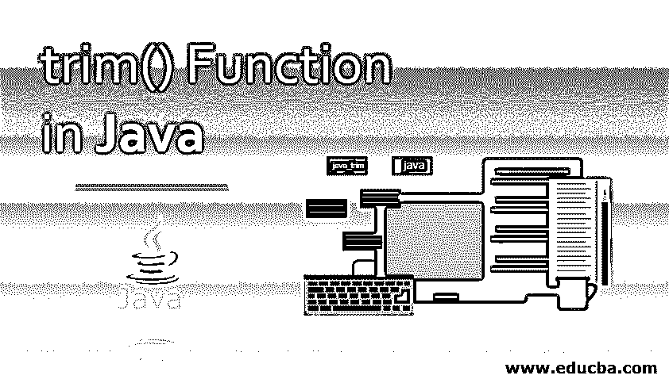
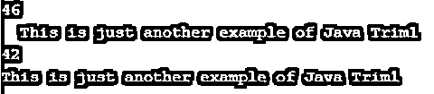
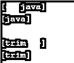

# Java 中的 trim()函数

> 原文：<https://www.educba.com/trim-function-in-java/>




## Java 中 trim()函数介绍

下面这篇文章，java 中的 trim()函数，提供了 Java 中函数的概要。基本上，Java 的 trim 方法去掉了前导和尾随空格。这是一个内置函数。该方法将任何字符串作为输入，并检查字符串前后是否有空格字符，然后删除找到的不必要的空格，并返回编辑后的字符串。

Java 是一种广泛使用且容易学习的编程语言，有各种各样的方法和函数可以轻松完成任务。修剪方法就是这样一种方法。按照 Oracle 文档中的定义，trim 方法是:返回字符串的一个副本，不包括开头和结尾的空格。简单地说，trim 方法用于删除字符串开头和结尾的空白。

<small>网页开发、编程语言、软件测试&其他</small>

现在让我们来理解用于实现 Trim 方法的标准语法:

**语法:**

```
public String trim()
```

上面提到的是 trim 方法的标准语法。也称为 Signature，它没有参数，这个 trim 方法返回编辑过的字符串。

### trim()方法是如何工作的？

java 中的 trim 方法是一个内置函数。Java 中空白的 Unicode 值是“\u0020”。当传递任何字符串时，Trim 方法检查提到的 Unicode 值，它表示空白。如果 Trim 方法找到匹配的 Unicode 值，则它会消除该值并返回新修整的字符串。理解这种方法不会删除或修剪任何中间空格也很重要。每当调用 trim 方法时，都会返回一个新的 string 对象。

通常情况下，修剪是不必要的，如果修剪在不需要的情况下被删除，它将提高程序的性能。在处理字符串之间或内部的空白时，不能使用 trim 方法。[正则表达式是此类问题的较好选择](https://www.educba.com/regular-expression-in-python/)。

既然我们已经学习了 trim 方法的定义和标准语法，并且理解了 trim 的工作原理，那么让我们来看看 trim 方法在一些程序中的应用。

### Java 中 trim()函数的例子

我们现在将通过一个简单的例子来演示 Trim 方法的工作原理。

#### 示例#1

**代码:**

```
class java_trim {
public static void main(String args[]) {
String line = "  This is Java Trim Example with whitespaces  ";
System.out.println(line); // *without trim method*
System.out.println(line.trim()); *// with trim method*
}
}
```

**输出:**


**代码解释:**这里是我们的类 java _ trim 我们简单地用一个字符串变量名称 line 创建了主类，字符串在开头和结尾都有空格。然后我们按原样打印字符串，然后传递 trim 方法，并提供输出。输出和预期的一样，没有任何空白。上面的代码将打印两行关于正确编译和执行的内容，第一行有空格，另一行没有。参考下面附加的输出截图。

正如您所看到的，在字符串的开头有空白，对于第二行，它们被省略了。接下来，我们将使用 java 中的 trim()函数演示另一个示例，现在我们将跟踪字符串长度之间的差异。

#### 实施例 2

**代码:**

```
class java_trim {
public static void main(String[] args) {
String line1 ="  This is just another example of Java Trim1  ";
System.out.println(line1.length());
System.out.println(line1); //this is without trim method
String line2 = line1.trim();
System.out.println(line2.length());
System.out.println(line2); //this is with trim method
}
}
```

**输出:**




**代码解释:**在我们的第二个演示程序中，我们遵循了与前面相同的模式，但是使用了不同的方法来跟踪字符串的变化。我们从 java_trim 类开始，然后是其中的主类。声明了第一个字符串，其字符串值必须有前导空格和尾随空格。然后，我们简单地打印字符串的长度，以跟踪变化，然后打印原始字符串。然后我们有了第二个字符串，它是第一个字符串的精简版本。这里您可以看到第一个字符串的 trim 方法的实现。最后，我们打印了编辑过的字符串的长度，然后是编辑过的字符串。

这里，您会注意到两个字符串的长度计数不同。参考下面的输出截图。

现在我们已经了解了在 java 中实现 trim()函数的各种方法，让我们用字符串数组来演示最后一个例子。

#### 实施例 3

**代码:**

```
public class java_trim1{
public static void main(String[] args) {
String[] values = { "   java", "trim   "};
for (String val : values) {
String trimmed = val.trim();
System.out.println("[" + val + "]");
System.out.println("[" + trimmed + "]\n");
}
}
}
```

**输出:**




**代码解释:**在我们的最后一个例子中，我们用一个字符串数组实现了 Trim 方法。代码从公共类声明 java_trim1 开始，然后是我们的主类。String[]声明一个字符串数组，后跟变量名和其中的值。然后我们有一个 for 循环来检查数组中的每个值。在 Java 的 trim()函数中，对于循环，选取数组中的每一项并应用 trim 方法。修剪后的值将保存在另一个名为 trimmed 的字符串变量中。然后我们有两个简单的打印语句；第一条语句将按原样打印数组中当前选定的项。《出埃及记》“[ java]”将被打印。然后将打印同一项目的编辑版本。“val”和“trimmed”具有当前从数组中选择的项，val 具有原始的字符串，而 trimmed 返回编辑过的字符串。请参考下面所附的屏幕截图，以获得正确的输出。

具体来说，Trim 没有任何特殊的用途，但最好的应用可能是一个要读取的文件，它可能有多个不需要的空白；可以使用 trim 方法，清理文件。对于不同的编程语言，不同命名的方法可用于类似的操作；对于 ruby 或 pearl，使用 chop 和 chomp，strip()与 python 一起使用。

### 结论

我们从理解 Java 中的 Trim 方法开始。然后我们理解了可用的定义和正确的语法。我们了解了 Trim 方法的工作原理、工作原理和条件。后来，我们转到了正确演示的例子，为了理解实际应用，我们用各种方法实现了例子。针对相应的代码，附上编译后的代码和输出截图。Trim()是一个清晰而简单的调用。

### 推荐文章

这是 Java 中 trim()函数的使用指南。这里我们讨论 Java 中 trim()函数的介绍；trim()方法是如何工作的？以及相应的示例。您也可以浏览我们的其他相关文章，了解更多信息——

1.  [JAVA 中的 Swing 程序](https://www.educba.com/swing-program-in-java/)
2.  [Java 中的赋值运算符](https://www.educba.com/assignment-operators-in-java/)
3.  [Java 中的滚动条](https://www.educba.com/scrollbar-in-java/)
4.  [JavaScript 中的 trim()函数](https://www.educba.com/trim-function-in-javascript/)


