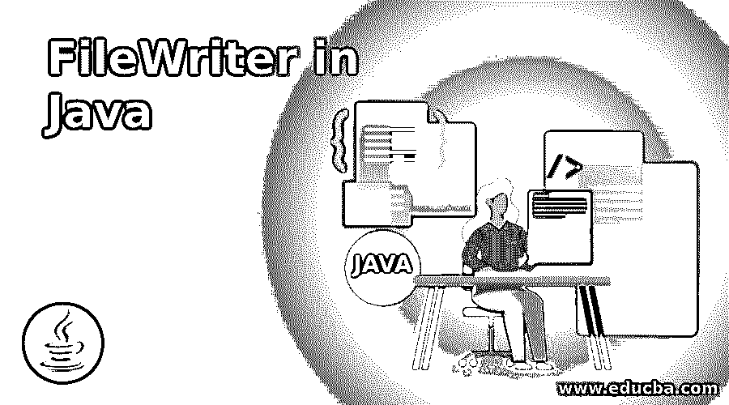

# Java 中的文件编写器

> 原文：<https://www.educba.com/filewriter-in-java/>




## Java 文件编写器简介

java 中的 FileWriter 用来创建文件，可以在创建的文件中写入字符；输出流类是 FileWriter 类的基类，因为它是从它继承的，并且该类的构造函数所做的假设是，默认字符编码和默认字节缓冲区大小是允许的，如果这些值是由我们指定的，则输出流编写器必须在文件输出流上构造。

**Java FileWriter 类的声明:**

<small>网页开发、编程语言、软件测试&其他</small>

```
Java.lang.Object
Java.io.Writer
Java.io.OutputStreamWriter
Java.io.FileWriter
```

### Java 文件编写器中的构造函数

java 中的 FileWriter 类由几个构造函数组成。它们是:

*   **FileWriter(File file):** 当给定一个 File 对象时，使用这个方法 FileWriter(File file)构造一个 FileWriter 对象。

*   **FileWriter(File file，Boolean append):** 给定一个 File 对象，构造一个 FileWriter 对象，布尔值表示是否使用这个方法 FileWriter(File file，Boolean append)追加正在写入的数据。

*   **FileWriter(file descriptor FD):**构造一个 file writer 对象，该对象与 FileWriter(FileDescriptor fd)方法中作为参数指定的文件描述符相关联。

*   **FileWriter(字符串文件名):**当给定文件名时，使用这个方法 FileWriter(字符串文件名)创建一个 FileWriter 对象。

*   **FileWriter(String filename，Boolean append):** 当给定一个文件名时，创建一个 FileWriter 对象，布尔值表示是否使用这个方法 FileWriter(String filename，Boolean append)追加正在写入的数据。

### Java 中的 FileWriter 方法

java 中的 FileWriter 类由几个方法组成，它们是:

*   **Public void write(int c)抛出 IOException:** 单个字符使用该方法写入；公共 void write(int c)抛出 IOException。
*   **Public void write(char [] stir)抛出 IOException:** 用这个方法写一个字符数组。Public void write(char [] stir)抛出 IOException。
*   **Public void write(string str)抛出 IOException:** 用这个方法写一个字符串。Public void write(string str)抛出 IOException。
*   **Public void write(string str，int off，int len)抛出 IOException:** 字符串的一部分使用此方法写入 Public void write(string str，int off，int len)抛出 IOException，其中 off 表示字符写入必须开始的偏移量，len 表示要写入的字符数。
*   **Public void flush()抛出 IOException:** 使用此方法刷新流 Public void flush()抛出 IOException。
*   **Public void close()抛出 IOException:** 首先刷新流，然后使用此方法关闭编写器 Public void close()抛出 IOException。

### 用 Java 实现 FileWriter 的例子

下面是用 Java 实现 FileWriter 的例子:

#### 示例#1

Java 程序，演示文件写入器类的创建。

**代码:**

```
import java.io.*;
public class Read {
public static void main(String args[])throws IOException {
File file1 = new File("check.txt");
// A file is created
file1.createNewFile();
// Object of FileWriter is created
FileWriter writer1 = new FileWriter(file1);
// Contents are written to the file
writer1.write("Welcome to FileWriter");
writer1.flush();
writer1.close();
// Object of filereader is created
FileReader read = new FileReader(file1);
char [] a1 = new char[50];
read.read(a1);   // array contents are read
for(char ch : a1)
System.out.print(ch);   // characters are printed one by one
read.close();
}
}
```

**输出:**


#### 实施例 2

Java 程序使用 FileWriter 类创建一个文本文件。

**代码:**

```
import java.io.*;
public class Example {
public static void main(String[] args) {
//File constructor is initialized
File file1 = new File("C:/Users/shivakumarsh/Desktop/Learning/source.txt");
try {
boolean create = file1.createNewFile();
if (create) {
System.out.println("File creation is succesful.");
}else {
System.out.println("There is already a file by this name.");
}
} catch (IOException e) {
e.printStackTrace();
}
}
}
```


#### 实施例 3

这个 Java 程序演示了在文件末尾添加字符串。

**代码:**

```
import java.io.*;
public class Example {
public static void append(String fileName,
String string)
{
try {
// The file is opened in append mode
BufferedWriter out1 = new BufferedWriter(
new FileWriter(fileName, true));
out1.write(string);
out1.close();
}
catch (IOException e) {
System.out.println("occurance of exception" + e);
}
}
public static void main(String[] args)
throws Exception
{
// A sample file is created with some text containing in it
String fileName = "Shobha.txt";
try {
BufferedWriter out1 = new BufferedWriter(
new FileWriter(fileName));
out1.write("Learning appending\n");
out1.close();
}
catch (IOException e) {
System.out.println("occurance of exception" + e);
}
// The newly created file is appended with the string value passed here
String string = "Learning is good";
append(fileName, string);
// contents of the modified file are printed here
try {
BufferedReader in1 = new BufferedReader(
new FileReader("Shobha.txt"));
String mystr;
while ((mystr = in1.readLine()) != null) {
System.out.println(mystr);
}
}
catch (IOException e) {
System.out.println("Occurance of exception" + e);
}
}
}
```

**输出:**


#### 实施例 4

使用 FileWriter 一行一行地写入文件的 Java 程序。

**代码:**

```
import java.io.BufferedWriter;
import java.io.File;
import java.io.FileWriter;
import java.util.ArrayList;
import java.util.List;
public class List {
public static void main(String[] args) throws Exception {
ArrayList<String> list1 = new ArrayList<String>();
// The newly created file is appended with the string value passed here
list1.add("Understanding an example in java");
list1.add("second line of the file");
list1.add("third line of the file");
writeFile("C:/Users/shivakumarsh/Desktop/Learning/source.txt", list1);
System.out.println("file creation is successful");
}
public static void write(String fileName, List<String> list1) throws Exception {
FileWriter fwd = null;
BufferedWriter bwd = null;
try {
fwd = new BufferedWriter(fwd);
for (int j = 0; list1 != null && j < list.size(); j++) {
bwd.write(list.get(j));
bwd.write("\n");
}
} catch (Exception e1) {
System.out.println("error occured:" + e1.getMessage());
throw e1;
} finally {
try {
bwd.close();
} catch (Exception e1) {
}
try {
fwd.close();
} catch (Exception e1) {
}
}
}
}
```

**输出:**


### 结论

在本教程中，我们了解了 FileWriter 的定义中的 FileWriter 的概念，如何声明 FileWriter，FileWriter 中的构造函数，以及演示如何创建 FileWriter 类的编程示例，使用 FileWriter 类创建文本文件，使用 FileWriter 类将文本追加到包含内容的现有文件中，使用 FileWriter 类逐行写入新文件，即逐行添加内容。

### 推荐文章

这是一个 Java 文件编写器的指南。这里我们讨论如何声明 FileWriter、FileWriter 中的构造函数及其方法以及代码实现。您也可以浏览我们推荐的其他文章，了解更多信息——

1.  [Java 中的布局](https://www.educba.com/layout-in-java/)
2.  [Java 编译器](https://www.educba.com/java-compilers/)
3.  [Java 中的合并排序](https://www.educba.com/merge-sort-in-java/)
4.  [Java 并行流](https://www.educba.com/java-parallel-stream/)


