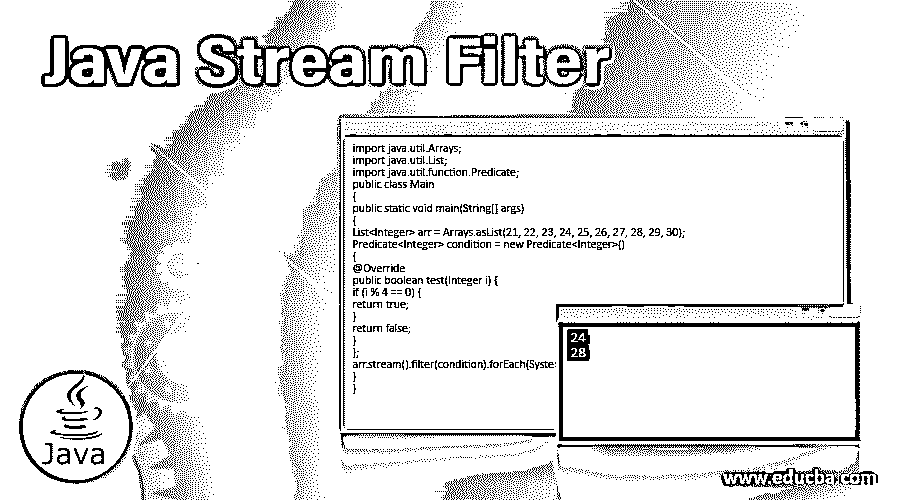
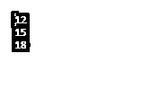
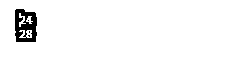
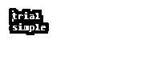
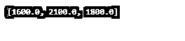

# Java 流过滤器

> 原文：<https://www.educba.com/java-stream-filter/>




## Java 流过滤器简介

Stream.filter()是我们在处理流时使用的 Java 方法。它遍历所有存在的元素，并通过一个有效参数删除或过滤掉所有与指定条件不匹配的元素。这基本上是发生在流接口之间的操作。该函数返回一个输出流，该输出流包含与给定条件匹配的输入流元素。

用 filter()传递的参数将是一个无状态谓词，应用于每一个元素，以确定是否应该包含它。我们也可以通过它传递 lambda 表达式，因为谓词属于函数接口类别。输出包含一个新的流，可用于与任何流相关的任何其他操作。

<small>网页开发、编程语言、软件测试&其他</small>

**语法**:

```
Stream<T> filter(Predicate<? super T> condition)d
```

谓词表示一个函数接口，并显示我们用来过滤掉与流不匹配的元素的条件。

### 实现 Java 流过滤器的示例

让我们举几个例子来理解 Java stream()函数的功能。

#### 示例#1

**代码:**

```
import java.util.Arrays;
import java.util.List;
public class Main
{
public static void main(String[] args)
{
List<Integer> arr = Arrays.asList(11, 12, 13, 14, 15, 16, 17, 18, 19, 20);
arr.stream()
.filter(i -> i % 3 == 0)
.forEach(System.out::println);
}
}
```

**输出:**




**解释:**这是一个非常基本简单的例子，展示了如何使用 java 流过滤函数。在这个例子中，我们声明了一个随机数数组，并将它们分配给一个列表。然后，我们使用流过滤器过滤掉给定数组中满足给定条件的所有元素，也就是说，数组中模数为 3 的所有数字都被过滤并显示在输出中。

#### 实施例 2

**代码:**

```
import java.util.Arrays;
import java.util.List;
import java.util.function.Predicate;
public class Main
{
public static void main(String[] args)
{
List<Integer> arr = Arrays.asList(21, 22, 23, 24, 25, 26, 27, 28, 29, 30);
Predicate<Integer> condition = new Predicate<Integer>()
{
@Override
public boolean test(Integer i) {
if (i % 4 == 0) {
return true;
}
return false;
}
};
arr.stream().filter(condition).forEach(System.out::println);
}
}
```

**输出:**




**解释:**在这个例子中，我们首先声明一个由一组随机数字组成的输入数组，并给它们分配一个 list。在这里，我们还展示了如何使用和声明谓词以及流过滤函数，方法是首先创建一个名称条件相同的对象。然后创建一个名为 test 的类，它的输入参数是 integer I，我们在这里检查给定数组的模数 4。如果模数为 4，此函数返回布尔值 true，否则返回 false。通过获取这个返回值，stream 函数用于从条件为真的数组中获取元素。

#### 实施例 3

**代码:**

```
import java.util.*;
public class Example {
public static void main(String[] args) {
//Array creation
List<String> arr1 = Arrays.asList("trial", "simple", "node");
//Calling usingFiltOutput function
List<String> op = usingFiltOutput(arr1, "node");
//for loop to print array
for (String arr : op) {
System.out.print(arr);
System.out.print("\n");
}
}
private static List<String> usingFiltOutput(List<String> arr2, String filter) {
List<String> op = new ArrayList<>();
for (String arr1 : arr2) {
if (!"node".equals(arr1)) {
op.add(arr1);
}
}
return op;
}
}
```

**输出:**




**解释:**在上面的例子中，我们展示了数组元素的过滤，其中我们使用流过滤方法来过滤元素“node”

#### 实施例 4

**代码:**

```
import java.util.ArrayList;
import java.util.List;
public class Main {
public static void main(String[] args) {
List<Car> listCar = new ArrayList<>();
listCar.add(new Car("Maruti", 350000));
listCar.add(new Car("Toyota", 400000));
listCar.add(new Car("Mahindra", 500000));
listCar.add(new Car("Honda", 600000));
// displaying all cars with cost more than 4lakh
listCar.stream().filter(c -> (c.getID() > 400000))
.forEach(c -> System.out.println(c.getCompany()));
}
}
class Car {
private String company;
private int ID;
public Car() {
}
public Car(String n, int a) {
this.company = n;
this.ID = a;
}
public String getCompany() {
return company;
}
public void setCompany(String company) {
this.company = company;
}
public int getID() {
return ID;
}
public void setID(int ID) {
this.ID = ID;
}
}
```

**输出:**


**解释:**在这个例子中，我们将看到一种实时应用程序，其中不同汽车公司及其基本成本的列表已经被分配给一个数组列表，如图所示。然后我们在下面定义一些方法来从数组列表中获取单个的值。getcost 方法用于获取特定汽车的成本，getCompany 用于从输入数组列表中获取公司名称。然后，在主函数中，我们使用 Java 流过滤函数只获取那些成本大约在 400000 卢比以上的汽车公司名称。

#### 实施例 5

**代码:**

```
import java.util.*;
import java.util.stream.Collectors;
class Example{
int pro_id;
String pro_name;
float pro_cost;
public Example(int pro_id, String pro_name, float pro_cost) {
this.pro_id = pro_id;
this.pro_name = pro_name;
this.pro_cost = pro_cost;
}
}
public class JavaStreamExample {
public static void main(String[] args) {
List<Example> productsList = new ArrayList<Example>();
//Here we are listing the products
productsList.add(new Example(1,"Shirt",1500f));
productsList.add(new Example(2,"Long Sleeve Top",1000f));
productsList.add(new Example(3,"Crop Top",1600f));
productsList.add(new Example(4,"Jeans",2100f));
productsList.add(new Example(5,"Skirt",1800f));
List<Float> pricesList = productsList.stream()
.filter(p ->p.pro_cost> 1500)
.map(pm ->pm.pro_cost)
.collect(Collectors.toList());
System.out.println(pricesList);
}
}
```

**输出:**




**解释:**在这个例子中，我们首先声明一些关于服装店产品的参数，比如产品 id、名称和成本。通过使用数组列表，我们将某些产品和它的参数一起添加进去。最后，通过使用 java 流过滤器，我们筛选出了一些价格在 1500 卢比以上的产品。这显示了该方法的实时应用。

### 结论

我们看到了各种不同的组合，通过这些组合，Java 流过滤器可以根据给定的条件过滤掉数组中的某些元素。根据需要，它还可以与 Java 流、数组列表、集合以及许多其他元素相结合。

### 推荐文章

这是一个 Java 流过滤指南。这里我们讨论 Java stream()函数的介绍，并通过相应的例子来理解其功能。您也可以浏览我们的其他相关文章，了解更多信息——

1.  [终于在 Java 中](https://www.educba.com/finally-in-java/)
2.  [Java min()](https://www.educba.com/java-min/)
3.  [Java 中的 copy()](https://www.educba.com/copy-in-java/)
4.  [Java max()](https://www.educba.com/java-max/)


Secondary Sidebar

  *###### Java 教程

*   *功能* ***   [Java 中的字符串函数](https://www.educba.com/string-functions-in-java/)
    *   [Java 中的数学函数](https://www.educba.com/math-functions-in-java/)
    *   [Java 中的散列函数](https://www.educba.com/hashing-function-in-java/)
    *   [Java 中的正则表达式](https://www.educba.com/regular-expressions-in-java/)
    *   [Java 中的递归](https://www.educba.com/recursion-in-java/)
    *   [Java 回调函数](https://www.educba.com/java-callback-function/)
    *   [Java 按值调用](https://www.educba.com/java-call-by-value/)
    *   [Java 引用调用](https://www.educba.com/java-call-by-reference/)
    *   [Java 中的 HashMap](https://www.educba.com/hashmap-in-java/)
    *   [Java 字符串串联](https://www.educba.com/java-string-concatenation/)
    *   [Java 字符串等于](https://www.educba.com/java-string-equals/)
    *   [比较 Java 中的两个字符串](https://www.educba.com/compare-two-strings-in-java/)
    *   [Java 中的虚函数](https://www.educba.com/virtual-function-in-java/)
    *   [Java newInstance()](https://www.educba.com/java-newinstance/)
    *   [枚举()在 Java 中](https://www.educba.com/enumeration-in-java/)
    *   [Java 中的 split()函数](https://www.educba.com/split-function-in-java/)
    *   [Java 中的 trim()函数](https://www.educba.com/trim-function-in-java/)
    *   [Java 中的 Replace()函数](https://www.educba.com/replace-function-in-java/)
    *   [Java 中的 substring()函数](https://www.educba.com/substring-function-in-java/)
    *   [Java 中的 Strictfp](https://www.educba.com/strictfp-in-java/)
    *   [Java 中的字符串反转功能](https://www.educba.com/string-reverse-function-in-java/)
    *   [Java 字符串字节](https://www.educba.com/java-string-getbytes/)
    *   [Java 替换字符串中的字符](https://www.educba.com/java-replace-char-in-string/)
    *   [Java 中的 Shuffle()](https://www.educba.com/shuffle-in-java/)
    *   [Java 中的 addAll()](https://www.educba.com/addall-in-java/)
    *   [Java 中的文件处理](https://www.educba.com/file-handling-in-java/)
    *   [Java 中的 FileReader](https://www.educba.com/filereader-in-java/)
    *   [Java 中的 FileWriter](https://www.educba.com/filewriter-in-java/)
    *   [Java 流过滤器](https://www.educba.com/java-stream-filter/)
    *   [Java 文件输入流](https://www.educba.com/java-fileinputstream/)
    *   [Java 中的 replace all()](https://www.educba.com/replaceall-in-java/)
    *   [用 Java 重画](https://www.educba.com/repaint-in-java/)
    *   [Java 中的 copy()](https://www.educba.com/copy-in-java/)
    *   [Java max()](https://www.educba.com/java-max/)
    *   [Java min()](https://www.educba.com/java-min/)
    *   [Java 时间戳](https://www.educba.com/java-timestamp/)
    *   [Java URLConnection](https://www.educba.com/java-urlconnection/)
    *   [Java StringJoiner](https://www.educba.com/java-stringjoiner/)
    *   [Java 密钥库](https://www.educba.com/java-keystore/)
    *   [Java InetAddress](https://www.educba.com/java-inetaddress/)
    *   [Java getMethod()](https://www.educba.com/java-getmethod/)
    *   [Java 中的 swap()](https://www.educba.com/swap-in-java/)
    *   [Java 中的死锁](https://www.educba.com/deadlock-in-java/)
    *   Java 中的[范围](https://www.educba.com/range-in-java/)
    *   [Java 库](https://www.educba.com/java-repository/)
    *   [Java 字典](https://www.educba.com/java-dictionary/)
    *   [Java 中的计算器](https://www.educba.com/calculator-in-java/)
    *   [Java 中的可变字符串](https://www.educba.com/mutable-string-in-java/)
    *   [可变与不可变的 Java](https://www.educba.com/mutable-vs-immutable-java/)
    *   [Java 中的本地方法](https://www.educba.com/native-methods-in-java/)
    *   [Java 中的国际化](https://www.educba.com/internationalization-in-java/)
    *   [settimeout Java](https://www.educba.com/settimeout-java/)
    *   [Java 中的 StringBuffer 类](https://www.educba.com/stringbuffer-class-in-java/)
    *   [Java 数组列表类](https://www.educba.com/java-arraylist-class/)
    *   [Java 中的属性类](https://www.educba.com/properties-class-in-java/)
    *   [Java 中的字符串类](https://www.educba.com/string-class-in-java/)
    *   [Java URL 类](https://www.educba.com/java-url-class/)
    *   [Java 矢量类](https://www.educba.com/java-vector-class/)** 

 ***   *基本* ***   [Java 是什么？](https://www.educba.com/what-is-java/)
    *   [Java 中的 JNDI 是什么](https://www.educba.com/what-is-jndi-in-java/)
    *   [Java 中的 JNI 是什么](https://www.educba.com/what-is-jni-in-java/)
    *   [什么是 Java 接口](https://www.educba.com/what-is-java-interface/)
    *   [什么是 Java SE](https://www.educba.com/what-is-java-se/)
    *   [什么是 JavaBeans](https://www.educba.com/what-is-javabeans/)
    *   [Java 中的 TreeSet](https://www.educba.com/treeset-in-java/)
    *   [遍历 Java 树](https://www.educba.com/tree-traversal-java/)
    *   [Elasticsearch Java](https://www.educba.com/elasticsearch-java/)
    *   [安装 JDK](https://www.educba.com/install-jdk/)
    *   [Java 编程语言的特点](https://www.educba.com/java-programming-language-features/)
    *   [Java 的应用](https://www.educba.com/applications-of-java/)
    *   [Java 版本](https://www.educba.com/versions-of-java/)
    *   [Java 虚拟机](https://www.educba.com/java-virtual-machine/)
    *   [Java 中的分页](https://www.educba.com/pagination-in-java/)
    *   [循环队列 Java](https://www.educba.com/circular-queue-java/)
    *   [对比 Java](https://www.educba.com/compareto-java/)
    *   [Java GUI 框架](https://www.educba.com/java-gui-framework/)
    *   [脱氧？在 Java](https://www.educba.com/unboxing-in-java/) 中
    *   [Java 方法引用](https://www.educba.com/java-method-references/)
    *   [JSP Usebean](https://www.educba.com/jsp-usebean/)
    *   [Java 列表迭代器](https://www.educba.com/java-listiterator/)
    *   [Java 异步](https://www.educba.com/java-async/)
    *   [Java 转储](https://www.educba.com/java-dumps/)
    *   [Java？异步等待](https://www.educba.com/java-async-await/)
    *   [Java 中的循环链表](https://www.educba.com/circular-linked-list-in-java/)
    *   [Java 包](https://www.educba.com/java-packages/)
    *   [Java 包示例](https://www.educba.com/java-package-example/)
    *   [Java 中的默认包](https://www.educba.com/default-package-in-java/)
    *   [变数在哪里？Java](https://www.educba.com/variables-in-java/)
    *   [Java 中的实例变量](https://www.educba.com/instance-variable-in-java/)
    *   Java 中的[对象](https://www.educba.com/object-in-java/)
    *   [Java 命令](https://www.educba.com/java-commands/)
    *   [Java 中的迭代器](https://www.educba.com/iterator-in-java/)
    *   [Java 中的多个 Catch 块](https://www.educba.com/multiple-catch-block-in-java/)
    *   [Java 布尔函数](https://www.educba.com/java-booleans/)
    *   [Java 中的转换](https://www.educba.com/conversion-in-java/)
    *   [Java 中的类型转换](https://www.educba.com/type-conversion-in-java/)
    *   [Servlet 架构](https://www.educba.com/servlet-architecture/)
    *   [Java 中的字符串](https://www.educba.com/string-in-java/)
    *   [Java 字符串修剪](https://www.educba.com/java-string-trim/)
    *   [Java 字符串转换成小写](https://www.educba.com/java-string-to-lowercase/)
    *   [Java 中的 string tokenizer](https://www.educba.com/stringtokenizer-in-java/)
    *   [什么是 JDK](https://www.educba.com/what-is-jdk/)
    *   [什么是 JVM](https://www.educba.com/what-is-jvm/)
    *   [什么是 J2EE](https://www.educba.com/what-is-j2ee/)
    *   [J2EE 科技公司](https://www.educba.com/j2ee-technologies/)
    *   [JSF 转换器](https://www.educba.com/jsf-converters/)
    *   [Java 堆转储](https://www.educba.com/java-heap-dump/)
    *   [Java 中的线性搜索](https://www.educba.com/linear-search-in-java/)
    *   [Java 中的 ATM 程序](https://www.educba.com/atm-program-in-java/)
    *   [Java 中可观察到的](https://www.educba.com/observable-in-java/)
    *   [Java 中的耦合](https://www.educba.com/coupling-in-java/)
    *   [Java 文字](https://www.educba.com/java-literals/)
    *   [Java 中的组合和聚合](https://www.educba.com/composition-and-aggregation-in-java/)
    *   [Java 中的鸭号](https://www.educba.com/duck-number-in-java/)
    *   [Java 中的数据类型](https://www.educba.com/data-types-in-java/)
    *   [Java 中的原始数据类型](https://www.educba.com/primitive-data-types-in-java/)
    *   [Java 中的非原始数据类型](https://www.educba.com/non-primitive-data-types-in-java/)
    *   [Java 用户定义的数据类型](https://www.educba.com/java-user-defined-data-types/)
    *   [Java 中的 enum set](https://www.educba.com/enumset-in-java/)
    *   [备忘单 Java](https://www.educba.com/cheat-sheet-java/)
    *   [IntelliJ 备忘单](https://www.educba.com/intellij-cheat-sheet/)** 
*   ***框架*** *****   [最佳 Java 编译器](https://www.educba.com/best-java-compilers/)
    *   [Java XML 解析器](https://www.educba.com/java-xml-parser/)
    *   [Java 中的框架](https://www.educba.com/frameworks-in-java/)
    *   [测试 Java 框架](https://www.educba.com/testing-frameworks-for-java/)
    *   [Java 监控工具](https://www.educba.com/java-monitoring-tool/)
    *   [最佳 Java IDE](https://www.educba.com/best-java-ide/)
    *   [Java 编译器](https://www.educba.com/java-compilers/)
    *   [Java 工具](https://www.educba.com/java-tools/)
    *   [Java 部署工具](https://www.educba.com/java-deployment-tools/)
    *   [Java 中的内存类型](https://www.educba.com/types-of-memory-in-java/)
    *   [Java 中的内存分配](https://www.educba.com/memory-allocation-in-java/)
    *   [Java 引用](https://www.educba.com/java-references/)
    *   [Java 类型推理](https://www.educba.com/java-type-inference/)
    *   [Java 布尔到字符串](https://www.educba.com/java-boolean-to-string/)
    *   [要浮动的 Java 字符串](https://www.educba.com/java-string-to-float/)
    *   [java.net 套餐](https://www.educba.com/java-dot-net-package/)
    *   [Java 格式化程序](https://www.educba.com/java-formatter/)
    *   [sprintf Java](https://www.educba.com/sprintf-java/)
    *   [Java 标识符](https://www.educba.com/java-identifiers/)**** 
*   *****运算符***** *******   [Java 操作符](https://www.educba.com/java-operators/)
    *   [Java 中的算术运算符](https://www.educba.com/arithmetic-operators-in-java/)
    *   [Java 中的一元运算符](https://www.educba.com/unary-operators-in-java/)
    *   [Java 中的逻辑运算符](https://www.educba.com/logical-operators-in-java/)
    *   [Java 中的比较运算符](https://www.educba.com/comparison-operators-in-java/)
    *   [Java 中的赋值运算符](https://www.educba.com/assignment-operators-in-java/)
    *   [Java 字符串操作符](https://www.educba.com/java-string-operators/)
    *   [Java 中的条件运算符](https://www.educba.com/conditional-operator-in-java/)
    *   [Java 中的布尔运算符](https://www.educba.com/boolean-operators-in-java/)****** 
*   *******关键词******* *******   [Java 关键字](https://www.educba.com/java-keywords/)
    *   [Java 中的这个关键字](https://www.educba.com/this-keyword-in-java/)
    *   [Java 中的静态关键字](https://www.educba.com/static-keyword-in-java/)
    *   [Java 中的原生关键字](https://www.educba.com/native-keyword-in-java/)
    *   [抛出 Java 中的关键字](https://www.educba.com/throw-keyword-in-java/)
    *   [抛出 Java 中的关键字](https://www.educba.com/throws-keyword-in-java/)
    *   [Java 里什么是 public？](https://www.educba.com/what-is-public-in-java/)
    *   [Java 私有](https://www.educba.com/private-in-java/)
    *   [Java 中受保护的关键字](https://www.educba.com/protected-keyword-in-java/)
    *   [Java 中的最终关键字](https://www.educba.com/final-keyword-in-java/)****** 
*   *******控制语句******* *******   [Java 中的控制语句](https://www.educba.com/control-statement-in-java/)
    *   [Java 中的 Else-If 语句](https://www.educba.com/else-if-statement-in-java/)
    *   [Java 中嵌套的 if 语句](https://www.educba.com/nested-if-statements-in-java/)
    *   [Java 中的 Continue 语句](https://www.educba.com/continue-statement-in-java/)
    *   [Java 中的 Break 语句](https://www.educba.com/break-statement-in-java/)
    *   [Java 中的 Case 语句](https://www.educba.com/case-statement-in-java/)****** 
*   *******循环******* *******   [Java 编程中的循环](https://www.educba.com/loops-in-java-programming/)
    *   [Java 中的 For 循环](https://www.educba.com/for-loop-in-java/)
    *   [Java 中的 While 循环](https://www.educba.com/while-loop-in-java/)
    *   [Java 中的 do-while 循环](https://www.educba.com/do-while-loop-in-java/)
    *   [Java 中的 For-Each 循环](https://www.educba.com/for-each-loop-in-java/)
    *   [Java 中的嵌套循环](https://www.educba.com/nested-loop-in-java/)****** 
*   *******传承******* *******   [Java 中的继承](https://www.educba.com/inheritance-in-java/)
    *   [Java 中的单一继承](https://www.educba.com/single-inheritance-in-java/)
    *   [Java 中的多级继承](https://www.educba.com/multilevel-inheritance-in-java/)
    *   [Java 中的层次继承](https://www.educba.com/hierarchical-inheritance-in-java/)
    *   [Java 中的混合继承](https://www.educba.com/hybrid-inheritance-in-java/)****** 
*   *******构造函数和析构函数******* *******   [Java 中的构造函数和析构函数](https://www.educba.com/constructor-and-destructor-in-java/)
    *   [Java 中的构造函数](https://www.educba.com/constructor-in-java/)
    *   [Java 中的析构函数](https://www.educba.com/destructor-in-java/)
    *   [复制 Java 中的构造函数](https://www.educba.com/copy-constructor-in-java/)
    *   [Java 中的静态构造函数](https://www.educba.com/static-constructor-in-java/)
    *   [Java 中的私有构造函数](https://www.educba.com/private-constructor-in-java/)****** 
*   *******阵列******* *******   [Java 编程中的数组](https://www.educba.com/arrays-in-java-programming/)
    *   [Java 中的 2D 数组](https://www.educba.com/2d-arrays-in-java/)
    *   [Java 中的 2D 数组列表](https://www.educba.com/2d-arraylist-in-java/)
    *   [Java 中的 3D 数组](https://www.educba.com/3d-arrays-in-java/)
    *   [Java 中的 2D 数组排序](https://www.educba.com/2d-array-sorting-in-java/)
    *   [Java 中的多维数组](https://www.educba.com/multidimensional-array-in-java/)
    *   [Java 中的数组方法](https://www.educba.com/array-methods-in-java/)
    *   [用 Java 打印 2D 数组](https://www.educba.com/print-2d-array-in-java/)
    *   [用 Java 打印数组](https://www.educba.com/print-array-in-java/)
    *   [Java 中的字符串数组](https://www.educba.com/string-array-in-java/)
    *   [Java 中的关联数组](https://www.educba.com/associative-array-in-java/)
    *   [Java 中的动态数组](https://www.educba.com/dynamic-array-in-java/)
    *   [Java 数组迭代器](https://www.educba.com/java-array-iterator/)
    *   [Java array.push](https://www.educba.com/java-array-push/)
    *   [在 Java 中排序字符串数组](https://www.educba.com/sort-string-array-in-java/)
    *   [基数排序 Java](https://www.educba.com/radix-sort-java/)****** 
*   *******排序******* *******   [Java 中的排序](https://www.educba.com/sorting-in-java/)
    *   [Java 中的排序算法](https://www.educba.com/sorting-algorithms-in-java/)
    *   [Java 中的 DFS 算法](https://www.educba.com/dfs-algorithm-in-java/)
    *   [Java 中的归并排序算法](https://www.educba.com/merge-sorting-algorithms-in-java/)
    *   [Java 向量排序](https://www.educba.com/java-vector-sort/)
    *   [Java 中的快速排序算法](https://www.educba.com/quick-sorting-algorithms-in-java/)
    *   [选择排序？Java](https://www.educba.com/selection-sort-in-java/)
    *   [Java 中的堆排序](https://www.educba.com/heap-sort-in-java/)
    *   [Java 中的冒泡排序](https://www.educba.com/bubble-sort-in-java/)
    *   [Java 中的桶排序](https://www.educba.com/bucket-sort-in-java/)
    *   [Java 中的合并排序](https://www.educba.com/merge-sort-in-java/)
    *   [Java 中的快速排序](https://www.educba.com/quick-sort-in-java/)
    *   [Java 中的插入排序](https://www.educba.com/insertion-sort-in-java/)
    *   [Java 中的排序字符串](https://www.educba.com/sort-string-in-java/)
    *   [Java 中用于合并排序的程序](https://www.educba.com/program-for-merge-sort-in-java/)
    *   [Java 中的 Shell 排序](https://www.educba.com/shell-sort-in-java/)****** 
*   *******多态性******* *******   [什么是多态性](https://www.educba.com/what-is-polymorphism/)
    *   [Java 中的多态性](https://www.educba.com/polymorphism-in-java/)
    *   [Java 中的运行时多态性](https://www.educba.com/runtime-polymorphism-in-java/)
    *   [Java 中的重载和覆盖](https://www.educba.com/overloading-and-overriding-in-java/)
    *   [Java 中的重载](https://www.educba.com/overloading-in-java/)
    *   [Java 中的方法重载](https://www.educba.com/method-overloading-in-java/)
    *   [Java 中的函数重载](https://www.educba.com/function-overloading-in-java/)
    *   [在 Java 中覆盖](https://www.educba.com/overriding-in-java/)
    *   [Java 中的方法覆盖](https://www.educba.com/method-overriding-in-java/)
    *   [Java 中的超级关键字](https://www.educba.com/super-keyword-in-java/)
    *   [Java 中的 instance of](https://www.educba.com/instanceof-in-java/)
    *   [Java 认证器](https://www.educba.com/java-authenticator/)
    *   [Java 别名](https://www.educba.com/java-alias/)****** 
*   *******收藏******* *******   [Java 中的 TreeMap 是什么？](https://www.educba.com/what-is-treemap-in-java/)
    *   [集合中的排序](https://www.educba.com/sorting-in-collection/)
    *   [Java 集合类](https://www.educba.com/java-collections-class/)
    *   [Java 收藏图](https://www.educba.com/java-collection-map/)
    *   [Java 收藏反转](https://www.educba.com/java-collection-reverse/)
    *   [Java 收集方法](https://www.educba.com/java-collection-methods/)
    *   [Java 集合泛型](https://www.educba.com/java-collection-generics/)
    *   [Java 集合框架](https://www.educba.com/java-collection-framework/)
    *   [Java 收集流](https://www.educba.com/java-collection-stream/)
    *   [Java 中的哈希表](https://www.educba.com/hashtable-in-java/)
    *   [Java 枚举图](https://www.educba.com/java-enummap/)
    *   [Java LinkedHashMap](https://www.educba.com/java-linkedhashmap/)
    *   [Java 中的反向链表](https://www.educba.com/reverse-linked-list-in-java/)
    *   Java 中的链接列表
    *   [跳过列表 Java](https://www.educba.com/skip-list-java/)
    *   [Java 集合类型](https://www.educba.com/java-collection-types/)
    *   [Java 集合排序](https://www.educba.com/java-collection-sort/)
    *   [Java 收藏列表](https://www.educba.com/java-collection-to-list/)****** 
*   *******日期时间******* *******   [java.util.Date](https://www.educba.com/java-util-date/)
    *   [Java 时钟](https://www.educba.com/java-clock/)
    *   [Java 即时](https://www.educba.com/java-instant/)
    *   [Java 本地时间](https://www.educba.com/java-localtime/)
    *   [Java 中的局部变量](https://www.educba.com/local-variable-in-java/)
    *   [Java ZoneId](https://www.educba.com/java-zoneid/)
    *   Java 分区偏移
    *   [Java varargs](https://www.educba.com/java-varargs/)
    *   Java local date
    *   [Java OffsetDateTime](https://www.educba.com/java-offsetdatetime/)
    *   [Java LocalDateTime](https://www.educba.com/java-localdatetime/)
    *   [Java 持续时间](https://www.educba.com/java-duration/)
    *   [Java DayOfWeek](https://www.educba.com/java-dayofweek/)
    *   [Java 时期](https://www.educba.com/java-period/)
    *   [Java 中的定时器](https://www.educba.com/timer-in-java/)
    *   [Java 倒计时定时器](https://www.educba.com/java-countdown-timer/)
    *   [Java 时区](https://www.educba.com/java-timezone/)
    *   [Java 日期选择器](https://www.educba.com/java-date-picker/)****** 
*   *******高级******* *******   [Java 中的方法](https://www.educba.com/methods-in-java/)
    *   [Java 中的内部类](https://www.educba.com/inner-class-in-java/)
    *   [Java 中的内聚](https://www.educba.com/cohesion-in-java/)
    *   [Java 中的抽象](https://www.educba.com/abstraction-in-java/)
    *   [Java Pop](https://www.educba.com/java-pop/)
    *   [Java 静态导入](https://www.educba.com/java-static-import/)
    *   [Java 中的图形类](https://www.educba.com/graphics-class-in-java/)
    *   [JAVA 中的反射](https://www.educba.com/reflection-in-java/)
    *   [Java 中的自动装箱](https://www.educba.com/autoboxing-in-java/)
    *   [Java 10 的特性](https://www.educba.com/java-10-features/)
    *   [Java 协同程序](https://www.educba.com/java-coroutines/)
    *   [Java 谓词](https://www.educba.com/java-predicate/)
    *   [Java 中的匿名内部类](https://www.educba.com/anonymous-inner-class-in-java/)
    *   [Java 中的计数排序](https://www.educba.com/counting-sort-in-java/)
    *   [认证 Java](https://www.educba.com/authentication-java/)
    *   [Java 堆栈方法](https://www.educba.com/java-stack-methods/)
    *   [Java 静态嵌套类](https://www.educba.com/java-static-nested-class/)
    *   [Java 中的同步块](https://www.educba.com/synchronized-block-in-java/)
    *   [Java 中的静态同步](https://www.educba.com/static-synchronization-in-java/)
    *   [Java 中的抽象类](https://www.educba.com/abstract-class-in-java/)
    *   [Java 中的访问修饰符](https://www.educba.com/access-modifiers-in-java/)
    *   [Java 中的非访问修饰符](https://www.educba.com/non-access-modifiers-in-java/)
    *   [Java 中的位操作](https://www.educba.com/bit-manipulation-in-java/)
    *   [Java 中的封装](https://www.educba.com/encapsulation-in-java/)
    *   [Java 中的单例类](https://www.educba.com/singleton-class-in-java/)
    *   [Java 中的包装类](https://www.educba.com/wrapper-class-in-java/)
    *   [Java 中的嵌套类](https://www.educba.com/nested-class-in-java/)
    *   [Java 匹配](https://www.educba.com/java-matcher/)
    *   [Java 模式类](https://www.educba.com/java-pattern-class/)
    *   [Java 文件类](https://www.educba.com/java-file-class/)
    *   [Java 中的最终类](https://www.educba.com/final-class-in-java/)
    *   [Java 中的堆栈类](https://www.educba.com/stack-class-in-java/)
    *   [Java 中的匿名类](https://www.educba.com/anonymous-class-in-java/)
    *   [Java 中的 StringBuilder 类](https://www.educba.com/stringbuilder-class-in-java/)
    *   [Java 中的 string buffer](https://www.educba.com/stringbuffer-in-java/)
    *   [Java 目录](https://www.educba.com/java-directories/)
    *   [Java 中的 JSON](https://www.educba.com/json-in-java/)
    *   [Java 中的对象类](https://www.educba.com/object-class-in-java/)
    *   [什么是 java 中的多线程](https://www.educba.com/what-is-multithreading-in-java/)
    *   [Java 线程优先级](https://www.educba.com/java-thread-priority/)
    *   [Java？线程转储](https://www.educba.com/java-thread-dump/)
    *   [Java 中的守护线程](https://www.educba.com/daemon-thread-in-java/)
    *   [Java 线程池](https://www.educba.com/java-thread-pool/)
    *   [Java ThreadLocal](https://www.educba.com/java-threadlocal/)
    *   [Java 中的关联](https://www.educba.com/association-in-java/)
    *   [Java 中的队列](https://www.educba.com/queue-in-java/)
    *   [Java 中的 Deque](https://www.educba.com/deque-in-java/)
    *   [Java 中的函数式编程](https://www.educba.com/functional-programming-in-java/)
    *   [Java 中的类加载器](https://www.educba.com/classloader-in-java/)
    *   Java 中的[接口](https://www.educba.com/interface-in-java/)
    *   [Java 中的函数接口](https://www.educba.com/functional-interface-in-java/)
    *   [Java 队列接口](https://www.educba.com/java-queue-interface/)
    *   [Java 中的优先级队列](https://www.educba.com/priorityqueue-in-java/)
    *   [Java 中的集合接口](https://www.educba.com/collection-interface-in-java/)
    *   [Java 中的对象克隆](https://www.educba.com/object-cloning-in-java/)
    *   Java.net·URI
    *   [Java 断言](https://www.educba.com/java-assertion/)
    *   [Java 中的矢量](https://www.educba.com/vector-in-java/)
    *   [Java 中的小程序](https://www.educba.com/applets-in-java/)
    *   [Java 中的模板](https://www.educba.com/template-in-java/)
    *   [Java 关机挂钩](https://www.educba.com/java-shutdown-hook/)
    *   [Java 中的 2D 图形](https://www.educba.com/2d-graphics-in-java/)
    *   [Java 中的自动装箱和拆箱](https://www.educba.com/autoboxing-and-unboxing-in-java/)
    *   [Java 示例中可比的](https://www.educba.com/comparable-in-java-example/)
    *   [Java 注释](https://www.educba.com/java-annotations/)
    *   [Java 用户输入](https://www.educba.com/java-user-input/)
    *   [Java 中的序列化](https://www.educba.com/serialization-in-java/)
    *   [Java 中的动态绑定](https://www.educba.com/dynamic-binding-in-java/)
    *   [Java 解析字符串](https://www.educba.com/java-parse-string/)
    *   [Java 适配器类](https://www.educba.com/java-adapter-classes/)
    *   [Java 中的不可变类](https://www.educba.com/immutable-class-in-java/)
    *   [Java 中的字符串初始化](https://www.educba.com/string-initialization-in-java/)
    *   [Java 中的字符串操作](https://www.educba.com/string-manipulation-in-java/)
    *   [Java 中的线程组](https://www.educba.com/threadgroup-in-java/)
    *   [Java 迭代图](https://www.educba.com/java-iterate-map/)
    *   [Java IO](https://www.educba.com/java-io/)
    *   [Java？OutputStreamWriter](https://www.educba.com/java-outputstreamwriter/)
    *   [Java 中的 data inputstream](https://www.educba.com/datainputstream-in-java/)
    *   [Java 缓冲器](https://www.educba.com/java-bufferedreader/)
    *   [Java BufferedWriter](https://www.educba.com/java-bufferedwriter/)
    *   [Java BufferedInputStream](https://www.educba.com/java-bufferedinputstream/)
    *   [Java ByteArrayInputStream](https://www.educba.com/java-bytearrayinputstream/)
    *   [Java bytearray output stream](https://www.educba.com/java-bytearrayoutputstream/)
    *   [Java 随机存取文件](https://www.educba.com/java-randomacessfile/)
    *   [Java PrintStream](https://www.educba.com/java-printstream/)
    *   [Java PrintWriter](https://www.educba.com/java-printwriter/)
    *   [Java URLEncoder](https://www.educba.com/java-urlencoder/)
    *   [Java 扫描器类](https://www.educba.com/java-scanner-class/)
    *   [Java 控制台](https://www.educba.com/java-console/)
    *   [Java 运行时类](https://www.educba.com/java-runtime-class/)
    *   [Java Base64](https://www.educba.com/java-base64/)
    *   [Java Base64 编码](https://www.educba.com/java-base64-encoding/)
    *   [Java Base64？解码](https://www.educba.com/java-base64-decode/)
    *   [在 Java 中完成](https://www.educba.com/finalize-in-java/)
    *   [Java 并行流](https://www.educba.com/java-parallel-stream/)
    *   [Java Getter Setter](https://www.educba.com/java-getter-setter/)
    *   [在 Java 中设置接口](https://www.educba.com/set-interface-in-java/)
    *   [如何在 Java 中连接数据库](https://www.educba.com/how-to-connect-database-in-java/)
    *   [如何用 Java 创建 web service](https://www.educba.com/how-to-create-webservice-in-java/)
    *   [Java Web 服务示例](https://www.educba.com/java-web-service-example/)
    *   [Java 中的作文](https://www.educba.com/composition-in-java/)
    *   [Java 中的 BinarySearch()](https://www.educba.com/binarysearch-in-java/)
    *   [Java 中的异常处理](https://www.educba.com/exception-handling-in-java/)
    *   [Java 中的异常类型](https://www.educba.com/types-of-exception-in-java/)
    *   [Java NullPointerException](https://www.educba.com/java-nullpointerexception/)
    *   [Java nosuchtelement exception](https://www.educba.com/java-nosuchelementexception/)
    *   [Java 并发修改异常](https://www.educba.com/java-concurrentmodificationexception/)
    *   [Java 算术异常](https://www.educba.com/java-arithmeticexception/)
    *   [Java IOException](https://www.educba.com/java-ioexception/)
    *   [Java RuntimeException](https://www.educba.com/java-runtimeexception/)
    *   [Java 中的 NumberFormatException](https://www.educba.com/numberformatexception-in-java/)
    *   [Java ArrayIndexOutOfBoundsException](https://www.educba.com/java-arrayindexoutofboundsexception/)
    *   [Java class not found exception](https://www.educba.com/java-classnotfoundexception/)
    *   [Java file not found exception](https://www.educba.com/java-filenotfoundexception/)
    *   [Java 中断异常](https://www.educba.com/java-interruptedexception/)
    *   [Java 用户定义的异常](https://www.educba.com/java-user-defined-exception/)
    *   [Java 中的事件处理](https://www.educba.com/event-handling-in-java/)
    *   [终于在 Java 中](https://www.educba.com/finally-in-java/)
    *   [Java 默认方法](https://www.educba.com/java-default-method/)
    *   [Java 语言环境](https://www.educba.com/java-locale/)
    *   [Java 中的元组](https://www.educba.com/tuples-in-java/)
    *   [Java 服务器套接字](https://www.educba.com/java-serversocket/)
    *   [Java Lambda 表达式](https://www.educba.com/java-lambda-expressions/)
    *   [Java DatagramSocket](https://www.educba.com/java-datagramsocket/)
    *   [数据集 Java](https://www.educba.com/dataset-java/)
    *   [Java 动画](https://www.educba.com/java-animation/)
    *   [Java 中的静态方法](https://www.educba.com/static-method-in-java/)
    *   [AVL 树 java](https://www.educba.com/avl-tree-java/)****** 
*   *******杂项******* *******   [什么是 Java 中的同步](https://www.educba.com/what-is-synchronization-in-java/)
    *   [Java 中的并发是什么](https://www.educba.com/what-is-concurrency-in-java/)
    *   [什么是 Java 中的设计模式](https://www.educba.com/what-is-design-pattern-in-java/)
    *   [什么是 Java 中的泛型](https://www.educba.com/what-is-generics-in-java/)
    *   [Java 中的 API 是什么](https://www.educba.com/what-is-api-in-java/)
    *   [什么是 Java 中的二叉树](https://www.educba.com/what-is-a-binary-tree-in-java/)
    *   [Java 中的数据结构](https://www.educba.com/data-structures-in-java/)
    *   [Java 中的 Trie 数据结构](https://www.educba.com/trie-data-structure-in-java/)
    *   [爪哇的二叉查找树](https://www.educba.com/binary-search-tree-in-java/)
    *   [Java 中的 AWT 组件](https://www.educba.com/awt-components-in-java/)
    *   [Java 中的 AWT 控件](https://www.educba.com/awt-controls-in-java/)
    *   [Java 中的 Volatile 关键字](https://www.educba.com/volatile-keyword-in-java/)
    *   [Java 中的 Struts](https://www.educba.com/struts-in-java/)
    *   [什么是 Java 垃圾收集器](https://www.educba.com/what-is-java-garbage-collector/)
    *   [什么是 Java 继承](https://www.educba.com/what-is-java-inheritance/)
    *   [Java 中的线程生命周期](https://www.educba.com/thread-life-cycle-in-java/)
    *   [Java 面向对象编程](https://www.educba.com/object-oriented-programming-in-java/)
    *   [Java 应用开发](https://www.educba.com/java-app-development/)
    *   [Java 命名惯例](https://www.educba.com/java-naming-conventions/)
    *   [Java 哈希码()](https://www.educba.com/java-hashcode/)
    *   [Java 中的 HashSet](https://www.educba.com/hashset-in-java/)
    *   [Java 瞬态](https://www.educba.com/java-transient/)
    *   [爪哇的 JSTL](https://www.educba.com/jstl-in-java/)
    *   [堪比 Java？](https://www.educba.com/comparable-in-java/)
    *   [Java 中的聚合](https://www.educba.com/aggregation-in-java/)
    *   [Java 电子邮件验证](https://www.educba.com/java-email-validation/)
    *   [Java 电子邮件](https://www.educba.com/java-email/)
    *   [爪哇的 EJB](https://www.educba.com/ejb-in-java/)
    *   [@在 Java 中已弃用](https://www.educba.com/deprecated-in-java/)
    *   [Java @Inherited](https://www.educba.com/java-inherited/)
    *   [@ Java 中的 suppress warnings](https://www.educba.com/suppresswarnings-in-java/)
    *   [Java @Override](https://www.educba.com/java-override/)
    *   [Inorder 遍历 Java](https://www.educba.com/inorder-traversal-java/)
    *   [Java 双向链表](https://www.educba.com/java-doubly-linked-list/)
    *   [Java 测试工具](https://www.educba.com/java-testing-tools/)
    *   [Java 测试私有方法](https://www.educba.com/java-testing-private-methods/)
    *   [Java 中的元数据](https://www.educba.com/metadata-in-java/)
    *   [Java 中的 Servlet](https://www.educba.com/servlet-in-java/)
    *   [Servlet 方法](https://www.educba.com/servlet-methods/)
    *   [Java 中的 Servlet 容器](https://www.educba.com/servlet-container-in-java/)****** 
*   *******程序******* *******   [Java 中的模式](https://www.educba.com/patterns-in-java/)
    *   [Java 中的星型模式](https://www.educba.com/star-patterns-in-java/)
    *   [Java 中的数字模式](https://www.educba.com/number-patterns-in-java/)
    *   [Java 中的交换](https://www.educba.com/swapping-in-java/)
    *   [Java 中的阶乘](https://www.educba.com/factorial-in-java/)
    *   [Java 中的斐波那契数列](https://www.educba.com/fibonacci-series-in-java/)
    *   [Java 中的反数](https://www.educba.com/reverse-number-in-java/)
    *   [Java 中的回文](https://www.educba.com/palindrome-in-java/)
    *   [Java 中的阿姆斯特朗数](https://www.educba.com/armstrong-number-in-java/)
    *   [Java 中的方块](https://www.educba.com/squares-in-java/)
    *   [Java 中的平方根](https://www.educba.com/square-root-in-java/)
    *   [Java 中的特殊数字](https://www.educba.com/special-number-in-java/)
    *   [Java 中的字谜程序](https://www.educba.com/anagram-program-in-java/)
    *   [Java 中的强数字](https://www.educba.com/strong-number-in-java/)
    *   [Java 中的随机数生成器](https://www.educba.com/random-number-generator-in-java/)
    *   [Java 中的矩阵乘法](https://www.educba.com/matrix-multiplication-in-java/)
    *   [Java 中的套接字编程](https://www.educba.com/socket-programming-in-java/)
    *   [Java 中的质数](https://www.educba.com/prime-numbers-in-java/)
    *   [Java 中的字符串比较](https://www.educba.com/string-comparison-in-java/)
    *   [Java 中的闰年程序](https://www.educba.com/leap-year-program-in-java/)
    *   [Java 中的 Weka](https://www.educba.com/weka-in-java/)
    *   [Java 中的完全数](https://www.educba.com/perfect-number-in-java/)
    *   [Java 中的史密斯数](https://www.educba.com/smith-number-in-java/)
    *   [在 Java 中反转字符串](https://www.educba.com/reverse-string-in-java/)
    *   [Java 设计模式](https://www.educba.com/design-patterns-in-java/)
    *   [IntelliJ 版本](https://www.educba.com/intellij-version/)
    *   [Java 中的快乐数字](https://www.educba.com/happy-numbers-in-java/)
    *   [Java 中迄今为止的时间戳](https://www.educba.com/timestamp-to-date-in-java/)****** 
*   *******面试题******* *******   [Java 面试问题](https://www.educba.com/java-interview-questions/)
    *   [Java 继承面试问题](https://www.educba.com/java-inheritance-interview-questions/)
    *   [Java EE 面试问题](https://www.educba.com/java-ee-interview-questions/)
    *   [Java 开发者面试问题](https://www.educba.com/java-developer-interview-questions/)
    *   [Java 合集？面试问题](https://www.educba.com/java-collection-interview-questions/)
    *   [多线程 Java 面试问题](https://www.educba.com/java-interview-question-on-multithreading/)
    *   [Java 字符串面试问题](https://www.educba.com/java-string-interview-question/)
    *   [Java 测试面试问题](https://www.educba.com/java-testing-interview-questions/)
    *   [Java 多线程面试问题](https://www.educba.com/java-multi-threading-interview-questions/)
    *   [Java 多线程面试问题](https://www.educba.com/multithreading-interview-questions-in-java/)
    *   [Java 春季面试试题](https://www.educba.com/java-spring-interview-questions/)
    *   [数据结构 Java 面试题](https://www.educba.com/data-structure-java-interview-questions/)
    *   [Java Web 服务面试问题](https://www.educba.com/java-web-services-interview-questions-and-answers/)*********  *******相关课程

#### [Java 课程](https://www.educba.com/software-development/courses/java-course/)

#### [JavaScript 认证课程](https://www.educba.com/software-development/courses/javascript-certification-course/)

#### [jQuery 培训课程](https://www.educba.com/software-development/courses/jquery-training-course/)

#### [Java 培训课程](https://www.educba.com/software-development/courses/java-course/)

#### [免费 Java 培训课程](https://www.educba.com/software-development/courses/free-java-online-course/)

#### [JavaFX 培训](https://www.educba.com/software-development/courses/javafx-course/)

#### [Java 培训课程](https://www.educba.com/software-development/courses/java-course/)******* 


