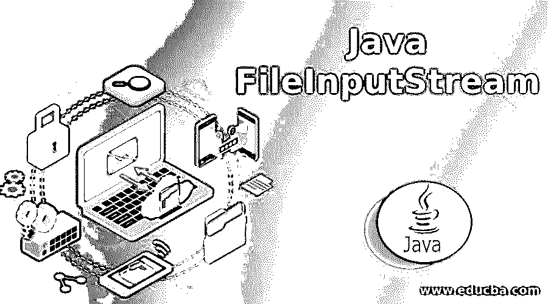
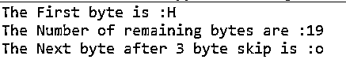
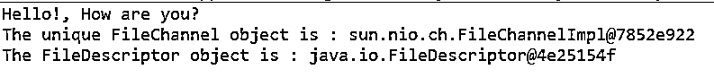

# Java 文件输入流

> 原文：<https://www.educba.com/java-fileinputstream/>




## Java FileInputStream 简介

Java FileInputStream 是一个用于从文件中读取数据和字节流的类。FileInputStream 类是 java 中的一个内置类，它定义了 java.io.FileInputStream 包。InputStream 是 FileInputStream 的超类。FileInputStream 类用于读取原始字节流(逐字节)，如图像数据、视频、音频等。，而要读取字符流(逐个字符)，我们可以使用 FileReaderbuiltin 类。

java 中 FileInputStream 类的声明语法:

<small>网页开发、编程语言、软件测试&其他</small>

以下是 java.io.FileInputStream 类的声明。

```
public class FileInputStream extends InputStream
{
// Constructors and methods of the FileInputStream class
}
```

以上是 FileInputStream 的语法，在这里扩展为 InputStream 类。

**FileInputStreamclass 成员函数:**FileInputStream 类包含构造函数和一些作为 file inputstream 类成员函数的函数。

### Java FileInputStream 类的构造函数

*   **FileInputStream(File File):**该构造函数通过打开到指定文件的连接来创建 File inputstream 的实例，以便从该实例中读取。
*   **FileInputStream(FileDescriptorfdobj):**该构造函数通过使用文件描述符 fdobj 创建 file inputstream 的实例，该文件描述符指定到文件系统中实际指定文件的现有连接，以从该实例中读取。
*   **FileInputStream(String fname):**该构造函数通过打开到指定文件 fname 参数的连接来创建 file inputstream 的实例，以从该实例中读取。

### Java FileInputStream 类的函数

函数和语法如下所示:

#### 1.阅读()

这个函数用于从输入流中读取一个字节的数据。

```
public int read() throws IOException
```

#### 2.读取(字节[] b)

该函数用于从输入流中读取最大为 b 数组大小的数据字节。

```
public int read(byte[] b)throws IOException
```

#### 3.read(byte[] b，int off，intlen)

此函数用于将输入流中指定长度的数据字节读入目标 b 数组的起始偏移量。

```
public int read(byte[] b, int offset, intlen) throws IOException
```

#### 4.可用()

此函数用于返回可以从输入流中读取的估计字节数。

```
public int available() throws IOException
```

#### 5.跳过(长 n)

这个函数用于从输入流中跳过 n 个字节的数据。

```
public long skip(long n) throws IOException
```

#### 6\. getChannel()

此函数用于获取文件输入流的唯一 FileChannel 对象。

```
public FileChannelgetChannel()
```

#### 7.最终确定()

这个函数用于确保当没有更多引用时，文件输入流的 close 方法将被调用。

```
protected void finalize() throws IOException
```

#### 8.getFD()–T

他的函数用于获取 FileDescriptor 对象，该对象指定了到文件系统实际文件的连接。

```
public final FileDescriptorgetFD() throws IOException
```

#### 9.关闭()

该函数用于关闭文件流并释放资源文件。

```
public void close() throws IOException
```

### 文件输入流类的函数和例子

FileInputStream 类及其 java 方法的工作和示例:

接下来，我们编写 java 代码来更清楚地理解 FileInputStream 类，在下面的示例中，我们使用 FileInputStream 类构造函数创建 FileInputStream 对象，并传递文件名来读取字符，如下所示

#### 示例#1

**代码:**

```
//package p1;
import java.io.FileInputStream;
public class Demo {
public static void main( String[] arg) {
int i;
char c;
try{
// create object of file input stream by opening connection data.txt file
FileInputStream fobj=new FileInputStream("D:\\data.txt");
// data.txt file contain "Hello!, How are you?" data in it
i = fobj.read();
c = (char) i;
System.out.println("The First byte is :" +c);
System.out.println("The Number of remaining bytes are :" +fobj.available());
// skip method to skip 3 bytes
fobj.skip(3);
i = fobj.read();
// converts byte to character
c = (char) i;
System.out.println("The Next byte after 3 byte skip is :" +c);
fobj.close();
}catch(Exception e)
{
System.out.println(e);
}
}
}
```

**输出:**




#### 实施例 2

接下来，我们编写 java 代码，更清楚地理解 FileInputStream 类；我们创建一个 FileInputStream 对象来读取文件中的所有字符，如下所示:

**代码:**

```
//package p1;
import java.io.FileInputStream;
public class Demo {
public static void main( String[] arg) {
int i;
char c;
// create object of file input stream by opening connection data.txt file
try {
FileInputStream fobj=new FileInputStream("D:\\data.txt");
// data.txt file contain "Hello!, How are you?" data in it
while((i = fobj.read())!=-1)
{
c = (char) i;
System.out.print(c);
}
// getChannel() method
System.out.println("\nThe unique FileChannel object is : " +fobj.getChannel());
// getFD() method
System.out.println("The FileDescriptor object is : " +fobj.getFD());
fobj.close();
}catch(Exception e)
{
System.out.println(e);
}
}
}
```

**输出:**




#### 实施例 3

接下来，我们编写 java 代码来理解 FileInputStream 类，其中我们将数据读入字节数组，我们将用户定义类扩展到 FileInputStream 类以使用 finalize()方法，如下所示

**代码:**

```
//package p1;
import java.io.FileInputStream;
public class Demo extends FileInputStream {
public Demo(String file) throws Exception {
super(file);
}
public static void main( String[] arg) {
byte[] b = new byte[16];
int i;
char c;
// create object of file input stream by opening connection data.txt file
try {
Demo fobj=new Demo("D:\\data.txt");
// data.txt file contain "Hello!, How are you?" data in it
i = fobj.read(b, 1, 15);
System.out.println("The total bytes read are : "+i);
System.out.print("The bytes read are : ");
for(byte t : b) {
c = (char)t;
System.out.print(c);
}
// finalize() method
fobj.finalize();
fobj.close();
}catch(Exception e)
{
System.out.println(e);
}
}
}
```

**输出:**


### 推荐文章

这是一个 Java 文件输入流的指南。在这里，我们还将讨论 java fileinputstream 类的介绍和功能，以及不同的示例和它的代码实现。您也可以看看以下文章，了解更多信息–

1.  [Java varargs](https://www.educba.com/java-varargs/)
2.  Java 分区偏移
3.  [JavaScript 范围](https://www.educba.com/javascript-range/)


