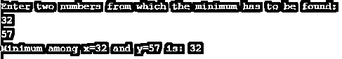

# Java min()

> 原文：<https://www.educba.com/java-min/>

")


## Java min()函数简介

在 Java 中，min()是一个内置的方法，它返回两个数的最小值。它继承自 java.lang.math 包，参数采用 double、int、long 和 float 类型。而且这个方法是可以重载的，实现这个方法是有一定条件的。这将在解释工作原理的部分讨论。除此之外，min()方法的语法和例子可以在下面的章节中看到。

**语法:**

<small>网页开发、编程语言、软件测试&其他</small>

正如已经讨论过的，在这个方法中可以使用不同的数据类型，比如 int、float、double 和 long。下面是方法 min()的这些不同数据类型的相应语法。

```
public static int min(int num1, int num2)  //syntax of min with datatype int
```

```
public static long min(long num1, long num2)  //syntax of min with datatype long
```

```
public static float min(float num1, float num2)  //syntax of min with datatype float
```

```
public static double min(double num1, double num2)  //syntax of min with double
```

**参数**:返回其中最小值的不同数据类型的 num1 和 num2。

**返回值**:将返回最少两个作为参数传递的数字，结果的数据类型将与参数相同。

### min()方法在 Java 中是如何工作的？

**1。**如果一个负数和一个正数作为方法的参数传递，那么生成的结果将是负数。

**示例:**如果给定数字-32 和 21 作为参数，那么将返回-32。

**2。**如果作为方法参数传递的两个参数都是负的，那么生成的结果将是具有较大值的结果。也就是说，它将更接近–ve(负)无穷大。

**示例:**如果给定数字-32 和-21 作为参数，则返回-32。

**3。**如果作为方法参数传递的两个参数相同，那么生成的结果将是相同的值。

**示例:**如果数字-32 和-32 作为参数给出，那么将返回-32。

**4。**如果 NaN(非数字)是任意一个值，则生成的结果也将是 NaN。

### 实现 Java min()方法的示例

以下是 Java min()方法的示例:

#### 示例#1

Java 程序寻找两个 int 类型正数的最小值。

**代码:**

```
public class MinExample {
public static void main(String[] args) {
// Declare two numbers of <u>int</u> type
int x = 41;
int y = 67;
// print the minimum number among x and y
System.out.println("Minimum among x="+x+" and y="+y+ " is: " + Math.min(x, y));
}
}
```

**输出:**

 Example 1")


在这个程序中，声明了两个正数 41 和 67，并使用 min()方法找到其中的最小值 41。

#### 实施例 2

Java 程序，找出两个 int 类型数的最小值，其中一个是正数，另一个是负数。

**代码:**

```
public class MinExample {
public static void main(String[] args) {
// Declare two numbers of <u>int</u> type
int x = 41;
int y = -67;
// print the minimum number among x and y
System.out.println("Minimum among x="+x+" and y="+y+ " is: " + Math.min(x, y));
}
}
```

**输出:**

 Example 2")


在这个程序中，声明了一个正数 41 和一个负数-67。其中的最小值-67 更接近负无穷大，使用 min()方法找到。

#### 实施例 3

Java 程序寻找两个 int 类型负数的最小值。

**代码:**

```
public class MinExample {
public static void main(String[] args) {
// Declare two numbers of <u>int</u> type
int x = -41;
int y = -67;
// print the minimum number among x and y
System.out.println("Minimum among x="+x+" and y="+y+ " is: " + Math.min(x, y));
}
}
```

**输出:**

 Example 3")


在这个程序中，声明了两个负数-41 和-67。其中的最小值-67 更接近负无穷大，使用 min()方法找到。

#### 实施例 4

Java 程序寻找两个双精度型正数的最小值。

**代码:**

```
public class MinExample {
public static void main(String[] args) {
// Declare two numbers of double type
double x = 26.11;
double y = 26.12;
// print the minimum number among x and y
System.out.println("Minimum among x="+x+" and y="+y+ " is: " + Math.min(x, y));
}
}
```

**输出:**

 Example 4")


与上面的程序不同，这里声明了两个 double 类型的正数 26.11 和 26.12。但是，其中的最小值 26.11 是使用类似于上述程序的 min()方法找到的。

#### 实施例 5

Java 程序寻找两个浮点数中的最小值。

**代码:**

```
public class MinExample {
public static void main(String[] args) {
// Declare two numbers of float type
float x = 26.11f;
float y = 26.12f;
// print the minimum number among x and y
System.out.println("Minimum among x="+x+" and y="+y+ " is: " + Math.min(x, y));
}
}
```

**输出:**


这里声明了两个浮点数 26.11f 和 26.12f。其中的最小值 26.11 是使用 min()方法找到的。

#### 实施例 6

Java 程序找到两个用户输入数字的最小值。

**代码:**

```
import java.util.Scanner;
public class MinExample {
public static void main(String[] args) {
System.out.println("Enter two numbers from which the minimum has to be found: ");
//read input numbers from the user
Scanner in= new Scanner(System.in);
//store first number in x
int x = in.nextInt();
//store second number in y
int y = in.nextInt();
in.close();
// print the minimum number among x and y
System.out.println("Minimum among x="+x+" and y="+y+ " is: " + Math.min(x, y));
}
}
```

**输出:**




在这个程序中，用户要求输入两个数字。如您所见，给出的数字是 32 和 57，从中返回 32 作为最小数字。

如果给两个数相同，会发生什么？


可以看出，结果将返回相同的数字。

### 推荐文章

这是 Java min()的指南。在这里，我们讨论 Java min()方法的介绍及其示例和代码实现。您也可以浏览我们推荐的其他文章，了解更多信息——

1.  [Java @Override](https://www.educba.com/java-override/)
2.  [Java 目录](https://www.educba.com/java-directories/)
3.  [Java max()](https://www.educba.com/java-max/)
4.  [Java IOException](https://www.educba.com/java-ioexception/)


