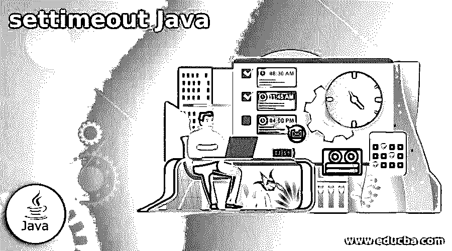
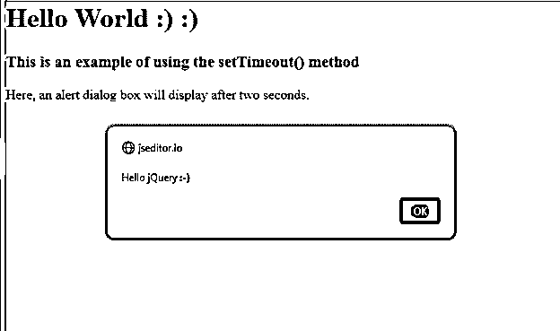
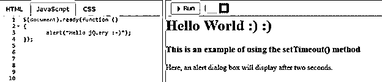
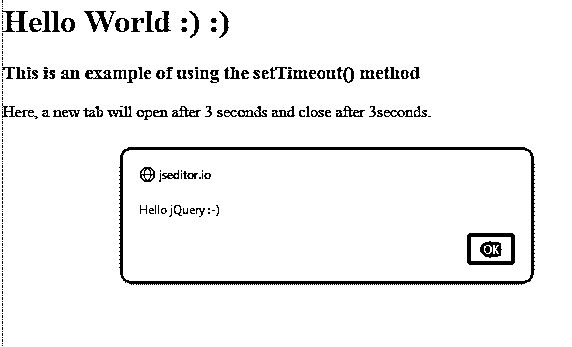
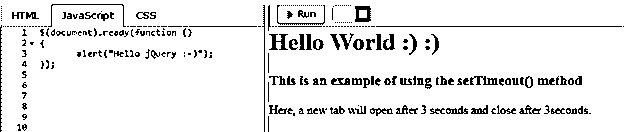
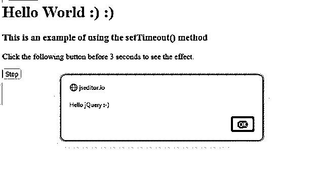
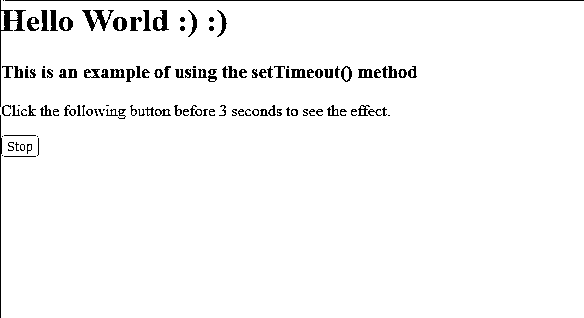
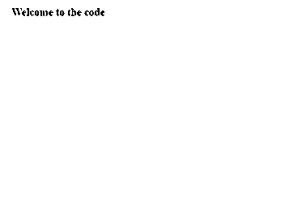

# settimeout Java

> 原文：<https://www.educba.com/settimeout-java/>




## Java 中设置超时的介绍

 **在 Java 中，我们有 wait()或 sleep()作为时间方法，setTimeout 是一个 javascript 方法，它被定义为在时间间隔等待后运行一个函数，其中该方法通过对给定表达式计算给定的指定次数(以毫秒为单位)来返回一个表示计时器 ID 值的数值。一般来说，与 setInterval()方法相比，setTimeout()方法只执行一次该函数，并且该方法还有另一种方式，即使用或不使用窗口前缀来编写该过程。因此，在 java 中，setTimeout 是 javascript 而不是 java 提供的函数。

**语法:**

<small>网页开发、编程语言、软件测试&其他</small>

```
setTimeout(function, milliseconds);
```

在上面的语法中，我们可以看到 setTimeout()函数接受两个参数，如下所示:

function–该参数是一个包含要执行的代码块或逻辑语句集的函数。

毫秒–该参数用于设置函数执行的时间。

### setTimeout()如何与示例一起工作？

在 Java 中，要在延迟一段时间后执行任何代码，我们使用 wait 或 sleep()函数。类似地，在 javascript 中，我们有 setTimeout()方法，该函数中指定的时间将以毫秒为单位。当您的代码运行 setTimeout()方法时，它只会在延迟后运行一次。因此，没有必要担心你的代码执行几次。有一个可选的延迟参数，但不是必须的；你可以用它。让我们看看文章中的原因。回调函数是该方法接受的另一个参数。一旦延迟开始运行，setTimeout()方法就会执行您传递的回调以及您放在回调函数中的任何内容。

**例子:**

```
<html>
<head>
<title> setTimeout() method </title>
</head>
<body>
<h1> Hello World :) :) </h1>
<h3> This is an example of using the setTimeout() method </h3>
<p> Here, an alert dialog box will display after two seconds. </p>
<script>
var a;    // initializing variable a
a = setTimeout(fun, 2000); // calling the setTimeout() function
function fun()
{
alert(" Welcome to the code ");   // sending an alert on the browser window to
demonstrate setTimeout()
}
</script>
</body>
</html>
```

**输出:**







在上面提到的代码片段中，我们将看到 setTimeout()函数的简单演示，同时执行、变量 a 和函数 fun()在开始时自动定义。这叫吊装。现在当我们调用 setTimeout()函数并在参数中，我们给出第一个参数作为间隔后要执行的函数，第二个参数是需要的时间延迟，以毫秒为单位。执行代码时，程序将等待 2000 毫秒，即 2 秒，然后执行代码片段，在浏览器上显示一条弹出消息，如下图所示。

#### 实施例 2

这是使用 setTimeout()方法的另一个例子。在这里，三秒钟后，一个新的标签页打开，三秒钟后关闭。该窗口已被使用。Open()新标签和窗口打开方法。Closing()打开标签方法。

因为我们没有使用一种方法来阻止 setTimeout()方法中指定的函数被执行。因此，在给定的时间间隔后，该函数只运行一次。

**代码:**

```
<html>
<head>
<title> setTimeout() method </title>
</head>
<body>
<h1> Hello World :) :) </h1>
<h3> This is an example of using the setTimeout() method </h3>
<p> Here, a new tab will open after 3 seconds and close after 3seconds. </p>
<script>
var a = setTimeout(fun1, 3000);
function fun1()
{
var win1 = window.open();
win1.document.write(" <h2> Welcome to the code  </h2>");
setTimeout(function(){win1.close()}, 3000);
}
</script>
</body>
</html>
```

**输出:**







现在，在上面的代码片段中，我们将看到如何在浏览器上打开一个新的标签页/窗口，并在一段延迟后自动关闭它，从而实现 setTimeout()函数。

正如在前面的代码片段中所解释的，我们再次调用 setTimeout()函数并传递两个参数，即函数 *fun* 和 3 秒的延迟时间。

在 fun 函数中，声明了 win1。Open()是一种绕过特定参数打开新浏览器标签或新浏览器窗口的方法。在编写 win1.document.write("text ")时，我们告诉浏览器将传递的文本写在窗口上。

在下一步中，我们一如既往地再次编写了 setTimeout()函数，但这一次我们没有传递一个函数；我们向浏览器传递了一个命令/指令。3 秒钟后，浏览器将执行命令并自动关闭浏览器窗口。

我们也可以停止行刑。

为了解释这一点，我们需要清楚地了解 clearTimeout()函数。JavaScript 中的 clearTimeout()函数清除之前由 setTimeout()函数设置的超时。

在指定的时间后，setTimeout()将运行传递的函数。setTimeout()函数返回的 id 号存储在变量中，用于清除计时器。

下面给出了一个简单的 cleartimeout()代码

```
var variable1;
function mytimeFunction() {  // taking mytime as a function
variable1 = setTimeout(function () {alert ("Hey World");}, 5000); // given a delay of 5000 miliseconds
}
function myClearFunction() {// myclear as a clearout function
clearTimeout(varaible1);
}
<html>
<head>
<title> setTimeout() method </title>
</head>
<body>
<h1> Hello World :) :) </h1>
<h3> This is an example of using the setTimeout() method </h3>
<p> Click the following button before 3 seconds to see the effect. </p>
<button onclick = "stop()"> Stop </button>
<script>
var a = setTimeout(fun1, 3000);
function fun1()
{
var win1 = window.open();
win1.document.write(" <h2> Welcome to the code</h2>");
setTimeout(function(){win1.close()}, 3000);
}
function stop() {
clearTimeout(a);
}
</script>
</body>
</html>
```

**输出:**










新标签页现在只打开 3 秒钟，然后它会自己关闭，标签页看起来如下。

### 结论–设置 Java 超时

在本文中，我们得出的结论是，在 java 中，有 wait()和 sleep()时间函数，这类似于 javascript 的 setTimeout()方法，这是一个内置的方法，允许您对某个函数的执行进行计时，我们需要传递等待的时间量，以毫秒为单位，这意味着等待一秒钟，您需要传递一千毫秒。要取消 setTimeout()方法的运行，需要使用 clearTimeout()方法，传递调用 setTimeout()方法时返回的 ID 值。

### 推荐文章

这是一个设置 Java 超时的指南。在这里，我们讨论 setTimeout()的工作原理和示例，以及代码和输出。您也可以看看以下文章，了解更多信息–

1.  [sprintf Java](https://www.educba.com/sprintf-java/)
2.  [Java 双向链表](https://www.educba.com/java-doubly-linked-list/)
3.  [Java 中的 Deque](https://www.educba.com/deque-in-java/)
4.  [Java 中的 Servlet](https://www.educba.com/servlet-in-java/)


**