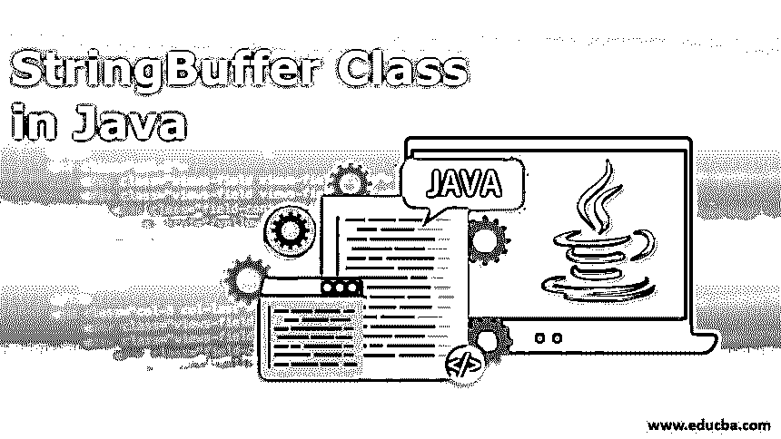
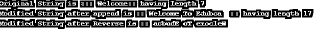
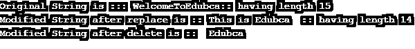

# Java 中的 StringBuffer 类

> 原文：<https://www.educba.com/stringbuffer-class-in-java/>




## Java 中的 StringBuffer 类是什么？

正如我们所知，基本上有两种类型的 java 对象，它们是可变的和不可变的。不可变对象是那些一旦创建就不能修改其内容的对象。每当一个不可变对象的内容被改变时，就会有新对象的创建。在可变对象的情况下，我们可以改变现有对象的内容，这不会导致新对象的创建。因此，可变字符串是那些其内容可以在不创建新对象的情况下被改变的字符串。

StringBuffer 和 StringBuilder 是 java 中 String 的可变版本，而 java String 类是不可变的。因此，StringBuffer 是一个可变字符串，用于为 String 对象提供可变性。String 类包含固定长度、不可变的字符序列，而 string buffer 具有可扩展的长度和可写的字符序列。

<small>网页开发、编程语言、软件测试&其他</small>

### Java 中如何使用字符串缓冲类？

以下几点说明了如何在 java 中使用 StringBuffer。

*   如前所述，java 中的[可变字符串可以使用](https://www.educba.com/mutable-string-in-java/) [StringBuffer 和 StringBuilder 类](https://www.educba.com/stringbuffer-vs-stringbuilder/)创建。
*   两者的主要区别在于 StringBuffer 是线程安全的实现，而 StringBuilder 不是。
*   每当需要高性能和高安全性时，应该优先选择 String 类的可变版本。
*   由于字符串池的原因，字符串类存在安全问题；因此，只要需要数据安全，就会使用 StringBuffer。
*   就性能而言，StringBuffer 比 StringBuffer 更好，因为 StringBuffer 是线程安全的，但是只要需要线程安全，就应该使用 StringBuffer。

### StringBuffer 构造函数

以下是字符串缓冲区构造函数:

*   **StringBuffer():** 这将创建一个默认容量为 16 个字符的空 StringBuffer。
*   **StringBuffer(int capacity):**创建一个指定容量的空 string buffer。
*   **StringBuffer(char sequence charseq):**这将创建一个 string buffer，其中包含与指定字符序列中相同的字符。
*   **StringBuffer(String str):** 创建指定字符串对应的 StringBuffer。

下面是 StringBuffer 类的声明:

```
public final class StringBuffer extends Object implements Serializable,CharacterSequence,Appendable
```

### Java 中 StringBuffer 类的方法

现在我们将看到 StringBuffer 中有哪些不同的可用方法和字段。以下是 StringBuffer 类中可用的常用方法列表:

| **方法名** | **描述** |
| 长度()和容量() | 可变字符串的长度可以使用 length()方法计算，相应的容量可以使用 capacity()计算。 |
| append(String str)追加(整数) | 此方法用于在现有字符串缓冲区的末尾添加新文本。 |
| insert(int index, String str)insert(int index，char ch) | 用于在给定字符串的指定位置插入文本。在给定的语法中，index 指定将插入字符串的起始索引。 |
| 反向() | 用于反转给定字符串缓冲区对象中的字符顺序。 |
| delete(int start，int end)和 deleteCharAt(int index) | 用于从字符串缓冲区中删除字符。Start 表示要删除的第一个字符的起始索引，end 表示要删除的最后一个字符的索引。 |
| replace(int startindex，int endindex，String str) | 用于用指定的字符串缓冲区替换 startindex 和 endindex-1 之间的字符序列。 |
| 字符(整数索引) | 用于返回字符串缓冲区中指定索引处的字符。 |
| 代码点(int index) | 用于返回指定索引处的 Unicode 字符。 |
| int index 之前的代码点 | 用于返回指定索引前的 Unicode 字符。 |
| substring(int start)子串(int start，int end) | 用于返回包含给定字符串中包含的字符子序列的新字符串。 |
| 确保容量(内部容量) | 用于增加现有字符串缓冲区对象的容量。 |
| toString() | 用于将可变字符串缓冲区转换为不可变字符串对象。 |

### Java 中 StringBuffer 类的例子

下面是 StringBuffer 类的一些示例:

#### 示例#1

让我们看一个 StringBuffer 类的基本例子。

**代码:**

```
public class StringBufferDemo{
public static void main(String args[]){
StringBuffer sBuffer1=new StringBuffer("Welcome");
System.out.println("Original String is ::: " + sBuffer1 + ":: having length " + sBuffer1.length());
//using append method
sBuffer1.append(" To Edubca");
System.out.println("Modified String after append is :: " + sBuffer1 + " :: having length " + sBuffer1.length());
//using reverse method
sBuffer1.reverse();
System.out.println("Modified String after Reverse is :: " + sBuffer1);
}
}
```

上面的代码展示了 java StringBuffer 的创建及其不同的方法。将产生以下输出。

**输出:**




#### 实施例 2

在这个例子中，我们将看到 StringBuffer 类的更多方法。

**代码:**

```
public class StringBufferDemo{
public static void main(String args[]){
StringBuffer sBuffer=new StringBuffer ("WelcomeToEdubca");
System.out.println("Original String is ::: " + sBuffer + ":: having length " + sBuffer.length());
//using replace method
sBuffer.replace(0,9,"This is ");
System.out.println("Modified String after replace is :: " + sBuffer + " :: having length " + sBuffer.length());
//using delete method
sBuffer.delete(0,7);
System.out.println("Modified String after delete is :: " + sBuffer);
}
}
```

上面的代码将显示以下内容作为输出。

**输出:**




在上面的例子中，我们已经看到了如何创建一个 StringBuffer 类及其方法的用法。

### 结论

通过上面的讨论，我们对 java 中的 StringBuffer、它是如何创建的以及 StringBuffer 类中可用的不同方法有了清晰的理解。另外，StringBuffer 是线程安全的；因此，它可以在多线程环境中使用。

### 推荐文章

这是一个 Java 中 StringBuffer 类的指南。在这里，我们讨论构造函数、方法以及如何在 java 中使用 StringBuffer 类，并给出一个示例和代码实现。您也可以浏览我们推荐的其他文章，了解更多信息——

1.  [Java 中的静态构造函数](https://www.educba.com/static-constructor-in-java/)
2.  [Java 中的转换](https://www.educba.com/conversion-in-java/)
3.  [Java 字符串操作符](https://www.educba.com/java-string-operators/)
4.  [Java 中的 StringBuilder 类](https://www.educba.com/stringbuilder-class-in-java/)


