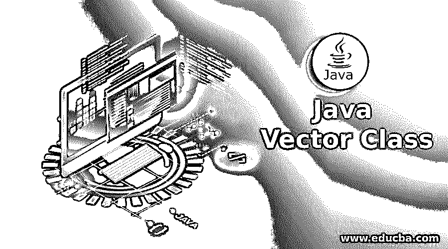
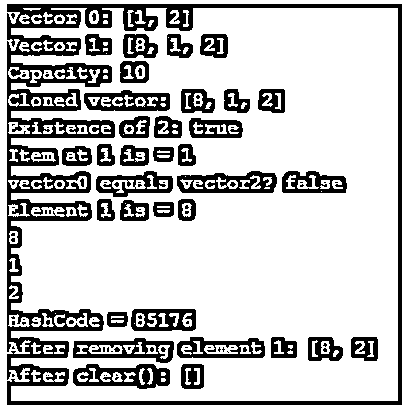
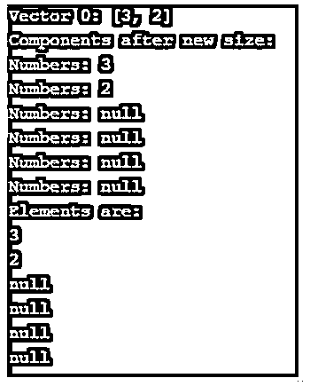

# Java 向量类

> 原文：<https://www.educba.com/java-vector-class/>




## Java Vector 类简介

Vector 是 Java 中的一个类，它实现了对象的动态数组。也就是说，可以根据需要扩展或收缩阵列。它在事先不知道数组大小的情况下非常有用。与数组不同，vector 是同步的，包含许多集合框架没有的遗留方法。它继承自 java.util 包，实现接口列表。建议在线程安全实现的情况下使用该类。否则，最好使用 ArrayList。

**声明:**

<small>网页开发、编程语言、软件测试&其他</small>

下面是 Java 中 vector 类的声明:

```
public class Vector<E> extends Object<E> implements List<E>,Cloneable, Serializable
```

### Java Vector 类的构造函数

下面给出了 Java Vector 类的构造函数:

*   **Vector():** 构造一个空向量，内部数据数组的大小为 10，标准容量增量为 0。
*   **矢(收藏<？extends E>c:**vector 由上述集合中的元素构成，并基于集合的迭代器进行排序。
*   **Vector(int c):** 用初始容量 c 和容量增量 0 构建一个空向量。
*   **Vector(int c，intcapacityIncrement):** 用初始容量 c 和容量增量构造一个空向量。

### Java 向量类的方法

下面给出了 Java Vector 类的方法:

*   **add(E e):** 元素 E 追加到向量末尾。
*   **add(int index，E Element):**E 元素将被插入到 vector 中提到的位置。
*   **addAll(收藏<？extends E>c:**所有元素都附加到 vector 的末尾，并根据集合的迭代器进行排序。
*   **add(int index，E element):** 集合中提到的所有元素都将被插入到 vector 中提到的位置。
*   addElement(E obj): 提到的组件将被添加到向量的末尾，大小递增 1。
*   **capacity():** 将返回向量的当前容量。
*   **clear():** 所有的元素都将从 vector 中移除。
*   **clone():** 将为 vector 返回克隆。
*   **包含(Object o):** 如果 vector 包含所提到的元素，将返回 true。
*   **containsAll(收藏<？> c):** 如果 vector 包含上述集合中提到的所有元素，将返回 true。
*   **copy into(Object[]an array):**这个向量的分量被复制到提到的数组中。
*   **elementAt(int index):** 将返回所提到的索引处的组件。
*   **elements():** 将为该向量返回组件的枚举。
*   **ensure capacity(int minCapacity):**Vector 容量增加，确保 Vector 可以容纳最小参数容量所提到的组件数量。
*   **equals(Object o):** 对于相等，指定的对象将与 vector 进行比较。
*   **firstElement():** 将返回向量索引 0 处的第一项。
*   **get(int index):** 在提到的位置的元素将在这个向量中返回。
*   **hashCode():** 将为此向量返回 hashCode 的值。
*   **indexOf(Object o):** 返回 Vector 中第 1 个<sup>第 1 个</sup>出现的项目的索引。如果该项不存在，将返回-1。
*   **indexOf(Object o，int index):** 返回所述项在 Vector 中第 1 个<sup>第</sup>次出现的索引。如果该项不存在，将返回-1。
*   **insertElementAt(E obj，int index):** 提到的对象将作为向量中的一个分量插入到提到的索引中。
*   **isEmpty():** 检查向量是否有分量。
*   **迭代器():**迭代器将按正确的顺序返回列表中的项目。
*   **lastElement():** 将为向量返回最后一个分量。
*   **lastIndexOf(Object o):** 返回 Vector 中最后一个条目的索引。如果该项不存在，将返回-1。
*   **lastIndexOf(Object o，int index):** 将返回所提到的项在 Vector 中的最后一次出现的索引。如果该项不存在，将返回-1。
*   listIterator(): 列表迭代器将返回列表项。
*   **listIterator(int index):** 一个列表迭代器将在列表项上返回，其中 starting 是提到的位置。
*   **remove(int index):** 所述位置的元素将从该向量中移除。
*   **remove(Object o):**1<sup>ST</sup>一个条目的出现将从 Vector 中删除。如果该项不存在，它将保持不变。
*   **removeAll(收藏<？> c):** 集合中所有可用的元素都将从 Vector 中移除。
*   **removeAllElements():** 所有的元素都将从 Vector 中移除，大小变为 0。
*   **retail(收藏<？> c):** 集合中所有可用的元素都将从 Vector 中保留。
*   **set(int index，E element):** 在这个 Vector 中所提到的位置的元素将被替换为所提到的元素。
*   **setElementAt(E obj，int index):** 所提到的索引处的组件将被设置为给定的对象。
*   **setSize(int newSize):** 将设置矢量大小。
*   **size():** 将返回组件数量。
*   **subList(int fromIndex，int toIndex):** 对于 fromIndex(包含)和 toIndex(不包含)之间的部分将返回一个视图。
*   **toArray():** 获取一个数组，该数组以正确的顺序包含 vector 中的所有元素。
*   **toString():** 将为 vector 返回字符串表示。
*   **trimToSize():** 向量容量被修剪为向量的当前大小。

### 例子

下面是提到的例子:

#### 示例#1

**代码:**

```
import java.util.Vector;
public class Main {
public static void main(String arg[]) {
Vector<String>vctr = new Vector<>(2);
vctr.add("1");
vctr.add(1,"2");
System.out.println("Vector 0: " + vctr);
Vector<String> vctr1 = new Vector<>();
vctr1.add("8");
vctr1.addAll(vctr);
System.out.println("Vector 1: " + vctr1);
System.out.println("Capacity: "+vctr1.capacity());
System.out.println("Cloned vector: "+vctr1.clone());
System.out.println("Existence of 2: "+vctr1.contains("2"));
System.out.println("Item at 1 is = "+vctr1.elementAt(1));
System.out.println("vector0 equals vector2? "+vctr.equals(vctr1));
System.out.println("Element 1 is = "+vctr1.firstElement());
vctr1.forEach(System.out::println);
System.out.println("HashCode = "+vctr1.hashCode());
vctr1.remove(1);
System.out.println("After removing element 1: " + vctr1);
vctr1.clear();
System.out.println("After clear(): " + vctr1);
}  }
```

**输出:**




#### 实施例 2

**代码:**

```
import java.util.ListIterator;
import java.util.Vector;
public class Main {
public static void main(String arg[]) {
Vector<Integer>vctr = new Vector<>(2);
vctr.add(3);
vctr.add(1,2);
vctr.setElementAt(2, 1);
System.out.println("Vector 0: " + vctr);
vctr.setSize(6);
System.out.println("Components after new size: ");
for (Integer n :vctr) {
System.out.println("Numbers: " +n);
}
ListIterator<Integer> li = vctr.listIterator();
System.out.println("Elements are: ");
while(li.hasNext())
{
System.out.println(li.next());
}
}
}
```

**输出:**




### 推荐文章

这是一个 Java 矢量类的指南。这里我们结合编程实例讨论 Java Vector 类、构造函数、方法的介绍。您也可以看看以下文章，了解更多信息–

1.  [Java @Inherited](https://www.educba.com/java-inherited/)
2.  [Java 断言](https://www.educba.com/java-assertion/)
3.  [Java URLEncoder](https://www.educba.com/java-urlencoder/)
4.  [在 Java 中完成](https://www.educba.com/finalize-in-java/)


