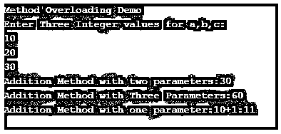
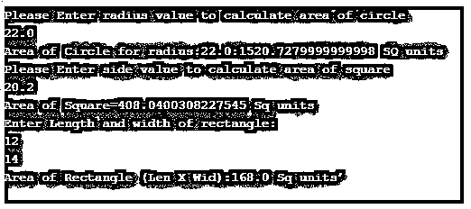

# Java 中的方法重载

> 原文：<https://www.educba.com/method-overloading-in-java/>


## Java 中的方法重载介绍

重载的基本含义是执行一个或多个同名的函数。Java 提供了重载方法的工具。方法重载是一个类，它可以有多个同名的方法，但是它们应该在签名或参数数量以及方法的返回类型上有所不同。这种重载功能的方法有利于代码的可读性和程序的可重用性。根据参数的数量和[方法的返回类型，每当方法过载时，JVM 调用](https://www.educba.com/what-is-jvm/)一个特定的方法。仅更改方法的返回类型 java 运行时系统不认为是方法重载。因此，方法必须在签名和返回类型上有所不同。

**语法:**

<small>网页开发、编程语言、软件测试&其他</small>

```
class Demo
{
void addition(int val ,int val)
{
}
void addition(float val, float val, float val)
{
}
void addition(double val, double val)
{
}
}
```

霸王有两种可能的方式:

*   更改参数的数量。
*   更改数据类型。

考虑上面的代码片段；类 Demo 包含一个重载的 addition()方法，该方法具有一个 int 返回类型，并更改了许多参数。

### Java 中方法重载的例子

下面是 java 中方法重载的例子:

#### 示例#1

考虑下面的例子，通过改变一些参数来重载。

**代码:**

```
import java.util.*;
class Demo2
{
int addition(int a,int b)
{
int res;
res=a+b;
return res;
}
int addition(int a,int b,int c)
{
int res;
res=a+b+c;
return res;
}
int addition(int c)
{
int res;
res=c+1;
return res;
}
}
public class OverloadingDemo
{
public static void main(String[] args)
{
Demo2 obj=new Demo2();
System.out.println("Method Overloading Demo");
Scanner scr=new Scanner(System.in);
System.out.println("Enter Three Integer values for a,b,c:");
int a=scr.nextInt();
int b=scr.nextInt();
int c=scr.nextInt();
System.out.println("Addition Method with two parameters:"+obj.addition(a, b));
System.out.println("Addition Method with Three Parameters:"+obj.addition(a, b, c));
System.out.println("Addition Method with one parameter:"+a+"+1:"+obj.addition(a));
}
}
```

**输出:**




在上面的示例中，程序在 Demo2 类中声明了三个 addition()方法。这三种方法都用不同的参数重载；第一个方法接受三个整数类型参数，并返回一个整数值。第二个重载加法()接受两个整数值，计算加法，并返回整数类型值的结果。

#### 实施例 2

通过改变数据类型和返回类型实现重载的程序。

**代码:**

```
import java.util.*;
class Demo3
{
float addition(int a,float b)
{
float res;
res=a+b;
return res;
}
float addition(float a,float b,float c)
{
float res;
res=a+b+c;
return res;
}
double addition(double a,double b)
{
double res;
res=a+b;
return res;
}
}
public class OverloadingDemo1
{
public static void main(String[] args)
{
System.out.println();
Demo3 obj=new Demo3();
Scanner scr=new Scanner(System.in);
System.out.println("Enter one Integer and floating point number:");
int a=scr.nextInt();
float b=scr.nextFloat();
System.out.println("Calling addition method with addition(int,float)"+obj.addition(a, b));
System.out.println("Enter three Floating point numbers:");
float i=scr.nextFloat();
float j=scr.nextFloat();
float k=scr.nextFloat();
System.out.println("Calling addition(float,float,float)"+obj.addition(i, j, k));
System.out.println("Enter two double type numbers:");
double x=scr.nextDouble();
double y=scr.nextDouble();
System.out.println("Calling addition(double,double):"+obj.addition(x, y));
}
}
```

**输出:**


上面的示例程序通过更改数据类型和返回类型来演示重载方法。声明了三个加法方法，它们的参数类型和返回类型不同。第一个方法采用两个 int 和 floats 类型的参数来执行加法并返回一个 float 值。第二个重载方法采用三个浮点参数来执行加法，并返回一个浮点值。第三个重载方法接受两个 double 值并返回一个 double 值。

#### 实施例 3

通过重载 area()方法计算正方形、长方形和圆形面积的程序。

**代码:**

```
import java.util.*;
class ComputeArea
{
void area(double r)
{
double area;
area=142*r*r;
System.out.println("Area of Circle for radius:"+r+":"+area+" SQ units");
}
void area(float side)
{
double res;
res=Math.pow(side,2);
System.out.println("Area of Square="+res+" Sq units");
}
void area(float len,float wid)
{
double res=len*wid;
System.out.println("Area of Rectangle (Len X Wid):"+res+" Sq units’");
}
}
public class AreaDemo
{
public static void main(String[] args)
{
Scanner scr=new Scanner(System.in);
ComputeArea obj=new ComputeArea();
System.out.println("Please Enter radius value to calculate area of circle");
double r=scr.nextDouble();
obj.area(r);
System.out.println("Please Enter side value to calculate area of square");
float x=scr.nextFloat();
obj.area(x);
System.out.println("Enter Length and width of rectangle:");
float l=scr.nextFloat();
float w=scr.nextFloat();
obj.area(l, w);
}
}
```

**输出:**




### 方法重载的特征

下面是提到的特征:

*   因为[方法重载](https://www.educba.com/method-overloading-in-python/)是静态多态，即方法在编译过程中被绑定。
*   重载在运行时影响，方法的绑定是在编译时完成的，所以在运行时不需要很多过程，例如绑定或检查。
*   只改变方法的返回不认为是[方法重载](https://www.educba.com/method-overloading-in-c-plus-plus/)。这导致了模糊错误。
*   参数数量、参数顺序和参数类型是实际方法重载的一部分。

### 方法重载的优点

下面是提到的优点:

*   减少执行时间，因为绑定是在编译时完成的。
*   过载机制实现了灵活性。
*   实现了代码重用；因此它节省内存。
*   降低了代码复杂度。因此提供了代码的一致性。

### 结论

通过使用方法重载机制，实现了静态多态。[方法重载降低了](https://www.educba.com/method-overloading-in-php/)代码复杂性，防止用不同的签名为相同的功能编写不同的方法。代码的可重用性是通过重载实现的，因为不同的函数使用相同的方法。重载也适用于 java 中的构造函数，但是这个功能是[运行时多态性](https://www.educba.com/runtime-polymorphism-in-java/)的一个例子。静态多态减少了执行时间。使用重载机制是最佳的编程实践。

### 推荐文章

这是 Java 中方法重载的指南。这里我们讨论 java 中方法重载的介绍、例子、特性和优点。您也可以看看以下文章，了解更多信息–

1.  [Java 收藏反转](https://www.educba.com/java-collection-reverse/)
2.  [Java 中的静态构造函数](https://www.educba.com/static-constructor-in-java/)
3.  [Java 中的这个关键字](https://www.educba.com/this-keyword-in-java/)
4.  [Java 流过滤器](https://www.educba.com/java-stream-filter/)


