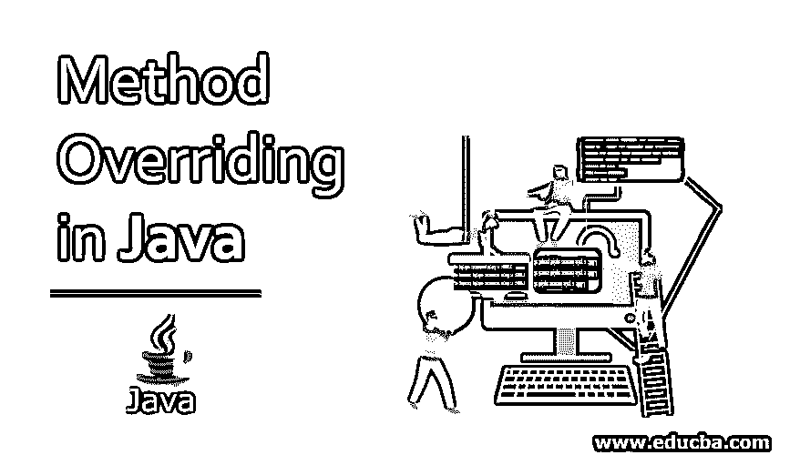
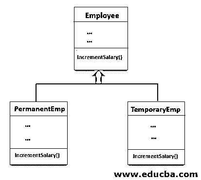
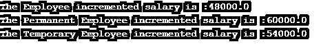

# Java 中的方法覆盖

> 原文：<https://www.educba.com/method-overriding-in-java/>




## Java 中的方法覆盖简介

这个特性允许子类或者子类为已经被一个超类定义的方法重新定义或者提供特定的实现。简单来说，在子类中重新定义的超类方法在 java 中称为方法重写。方法覆盖的条件是子类应该与其父类中的方法具有相同的名称、相同的参数列表或其他换言之方法签名和相同的返回类型，那么子类中的方法被认为覆盖了其父类的方法。

使用[方法覆盖特性](https://www.educba.com/method-overriding-in-python/)在 java 中执行[动态多态性。方法重写的另一个用途是为子类方法提供特定的实现，这已经在父类中提供了。借助下图，我们可以更清楚地理解方法覆盖。](https://www.educba.com/polymorphism-in-java/)

<small>网页开发、编程语言、软件测试&其他</small>




如上图所示，codePermanentEmp 类和 TemporaryEmp 类继承了 Employee 类。因此，Employee 变量和方法可以在两个类(codePermanentEmp 类和 TemporaryEmp 类)中重用，但是 PermanentEmp 和 TemporaryEmp 类都被重新定义了 incrementSalary()方法，以计算特定于雇员类型的工资增量。所以这两个类都覆盖了 incrementSalary()方法。根据方法覆盖的条件，它们也得到满足，因为它们与 employee 类中的方法名、参数列表和返回类型相同。

### Java 中方法覆盖的语法

让我们看看 java 中方法覆盖的语法:

```
class Superclassname
{
// variables
void methodA()
{
// method implementation code
}
}
class Subclassname1 extends Superclassname
{
// variables
void methodA()
{
// method specific implementation or re-implemented code
}
}
class Subclassname2 extends Superclassname
{
// variables
void methodA()
{
// method specific implementation or re-implemented code
}
}
```

extended 关键字表示我们正在创建一个从现有类派生的新类，因此已经在超类中定义的方法 methodA()正在子类中重新定义。

关于覆盖方法，需要记住的要点是:

*   重写的方法允许更多或相等(但不是更少)的访问修饰符来重写方法。
*   私有、最终和静态方法不能被重写。
*   接口或抽象类的子类必须重写抽象方法；否则，将引发编译时错误。

### Java 中方法覆盖的例子

下面是 Java 中覆盖超类方法的例子

#### 示例#1

接下来，我们编写 java 代码来理解 java 中的方法覆盖，用下面的例子来覆盖超类的方法

**代码:**

```
class Employee{
float salary = 40000;
void incrementSalary()
{
System.out.println("The Employee incremented salary is :" +(salary + (salary * 0.2)) );
}
}
class PermanentEmp extends Employee{
double hike = 0.5;
void incrementSalary()
{
System.out.println("The Permanent Employee incremented salary is :" +(salary + (salary * hike)) );
}
}
class TemporaryEmp extends Employee{
double hike = 0.35;
void incrementSalary()
{
System.out.println("The Temporary Employee incremented salary is :" +(salary + (salary * hike)) );
}
}
public class p1
{
public static void main(String args[]){
Employee e =new Employee( );
PermanentEmp p = new PermanentEmp();
TemporaryEmp t = new TemporaryEmp();
// based on an object it decide which class incrementSalary() method to be execute
e.incrementSalary();
p.incrementSalary();
t.incrementSalary();
}
}
```

**输出:**




在上面的代码中，PermanentEmp 类和 TemporaryEmp 类是子类，Employee 是超类，在子类中，方法 incrementSalary()从超类中重写，正如我们在代码中看到的，重写方法 incrementSalary()与超类 Employee 具有相同的名称、相同的签名和相同的返回类型。另一个要点是，在创建类的主方法对象和调用 incrementSalary()方法时，要执行哪个类 incrementSalary()方法是根据对象本身决定的(动态多态或后期绑定)，它执行与对象所属的类方法相同的方法，这一点我们可以在输出中清楚地看到。

#### 实施例 2

让我们看一个在 Java 中重写方法来重写超类的参数化方法的例子。

**代码:**

```
class Employee{
float salary = 40000;
void incrementSalary(double hike)
{
System.out.println("The Employee incremented salary is :" +(salary + (salary * hike)) );
}
}
class PermanentEmp extends Employee{
void incrementSalary(double hike)
{
System.out.println("The Permanent Employee incremented salary is :" +(salary + (salary * hike)) );
}
}
class TemporaryEmp extends Employee{
void incrementSalary(double hike)
{
System.out.println("The Temporary Employee incremented salary is :" +(salary + (salary * hike)) );
}
}
public class p1
{
public static void main(String args[]){
Employee e =new Employee( );
PermanentEmp p = new PermanentEmp();
TemporaryEmp t = new TemporaryEmp();
// based on an object it decide which class incrementSalary() method to be execute
e.incrementSalary(0.2);
p.incrementSalary(0.5);
t.incrementSalary(0.35);
}
}
```

**输出:**


在上面的示例中，PermanentEmp 类和 TemporaryEmp 类覆盖了 incrementSalary(double hike)方法。

### 结论

java 中的方法覆盖是一个特性，其中一个超类方法重新定义或再次实现子类。要覆盖一个方法，子类必须与其父类中的方法具有相同的名称、相同的参数列表或相同的签名以及相同的返回类型，那么子类中的方法就被称为覆盖了其父类的方法。

### 推荐文章

这是一个 Java 方法覆盖的指南。这里我们讨论 Java 中方法覆盖的介绍、语法和各种例子。您也可以浏览我们的其他相关文章，了解更多信息——

1.  [Java 中的控制语句](https://www.educba.com/control-statement-in-java/)
2.  [Java 中的哈希表](https://www.educba.com/hashtable-in-java/)
3.  [Java 中的不可变类](https://www.educba.com/immutable-class-in-java/)
4.  [Java 本地时间](https://www.educba.com/java-localtime/)


