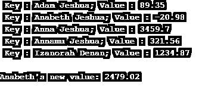

# Java 中的 TreeMap 是什么？

> 原文：<https://www.educba.com/what-is-treemap-in-java/>


## Java 中的树形图介绍

TreeMap 与抽象类一起使用，在 Java 中部署地图和 NavigableMap 接口。该映射根据其键的自然顺序或由依赖于构建器的预构建比较器来排序。这是一种排序和存储键值对的简单方法。树映射保留的存储顺序必须与任何其他分类映射相同，而与特定的比较器无关。

以下是 TreeMap 的一些属性。

<small>网页开发、编程语言、软件测试&其他</small>

*   它由独特的元素组成。
*   它不能有空键。
*   可以多次具有空值。
*   不同步。

**声明:**

```
public class TreeMap<Key, Value> extends AbstractMap<Key, Value>implements NavigableMap<Key, Value>, Cloneable, Serializable
```

这里，Key 和 Value 分别是这个映射中键和映射值的类型。

### TreeMap 的构造函数

下面是 TreeMap 的构造函数。

*   **TreeMap():** 通过对关键字进行自然排序，将构建一个新的空树图。
*   **树形图** **(** **比较器** **<？super** **K** **ey >比较器):**通过对比较器中指定的键进行排序，将构建一个新的空的树形图。
*   **TreeMap****(****Map****<？扩展了**KT10】ey，？Ext
*   **TreeMap****(****sorted map****<****K****ey，？extends****V****value>m):**将使用映射 m 中的映射和比较器中指定的键排序来构建新的树映射。

### 树形图方法

TreeMap 提供了大量的方法来帮助执行不同的功能。它们是:

*   **清除** **():** 地图中的所有贴图都将被移除。
*   **克隆** **():** 将为 TreeMap 实例返回一个浅层副本。
*   **包含关键字** **(** **对象** **k):** 如果指定的关键字有映射，则返回 true。
*   **包含值** **(** **对象** **v):** 如果值 v 有一个或多个键可用的映射，则返回 true。
*   **ceiling Key****(****K****key):**返回大于等于指定 key 的最小 key。如果没有键，那么将返回 null。
*   **ceiling entry****(****K****Key):**返回大于等于指定键的最小键-值对。如果没有键，那么将返回 null。
*   **firstKey** **():** 返回地图中的第一个或最后一个键。
*   **firstEntry** **():** 将返回映射中最少或第一个键的键-值对。如果没有键，那么将返回 null。
*   **floor Key****(****K****key):**返回小于等于指定 key 的最大 key。如果没有键，那么将返回 null。
*   **floor entry****(****K****key):**返回小于等于指定 Key 的最大 Key 的 Key-value 对。如果没有键，那么将返回 null。
*   **lastKey** **():** 返回地图中最高或最后一个键。
*   **lastEntry** **():** 将返回映射中最大键的键-值对。如果没有键，那么将返回 null。
*   **lower Key****(****K****key):**返回严格小于指定 key 的最大 key。如果没有键，那么将返回 null。
*   **lower entry****(****K****Key):**返回严格小于指定键的最大键的键-值对。如果没有键，那么将返回 null。
*   **删除** **(** **对象** **k):** 地图中指定键的映射将被删除。
*   **大小** **():** 返回映射中键值对的个数。
*   **higher entry****(****K****Key):**返回严格大于指定键的最小键的键-值对。如果没有键，那么将返回 null。
*   **higher Key****(****K****key):**返回严格高于指定 key 的最小 key。如果没有键，那么将返回 null。
*   **descendingMap** **():** 返回映射的逆序。
*   **entrySet** **():** 将为映射返回集合视图。
*   **get****(****Object****k):**返回指定键的值。如果该键不包含任何映射，则将返回 null。
*   **键集**、 **():** 键集视图将被返回。
*   **navigable keyset****():**返回按键的 NavigableSet 视图。
*   **pollFirstEntry****():**映射中最少或第一个键的键-值对将被删除并返回。如果映射为空，则将返回 null。
*   **pollastentry****():**映射中最大键的键值对将被删除并返回。如果映射为空，则将返回 null。
*   **值** **():** 地图中的值将返回集合视图。

### 用 Java 实现树形图的例子

现在，让我们看一个创建树形图并向其中添加元素的示例程序。

```
import java.util.Iterator;
import java.util.Map;
import java.util.Set;
import java.util.TreeMap;
public class TreeMapExample {
public static void main(String args[]) {
// Tree Map creation
TreeMap tmap = new TreeMap();
// Add elements to the treemap tmap
tmap.put("Anna Jeshua", new Double(3459.70));
tmap.put("Annamu Jeshua", new Double(321.56));
tmap.put("Izanorah Denan", new Double(1234.87));
tmap.put("Adam Jeshua", new Double(89.35));
tmap.put("Anabeth Jeshua", new Double(-20.98));
// Retrieve the entry set of treemap
Set set = tmap.entrySet();
// Create an iterator itr
Iterator itr = set.iterator();
// Display the elements in treemap using while loop
while(itr.hasNext()) {
Map.Entry mp = (Map.Entry)itr.next();
System.out.print(" Key : " + mp.getKey() + ";");
System.out.println(" Value : "+ mp.getValue());
}
System.out.println();
// Add 2500 to Anabeth's value
double val = ((Double)tmap.get("Anabeth Jeshua")).doubleValue();
tmap.put("Anabeth Jeshua", new Double(val + 2500));
System.out.println("Anabeth's new value: " + tmap.get("Anabeth Jeshua"));
} }
```

**输出:**

执行代码时将显示树映射的键和相应的值。




**说明:**

*   首先，创建一个树形图并向其中添加元素。
*   为了显示元素，必须创建一个迭代器。
*   使用迭代器，所有的键和它们对应的值都会显示出来。
*   为了给键值加上 2500，还使用了 put()方法。

### 结论

Java TreeMap 是红黑树的一种实现，有助于按排序顺序存储键值对。本文详细讨论了 Java TreeMap 的声明、构造函数、方法和示例程序等几个细节。

### 推荐文章

这是一本关于 Java 中什么是 TreeMap 的指南？.这里我们讨论 java 中 treemap 的构造函数和方法，以及一个例子和它的代码实现。您也可以阅读以下文章，了解更多信息——

1.  [Java 中的二叉树](https://www.educba.com/what-is-a-binary-tree-in-java/)
2.  [Tableau 中的树形图](https://www.educba.com/treemap-in-tableau/)
3.  [Java 中的排序](https://www.educba.com/sorting-in-java/)
4.  [Java class not found exception](https://www.educba.com/java-classnotfoundexception/)


