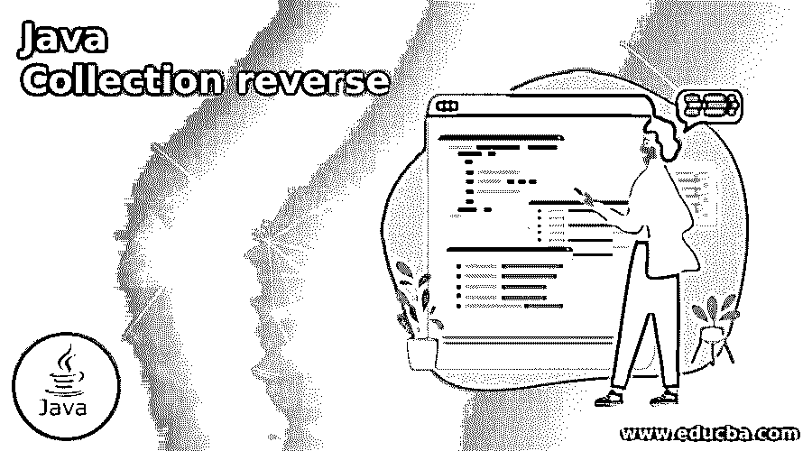
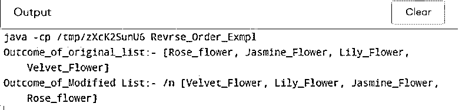
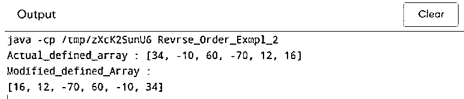
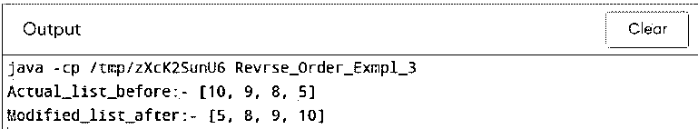
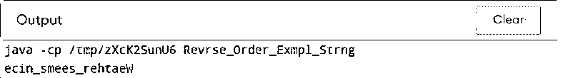
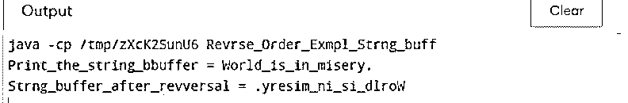

# Java 集合反向

> 原文：<https://www.educba.com/java-collection-reverse/>




## Java 集合反向介绍

Java 集合在 Java 中起着非常重要的作用，它的主要作用是颠倒以列表形式出现的元素数量的顺序。用于排序和反转元素的 Java 集合支持 util 方法，该方法进一步用于在一些帮助和制作下使反转方法工作。Java collection reverse 方法抛出一个异常，如果在这种情况下抛出一些 UnsupportedOperationException 是否存在并不重要，因为它不支持集合的任何操作。反转列表，然后按照正确的逆序排列元素是很重要的。

**Java 集合反向的语法**

<small>网页开发、编程语言、软件测试&其他</small>

Java Collection Reverse()方法有一个合适的语法，它作为 Reverse 类的一部分起着重要的作用，如下所示:

```
public static <K> ComparatorOrigin<K> reverseOrder()
```

reverse 方法的声明以这种格式完成，其中 Java collections 类用于获取 comparatorOrigin，该 comparator origin 将用于以特定顺序(即逆序)排列列表中的所有元素。

```
public static <L> ComparatorOrigin<L> reverseOrder (Comparator<L> comp_0)
```

逆序方法的声明用于使比较器以自然顺序将它与以特定方式进行反向比较器排序的对象集合相结合。Comp_0 作为列表中的可选参数。

### Java 集合逆向方法是如何工作的？

Java 集合包含了许多方法，但同样依赖于类似于 reverse method()的需求，对每个方法都有意义。

Java 集合反向方法的工作原理如下:

*   Java reverse()方法作为集合的一部分存在于 Java.util 包中，是 Java 中的一种数据结构。
*   reverse()方法用于反转列表中的元素，这意味着它主要用于从右到左排列元素的顺序。
*   它遵循以特定方式简化元素的搜索和实现的顺序。
*   reverse()方法是一种用作静态方法的方法，用于通过类名访问元素，从而使类具有正确的数据结构。
*   如果方法中存在的类对象不正确，那么它肯定会抛出一个错误，而不是正确的，那么可访问性是非常容易的。
*   Java reverse method()也支持不需要的异常，如果类对象中存在不需要的东西，可能会出现这种异常，并且在用顺序反转列表中存在的元素时会清楚地确认。
*   它抛出一个异常 UnsupportedOperationException，该异常给出了任何集合的不支持操作的列表。
*   说到方法的返回类型，它返回 void，这没有任何意义。
*   reverse 方法()正常工作的兼容版本包括 Java 1.5 版本和更高版本，使其完全适用。
*   假设有一个字符串缓冲区类，以防不可能直接在字符串类上执行 reverse()方法；需要执行一些操作来将 reverse 方法()引入到带有 String 类的图片中。首先需要先将输入字符串转换成 String builder，之后需要使用 append 方法将哪个输入字符串追加到字符串缓冲区中。一旦完成，所有的字符都将出现在元素的最后一个反向字符串中。
*   因此，可以说 reverse()方法在 string builder 类中被默认支持，但在整个 string 类中却不受支持。

### Java 集合反向的例子

下面给出了 Java 集合反向的例子:

#### 示例#1

此示例显示了以特定方式定义的花卉列表，其中原始花卉是这样的，应用 reverse()方法后的反向顺序是这样的，如下面的输出所示。

**代码:**

```
import java.util.*;
class Revrse_Order_Exmpl
{
public static void main(String[] args) {
List<String> mylist_0 = new ArrayList<String>();
mylist_0.add("Rose_flower");
mylist_0.add("Jasmine_Flower");
mylist_0.add("Lily_Flower");
mylist_0.add("Velvet_Flower");
System.out.println("Outcome_of_original_list:- " + mylist_0);
Collections.reverse(mylist_0);
System.out.println("Outcome_of_Modified List:- /n " + mylist_0);
}
}
```

**输出:**




#### 实施例 2

这个程序用整数数组演示了 reverse()方法的功能，一旦对整数数组应用 reverse()方法，它们就会被反转，如输出所示。

**代码:**

```
import java.util.*;
class Revrse_Order_Exmpl_2 {
public static void main(String[] args) {
Integer arr_5[] = {34, -10, 60, -70, 12, 16};
System.out.println("Actual_defined_array : " +Arrays.toString(arr_5));
Collections.reverse(Arrays.asList(arr_5));
System.out.println("Modified_defined_Array : " + "\n"+Arrays.toString(arr_5));
}
}
```

**输出:**




#### 实施例 3

这个程序演示了用于整数列表的 reverse 方法()，该方法反转输出中显示的元素列表。

**代码:**

```
import java.util.*;
class Revrse_Order_Exmpl_3 {
public static void main(String[] args) {
List<Integer> list_0 = new ArrayList<Integer>();
list_0.add(10);
list_0.add(9);
list_0.add(8);
list_0.add(5);
System.out.println("Actual_list_before:- " + list_0);
Collections.reverse(list_0);
System.out.println("Modified_list_after:- " + list_0);
}
}
```

**输出:**




#### 实施例 4

该程序显示 inbuild reverse()方法，该方法是 StringBuilder 类的一部分，而不是 string buffer 类的一部分，因此需要进行转换才能将其附加到 string 调用中，如下面的输出所示。

**代码:**

```
import java.util.*;
class Revrse_Order_Exmpl_Strng {
public static void main(String[] args) {
String input_0 = "Weather_seems_nice";
StringBuilder input_a = new StringBuilder();
input_a.append(input_0);
input_a.reverse();
System.out.println(input_a);
}
}
```

**输出:**




#### 实施例 5

这个程序显示字符串缓冲区和一个应用 reverse()方法的字符串，并显示如下内容，如输出所示。

**代码:**

```
import java.util.*;
class Revrse_Order_Exmpl_Strng_buff {
public static void main(String[] args) {
StringBuffer strng_bf = new StringBuffer("World_is_in_misery.");
System.out.println("Print_the_string_bbuffer = " + strng_bf);
strng_bf.reverse();
System.out.println("Strng_buffer_after_revversal = " + strng_bf);
}
}
```

**输出:**




### 结论

java 集合引用有很多优点，在任何 Java 数据结构中都起着举足轻重的作用。它有助于使整个集合框架处理许多字符串、字符和整数，这有助于进一步的实现，并且结果看起来符合开发人员和用户的期望。它有助于使整个 Java 变得有用。

### 推荐文章

这是一个 Java 集合逆向的指南。这里我们讨论一下入门，java 集合逆向方法是如何工作的？还有例子。您也可以看看以下文章，了解更多信息–

1.  [Java 中的排序字符串](https://www.educba.com/sort-string-in-java/)
2.  [在 Java 中排序字符串数组](https://www.educba.com/sort-string-array-in-java/)
3.  [终于在 Java 中](https://www.educba.com/finally-in-java/)
4.  [Java 中的 JSON](https://www.educba.com/json-in-java/)


