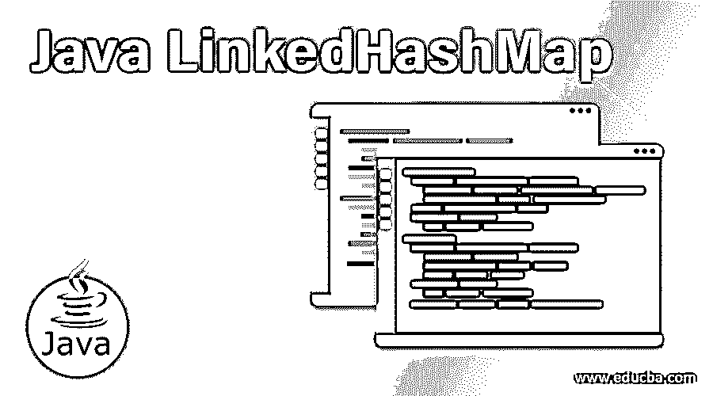
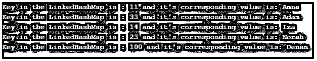
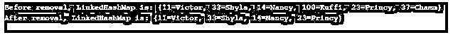
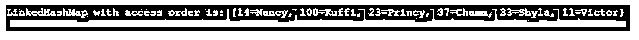

# Java LinkedHashMap

> 原文：<https://www.educba.com/java-linkedhashmap/>




## Java LinkedHashMap 简介

在 Java 中，LinkedHashMap 是接口映射中 linkedlist 的实现。它类似于 HashMap，其中包含了一个额外的特性来维护插入其中的元素的顺序。尽管 HashMap 提供了快速的插入、删除和搜索，但是元素的插入顺序并没有得到维护。

### Java LinkedHashMap 的特性

除此之外，LinkedHashMap 中还包含其他几个特性。

<small>网页开发、编程语言、软件测试&其他</small>

*   它只包含独特的元素。
*   它可以包含一个空键和几个空值。
*   插入顺序保持不变。
*   扩展 HashMap 类。
*   显示的值基于键。
*   不同步。
*   16 是初始默认容量
*   负载系数为 0.75。

**语法:**

```
LinkedHashMap<Integer, String> obj = new LinkedHashMap<Integer, String>();
```

这里，obj 是创建的 LinkedHashMap 的对象。

创建 LinkedHashMap 对象后，它将用于向地图添加元素，如下所示。

```
obj.put(11, "Victor");
obj.put(33, "Shyla");
obj.put(14, "Nancy");
obj.put(100, "Kuffi");
obj.put(23, "Princy");
obj.put(37, "Chamm");
```

### 构造器

下面给出了 LinkedHashMap 的构造函数:

**1。LinkedHashMap():** 将创建一个空的 LinkedHashMap 实例，其排序基于插入，加载因子为 0.75，默认初始容量为 16。

**2。LinkedHashMap(int initial capacity):**将创建一个空的 linked hashmap 实例，其排序基于插入、加载因子 0.75 和指定的初始容量。

**3。LinkedHashMap(int initial capacity，** **float loadFactor):** 将创建一个空的 linked hashmap 实例，其排序基于插入、指定的加载因子和初始容量。

**4。LinkedHashMap(int initial capacity，** **float loadFactor，boolean accessOrder):** 将使用指定的加载因子、访问顺序和初始容量创建一个空的 linked hashmap 实例。

**5。LinkedHashMap(地图<？扩展 K，？extends V>m:**linked hashmap 实例将被创建，其排序基于插入，映射基于上述映射。

### 方法

以下是 LinkedHashMap 中常用的方法。

**1。clear():** 地图中的每个映射都将被删除。

**2。boolean contains key(Object key):**如果映射包含到一个或多个提到的值的键的映射，将返回 true。

**3。boolean contains value(Object key):**如果映射包含到最少一个键的映射，将返回 true。

**4。Object get(Object key):** 将返回所提到的键的映射的值。

**5。isEmpty():** 如果没有键值对映射，将返回 true。

**6。size():** 将返回映射中可用的键值对的计数。

**7。Object remove(Object key):** 所提到的键的映射值将被删除。

**8。boolean removeEldestEntry(映射。entry oldest):**如果可以移除最老的条目，则返回 true。

### Java LinkedHashMap 的例子

下面给出了 Java LinkedHashMap 的例子:

#### 示例#1

Java 程序创建一个简单的 LinkedHashMap。

**代码:**

```
import java.util.Iterator;
import java.util.LinkedHashMap;
import java.util.Map;
import java.util.Set;
//class begins here
public class LinkedHashMapExample {
//main method
public static void main(String args[]) {
// create a LinkedHashMap
LinkedHashMap<Integer, String> obj = new LinkedHashMap<Integer, String>();
//Adding key-value pair 1
obj.put(11, "Anna");
//Adding key-value pair 2
obj.put(33, "Adam");
//Adding key-value pair 3
obj.put(14, "Iza");
//Adding key-value pair 4
obj.put(23, "Norah");
//Adding key-value pair 5
obj.put(100, "Denan");
// create an entry set
Set s = obj.entrySet();
// Display the elements
Iterator itr = s.iterator();
//iterate each element
while(itr.hasNext()) {
//create an object for map.entry
Map.Entry mp = (Map.Entry)itr.next();
//print each element
System.out.print("Key in the LinkedHashMap is : "+ mp.getKey() +
" and it's corresponding value is: "+mp.getValue()+" \n");
}
}
}
```

**输出:**




在这个程序中，首先创建一个 LinkedHashMap。之后，用键-值对向它添加元素。一旦完成，就创建了一个条目集。此外，为了打印 LinkedHashMap 中的所有元素，需要创建一个迭代器。通过迭代每个元素，它被打印并显示出来，如示例输出所示。

#### 实施例 2

从映射中删除键值对的 Java 程序。

**代码:**

```
import java.util.Iterator;
import java.util.LinkedHashMap;
import java.util.Map;
import java.util.Set;
//class begins here
public class LinkedHashMapExample {
//main method
public static void main(String args[]) {
// create a LinkedHashMap
LinkedHashMap<Integer, String> obj = new LinkedHashMap<Integer, String>();
//Adding key-value pair 1
obj.put(11, "Victor");
//Adding key-value pair 2
obj.put(33, "Shyla");
//Adding key-value pair 3
obj.put(14, "Nancy");
//Adding key-value pair 4
obj.put(100, "Kuffi");
//Adding key-value pair 5
obj.put(23, "Princy");
//Adding key-value pair 6
obj.put(37, "Chamm");
System.out.print("Before removal, LinkedHashMap is: "+obj+"\n");
//remove the elements with keys 100 and 37
obj.remove(100);
obj.remove(37);
System.out.print("After removal, LinkedHashMap is: "+obj);
}
}
```

**输出:**




在这个程序中，也是首先创建一个 LinkedHashMap。之后，用键-值对向它添加元素。一旦完成，就会打印 LinkedHashMap。然后，使用 remove()方法从映射中删除两个键值对。之后，再次打印并显示地图，如示例输出所示。

#### 实施例 3

Java 程序根据访问顺序在 map 中打印键值对。

**代码:**

```
import java.util.Iterator;
import java.util.LinkedHashMap;
import java.util.Map;
import java.util.Set;
//class begins here
public class LinkedHashMapExample {
//main method
public static void main(String args[]) {
// create a LinkedHashMap with third paramter set access order
LinkedHashMap<Integer, String> obj = new LinkedHashMap<Integer, String>(2, .75f, true);
//Adding key-value pair 1
obj.put(11, "Victor");
//Adding key-value pair 2
obj.put(33, "Shyla");
//Adding key-value pair 3
obj.put(14, "Nancy");
//Adding key-value pair 4
obj.put(100, "Kuffi");
//Adding key-value pair 5
obj.put(23, "Princy");
//Adding key-value pair 6
obj.put(37, "Chamm");
//Access the pair 33
obj.get(33);
//Access the pair 11
obj.get(11);
System.out.print("LinkedHashMap with access order is: "+obj);
}
}
```

**输出:**




这里，在这个程序中，首先创建一个 LinkedHashMap。之后，用键-值对向它添加元素。一旦完成，带有键 33 和 11 的元件被访问。然后，打印并显示地图，如示例输出所示。可以看到，被访问的元素位于地图的末尾。

### **结论**

本文详细探讨了 Java LinkedHashMap 的几乎所有细节，比如语法、构造函数、方法和示例。此外，它还确定了 LinkedHashMap 和 HashMap 之间的主要区别。

### 推荐文章

这是一个 Java LinkedHashMap 的指南。这里我们讨论介绍、构造函数、方法和例子。您也可以看看以下文章，了解更多信息–

1.  [Java 中的排序](https://www.educba.com/sorting-in-java/)
2.  [Java 枚举图](https://www.educba.com/java-enummap/)
3.  Java 中的链接列表
4.  [JavaScript 中的 linked list](https://www.educba.com/linkedlist-in-javascript/)


