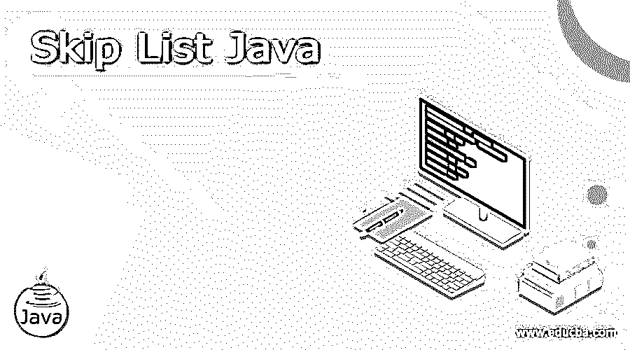
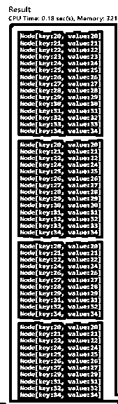

# 跳过列表 Java

> 原文：<https://www.educba.com/skip-list-java/>




## 跳过列表 Java 简介

跳转列表 Java 是一种数据结构，用于在连接到元素子序列的链表层次结构的帮助下存储元素的排序列表。跳过列表允许以有效的方式处理项目查找。跳过列表是一种概率数据结构，这意味着它跳过了整个列表中的几个元素，因此被称为跳过列表。我们可以把跳转列表看作是链表的扩展版本。类似于链表如何允许插入、移除和执行对元素的搜索，跳转列表也允许搜索元素、从列表中移除元素和插入元素。它将包含一个基本列表，该列表包含一组维护后续元素的链接层次结构的元素。

**语法:**

<small>网页开发、编程语言、软件测试&其他</small>

跳过列表没有特定的语法，但是它有一个算法。在研究算法之前，我们需要检查基本的跳表操作的类型。

*   **插入操作:**在跳表中，用于在特定的情况下，将一个新的节点添加到特定的位置
*   **搜索操作:**在跳转列表中，用于搜索特定的节点
*   **删除操作:**在跳转列表中，用于删除特定情况下的节点

### Java 中跳转列表的使用

所以让我们看看跳过列表实际上是如何以算法的方式工作的。

#### 插入算法

**步骤 1:** 决定节点级别由于列表中的每个元素都由节点表示，并且节点的级别是在插入列表时随机选择的

**步骤 2:** 根据以下步骤决定节点的级别

**第三步:**找到最大级别作为跳过列表中级别计数的上限，由 L(N) = logp/2N 确定。这保证了随机等级将大于最大等级

**步骤 4:** 插入从最高层开始，比较当前节点的下一个节点

**步骤 5:** 如果下一个节点键小于插入的键，那么我们可以向前移动相同的级别

**步骤 6:** 如果下一个节点关键字大于插入的关键字，那么我们需要存储一个指向当前节点 I 的指针，并向下移动一级继续搜索。

#### 搜索算法

**步骤 1:** 因为搜索元素非常类似于在跳转列表中搜索一个点来插入元素。

**步骤 2:** 如果下一个节点关键字小于搜索关键字，那么我们可以在同一级别上向前移动

**步骤 3:** 如果下一个节点关键字大于插入的关键字，那么我们需要存储一个指向当前节点 I 的指针，并向下移动一级继续搜索。

**第四步:**在最低层，如果最右边元素的下一个元素的键等于搜索键，那么我们已经找到了该键，否则失败。

#### 删除算法

**步骤 1:** 要删除任何元素，比如 k，首先我们需要使用搜索算法在跳过列表中定位该元素。

**步骤 2:** 一旦我们使用搜索算法找到了元素，就像在单个链表中一样，进行指针重排以从列表中移除元素。

**第三步:**我们需要从跳转列表的最底层开始，重新排列 I not 元素 k 旁边的元素。

**步骤 4:** 删除元素后，可能会出现没有元素的级别，因此我们需要通过减少跳过列表级别来删除这些级别。

### Java 中的跳转列表示例

**代码:**

```
import java.util.Iterator;
import java.util.Random;
import java.util.NoSuchElementException;
public class SkipListJava<K extends Comparable<K>, V> implements Iterable<K> {
private int listsize;
private double pb;
protected static final Random randomGen = new Random();
protected static final double DEFAULT_PB = 0.5;
private NodeKeyValue<K, V> head;
public SkipListJava() {
this(DEFAULT_PB);
}
public SkipListJava(double pb) {
this.head = new NodeKeyValue<K, V>(null, null, 0);
this.pb = pb;
this.listsize = 0;
}
public V get(K key) {
checkKeyValid(key);
NodeKeyValue<K, V> listnode = findNode(key);
if (listnode.getKey().compareTo(key) == 0)
return listnode.getValue();
else
return null;
}
public void add(K key, V value) {
checkKeyValid(key);
NodeKeyValue<K, V> listnode = findNode(key);
if (listnode.getKey() != null && listnode.getKey().compareTo(key) == 0) {
listnode.setValue(value);
return;
}
NodeKeyValue<K, V> newlistNode = new NodeKeyValue<K, V>(key, value, listnode.getLevel());
horizontalInsertList(listnode, newlistNode);
int curLevel = listnode.getLevel();
int headlistLevel = head.getLevel();
while (isBuildLevel()) {
if (curLevel >= headlistLevel) {
NodeKeyValue<K, V> newHeadEle = new NodeKeyValue<K, V>(null, null, headlistLevel + 1);
verticalLink(newHeadEle, head);
head = newHeadEle;
headlistLevel = head.getLevel();
}
while (listnode.getUp() == null) {
listnode = listnode.getPrevious();
}
listnode = listnode.getUp();
NodeKeyValue<K, V> tmp = new NodeKeyValue<K, V>(key, value, listnode.getLevel());
horizontalInsertList(listnode, tmp);
verticalLink(tmp, newlistNode);
newlistNode = tmp;
curLevel++;
}
listsize++;
}
public void remove(K key) {
checkKeyValid(key);
NodeKeyValue<K, V> listnode = findNode(key);
if (listnode == null || listnode.getKey().compareTo(key) != 0)
throw new NoSuchElementException("Key does not exist!");
while (listnode.getDownList() != null)
listnode = listnode.getDownList();
NodeKeyValue<K, V> previous = null;
NodeKeyValue<K, V> next = null;
for (; listnode != null; listnode = listnode.getUp()) {
previous = listnode.getPrevious();
next = listnode.getNext();
if (previous != null)
previous.setNext(next);
if (next != null)
next.setPreviousVal(previous);
}
while (head.getNext() == null && head.getDownList() != null) {
head = head.getDownList();
head.setUp(null);
}
listsize--;
}
public boolean contains(K key) {
return get(key) != null;
}
public int listsize() {
return listsize;
}
public boolean empty() {
return listsize == 0;
}
protected NodeKeyValue<K, V> findNode(K key) {
NodeKeyValue<K, V> listnode = head;
NodeKeyValue<K, V> next = null;
NodeKeyValue<K, V> down = null;
K nodeKey = null;
while (true) {
next = listnode.getNext();
while (next != null && lessThanEqual(next.getKey(), key)) {
listnode = next;
next = listnode.getNext();
}
nodeKey = listnode.getKey();
if (nodeKey != null && nodeKey.compareTo(key) == 0)
break;
down = listnode.getDownList();
if (down != null) {
listnode = down;
} else {
break;
}
}
return listnode;
}
protected void checkKeyValid(K key) {
if (key == null)
throw new IllegalArgumentException("Key must be not null!");
}
protected boolean lessThanEqual(K a, K b) {
return a.compareTo(b) <= 0;
}
protected boolean isBuildLevel() {
return randomGen.nextDouble() < pb;
}
protected void horizontalInsertList(NodeKeyValue<K, V> a, NodeKeyValue<K, V> b) {
b.setPreviousVal(a);
b.setNext(a.getNext());
if (a.getNext() != null)
a.getNext().setPreviousVal(b);
a.setNext(b);
}
protected void verticalLink(NodeKeyValue<K, V> a, NodeKeyValue<K, V> b) {
a.setDown(b);
b.setUp(a);
}
@Override
public String toString() {
StringBuilder stringbuild = new StringBuilder();
NodeKeyValue<K, V> listnode = head;
while (listnode.getDownList() != null)
listnode = listnode.getDownList();
while (listnode.getPrevious() != null)
listnode = listnode.getPrevious();
if (listnode.getNext() != null)
listnode = listnode.getNext();
while (listnode != null) {
stringbuild.append(listnode.toString()).append("\n");
listnode = listnode.getNext();
}
return stringbuild.toString();
}
@Override
public Iterator<K> iterator() {
return new SkipListIterator<K, V>(head);
}
protected static class SkipListIterator<K extends Comparable<K>, V> implements Iterator<K> {
private NodeKeyValue<K, V> listnode;
public SkipListIterator(NodeKeyValue<K, V> listnode) {
while (listnode.getDownList() != null)
listnode = listnode.getDownList();
while (listnode.getPrevious() != null)
listnode = listnode.getPrevious();
if (listnode.getNext() != null)
listnode = listnode.getNext();
this.listnode = listnode;
}
@Override
public boolean hasNext() {
return this.listnode != null;
}
@Override
public K next() {
K result = listnode.getKey();
listnode = listnode.getNext();
return result;
}
@Override
public void remove() {
throw new UnsupportedOperationException();
}
}
protected static class NodeKeyValue<K extends Comparable<K>, V> {
private K key;
private V value;
private int skiplevel;
private NodeKeyValue<K, V> up, down, next, previous;
public NodeKeyValue(K key, V value, int skiplevel) {
this.key = key;
this.value = value;
this.skiplevel = skiplevel;
}
@Override
public String toString() {
StringBuilder stringbuild = new StringBuilder();
stringbuild.append("Node[")
.append("key:");
if (this.key == null)
stringbuild.append("None");
else
stringbuild.append(this.key.toString());
stringbuild.append(", value:");
if (this.value == null)
stringbuild.append("None");
else
stringbuild.append(this.value.toString());
stringbuild.append("]");
return stringbuild.toString();
}
public K getKey() {
return key;
}
public void setKey(K key) {
this.key = key;
}
public V getValue() {
return value;
}
public void setValue(V value) {
this.value = value;
}
public int getLevel() {
return skiplevel;
}
public void setLevel(int skiplevel) {
this.skiplevel = skiplevel;
}
public NodeKeyValue<K, V> getUp() {
return up;
}
public void setUp(NodeKeyValue<K, V> up) {
this.up = up;
}
public NodeKeyValue<K, V> getDownList() {
return down;
}
public void setDown(NodeKeyValue<K, V> down) {
this.down = down;
}
public NodeKeyValue<K, V> getNext() {
return next;
}
public void setNext(NodeKeyValue<K, V> next) {
this.next = next;
}
public NodeKeyValue<K, V> getPrevious() {
return previous;
}
public void setPreviousVal(NodeKeyValue<K, V> previous) {
this.previous = previous;
}
}
public static void main(String[] args) {
SkipListJava<Integer, String> skip = new SkipListJava<>();
for (int i = 20; i < 35; i++) {
skip.add(i, String.valueOf(i));
}
System.out.println(skip);
assert skip.listsize() == 10;
int count = 0;
for (Integer i : skip)
assert i.equals(count++);
skip.remove(23);
System.out.println(skip);
skip.remove(25);
skip.remove(33);
skip.remove(30);
System.out.println(skip);
skip.remove(28);
skip.add(25, "25");
System.out.println(skip);
assert skip.listsize() == 0;
assert skip.empty();
}
}
```

**输出:**




我们写了这段代码，用于添加到跳过列表中，在跳过列表中搜索，以及从跳过列表中删除。

### 结论

至此，我们将结束“Java 跳过列表”这一主题。我们已经了解了什么是 Skip list Java，以及它如何使用算法在 Skip list 中搜索、插入和删除元素。此外，有一个很好的例子，它一次完成了所有的跳表操作。你仍然可以尝试你脑海中的其他例子或逻辑。跳表的概念在任何编程语言中都是一样的，是数据结构中的主要算法之一。

### 推荐文章

这是一个跳过列表 Java 的指南。在这里，我们讨论介绍，语法，基本的跳表操作的类型，算法，代码实现的例子。您也可以看看以下文章，了解更多信息–

1.  [Java 中的排序字符串](https://www.educba.com/sort-string-in-java/)
2.  [在 Java 中排序字符串数组](https://www.educba.com/sort-string-array-in-java/)
3.  [JavaScript 中的 2D 数组](https://www.educba.com/2d-arrays-in-javascript/)
4.  [JavaScript 表单](https://www.educba.com/javascript-modulo/)


