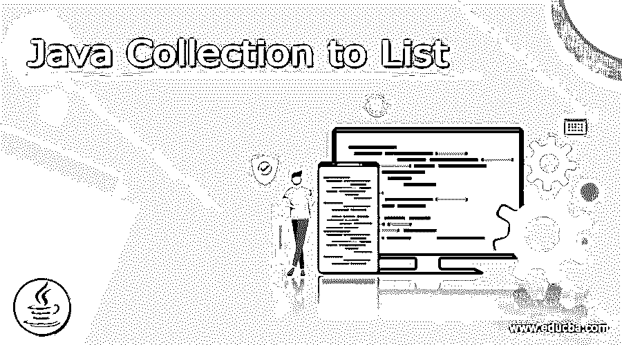
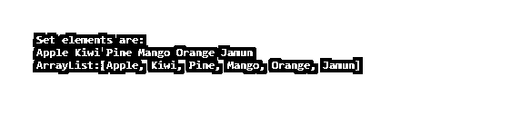
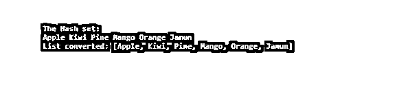

# 要列出的 Java 集合

> 原文：<https://www.educba.com/java-collection-to-list/>




## Java 集合列表介绍

Java 集合到列表意味着集合到列表的转换。将 Java 集合从一种类型转换为另一种类型是编程中的常见任务。集合是包含并处理一组数据的数据结构。集合框架由 Set、Queue、Dequeue、List 等多个接口和 ArrayList、Vector、Linked List、Priority Queue、Tree Set、Hash Set、Linked Hash Set 等类组成。存储在集合中的数据被封装，只能通过一些预定义的方法来访问这些数据。在本教程中，我们将看到集合到数组列表的转换。

**语法:**

<small>网页开发、编程语言、软件测试&其他</small>

下面是用于将 Java 集合转换为列表的语法。

```
List<Integer> intVal = values.stream().collect(Collectors.toList());
```

Java 集合必须用类型声明进行参数化。它使 Java 编译器能够检查用户是否试图使用具有正确对象类型的集合。

### 要列出的 Java 集合示例

让我们看几个例子，让我们深入了解集合的转换。

#### 示例#1

**代码:**

```
import java.util.*;
public class CollectionToArrayList{
public static void main(String[] args){
List<String> list = new ArrayList<String>();
list.add("eduCBA ");
list.add("is ");
list.add("best ");
list.add("platform ");
list.add("for ");
list.add("Web ");
list.add("Development ");
list.add("course. ");
String[] s = list.toArray(new String[0]);
for(int i = 0; i< s.length; ++i) {
String data = s[i];
System.out.print(data);
}
}
}
```

**输出:**


因此，这里我们使用一个集合框架将数据转换为列表。

因为收集框架包括列表、队列、集合等。我们将把数组转换成列表，就像我们把列表转换成数组一样。

#### 示例 2:使用 asList

**代码:**

```
import java.util.*;
import java.util.stream.*;
class Main {
public static void main(String args[])
{
Integer[] evenArray = { 2, 4, 6, 8, 10, 12, 14 };
List<Integer> evemList = Arrays.asList(evenArray);
System.out.println("List from array: " + evemList);
}
}
```

**输出:**


所以基本上，我们有传统的方法将数组集合转换成列表。但是这里我们使用的是另一种转换方法，即 Array 类的 asList 方法。这里我们使用一个偶数数组，使用 array 类的 asList 方法创建整数列表并分配给输出。

#### 示例 3:使用 Collections.addAll()方法

**代码:**

```
import java.util.*;
import java.util.stream.*;
class Main {
public static void main(String args[]) {
String stringArr[] = { "Web", "Development", "is", "course", "No.", "1" };
System.out.println("Array Before conversion: " + Arrays.toString(stringArr));
List<String> strList = new ArrayList<>();
Collections.addAll(strList, stringArr);
System.out.println("List after converting: " + strList);
}
}
```

**输出:**


所以，这里我们使用集合类的 addAll()方法，因为数组和列表都是集合框架的一部分。我们初始化了一个空数组并创建了一个空列表。Collections.addAll()方法用于将列表和数组作为参数传递。类似于 Array，其中一个集合被转换成 List，我们将看到一个 Set，一个集合是如何被转换成 List 的。

#### 示例 4:使用普通 Java

**代码:**

```
import java.util.*;
class Main {
public static void main(String[] args) {
Set<String> HashSet = new HashSet<String>();
HashSet.add("Mango");
HashSet.add("Apple");
HashSet.add("Orange");
HashSet.add("Jamun");
HashSet.add("Pine");
HashSet.add("Kiwi");
System.out.println("Set elements are: ");
for (String i : HashSet)
System.out.print(i + " ");
List<String> stringList = new ArrayList<String>(HashSet.size());
for (String i : HashSet)
stringList.add(i);
System.out.println("\nArrayList:" + stringList);
}
}
```

**输出:**




在这里，我们声明并初始化一个集合，然后创建一个列表并将集合元素添加到列表中。

#### 示例 5:使用构造函数

**代码:**

```
import java.util.*;
class Main {
public static void main(String[] args) {
Set<String> HashSet = new HashSet<String>();
HashSet.add("Mango");
HashSet.add("Apple");
HashSet.add("Orange");
HashSet.add("Jamun");
HashSet.add("Pine");
HashSet.add("Kiwi");
System.out.println("Hash set :");
for(String string: HashSet)
System.out.print(string + " ");
List<String> lList = new LinkedList<String>(HashSet);
System.out.println ("\nLinked List from set: " + lList);
}
}
```

**输出:**


所以上面的例子是另一种使用构造函数将 Hash set，Collection 转换成 list 的方式。我们在上面也使用了相同的散列集合，并使用了带有集合对象的列表构造函数作为参数。它将所有集合元素复制到列表对象中。

#### 示例#6:使用 Java 8 流

**代码:**

```
import java.util.*;
import java.util.stream.*;
class Main {
public static void main(String[] args) {
Set<String> HashSet = new HashSet<String>();
HashSet.add("Mango");
HashSet.add("Apple");
HashSet.add("Orange");
HashSet.add("Jamun");
HashSet.add("Pine");
HashSet.add("Kiwi");
System.out.println("The Hash set:");
for(String string : HashSet)
System.out.print(string + " ");
List<String> stringList = HashSet.stream().collect(Collectors.toList());
System.out.println("\nList converted: " + stringList);
}
}
```

**输出:**




这里，我们使用 Java 8 stream 和 collect 方法将 Hash 集转换成 list。

至此，我们将结束“要列出的 Java 集合”主题。我们已经看到了将集合转换为列表的通用语法。我们已经看到了集合的转换，包括数组、集合等。被转换成列表。通过各种方法实现了数组和集合到列表的转换，例如使用 addAll()方法、Java 8 stream、general Java class、asList()方法。Java 中还有很多其他的集合可以转换成 List。谢谢！快乐学习！!

### 推荐文章

这是一个 Java 收藏指南列表。在这里，我们讨论了介绍，语法，收集到一个数组列表的转换，代码实现的例子。您也可以看看以下文章，了解更多信息–

1.  [Java 集合类型](https://www.educba.com/java-collection-types/)
2.  [Java 集合排序](https://www.educba.com/java-collection-sort/)
3.  [Java 中的排序字符串](https://www.educba.com/sort-string-in-java/)
4.  [Java 中的 Shell 排序](https://www.educba.com/shell-sort-in-java/)


