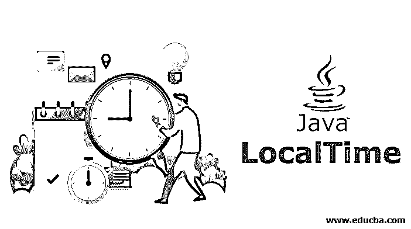
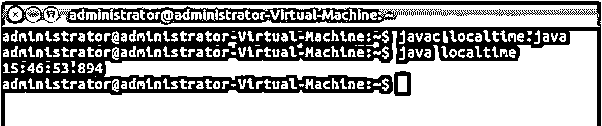
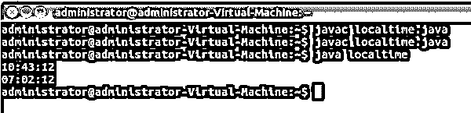
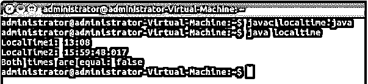

# Java 本地时间

> 原文：<https://www.educba.com/java-localtime/>




## Java LocalTime 简介

Java LocalTime 是内置的功能包之一，可用于与日期和时间相关的多种操作。对于与 LocalTime 相关的操作，Java 有一个特定的应用程序接口(API ),称为 Java Time，它拥有多种方法，可以应用于任何与日期和时间相关的函数。LocalTime 类中一些常用的方法有 get()、compareTo()、equals、atDate()、of()、now()、plusHours()、minusHours()等，它们的预定义对象是小时、分钟和秒。

现在我们已经理解了 Java 8 的 LocalTime 类，让我们来学习语法。

<small>网页开发、编程语言、软件测试&其他</small>

**语法:**

公共最终类 LocalTime 扩展了可比较的对象实现<localtime></localtime>

上述语法是初始化该类的标准方式。如前所述，LocalTime 类扩展了 Object 类，并实现了一个类似的接口。

### Java 本地时间的方法

现在让我们探索一下 LocalTime 类提供的方法。

```
public LocalDateTime atDate(LocalDate date)
```

**1。atDate()** :为了[创建一个 LocalDateTime](https://www.educba.com/java-localdatetime/) ，它将这个时间与一个日期结合起来。将要组合的日期作为参数，不接受 null。在这里，所有可能的日期和时间组合都有效。

```
public int compareTo(LocalTime other)
```

**2。compareTo():** 简单地将这个时间与任何其他过去的时间进行比较。将另一个要比较的时间作为参数。返回一个比较值。大于则为正，小于则为负。如果另一个值没有被传递或传递失败，它会抛出一个 NullPointerException。

```
public int get(TemporalField field)
```

**3。get():** 以整数形式获取当前时间的值。接受要获取的字段作为参数，不接受 Null。并返回该字段的值。返回值始终在范围内。如果它由于某种原因没有返回值，就会抛出一个异常。

**4。异常:**如果值超出范围或者无法获得值，抛出 DateTimeException。并且在发生数值溢出时抛出 ArithmeticException。

```
public boolean equals(Object obj)
```

**5。等于:**这个时间和其他任何时间的简单比较。它接受一个要检查的对象作为参数，如果值为 false，则返回 null。它覆盖类对象中的等号。这里，只比较 LocalTime 类型的对象；对于其他类型，它返回 false。

```
public static LocalTime now()
```

**6。now():** 在默认时区，now()从系统中获取当前时间。Never Null 总是返回当前系统时间。

```
public static LocalTime now(ZoneId zone)
```

**7。now(ZoneId zone):** 与上面类似，但是具有指定的时区。它将区域 ID 作为参数，不接受 null。返回过去时区的当前时间。

```
public static LocalTime of(int hour, int minute, int second, int nanoOfSecond):
```

**8。of():** 获取 LocalTime 的一个实例。接受小时、分钟、秒、纳秒这四个参数，并返回本地时间，从不为空。如果值超出范围，它会抛出 DateTimeException。

```
public LocalTime minusHours(long hoursToSubtract):
```

**9。minusHours():** 返回减去小时数后的本地时间副本。以 hoursToSubtract 为参数；一定不能是负数。并返回减去小时数后的本地时间。这里的实例是不可变的，不受方法调用的影响。

```
public LocalTime plusHours(long hoursToAdd):
```

10。plusHours(): 与上面提到的方法完全相反。返回添加了指定小时数的此 LocalTime 的副本。和上面类似，是不可变的，不受影响的。

### 实现 Java LocalTime 的示例

现在我们已经理解了上面的方法，让我们试着用例子来演示这些方法。

#### 示例#1

**代码:**

```
public class localtime {
public static void main(String[] args) {
LocalTime time_now = LocalTime.now();
System.out.println(time_now);
}
}
```

**代码解释:**对于例 1，我们简单实现了 LocalTime 类的 now()方法。创建了一个类，然后是主类，接着是方法调用和一个简单的输出语句。在执行时，它将返回当前系统时间。输出将采用小时、分钟、秒和迷你秒的格式。请参考下面的输出截图。

**输出:**




#### 实施例 2

**代码:**

```
import java.time.LocalTime;
public class localtime {
public static void main(String[] args) {
LocalTime time_1 = LocalTime.of(10,43,12);
System.out.println(time_1);
LocalTime time_2=time_1.minusHours(3);
LocalTime time_3=time_2.minusMinutes(41);
System.out.println(time_3);
}
}
```

**代码解释:**这里我们演示了两个方法，minusHours()和 minusMinutes()。在创建了我们的类和主类之后，我们用参数调用()方法并打印下一行的输出。后来，我们用两种方法创建了两个对象，分别用于小时和分钟。因此，在 of()方法的给定时间中，要减去的小时数将是 2，分钟数将是 41。考虑到这一点，我们的输出应该是 10-3 小时，也就是 7 小时，43-41 分钟，也就是 2 分钟。所以，最后的输出一定是“07:02:12”。对于示例输出，请参考下面附加的屏幕截图。

**输出:**




#### 实施例 3

**代码:**

```
import java.time.*;
public class localtime {
public static void main(String[] args) {
LocalTime time1 = LocalTime.parse("13:08:00");
LocalTime time_now = LocalTime.now();
System.out.println("LocalTime1: " + time1);
System.out.println("LocalTime2: " + time_now);
boolean eq_value = time1.equals(time_now);
System.out.println("Both times are equal: "  + eq_value);
}
}
```

**代码解释:**在我们的第三个<sup>第三个</sup>例子中，我们已经实现了 equals 方法。除了创建 class 和 main 类之外，我们还有两个分配了值的对象。首先，我们已经过了一个特定的时间，其次，我们用 now()方法获取了系统的当前时间。后来，我们打印了这两个值，然后是一个布尔比较。使用 equals()方法，我们比较了两个时间，并将输出传递给 output print 语句。equals 方法的输出将是 true 或 false 基于此处传递的值，此处的输出必须为 false。请参考下面的输出截图。

**输出:**




### 结论

Java 8 的日期时间更新有很多特性，LocalTime 就是其中之一，它不存储任何值，但是更好地表示了日期和时间。我们通过描述和三个示例理解了这些方法。java 的 LocalTime 类提供了多种方法，可以根据需要使用。

### 推荐文章

这是 Java LocalTime 的指南。在这里，我们讨论 Java LocalTime 的基本概念、方法和参数，并给出例子。您也可以看看以下文章，了解更多信息–

1.  [Java 字符串串联](https://www.educba.com/java-string-concatenation/)
2.  Java local date
3.  [Java ZoneId](https://www.educba.com/java-zoneid/)
4.  [Java 中的最终类](https://www.educba.com/final-class-in-java/)


