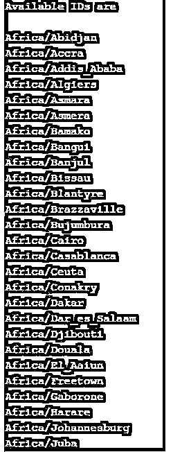

# Java 时区

> 原文：<https://www.educba.com/java-timezone/>


## Java 时区简介

它是 java.util 包中 java.lang.Object 类的直接子类，有助于表示程序运行的特定地区的时区偏移量，或者将时区定义为参数，还有助于保存其他更改，如夏令时；它实现了可序列化和可克隆的接口，使其兼容网络传输以及将一个时区对象的设置克隆到另一个时区对象中。

### Java 中 TimeZone 类的方法

该类使用以下 5 个参数来存储时区信息:

<small>网页开发、编程语言、软件测试&其他</small>

*   public static final int SHORT = 1；
*   public static final int LONG= 1:
*   private static final int ONE _ MINUTE = 60 * 1000；
*   private static final int ONE _ HOUR = 60 * ONE _ MINUTE；
*   私有静态 final int ONE _ DAY = 24 * ONE _ HOUR

下面是该类中可用的方法:

**1。公共抽象 int getOffset(int era，int year，int month，int day，int dayOfWeek，int milliseconds)**

此方法有助于检索时区的偏移量(以毫秒为单位),该偏移量可以添加到 GMT 中，以获取参数中指定的特定日期的本地时间。在这里，月份参数中的 0 表示一月。

**代码:**

```
package Try;
import java.util.TimeZone;
publicclass Office
{
publicstaticvoid main(String[] args)
{
TimeZone obj     = TimeZone.getTimeZone("Africa/Bangui");
System.out.println("Offset value at 2020,5,6 date is  = " + obj.getOffset(1, 2020, 2, 5, 6, 2000));
}
}
```

**输出:**


**2。抽象公共 void setraw offset(int offsetMillis)**

此方法用于将时区基准设置为 GMT，GMT 用于通过将本地时间添加到 UTC 来获取本地时间。

**3。公共抽象 int getRawOffset()**

它用于获取与夏令时无关的毫秒数，并添加到 UTC 中以检索标准时区。

**代码:**

```
import java.util.TimeZone;
publicclass Office
{
publicstaticvoid main(String[] args)
{
TimeZone obj     = TimeZone.getTimeZone("Pacific/Pago_Pago");
System.out.println("RawOffset in the start is = " + obj.getRawOffset());
obj.setRawOffset(7000000);
System.out.println("RawOffset "+ "set to 7000000");
System.out.println("RawOffset after changes is = "          + obj.getRawOffset());
```

}
}

**输出:**


**4。public boolean observsdaylighttime()**

此方法用于检查时区当前是否处于夏令时，或者是否为将来的计划更改安排了任何转换，如果是，则发送 true，否则发送 false。

**代码:**

```
import java.util.*;
publicclass Office
{
publicstaticvoid main(String[] args)
{
TimeZone obj     = TimeZone.getTimeZone("Europe/Rome");
System.out.println(obj.getID()+" is in Daylight or will be in future transitions = " + obj.observesDaylightTime());
}
}
```

**输出:**


**5。静态字符串[] getAvailableIDs()**

它用于以字符串格式获取该时区下所有支持的和可用的 id 的数组。

**代码:**

```
import java.util.*;
publicclass Office
{
publicstaticvoid main(String[] args)
{
String[] idArray= TimeZone.getAvailableIDs();
System.out.println("Available IDs are \n");
for(String a :idArray){
System.out.print(a);
System.out.print("\n");
}
}
}
```

**输出:**




**6。公共字符串 getDisplayName(布尔值 daylight，int style，Locale locale)**

此方法用于获取所用时区的名称。如果 daylight 参数为 true，则返回夏令时区；否则，将返回标准时区。Style 参数指定是需要长名称还是短名称，并且在指定的区域设置中。如果给定的样式无效，将引发 IllegalArgumentException，如果未指定区域设置参数，将引发 NullPointerException。

7 .**。公共静态时区 getDefault()**

这个方法帮助我们检索特定地区时区的默认值。

**8。public StringgetID()**

它用于检索该时区的 ID。

解释上述三种方法的示例程序:

**代码:**

```
import java.util.TimeZone;
publicclass Office
{
publicstaticvoid main(String[] args)
{
TimeZone obj1    = TimeZone.getDefault();
System.out.println("Display Name of default Offset is = " + obj1.getDisplayName(false,0));
System.out.println("Id of Default Offset = " + obj1.getID());
}
}
```

**输出:**


**9。公共抽象布尔 inDaylightTime(日期日期)**

此方法用于查询参数中给定的特定日期是否处于该特定时区的夏令时，否则返回 true 或 false。

**代码:**

```
import java.util.*;
publicclass Office
{
publicstaticvoid main(String[] args)
{
TimeZone obj     = TimeZone.getTimeZone("Europe/Rome");
Date dt = new Date();
System.out.println(dt.toString()+" is in Daylight Savings or not = " + obj.inDaylightTime(dt));
}
}
```

**输出:**


10。公共抽象布尔 useDaylightTime()

此方法用于验证给定时区是否支持夏令时计划更改；如果是，则返回 true，否则返回 false。

**代码:**

```
import java.util.*;
publicclass Office
{
publicstaticvoid main(String[] args)
{
TimeZone obj     = TimeZone.getTimeZone("Europe/Rome");
System.out.println(obj.getID()+" supports Daylight Savings or not = \n" + obj.useDaylightTime());
}
}
```

**输出:**


**11。公共布尔值具有相同的规则(时区 tz1)**

此方法有助于分析调用时区对象是否与其参数中传递的时区对象具有相同的规则，否则返回 true 或 false。

**代码:**

```
import java.util.*;
publicclass Office
{
publicstaticvoid main(String[] args)
{
TimeZone obj     = TimeZone.getTimeZone("Africa/Bangui");
TimeZone obj1     = TimeZone.getTimeZone("Europe/Rome");
System.out.println(obj.getID() + " has Same Rules as of " +obj.getID() + " = " +obj.hasSameRules(obj));
System.out.println(obj.getID() + " has Same Rules as of " +obj1.getID() + " = " +obj.hasSameRules(obj));
}
}
```

**输出**:


### 结论

它是 java.util 包中的一个可序列化和可克隆的类，是 java.lang.object 类的直接子类，有助于在两个静态 final 和 int 字段 long 和 short 中表示特定区域的时区偏移量，并支持使用其中支持的方法的各种操作。

### 推荐文章

这是 Java 时区的指南。这里我们讨论 TimeZone 类的介绍和方法。您也可以看看以下文章，了解更多信息–

1.  [Java ZoneId](https://www.educba.com/java-zoneid/)
2.  [Java 8 特性](https://www.educba.com/java-8-features/)
3.  [Java 时钟](https://www.educba.com/java-clock/)
4.  [Java 中的 HashSet](https://www.educba.com/hashset-in-java/)


