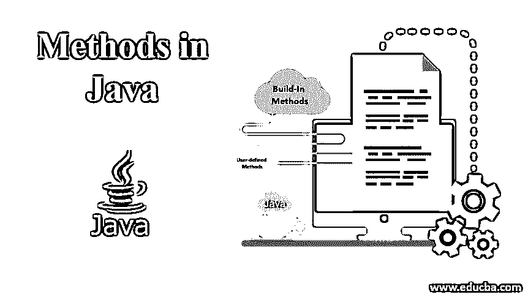

# Java 中的方法

> 原文：<https://www.educba.com/methods-in-java/>




## Java 中的方法介绍

java 方法可以被定义为一组被编写来执行特定任务的逻辑 java 语句。它们提供了一种无需重新编写代码就能重用代码的方法。在 Java 中，任何方法都应该是不同于 Python、C 和 C++的类的一部分。没有 java 类，方法是不可能存在的。下面是创建 java 方法时涉及的组件列表:

### 用于创建 Java 方法的组件

下面是创建 java 方法时涉及的组件列表:

<small>网页开发、编程语言、软件测试&其他</small>

*   **访问修饰符**:在 java 中，有四种不同类型的访问修饰符:
    *   **Public:** 声明为 Public 的方法可以从应用程序中的所有类访问。
    *   **Protected:** 声明为 Protected 的方法可以从定义它的类以及该类的所有子类中访问。
    *   **私有:**声明为私有的方法只能从定义它的类中访问。
    *   **Default:** 声明为 Default 的方法可以从定义它的类中访问，也可以从与封装该方法的类在同一个包中声明的类中访问。
*   **返回类型**:包含该方法应该返回的值的数据类型，如果该方法不返回任何东西，则为空。
*   **方法名称**:这是分配给方法的名称，可能是也可能不是唯一的。需要注意的是，方法名应该是动词，所用的单词遵循 camel case 符号。
*   **Parameters** :这包括一个输入参数列表，用逗号分隔它们的数据类型。如果该方法不需要任何输入参数，则使用()。
*   **异常:**如果一个方法可能抛出一个或多个异常，我们可以用逗号分隔列出异常。
*   **方法体:**是用大括号括起来的编程内容。方法体包含一个或多个用于执行特定任务的逻辑语句。

**语法:**

下面是方法的基本语法:

```
//declare Enclosing class
public class Myclass{
//declare java method
public String concat(String s1, String s2){
// combine two strings with space
String s3= s1 + " " + s2 ;
//return resulting string
return s3;
}
}
```

### Java 中的方法类型

方法可以分为以下两种类型:

*   **内置方法:**这些方法在 java 库中可用，不需要开发人员创建。例如，max()方法出现在 java 的数学类中。
*   **用户定义的方法**:Java 类中的开发者明确定义了这些方法。

### 调用 Java 方法

当调用程序调用一个方法时，控制进入方法体。在控制转到方法体之后，它在以下三种情况下返回到调用程序:

*   方法体中编写的所有语句都成功执行。
*   遇到任何 return 语句。
*   会引发异常。

静态方法使用类名调用，非静态方法使用对象实例调用。

#### 示例#1

现在我们将看到 java 代码示例，展示如何使用 java 声明和调用方法。在这个例子中，我们将看到如何创建一个静态方法以及如何调用它。

**代码:**

```
package com.edubca.methods;
public class MethodDemo{
public static int getMaximum(int a , int b){
if(a>b){
return a;
}else {
return b;
}
}
public static void main (String args[]){
int maxvalue1 = getMaximum(10,23);
System.out.println("Out of 10 and 23, " + maxvalue1 + " is greater" );
int maxvalue2= getMaximum(40,20);
System.out.println("Out of 40 and 20, " + maxvalue2 + " is greater" );
}
}
```

**输出:**


#### 实施例 2

在下一个例子中，我们将看到如何调用非静态方法。

**代码:**

```
package com.edubca.methods;
public class MethodDemo{
public  int getMinimum(int a , int b){
if(a<b){
return a;
}else {
return b;
}
}
public static void main (String args[]){
MethodDemo demo =new MethodDemo();
int minvalue1 = demo.getMinimum(10,23);
System.out.println("Out of 10 and 23, " + minvalue1 + " is smaller" );
int minvalue2= demo.getMinimum(40,20);
System.out.println("Out of 40 and 20, " + minvalue2 + " is smaller" );
}
}
```

正如我们在上面看到的，调用非静态方法需要一个封闭类的实例。上述代码将产生以下输出:

**输出:**


#### 实施例 3

在下一个例子中，我们将学习如何创建抛出异常的方法。

**代码:**

```
import java.io.*;
package com.edubca.methods;
public class MethodDemo{
public  void mymethod() throws IOException{
throw new IOException("IO Exception occurred...");
}
public static void main (String args[]){
MethodDemo demo =new MethodDemo();
try{
demo.mymethod();
}catch(Exception e){
e.printStackTrace();
}
}
}
```

从上面的代码中我们可以看出，每当一个方法抛出异常调用方时，该方法必须使用 try-catch 或任何其他合适的错误处理机制来处理异常。上面的代码在屏幕上显示了下面的输出:

**输出:**


### 结论

从上面的文章中，我们对 java 中的方法有了清晰的认识。因此在方法的帮助下，我们可以完成任何任务。使用方法使我们的代码可重用，并且易于测试、理解和调试。

### 推荐文章

这是一本 Java 方法指南。在这里，我们讨论创建 java 方法和示例及其代码实现时所涉及的方法类型和组件列表。您也可以阅读以下文章，了解更多信息——

1.  [Java 中的哈希表](https://www.educba.com/hashtable-in-java/)
2.  [Java StringJoiner](https://www.educba.com/java-stringjoiner/)
3.  [Java class not found exception](https://www.educba.com/java-classnotfoundexception/)
4.  [Java StringJoiner](https://www.educba.com/java-stringjoiner/)


