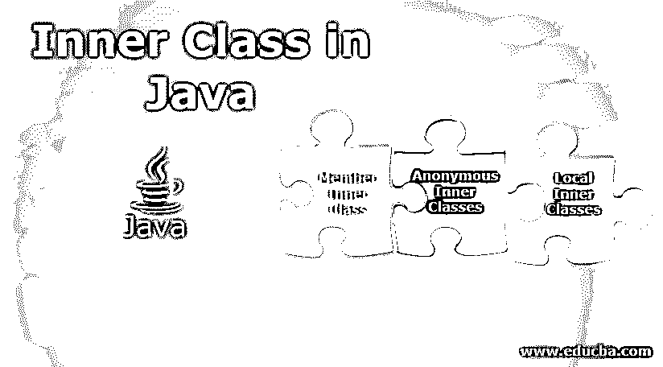

# Java 中的内部类

> 原文：<https://www.educba.com/inner-class-in-java/>




## Java 内部类介绍

Java 程序中的内部类只不过是在已经运行的类中声明和使用的类，以使用所有函数和成员对外部类的访问。当程序的编码模式需要更有条理，同时减少代码长度时，通常会使用这种方法。内部类有三种类型:成员内部类、匿名内部类和局部内部类。在 Java 程序片段中使用内部类的主要优点是，内部类使代码更加优化和有组织，增加了可读性，并且这种类的维护成本很低。

### Java 内部类的类型

java 中的内部类基本上是那些非静态的类，并且在另一个类中声明。所以内部类是外部类的成员。Java 中有 3 种类型的内部类:

<small>网页开发、编程语言、软件测试&其他</small>

*   内部类成员
*   局部内部类
*   匿名内部类

请注意，内部类是嵌套类的[类型，不是静态的。让我们逐一讨论 java 中不同类型的内部类。](https://www.educba.com/nested-class-in-java/)

#### 1.成员内部类

在这种情况下，只需要在外部类中声明一个类。但是该类不能在外部类的方法内部。它需要在外部类的方法之外定义。内部类必须是非静态类型。内部类类型的对象可以访问外部类的变量。

#### 2.局部内部类

在这种情况下，它也只需要在其外部类中声明一个类。但是该类必须在外部类的方法内部。它需要在外部类的方法中定义。内部类必须是非静态类型。内部类类型的对象可以访问外部类的变量。因为这个类是在外部类的方法中声明的，所以它的访问也是受限制的，类似于局部变量。如果你需要调用内部类的函数，你必须在函数内部实例化它。

**局部内部类注意点:**

*   局部变量的说明符不能是私有的、公共的或受保护的。
*   不能在函数外部调用局部内部类。
*   在 1.7 版之前，非 final 局部变量不能被局部内部类访问。但是，从 JDK 版本 1.8 开始，可以访问局部[内部类中的非最终局部变量](https://www.educba.com/inner-class/)。

#### 3.匿名内部类

匿名，顾名思义，就是没有名字的通话。但是这怎么可能呢？实际上，它是一种内部类，我们同时进行声明和实例化(意味着对象创建)。每当你想重写一个类的方法时，你可能需要使用一个匿名的内部类。因为匿名内部类没有名字，所以我们不能创建匿名内部类构造函数。另外，请注意，您只能在匿名内部类的定义点访问它。

匿名内部类有两种创建方式。

*   作为特定类型的子类。
*   作为特定接口的实现者。

### Java 内部类的例子

下面我们将讨论一些 Java 内部类的代码示例:

#### 例子#1:成员，内部类

在这个例子中，我们将演示一个成员内部类的例子。在这个简单的例子中，我们在外部类中声明了一个类。在“OuterClass”内部，我们有一个名为“num1”的私有数据成员和一个内部类“inner class”。我们可以通过“inner class”类型的对象访问内部类中外部调用的私有变量“num1”。这样，我们就利用了内部类，其中外部调用的私有成员可以被内部类的方法访问。

**代号:** 

```
class OuterClass{
private int num1=36;
class InnerClass{
void shw(){
System.out.println("Member Inner Class");
}
}
}
public class DemoOfMemberInnerClass{
public static void main(String args[]){
OuterClass oc=new OuterClass();
OuterClass.InnerClass ic=oc.new InnerClass();
ic.shw();
}
}
```

**输出:**


#### 示例 2:匿名内部类

在这个例子中，我们将演示一个局部内部类的例子。这里我们的主要目标是覆盖外部类方法的功能。顾名思义，类名是明确未知的，因此称为匿名内部类。这里，内部类的声明和实例化都是在某个时间点完成的，因此它被称为匿名内部类。

**代码:**

```
abstract class Cat{
abstract void drink();
}
public class AnonymousInnerClassDemo{
public static void main(String args[]){
Cat ct=new Cat(){ //anonymous inner class
void drink(){
System.out.println("kitty loves milk");
}
};
ct.drink();
}
}
```

**输出:**


#### 示例 3:方法局部内部类

在这个例子中，我们将演示一个方法局部内部类的例子。在这个简单的例子中，我们在外部类“OuterClassDemo”的方法“display()”中声明了一个类。之后，我们可以通过外部类的对象访问该方法。

**代码:**

```
public class OuterClassDemo{
private int num1=36;//instance variable
void display(){
class LocalInnerClass{ // local inner class inside the method of outer class
void shw(){
System.out.println(num1);
}
}
LocalInnerClass li=new LocalInnerClass();
li.shw();
}
public static void main(String args[]){
OuterClassDemo obj=new OuterClassDemo();
obj.display();
}
}
```

**输出:**


### 优势

下面是 java 内部类的一些优点，解释如下:

*   内部类的优点是它可以访问外部类的所有成员，也就是函数和变量。
*   Java 中的这一特性有助于我们根据功能对代码进行逻辑组织，从而提高代码的可读性和可维护性。这也有助于优化您的代码。
*   内部类可以访问其外部类的所有私有成员(包括数据和方法)。

### 结论

我们对主题“Java 内部类”的学习到此结束。内部类是 java 中一个非常有趣的特性，你可以通过内部类的对象来使用外部类的成员。在 java 编译器中自己编写上述示例中提到的代码，并验证输出。如果你不自己写代码，对代码的学习将是不完整的。

### 推荐文章

这是一个 Java 内部类的指南。这里我们讨论 Java 内部类的基本概念、类型、不同的例子和优点。您也可以阅读以下文章，了解更多信息——

1.  [Java 版本](https://www.educba.com/versions-of-java/)
2.  [Java StringJoiner](https://www.educba.com/java-stringjoiner/)
3.  [Java URLConnection](https://www.educba.com/java-urlconnection/)
4.  [Java class not found exception](https://www.educba.com/java-classnotfoundexception/)


