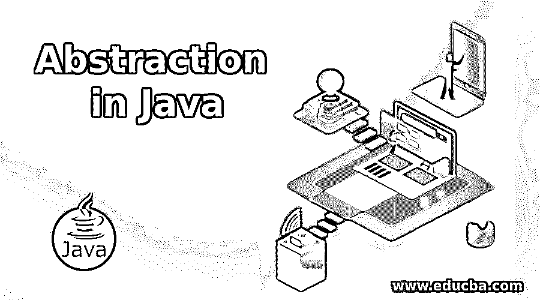
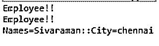
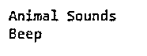
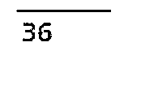

# Java 中的抽象

> 原文：<https://www.educba.com/abstraction-in-java/>




## Java 抽象介绍

在主要用 oops 概念抽象构建的 java 技术中，oops(面向对象的编程系统)概念之一也被表示为隐藏数据的过程，也就是说，它不会显示一些细节，但它将只在用户屏幕上显示与隐藏数据相关的相关信息。java 中的抽象我们可以在“抽象类和接口”的帮助下使用这些概念。这两种类型将在 java 中同时使用，或者根据用户需求，我们可以在程序中同时使用这两种类型。

**语法**

<small>网页开发、编程语言、软件测试&其他</small>

该抽象将用于 java 程序中使用的两种不同类型的语法。

```
import packages;
abstract class names
{
-----some logic codes---
}
interface  names
{
----Some logic codes----
}
```

上述代码是 java 程序中适用抽象的基本语法。当我们使用抽象类时，它将使用抽象和非抽象方法，但是接口只接受非抽象方法。这两个概念有一些相似的区别。

### Java 中如何使用抽象？

抽象地说，它在 java 对象中隐藏了不需要的细节，只显示了与主题相关的信息，主要是与 java 集合接口 map in map interface 相比，它有 hashmap 这样的派生类，它将使用 get()和 put()这样的方法在用户数据中存储键值对，以便从后端存储和检索数据。

抽象主要提供两种不同的方式 1 .数据抽象和 2 .控制抽象。在数据抽象中，用于创建困难的数据类型，它将用于在屏幕中显示一些有用的内容，包括数据类型。在控制抽象中，用其他编程语言编写一些数据的过程是在不同的场景中多次编写用于存储和检索数据的代码，因此这些类型的数据将被识别并与称为控制抽象的单个工作相结合。

虽然我们使用接口类型来实现抽象，但这意味着它必须在最可能的情况下实现，但在抽象类中，它不能在抽象过程中完全实现，它必须部分完成。如果我们使用抽象类，我们就不能创建这些类的一个实例，如果我们想把它用于完全的或具体的这些类的实例，通过扩展它。使用抽象我们声明的方法实现可能会有变化，而我们使用 new 操作符创建抽象类的实例时会抛出编译错误。

### Java 中抽象的例子

下面举几个例子:

#### 示例#1

**代码:**

```
public abstract class Main {
private String names;
private String city;
public Main(String nm, String cty){
this.names=nm;
this.city=cty;
}
public abstract void work();
@Override
public String toString(){
return "Names="+this.names+"::City="+this.city;
}
public void changeName(String newNames) {
this.names = newNames;
}
}
public class ClientMain extends Main {
private int empId;
public ClientMain(String nm, String cty, int id) {
super(nm, cty);
this.empId=id;
}
@Override
public void work() {
if(empId == 0){
System.*out*.println("Invalid name");
}else{
System.*out*.println("Employees List!!");
}
}
public static void main(String args[]){
//coding in terms of abstract classes
Main m = new ClientMain("siva","tirupur",1);
Main m1 = new ClientMain("raman","chennai",234);
m.work();
m1.work();
//using method implemented in abstract class - inheritance
m1.changeName("Sivaraman");
System.*out*.println(m1.toString());
}
}
```

**输出:**




#### 实施例 2

**代码:**

```
interface Animals {
public void animalSounds();
public void sleep();
}
class Sample implements Animals {
public void animalSounds() {
System.*out*.println("Animal Sounds");
}
public void sleep() {
System.*out*.println("Beep");
}
}
class ClientMain {
public static void main(String[] args) {
Sample s = new Sample();
s.animalSounds();
s.sleep();
}
}
```

**输出:**




#### 实施例 3

**代码:**

```
@FunctionalInterface
interface SquareofNumbers
{
int numbers(int x);
}
class ClientMain
{
public static void main(String args[])
{
int a = 6;
SquareofNumbers  s = (int i)->i*i;
int result = s.numbers(a);
System.*out*.println(result);
}
}
```

**输出:**




上述三个例子中，我们使用了抽象类和接口的基本用法来实现 java 应用程序中的抽象。最后一个例子中，我们使用了 java 中的函数接口概念来计算给定数字的平方。函数接口与接口概念相同，但它不允许程序中有一个以上的抽象方法，如果我们使用一个以上的抽象方法，这意味着它会抛出类似“意外的@函数接口注释”的错误，而我们在使用函数接口时也声明了注释，这对于有关数据概念的数据非常有帮助，因为我们在 java 中需要元数据技术，我们已经使用了这些类型的技术 称为注释，我们还使用了另一个概念，称为 lambda 表达式，我们在最后一个示例中使用它来减少代码空间，因此代码的冗余非常简单，程序的复杂性也较低，这对于编写复杂的代码来说很容易理解。

如果我们定义了类中的任何方法，那么我们应该声明这个类也是抽象的，如果我们扩展了抽象类，并且在内部类的任何方法中使用，在此之前，我们必须在 java 技术中实现抽象类的所有方法，我们不能创建抽象类的实例，我们不能在 java 中将抽象类声明为最终访问修饰符或关键字，因为当我们使用 在抽象类或该类的任何方法中是 final，在应用程序的整个执行过程中不能改变。 抽象中也不允许私有修饰符，它会影响父子关系。继承应该在抽象类中受到影响，因为子类**不允许使用函数/方法。**

### 结论

上述抽象概念是对 oops 的基本理解，当我们在 java 技术中实现时，它应该与接口和抽象类一起使用来实现抽象，但在 java 最新版本中，它可能会根据新特性而变化。

### 推荐文章

这是一本 Java 抽象指南。在这里，我们讨论 Java 中抽象的介绍以及相应的编程例子。您也可以看看以下文章，了解更多信息–

1.  [Java 目录](https://www.educba.com/java-directories/)
2.  [Java 并行流](https://www.educba.com/java-parallel-stream/)
3.  [Java Swing 按钮](https://www.educba.com/java-swing-button/)
4.  [JavaFX 选择框](https://www.educba.com/javafx-choicebox/)


