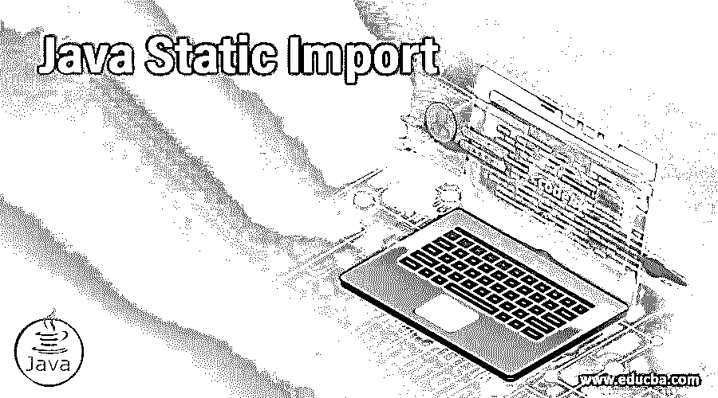
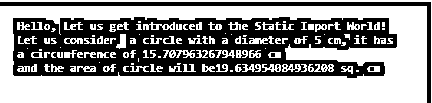
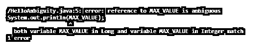

# Java 静态导入

> 原文：<https://www.educba.com/java-static-import/>




## Java 静态导入简介

Java 静态导入是一种有助于直接使用任何类的静态成员的机制。类中的静态项可以很容易地在模块中被引用，而不需要另外的限定。不需要任何类名或对象，这些静态对象可以直接使用。这是增加代码可读性和提高代码质量的好方法。除非必要，否则不建议使用静态导入。

### Java 中静态导入的实现

静态导入帮助我们直接使用类的静态成员。它使得所有的类成员都是可访问的，这反过来有助于使用该类的成员，而不用重复提到类名。下面的代码是静态导入的一个例子。您不需要使用 System 类的模块 System.out，而是可以在代码中直接引用 out.println，由于我们已经静态导入了 System 类，所以该程序会成功运行。

<small>网页开发、编程语言、软件测试&其他</small>

```
import static java.lang.System.*;
public class StaticImportInstance{
public static void main(String args[]){
out.println("Hi");//Now no need of System.out
out.println("We are using Static Import");
}
}
```

### Java 静态导入的例子

让我们看一些使用静态导入功能的例子。

#### 示例#1

静态导入内置的 Java Math 类。

**代码:**

```
import static java.lang.Math.PI;
import static java.lang.Math.pow;
public class HelloStaticWorld {
public static void main(String[] args) {
System.out.println("Hello, Let us get introduced to the Static Import World!");
System.out.println("Let us consider  a circle with a diameter of 5 cm, it has");
System.out.println("a circumference of " + (Math.PI * 5) + " cm");
System.out.println("and the area of circle will be" + (Math.PI * Math.pow(2.5, 2)) + " sq. cm");
}
}
```

**输出:**




上面的程序正在导入数学类。更进一步，它还静态地导入 PI 和 POW 方法。一旦这些被静态使用，我们将不需要在程序中创建任何进一步的引用或对象。我们可以很容易地使用导入的类。我们已经利用了数学。圆周率用圆周率的值求圆的周长。此外，我们已经找到了圆的面积，再次使用圆周率和功率方法，这有助于我们找到圆的面积。如果您查看截图，您会看到显示了一个圆的周长和面积。

#### 实施例 2

导入内置的 Java Integer 类

**代码:**

```
import static java.lang.Integer.MAX_VALUE;
import static java.lang.Integer.MIN_VALUE;
public class StaticImportInteger {
public static void main(String args[]) {
//Finding Max and Min without static import
System.out.println("We will find maximum value of an integer variable in Java without using" + "static import : " + Integer.MAX_VALUE);
System.out.println("We will find minimum value of an integer variable in Java without using" +
"static import : " + Integer.MIN_VALUE);
//Finding Max and Min without static import
System.out.println("We will find maximum value of an integer variable in Java with  using" +
"static import : " + MAX_VALUE);
System.out.println("We will find minimum value of an integer variable in Java with  using" +
"static import : " + MIN_VALUE);
}
}
```

**输出:**


上面的例子是静态导入 Integer 类。这意味着我们可以直接使用这个类中的方法，并在程序中使用它们，而无需任何进一步的引用。我们首先找到整数的最大数目和整数的最小数目，这里我们不使用静态导入，而使用普通函数。这里我们将使用类名，然后使用函数名。如果你看到这个例子，我们使用了整数。最小值和整数。Max_Value。在下面的代码中，我们使用了静态导入。在这里，如果你检查一下，你会发现我们直接使用了 MAX_VALUE 和 MIN_VALUE 方法。两者的结果是一样的。这告诉我们有两种方法可以利用不同的 Java 函数。

#### 实施例 3

使用静态导入时不明确

**代码:**

```
import static java.lang.Integer.*;
import static java.lang.Long.*;
public class HelloAmbiguity{
public static void main(String[] args) {
System.out.println(MAX_VALUE);
}
}
```

**输出:**




当导入同一个类的静态成员时，可能会出现上述情况。当这种情况发生时，编译器不知道选择哪个成员。因此，当涉及到同一个类的成员时，它会面临模糊性。在上面的例子中，lang 类被导入了两次。它使用的不同成员是整数和长整型。当调用 main 函数时，编译器不知道在 Integer 和 Long 中选择哪个成员。在缺少特定类名的情况下，它将无法计算应该使用哪个成员。因此它抛出一个错误，正如你在上面的截图中看到的。

### 优势

使用静态方法有许多优点。举几个例子，你可以看看下面:

*   您可以一起访问许多不依赖于任何实例的类，也可以单独使用它们。
*   通过导入应该完成相关工作的方法，我们可以将这些无状态的实用程序分组，反过来，使它们一致，这样它也可以直接使用参数和返回类型。
*   利用静态导入的方法在性能上更好。它们不需要任何显式的空值检查。他们更快。
*   当我们使用静态方法时，我们使代码更具可读性。这是因为包含的类名数量较少。
*   它有助于使可重用性成为一种更简单的方法。您可以重用代码，并且只需要静态导入类。

### 结论

静态导入方法是一种使用任何类的成员的简单方法，无需为该类创建任何引用。当我们导入类时，我们可以直接使用这些方法。静态导入使用户能够拥有一个需要较少击键次数的代码和一个更有效的代码。我们可以使用静态导入，但是建议只在需求这样说的时候才使用它。

### 推荐文章

这是 Java 静态导入的指南。在这里，我们讨论 Java 中静态导入的工作原理、示例以及代码和输出。您也可以看看以下文章，了解更多信息–

1.  [Java 瞬态](https://www.educba.com/java-transient/)
2.  [Java PrintWriter](https://www.educba.com/java-printwriter/)
3.  [Java 控制台](https://www.educba.com/java-console/)
4.  [Java 模式类](https://www.educba.com/java-pattern-class/)


