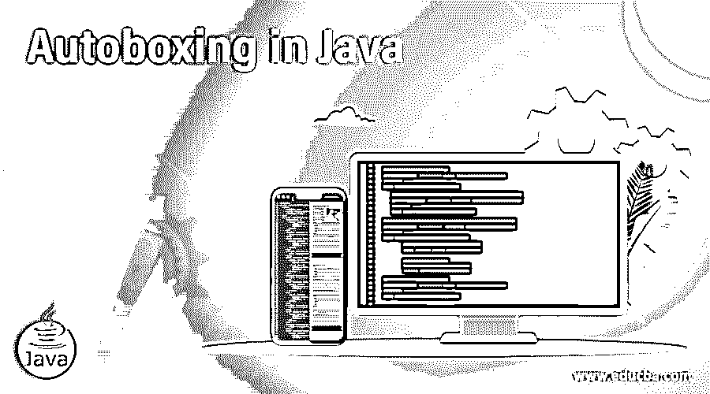

# Java 中的自动装箱

> 原文：<https://www.educba.com/autoboxing-in-java/>




## Java 自动装箱简介

自动装箱是 JAVA 中遵循的一个过程，其中由编译器将原始数据转换成对象类型。例如，如果变量声明为“int”，那么编译器会将变量从原始整数转换为对象数据类型，并以该格式使用。还有一个过程是自动装箱的反向过程，称为“拆箱”

定义:将原始数据类型的任何值转换成相应包装类的对象称为自动装箱。

<small>网页开发、编程语言、软件测试&其他</small>

**语法**

用于自动装箱的语法如下-

```
primitive_DataType variableName = 'VariableValue';
```

### Java 中的自动装箱是如何工作的？

JAVA 编译器接受原始数据类型，并将其转换为包装类的对象。然后，只有满足以下两点，编译器才能工作:

1.  变量作为参数传递给函数，该函数需要包装类的对象创建。
2.  将原始值赋给变量，以便编译器可以执行自动装箱。
3.  所有的原始数据类型都链接到它们各自的包装类(这已经由存储在库中的 JAVA 完成了)。基本数据类型及其链接的包装类链接如下:

| 原始数据类型 | 包装类 |
| 布尔型 | 布尔代数学体系的 |
| 字节 | 字节 |
| 长的 | 长的 |
| 两倍 | 两倍 |
| 短的 | 短的 |
| 茶 | 字符 |
| （同 Internationalorganizations）国际组织 | 整数 |
| 漂浮物 | 浮动 |

### Java 中自动装箱的例子

下面是 JAVA 中自动装箱的例子，有助于进一步理解这个概念。

#### 示例#1

**代码:**

```
import java.io.*;
class example1
{
public static void main (String[] args)
{
//here we are creating an integer "test1" having value of "100".
Integer test1 = new Integer(100);
System.out.println("Here is the value of integer test1 which is created into object of the wrapper class integer: " + test1);
//here we are autoboxing a character "test2" with a value of "a".
Character test2 = 'a';
System.out.println("Here is the value of test2 variable after autoboxing using character wrapper class: " + test2);
}
}
```

**输出:**


**说明:**

导入了名为“java.io”的 JAVA 库，以便可以使用 JAVA prime 功能。首先，创建了包含 main 函数的主类名“example1”。主函数是程序执行的起始点。接下来，创建一个名为“test1”的整数，并为其赋值。它与声明和赋值的正常方式略有不同；正如您所看到的，包装器类“Integer”被实例化，要赋值的值作为参数传递给包装器类。这个过程称为使用包装类对象化原始数据类型。毫无疑问，“JAVA”被称为完全面向对象的语言。

在下一段代码中，字符基本数据类型被赋值给一个名为“test2”的变量，变量的值为“a”。这是声明变量并为变量赋值的常用方式。这是可行的，因为 JAVA 编译器足够聪明，可以在后台自动将原始数据类型转换为其包装类的对象。这个功能在 JAVA 中被称为自动装箱。

#### 实施例 2

**代码:**

```
public class BoxingWidening
{
// The function below is demonstrating the boxing functionality in JAVA.
static void testFunction(char i)
{
System.out.println("Program output for boxing:: ");
System.out.println("char in short");
}
// This function is demonstrating the widening functionality in JAVA.
static void testFunction(Character i)
{
System.out.println("Program output for widening: ");
System.out.println("Character in full");
}
public static void main(String args[])
{
char ch='a';
testFunction(ch);
}
}
```

**输出:**


**说明:**

在此示例中，演示了“加宽”和“装箱”之间的区别。扩展是一种使用完整类名的功能，例如，Integer 或 character，而不是 int 或 char。两个函数用相同的名称“testFunction”定义，一个用加宽，另一个用装箱语法声明和赋值。在 main 函数中，声明了一个名为“ch”的字符，并为其赋值“a”，然后用函数名调用函数。这个函数的名字有两个定义。由于 JAVA 更喜欢装箱，所以调用函数的装箱定义，并将参数“ch”传递给装箱定义。使用 print()函数显示最终结果。此函数在输出屏幕中显示装箱定义，而不是采用扩大定义。当然，与 JAVA 语言提供的扩展功能相比，自动装箱要强大得多。

### 优势

JAVA 从这一有用功能中获得的一些优势列举如下:

1.  开发人员必须编写更少的代码，这减轻了编码人员的负担，使得编码人员可以专注于复杂的逻辑。
2.  更干净的代码，因为创建对象和实例化它的复杂性由于编译器智能而被抽象。
3.  编译器使用这个来选择信息的最佳策略。例如，如果我们希望整数值被拾取，那么我们应该使用 code: valueOf (int)而不是 new Integer (int)。这缩短了周转时间。
4.  促进抽象。
5.  由于抽象，减少了冗长代码/项目中出现错误的可能性。

### 结论

通过添加编译器智能，自动装箱是从开发人员那里抽象复杂代码的最佳策略之一。这减少了开发人员编写逻辑上不相关的小代码片段的开销。这被开发人员广泛使用，以至于许多开发人员都不知道包装类的实例化。自动装箱当然是一种强大而又干净的声明和赋值给变量的方式。

### 推荐文章

这是一个 Java 自动装箱的指南。在这里，我们讨论自动装箱在 Java 中是如何工作的，并给出了代码和输出的例子。您也可以看看以下文章，了解更多信息–

1.  [Java InetAddress](https://www.educba.com/java-inetaddress/)
2.  [Java 密钥库](https://www.educba.com/java-keystore/)
3.  [Java IO](https://www.educba.com/java-io/)
4.  [Java URLConnection](https://www.educba.com/java-urlconnection/)


