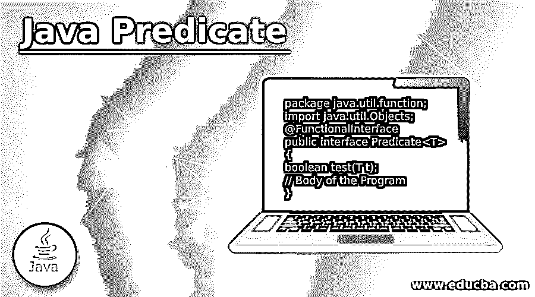

# Java 谓词

> 原文：<https://www.educba.com/java-predicate/>




## Java 谓词简介

Java Predicate 是作为 java.util.function 包的一部分的函数接口，它作为一个通用谓词被分配为 lambda 表达式的目标，用于引用任何方法或评估任何基于布尔的函数，布尔值 true 或 false 被分配为任何 lambda 表达式或任何方法引用的目标；因此，它需要一个基于这些谓词赋值的适当的评估条件，这有助于它们根据由对象组成的用例以及用于实现的评估条件规则，从编程的角度来评估特定实现的任何条件。

### 句法

谓词的语法流如下所示。如果你遍历语法，那么看起来它基本上是一个函数接口，用作方法引用的谓词，用于验证程序体的测试条件。

<small>网页开发、编程语言、软件测试&其他</small>

```
package java.util.function;
import java.util.Objects;
@FunctionalInterface
public interface Predicate<T>
{
boolean test(T t);
// Body of the Program
}
```

**解释:**在遍历语法流的时候，可以看出它基本上是一个函数接口，用作方法引用的谓词，用于验证程序体的测试条件。

*   **package Java . util . function:**表示用于支持与谓词函数相关的方法和函数的函数的包。
*   **导入 java.util.Objects:** 这个导入的包负责支持针对函数接口创建的对象。
*   **@FunctionalInterface** :这表示关于 spring boot 应用程序的注释，该应用程序或它所使用的接口支持是作为功能接口的谓词。
*   **公共接口谓词< T > :** 这表示支持当前类或方法的接口类型是一个谓词接口。
*   **布尔测试(T t):** 这个方法是谓词接口的一部分。它是一个抽象方法，用于定义和评估 lambda 表达式的重要性，或者用于分配谓词类型的目标的方法引用。这个方法有一个布尔值作为返回类型。此外，T 是传递的参数，它是作为接口的谓词的输入类型。总的来说，这个测试方法将根据评估条件的满足情况返回 true 或 false。

### 谓词在 Java 中是如何工作的？

java 中的谓词是程序员的救星，可以让他们以更简洁易读的格式编写和创建代码。它有助于更好地格式化测试用例，并增强测试用例。一般来说，谓词只是一个布尔格式的语句，有助于评估带有约束的条件。java 中的谓词基本上用于实现函数接口，帮助将谓词指定为从 java.util.function.package 中获得的值。它使包方法成为传递谓词包的对象的目标，以获得为整个方法或代码库的函数返回 true 或 false 的布尔值。它由一个测试方法组成，用于评估整个方法的引用和各自的函数。在 Java 中，没有独立函数的概念；因此，它所做的就是从这些接口定义和创建对象。Iterable.filter()方法可以与方法的对象配合使用。带有谓词的 Lambda 表达式也发挥了很好的作用，可以轻松地处理谓词。

### Java 谓词中的方法

有许多利用 Java 谓词方法的方法，如下所示:

*   **布尔测试(T t ):** 该方法用于根据传递的参数 T 计算当前谓词。
*   **默认谓词< T > and(谓词<？super T > other):** 这个方法的返回类型是基于短路的 AND 逻辑操作符的复合谓词，它将谓词，然后是另一个谓词的值，如果抛出的值为 false，那么将不使用任何参数或其他逻辑操作符进行计算。
*   **默认谓词< T > negate():** 任何被求反的值，即负值，只要在包内定义，都将使用默认谓词< T > negate 方法返回。
*   **默认谓词< T > or(谓词<？super T > other):** 这种行为也与默认谓词相同，唯一的区别是，短路将谓词化并跟随另一个谓词的值，如果任何一个值为真，那么只有另一个值将变为假。
*   **静态< T >谓词<T>is equal(Object target ref):**该方法返回一个谓词值，该值将用于测试两个对象是否具有相似的值或者是否都具有一些转换后的值。

因此，将这些方法与谓词一起使用有助于评估用谓词的方法类型定义的任何条件。

### 实现 Java 谓词的示例

下面是提到的例子:

#### 示例#1

这个程序演示了如何创建一个简单的谓词，然后调用这个谓词方法来评估一个测试条件，如图所示。

**代码:**

```
import java.util.function.Predicate;
public class Frst_Java_Predicate_Ex  {
public static void main(String[] args) {
Predicate<Integer> prdc = vl -> (vl > 20);
System.out.println(prdc.test(80));
}
}
```

**输出:**


#### 实施例 2

这个程序演示了带有布尔约束的谓词值，通过使用一个谓词来评估学生的分数，其中一个约束说，如果学生获得的分数超过 35 分，则该学生通过；否则，如果返回值 false，学生将失败。

**代码:**

```
import java.util.function.Predicate;
public class Predict_Java_ex_2 {
static Boolean checkMarks(int marks){
if(marks>35)
return true;
else
return false;
}
public static void main(String[] args){
Predicate<Integer> pred =  Predict_Java_ex_2::checkMarks;
boolean rslt = pred.test(15);
System.out.println("If marks is more than 35 then only the student will get pass otherwise fail." + rslt);
}
}
```

**输出:**


### 结论

Java Predicate 是 java 8 中引入的新包和实用程序之一，它非常灵活地使用 lambda 表达式，并帮助程序员创建一个整洁的增强代码以供参考和理解。带有值的谓词有助于评估带有返回类型和值的条件。

### 推荐文章

这是一个 Java 谓词指南。这里我们讨论一个 Java 谓词的介绍，语法，它是如何工作的，以及编程例子。您也可以浏览我们的其他相关文章，了解更多信息——

1.  [Java 9 的特性](https://www.educba.com/java-9-features/)
2.  [Java 中的函数接口](https://www.educba.com/functional-interface-in-java/)
3.  [JavaFX 库](https://www.educba.com/javafx-libraries/)
4.  [Java 并行流](https://www.educba.com/java-parallel-stream/)


