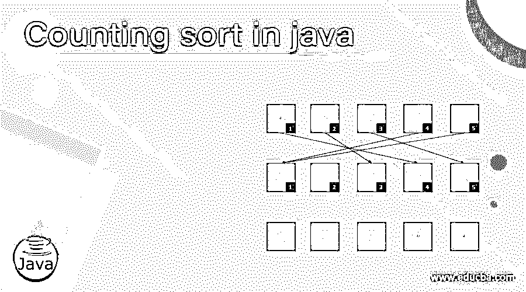
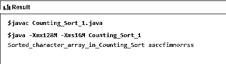

# java 中的计数排序

> 原文：<https://www.educba.com/counting-sort-in-java/>




## java 中计数排序的介绍

计数排序是一种算法，在任何编程语言中都起着举足轻重的作用，Java 也是如此。计数排序算法的主要目标是根据作为小整数出现的键对对象集合进行排序，以便对算法进行排序。它主要对键值对进行操作和计数，按照输出序列显示元素的位置。这种排序中的运行时间就项目而言是线性的，然后键值之间的差位于最大值和最小值之间。

**语法**

<small>网页开发、编程语言、软件测试&其他</small>

在 Java 中执行计数排序没有特定的语法，但是有一个逻辑流程，它以算法的形式一步一步地应用，根据输入执行计数排序，表示如下:

```
Class name {
Method name following sorting ()
{
# Find the length of array defined;
#the output character array will have sorted array
#Create a count arr to store count of each element, characters and initialize it 0
#Store count of each character element in the array
#Build output character and write the logic to make it operated in reverse order
#that builds output can now be copied from the previous array to the current
#Make use of the driver code to move and proceed.
}
```

### Java 中计数排序是如何工作的？

*   如前所述，计数排序算法在编程中起着重要的作用；它对以收集格式存在的对象进行排序，并用于计算存在的具有不同键和值对的元素的数量，并再次与算术计数一起使用，确定存在的每个元素的位置，每个键值具有最小值和最大值之间的差。
*   运行时间或时间复杂度(如果检查的话)本质上是线性的，具有数组中的所有元素以及最小和最大键值之间的差，因此这些元素和排序技术适合于直接使用的情况，其中键的变化不明显大于与所需键一起出现的元素。
*   虽然有另一种算法可以支持大部分的密钥处理，但它并不像按要求计数排序那样有效，因此可以用基数排序来代替哈希，以处理与以前相比大量密钥的情况。
*   由于计数排序使用键和值对作为数组中索引值的一部分，因此它不被视为比较排序。同样，比较排序的下限也是不允许的。
*   桶排序也低于计数排序，仅具有相同的任务集和相似的时间分析，但与计数排序相比，那时，桶排序需要动态数组、链表或大量内存来保存桶中存在的元素，然后计数排序仅存储每个桶中的单个数值。
*   存在某些输入和输出假设序列，其事实在于计数排序的输入由 n 个项目的集合组成，其中每个项目具有最大值为 k 的非负整数键值。计数排序的一些描述是对整数的线性格式序列进行简单排序的输入。
*   数组的输出通常不是由具有某种键顺序的主要项目组成的，但是它的使用需要根据需求进行检查。
*   计数排序的时间复杂度为 O(n+1)，其中 n 是元素的数量，l 是考虑输入的范围。
*   还有，辅助空间出来只是 O(n+l)。

### java 中计数排序的例子

这个程序通过将一些输入和输出序列集作为 Java 排序的一部分来演示计数排序。

**代码**:

```
public class Counting_Sort_1{
void sort_0(char arr_0[])
{
int n_8 = arr_0.length;
char output_val[] = new char[n_8];
int count_0[] = new int[528];
for (int l_0 = 0; l_0 < 528; ++l_0)
count_0[l_0] = 0;
for (int y_1 = 0; y_1 < n_8; ++y_1)
++count_0[arr_0[y_1]];
for (int l_0 = 1; l_0 <= 526; ++l_0)
count_0[l_0] += count_0[l_0 - 1];
for (int l_0 = n_8 - 1; l_0 >= 0; l_0--) {
output_val[count_0[arr_0[l_0]] - 1] = arr_0[l_0];
--count_0[arr_0[l_0]];
}
for (int l_0 = 0; l_0 < n_8; ++l_0)
arr_0[l_0] = output_val[l_0];
}
public static void main(String []args){
Counting_Sort_1 ob = new Counting_Sort_1();
char arr_0[] = { 's', 'a', 'r', 'c', 's', 'f', 'o',
'i', 'n', 'c', 'a', 'r', 'm' };
ob.sort_0(arr_0);
System.out.print("Sorted_character_array_in_Counting_Sort ");
for (int l = 0; l < arr_0.length; ++l)
System.out.print(arr_0[l]);
}
}
```

**输出:**




**解释**

在上面的例子中，我们在 Java 中实现了计数排序，为了正确执行，遵循了以下步骤:

*   创建一个 Selection_Sort_0 的类，然后按照该类的输入集。
*   一旦创建了这个类，就创建了一个方法来存储字符数组，该数组将有一个排序后的数组。
*   创建计数数组，以键和值对的形式将值存储为独立的实体，并以 char 的形式存储为计数。
*   计算实际值和当前字符在输出数组中的位置时，需要改变计数。
*   用字符集构建输出数组，使其稳定并可以逆序操作。
*   将排序后的数组复制到当前数组，以某种方式对数组进行排序。
*   执行驱动程序代码以驱动整个代码库，进而从输入源获得输出。

### 结论

计数排序是一种排序算法，应用于由一系列排序元素组成的数组。排序将基于数组中出现的键和值对，或者最小值或最大值的差。当需要大量使用整数实现时，计数排序为开发人员提供了很多帮助。

### 推荐文章

这是一个 java 中计数排序的指南。在这里，我们将讨论计数排序在 Java 中是如何工作的，以及示例和输出。您也可以看看以下文章，了解更多信息–

1.  [JavaScript 列表](https://www.educba.com/javascript-list/)
2.  [Java 中的排序字符串](https://www.educba.com/sort-string-in-java/)
3.  [Javafx Scrollpane](https://www.educba.com/javafx-scrollpane/)
4.  [JavaScript 中的 2D 数组](https://www.educba.com/2d-arrays-in-javascript/)


