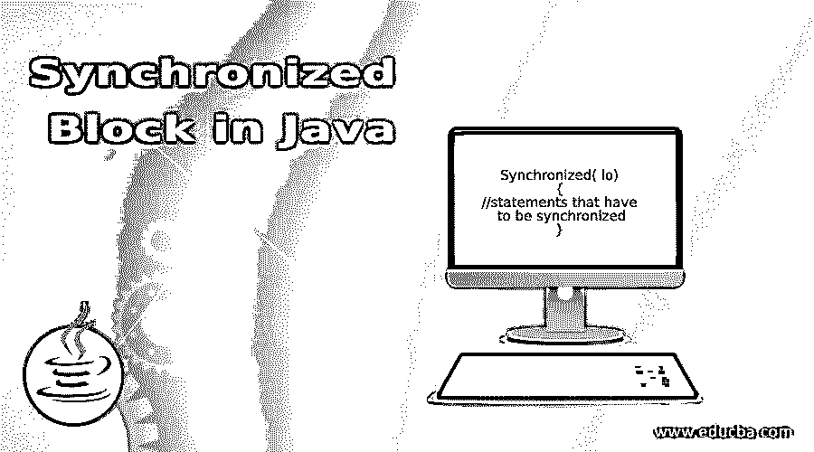
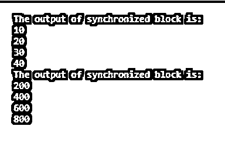
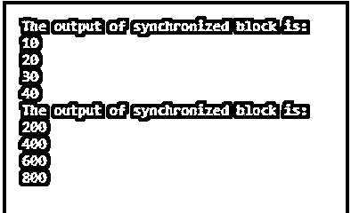

# Java 中的同步块

> 原文：<https://www.educba.com/synchronized-block-in-java/>




## Java 中同步块的定义

在 Java 中，同步块有助于在函数或方法的任何特定资源上执行同步。如果有 100 行代码(LOC ),并且只需要对 10 行代码进行同步，那么可以使用同步块。Synchronized 可以用作关键字、方法和块。在本教程中，我们将详细讨论同步块。

**语法:**

<small>网页开发、编程语言、软件测试&其他</small>

同步块的语法如下所示:

```
Synchronized( lo)
{
//statements that have to be synchronized
}
```

这里，lo 是锁对象

### Java 中的同步块是如何工作的？

如前所述，Synchronized 块有助于在函数或方法的任何特定资源上执行同步。当一个线程需要执行在 synchronized 块内同步的行时，强制获取上面语法中提到的锁对象 lo 的监视器上的锁。一次只有一个线程可以获取锁对象的监视器。每个线程都必须等待，直到当前持有锁的线程完成执行并释放它。

类似地，synchronized 关键字确保一次只有一个线程执行同步块中的代码行，从而防止多个线程破坏块中共享的数据。

假设一个方法由 500 行代码组成，但是只有 20 行代码包含代码的临界区。也就是说，这 20 行可以改变或改变对象的状态。因此，可以对这 20 行代码函数进行同步，以避免对象状态的任何改变，并确保其他线程执行特定方法中的其他 480 行代码，而没有任何中断。

### Java 中同步块的例子

现在，让我们看看 Java 中同步块上的一些示例程序。

#### 示例#1

实现同步块的 Java 程序

**代码:**

```
class Testsmple{
void printTestsmple(int n)
{
//start of synchronized block
synchronized(this)
{
System.out.println("The output of synchronized block is: ");
for( int i=1 ; i<=4 ; i++ )
{
System.out.println(n*i);
//exception handling
try
{
Thread.sleep(500);
}
catch(Exception exc)
{
System.out.println(exc) ;
}
}
}
} //end
}
class T1 extends Thread
{
Testsmple t;
T1(Testsmple t)
{
this.t=t;
}
public void run()
{
t.printTestsmple(10);
}
}
class T2 extends Thread
{
Testsmple t;
T2(Testsmple t)
{
this.t=t;
}
public void run()
{
t.printTestsmple(200);
}
}
public class SyncBlockExample
{
public static void main(String args[])
{
// create only one object
Testsmple ob = new Testsmple();
//objects of threads
T1 t1=new T1(ob);
T2 t2=new T2(ob);
//start the threads t1 and t2
t1.start();
t2.start();
}  }
```

**输出:**




在这个程序中，使用了两个线程 t1 和 t2，其中每个线程都有一个调用同步方法的方法 printTestsmple。printTestsmple 的线程 1 输入是 10，线程 2 输入是 200。在结果中，可以看到第一个线程的同步块的输出是 10，20，30，40。同时，线程 2 同步块的结果是 200，400，600，800。此外，还有一行“同步块的输出是:”打印在每个线程的结果之间。

#### 实施例 2

Java 程序，利用匿名类的帮助实现同步块。

**代码:**

```
class Testsmple{
void printTestsmple(int n)
{
//start of synchronized block
synchronized(this)
{
System.out.println("The output of synchronized block is: ");
for( int i=1 ; i<=4 ; i++ )
{
System.out.println(n*i);
//exception handling
try
{
Thread.sleep(500);
}
catch(Exception exc)
{
System.out.println(exc) ;
}
}
}
} //end
}
public class SyncBlockExample
{
//main method
public static void main(String args[])
{
//create only one object
final Testsmple obj = new Testsmple() ;
//create thread th1
Thread th1=new Thread()
{
public void run()
{
obj.printTestsmple(10) ;
}
}
;
//create thread th2
Thread th2=new Thread()
{
public void run()
{
obj.printTestsmple(200);
}
} ;
th1.start() ;
th2.start() ;
}}
```

**输出:**




同样在这个程序中，使用了两个线程 t1 和 t2，其中每个线程都有一个调用 synchronized 方法的方法 printTestsmple。printTestsmple 的线程 1 输入是 10，线程 2 输入是 200。在结果中，可以看到第一个线程的同步块的输出是 10，20，30，40。同时，线程 2 同步块的结果是 200，400，600，800。此外，还有一行“同步块的输出是:”打印在每个线程的结果之间。唯一的区别是这个程序中存在一个匿名类。

#### 实施例 3

实现同步块的 Java 程序。

```
import java.util.*;
class ABC
{
String nm = "";
public int cnt = 0;
public void samplename(String stringexample, List<String>li)
{
// In order to change the name at a time, only 1 thread is permitted
synchronized(this)
{
nm = stringexample;
cnt++;
}
li.add(stringexample);
}
}
public class SyncBlockExample
{
//main method
public static void main (String[] args)
{
//create an object for the class ABC
ABC obj = new ABC();
//create a list
List<String>li = new ArrayList<String>();
//call the method using the object created
obj.samplename("Anna Sam", li);
System.out.println(obj.nm);
}
}
```

**输出:**


在这个程序中，使用 samplename 方法中的同步方法创建了一个 ABC 类。字符串“Anna Sam”作为调用方法 samplename 的输入被传递。在执行代码时，打印出字符串“Anna Sam”。

### 优势

下面给出了一些优点:

*   如果同步范围有限，可以提高性能。
*   同步小代码块以降低计算成本。
*   灵活地使用其他对象作为锁。
*   因为 Java 是一种多线程编程语言，所以最好在共享的资源上实现互斥。

### 推荐文章

这是 Java 中同步块的指南。在这里，我们还讨论了同步块的定义和在 java 中的工作方式，以及不同的例子和代码实现。您也可以看看以下文章，了解更多信息–

1.  [Java BufferedWriter](https://www.educba.com/java-bufferedwriter/)
2.  [Java 语言环境](https://www.educba.com/java-locale/)
3.  [Java @Override](https://www.educba.com/java-override/)
4.  [@在 Java 中已弃用](https://www.educba.com/deprecated-in-java/)


