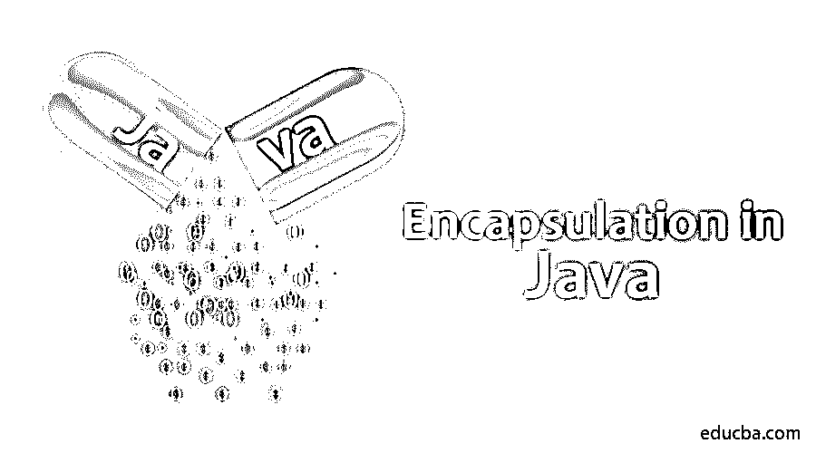

# Java 中的封装

> 原文：<https://www.educba.com/encapsulation-in-java/>




## Java 封装简介

封装是 Java 中四个基本的[面向对象编程概念之一。这背后的主要思想是对用户隐藏实现细节。换句话说，封装就是将数据打包成一个单元，以防止外界对其进行访问。由于数据对其他类是隐藏的，这个过程称为数据隐藏。让我们以灯泡的工作为例。即使我们使用它，我们也不知道它是否在灯泡后面工作。但是在 Java 封装的情况下，使用修饰符访问数据是可能的。让我们在下一节中研究它。](https://www.educba.com/object-oriented-programming-in-java/)

### java 中的封装是如何工作的？

封装在 Java 中的工作原理是

<small>网页开发、编程语言、软件测试&其他</small>

*   **将类中的属性或变量声明为私有**

例如，我们正在创建一个雇员类。变量需要设置为私有的，如下所示。

```
private String EmpName;
private int EmpID;
private int EmpSal;
```

*   在类中创建公共方法来获取和设置属性或变量。

下面是 Employee 类中不同私有变量的 get 方法和 set 方法。

**代码:**

```
public int getEmpSal()
{
return EmpSal;
}public String getEmpName()
{
return EmpName;
}
public int getEmpID()
{
return EmpID;
}
public void setEmpSal( int EmpSal)
{
this.EmpSal = EmpSal;
}
public void setEmpName(String EmpName)
{
this.EmpName = EmpName;
}
public void setEmpID( int EmpID)
{
this.EmpID = EmpID;
}
```

使用这些方法，有可能使类只写或只读，也就是说，如果需要，我们可以跳过这些方法。

### Java 封装的优势

以下是封装的一些优点。

*   应用简单
*   基于需求重用或修改代码的能力
*   限制数据的可访问性
*   由于代码被封装，单元测试容易

Java Bean 类是完全封装类的一个例子，因为类中的所有数据成员都是私有的。

### Java 封装的例子

让我们看一个用 getter 和 setter 方法封装的例子。为此，创建两个类——一个使用主方法，另一个使用 get 和 set 方法。

#### 示例#1

Employee.java

**代码:**

```
//Java program for Encapsulation with both read and write
public class Employee {
//private variables which can be accessed by public methods of the class
private String EmpName;
private int EmpID;
private int EmpSal;
// get method to access the private integer variable EmpSal
public int getEmpSal()
{
return EmpSal;
}
// get method to access the private string variable EmpName
public String getEmpName()
{
return EmpName;
}
// get method to access the private integer variable EmpID
public int getEmpID()
{
return EmpID;
}
// set method to access the private integer variable EmpSal
public void setEmpSal( int EmpSal)
{
this.EmpSal = EmpSal;
}
// set method to access the private string variable EmpName
public void setEmpName(String EmpName)
{
this.EmpName = EmpName;
}
// set method to access the private integer variable EmpID
public void setEmpID( int EmpID)
{
this.EmpID = EmpID;
}
}
```

*   EmployeeEncaps.java

**代码:**

```
public class EmployeeEncaps {
public static void main(String[] args) {
Employee EmpObj= new Employee(); //object of the class Employee
//passing the values to the methods using object
EmpObj.setEmpName("Anna");
EmpObj.setEmpSal(30000);
EmpObj.setEmpID(670311);
// Printing values of the variables
System.out.println("Employee's Name: " + EmpObj.getEmpName());
System.out.println("Employee's ID: " + EmpObj.getEmpID());
System.out.println("Employee's Salary: " + EmpObj.getEmpSal());
}
}
```

**输出:**


Employee 类封装在上面的程序中，因为变量是私有的。因为它有 get 和 set 方法，所以可以读写实现。私有变量(如 EmpName、EmpSal 和 EmpID)是使用这些方法访问的，并通过使用对象调用这些方法来显示。

现在，让我们看看封装是如何处理只读类的。

#### 实施例 2

*   Employee.java

**代码:**

```
//Java program for Encapsulation with read permission
public class Employee {
//private variables which can be accessed by public methods of the class
private String EmpName = "Adam";
private int EmpID = 670388;
private int EmpSal = 35000;
// get method to access the private integer variable EmpSal
public int getEmpSal()
{return EmpSal;
}// get method to access the private string variable EmpName
public String getEmpName()
{
return EmpName;
}
// get method to access the private integer variable EmpID
public int getEmpID()
{
return EmpID;
}
}
```

*   EmployeeEncaps.java

**代码:**

```
public class EmployeeEncaps {
public static void main(String[] args) {
Employee EmpObj= new Employee(); //object of the class Employee
// Printing values of the variables
System.out.println("Employee's Name: " + EmpObj.getEmpName());
System.out.println("Employee's ID: " + EmpObj.getEmpID());
System.out.println("Employee's Salary: " + EmpObj.getEmpSal());
}
}
```

**输出:**


与第一个例子类似，我们也使用私有变量。不同之处在于，我们没有使用 set 方法来为类中的私有变量设置值。相反，我们直接给变量赋值。

现在，我们可以继续学习只写类了。

#### 实施例 3

*   Employee.java

**代码:**

```
//Java program for Encapsulation with write permission
public class Employee {
//private variables which can be accessed by public methods of the class
private String EmpName;
private int EmpID;
private int EmpSal;
// set method to access the private integer variable EmpSal
public void setEmpSal( int EmpSal)
{
this.EmpSal = EmpSal;
//for sample output
System.out.println("Employee's Salary: " + EmpSal);
}
// set method to access the private string variable EmpName
public void setEmpName(String EmpName)
{
this.EmpName = EmpName;
//for sample output
System.out.println("Employee's Name: " + EmpName);
}// set method to access the private integer variable EmpID
public void setEmpID( int EmpID)
{
this.EmpID = EmpID;
//for sample output
System.out.println("Employee's ID: " + EmpID);
}
}
```

*   EmployeeEncaps.java

**代码:**

```
public class EmployeeEncaps {
public static void main(String[] args) {
Employee EmpObj= new Employee(); //object of the class Employee
//passing the values to the methods using object
EmpObj.setEmpName("Iza");
EmpObj.setEmpID(670472);
EmpObj.setEmpSal(48000);
}
}
```

**输出:**


在上面的例子中，我们没有使用 get 方法来实现只写类。也就是说，在这里变量不能被改变或检索。因为不可能获得这些值，所以我们在 set 方法中使用 print 进行示例输出。

### 结论

[封装是一个 OOP 概念](https://www.educba.com/encapsulation-in-javascript/)数据将被包装，隐藏所有的实现细节。这可以通过使用私有变量和方法(如获取和设置)来访问变量来实现。封装的主要优点包括灵活性、数据隐藏、易于测试和可重用性。

### 推荐文章

这是一个 Java 封装指南。这里我们已经讨论了封装是如何工作的，以及带有代码和输出的 Java 封装的例子。你也可以浏览我们的文章来了解更多-

1.  [最佳 Java 编译器](https://www.educba.com/best-java-compilers/)
2.  [c++中的封装](https://www.educba.com/encapsulation-in-c-plus-plus/)
3.  [C 语言中的封装](https://www.educba.com/encapsulation-in-c/)
4.  JavaScrip 中的封装


