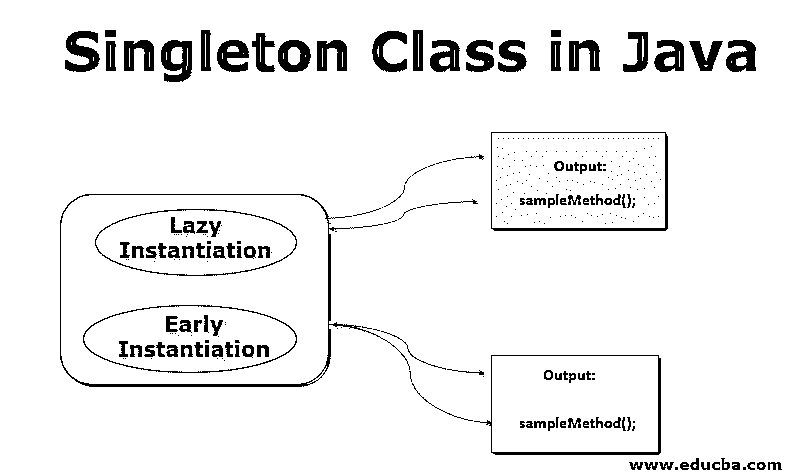
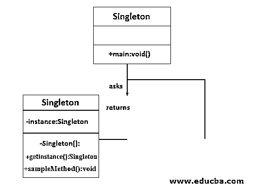
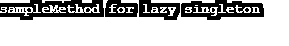

# Java 中的单例类

> 原文：<https://www.educba.com/singleton-class-in-java/>




## Java 中单例类介绍

Singleton 类将一个类的对象创建限制为只能在 [java 虚拟机](https://www.educba.com/java-virtual-machine/)中创建一个。它还有助于提供对象的全局访问点。这种设计模式常用于缓存、抽象工厂、日志、原型等。它还用于核心 java 类，如 java.awt.Desktop、java.lang.Runtime。在 java.lang.Runtime 中，java 提供了一个类运行时，表示应用程序运行的当前运行时环境。这有助于连接应用程序和运行时环境。应该有一个对象，因为 JRE 是唯一的。在 java.awt.Desktop 中，class Desktop 允许应用程序使用用户的默认浏览器、邮件客户端等启动 URI 或文件。这里也必须只有一个类的实例。

### Java 中的 Singleton 类是如何工作的？

单例类可以用两种方法创建。

<small>网页开发、编程语言、软件测试&其他</small>

1.  将构造函数设置为私有，以限制对象的创建。
2.  创建一个静态方法来获取对象的实例，这样您就可以只在类内部处理对象的创建。

现在，让我们看看 Singleton 类的类 UML(统一建模语言)图。




在 UML 类图中，第一部分代表类名，第二部分代表属性，第三部分代表方法。另外，+表示公共属性或方法，而–表示私有属性或方法。例如，在我们的单例类 UML 图中，类名是 Singleton，它有一个 main 方法。main 方法、getInstance 方法和 sampleMethod 是上图中仅有的公共方法。构造函数和实例属性[被设置为私有，作为我们实现的一部分](https://www.educba.com/private-in-php/)。这个公共的 main 方法请求实例，getInstance 将它返回给 Main 方法。

基于实例化，普通 Java 类和 Singleton 类之间的唯一区别是，我们将在 Java 类中使用构造函数，而在 Singleton 中，我们将使用 getInstance()方法。

Singleton 设计模式有两种形式。

*   **惰性实例化:**在需要时创建实例
*   **早期实例化:**在加载时创建实例。

**1。惰性实例化**

在惰性实例化中，类实例是在需要时创建的。它是在 Synchronized 方法或块中创建的，以避免在多线程环境中可能出现的竞争情况。

**2。早期实例化**

在早期实例化中，实例是在加载时创建的。尽管这是最简单的方法，但它有一个缺点，即实例的创建与它是否被访问无关。

下一节将解释延迟实例化和早期实例化的一个例子。

### 单一类在 Java 中的实现

如上所述，单例类可以在早期实例化或延迟实例化中创建。

#### 惰性实例化

下面是实现惰性实例化的步骤。

1.将构造函数设置为私有。

例如，我们正在创建一个类 LazyClass。构造函数如下所示。

```
private LazyClass ()
{
}
```

2.为创建的类创建一个私有静态实例。

```
private static LazyClass instance;
```

3.创建一个静态同步方法来获取创建的类实例。

```
public static synchronized LazyClass getInstance()
{
}
```

4.在 getInstance()方法中，首先检查是否存在任何实例。如果找不到，请创建一个。否则返回实例。

```
if(instance == null)
{
instance = new LazyClass ();
}
return instance;
```

现在，让我们使用示例代码来研究它。

```
//Java Program for Lazy Instantiation
public class LazyClass {
private static LazyClass instance;
//set the constructor as private
private LazyClass () {}
//Checks whether an instance is already in the getInstance method
public static synchronized LazyClass getInstance() {
//if instance is not present already, create a new one
if(instance == null) {
instance = new LazyClass ();
}
// if an instance is present, then return it
return instance;
}
//Sample method that is protected from more than one object creation
public void sampleMethod( ) {
System.out.println("sampleMethod for lazy singleton");
}
public static void main(String[] args) {
LazyClass temp=LazyClass.getInstance();
temp.sampleMethod();
}
}
```

**输出:**




这里，不是在加载时创建实例，而是在 synchronized 块内部创建。为了更好地理解，还给出一个示例方法，它受到保护，不会被多个对象创建。

#### 早期实例化

现在让我们看看早期实例化的步骤。它类似于惰性实例化，只是它不使用任何同步的方法或块。

1.将构造函数设置为私有。

例如，我们正在创建一个类，EarlyClass。构造函数如下所示。

```
private EarlyClass () ()
{
}
```

2.为创建的类创建一个私有静态实例。

```
private static EarlyClass *ins*= new EarlyClass();
```

3.创建一个静态方法来获取创建的类实例。

```
public static EarlyClass getInstance()
{
}
```

下面是早期实例化的示例代码。

```
//Java Program for Early Instantiation
public class EarlyClass {
//Create an instance of the class at load time
private static EarlyClass *ins*= new EarlyClass();
//set the constructor as private
private EarlyClass () {}
//A static method to get the instance
public static EarlyClass getInstance() {
return *ins*;
}
//A sample method that is protected from more than one object creation
public void sampleMethod() {
System.*out*.println("sampleMethod for Early singleton");
}
//Main method
public static void main(String[] args) {
EarlyClass tmp = *getInstance*();
tmp.sampleMethod();
}
}
```

**输出:**


在上面的程序中，在加载时创建了一个实例，并使用 getInstance()方法返回该实例。此外，构造函数作为单例实例化的一部分被设置为 private。

使用它的主要优点是节省内存，因为对象可以重复使用，而不是一次又一次地创建。

### 结论

在这篇文档中，我们已经介绍了一个单例类如何在 UML 图、算法和示例代码的帮助下工作。当我们只需要一个类的一个对象和该对象的一个全局访问点时，就使用 Singleton 类。可以根据需要使用早期实例化和延迟实例化两种形式。

### 推荐文章

这是 Java 中单例类的指南。在这里，我们讨论了 singleton 类在 java 中的工作方式以及实现，包括延迟实例化和早期实例化。您也可以浏览我们推荐的其他文章，了解更多信息——

1.  [Java 中的设计模式是什么？](https://www.educba.com/what-is-design-pattern-in-java/)
2.  [Java 中的抽象类](https://www.educba.com/abstract-class-in-java/)
3.  [Java 注释](https://www.educba.com/java-annotations/)
4.  [Java 中的 BorderLayout](https://www.educba.com/borderlayout-in-java/)


