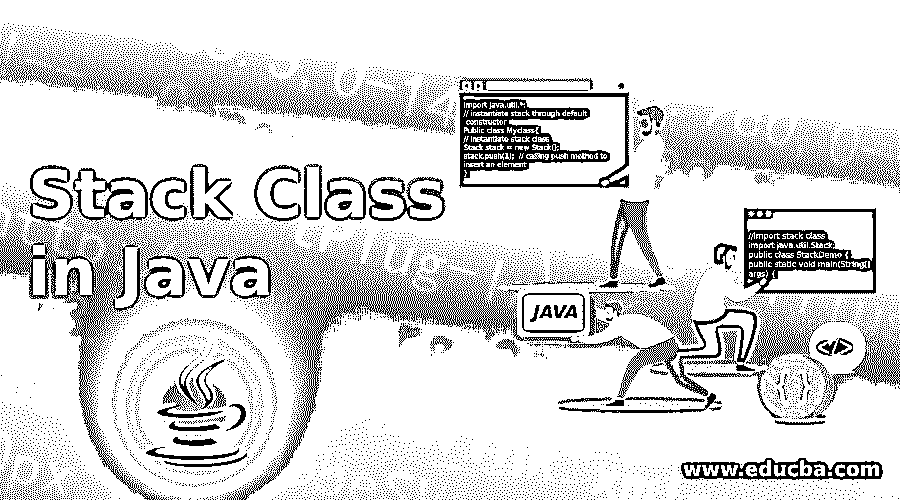

# Java 中的堆栈类

> 原文：<https://www.educba.com/stack-class-in-java/>




## Java 中的堆栈类介绍

Stack 类是实现堆栈数据结构的 Java.util 包的一部分。java 中的 Stack 类是按照 LIFO(后进先出)的原则运行的。Stack 类提供基本的 push 和 pop 操作以及其他操作，如清空、查看和搜索。stack 类为执行不同的操作提供了不同的方法。

**语法:**

<small>网页开发、编程语言、软件测试&其他</small>

下面是 java 中如何使用堆栈类的基本语法:

```
import java.util.*;
// instantiate stack through default constructor
Public class Myclass{
// instantiate stack class
Stack stack = new Stack();
stack.push(1);  // calling push method to insert an element
}
```

### Java 中的 Stack 类是如何工作的？

Stack 类是 java.util 包的一部分，它扩展了 Vector 类，实现了 List 接口。Vector 类在 java 中是可调整大小的，这意味着它可以在添加新元素的情况下增加大小，在删除元素后缩小大小。因为 stack 类扩展了 vector，所以它本质上也是可调整大小的。为了使用堆栈类，我们必须通过构造函数创建一个堆栈类的实例。因为 stack 类是可调整大小的，所以它只有一个默认的构造函数。

得到实例后，可以根据需要调用以下方法:

*   **push():** 这个方法在栈顶插入一个元素，并返回插入的元素。
*   **pop():** 这个方法从堆栈中移除最后插入的元素，并返回移除的元素。
*   **peek():** 这个方法从堆栈中返回顶层元素，而不将它们从堆栈中移除。
*   **search (Object element):** 此方法在堆栈中搜索指定的元素，如果找到该元素，则从堆栈顶部返回其索引；否则，它返回-1。
*   **empty():** 这个方法检查给定的堆栈是否为空。如果堆栈为空，则返回 true 否则，它返回 false。
*   **size():** 该方法返回堆栈中可用的多个元素。

### Java 中 Stack 类的例子

下面是一些例子:

#### 示例#1

现在我们将看到一个 java 代码示例，展示如何在堆栈中使用上述方法。

**代码:**

```
//import stack class
import java.util.Stack;
public class StackDemo {
public static void main(String[] args) {
// Creating Instance of  Stack
Stack<String> numbers = new Stack<>(); // stack of type string only string type elements can be inserted
// Pushing new elements to the Stack
numbers.push("One");
numbers.push("Two");
numbers.push("Three");
numbers.push("Four");
int size= numbers.size(); // finding size of stack
System.out.println("Stack contains => " + numbers);
System.out.println("Size of Stack is  => " + size);
System.out.println();
// Popping Elements from the Stack
String numbersAtTop = numbers.pop();  // Throws EmptyStackException if the stack is empty
System.out.println("Element Removed  => " + numbersAtTop);
System.out.println("Current State of Stack => " + numbers);
size= numbers.size();
System.out.println("Size of Stack is  => " + size);
System.out.println();
// Get the element at the top of the stack without removing it
numbersAtTop = numbers.peek();
System.out.println("Top Most elemement of stack  => " + numbersAtTop);
System.out.println("Current State of Stack => " + numbers);
// searching for an element in stack
int index = numbers.search("Two");
System.out.println("Element found at Index " + index);
// check if the stack is empty
boolean isempty = numbers.empty();
System.out.println("Is Stack Empty =>  " + isempty);
}}
```

在上面的程序中，我们已经展示了如何在 stack 类上执行不同的操作，如 push、pop、peek 和 search、empty。

#### 实施例 2

现在我们将看到如何迭代堆栈类的元素。

**代码:**

```
//import stack class
import java.util.Stack;
//import stream to iterate over stack
import java.util.stream.Stream;
public class StackDemo {
public static void main(String[] args) {
// Creating Instance of  Stack
Stack<String> numbers = new Stack<>(); // stack of type string only string type elements can be inserted
// Pushing new elements to the Stack
numbers.push("First");
numbers.push("Second");
numbers.push("Third");
numbers.push("Fourth");
System.out.println("Stack contains => " + numbers);
System.out.println();
// getting stream object to iterate over elements of stack
Stream stream = numbers.stream();
System.out.println("Iterating stack using stream >> ");
stream.forEach((item) -> {
System.out.println(item);  // print item
});
}
}
```

上面的程序展示了我们如何迭代堆栈的元素。我们需要在 stack 实例上调用 stream()方法，该方法返回 Stream 对象。然后，我们可以使用 stream 类的 forEach 方法迭代堆栈。

### 结论

在本文中，我们已经了解了 stack 类。此外，我们已经看到了如何实例化 stack 类并使用 stack 类中不同的可用方法。我们已经看到了使用 stack 类可以执行的不同操作。上面显示的 Java 代码示例完全清楚地说明了 stack 类。

### 推荐文章

这是一个 Java 中堆栈类的指南。在这里，我们讨论如何实例化 stack 类并使用 stack 类中可用的不同方法，以及不同的示例及其代码实现。您也可以阅读以下文章，了解更多信息——

1.  [Java 中的内部类](https://www.educba.com/inner-class-in-java/)
2.  [Java 中的不可变类](https://www.educba.com/immutable-class-in-java/)
3.  [Java 中的单例类](https://www.educba.com/singleton-class-in-java/)
4.  [Java 适配器类](https://www.educba.com/java-adapter-classes/)


