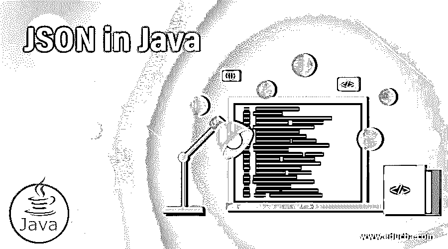
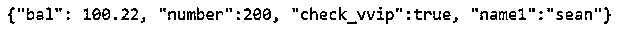
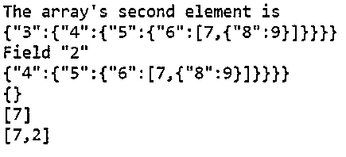
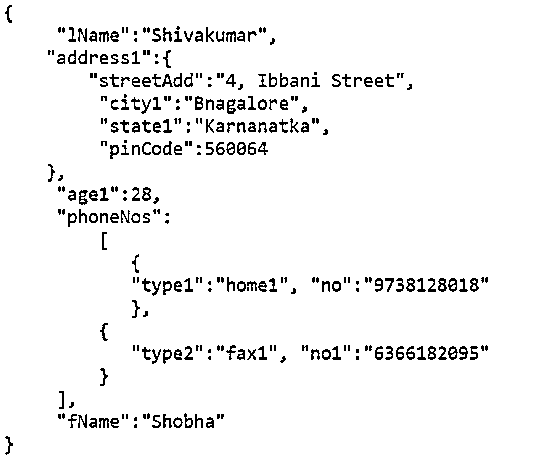
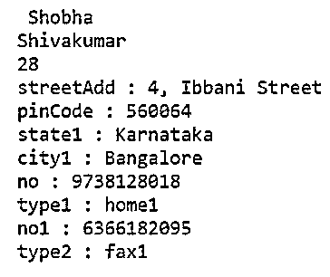

# Java 中的 JSON

> 原文：<https://www.educba.com/json-in-java/>




## Java 中的 JSON 简介

数据交换的格式是轻量级的，基于文本，独立于语言，易于人和机器读写，是 JavaScript 对象符号，在 Java 中也称为 JSON。这表示称为对象和数组的两种类型的结构，其中对象是没有或多于零个名称和值对的集合，并且是无序的集合，没有或多于零个值的有序序列是数组，并且可能的值可以是数字、字符串、布尔值、null、对象和数组。

### JSON 在 Java 中的应用

*   考虑下面的例子，用 JSON 表示一个对象来描述一个人。
*   名字和姓氏采用对象中的字符串值；age 取对象中数字的值，address 取字符串和数字的值来表示对象中人的地址；电话号码接受对象中数组的值。

**代码:**

<small>网页开发、编程语言、软件测试&其他</small>

```
{
"fName": "Shobha",
"lName": "Shivakumar",
"age1": 28,
"address1":
{
"streetAdd": "4, Ibbani street",
"city1": "Bangalore",
"state1": "Karnataka",
"pinCode": 560064
},
"phNumbers":
[
{
"type1": "home1",
"no": "9738128018"
},
{
"type2": "fax1",
"no1": "6366182095"
}
]
}
```

*   java 中的 JavaScript 对象符号(JSON)的处理是通过使用 JavaScript 对象符号的 Java 应用编程接口来完成的，即 JSON.simple，JavaScript 对象符号 JSON.simple 是 Java 中的一个库，它允许解析 JavaScript 对象符号、生成 JavaScript 对象符号、转换 JavaScript 对象符号、查询 JavaScript 对象符号等。
*   为了使用 JavaScript Object Notation simple library，必须下载 json-simple-1.1.jar，并在编译和运行 JavaScript Object Notation 编程示例之前将其放入类路径中。
*   JavaScript 对象符号对象和数组结构使用 JavaScript 对象符号简单应用程序编程接口提供的对象模块。
*   这些 JavaScript 对象符号结构使用 JSON 对象和 JSON 数组类型来表示对象模型。JSON 对象提供了一个映射视图，用于访问模型中零个或零个以上的名称和值对的集合，这是一个无序的集合，而 JSON 数组提供了一个列表视图，用于访问模型数组中零个或零个以上值的有序序列。

### Java 中 JSON 的例子

下面是 Java 中 JSON 的例子:

#### 示例#1

一个 Java 程序，演示了用 Java 对 JavaScript 对象符号(JSON)进行编码。

**代码:**

```
//Importing JSON simple library
import org.json.simple.JSONObject;
//Creating a public class
public class JsonEncode {
//Calling the main method
public static void main(String[] args) {
//Creating an object of JSON class
JSONObject obje = new JSONObject();
//Entering the values using the created object
obje.put("bal", new Double(100.22));
obje.put("number", new Integer(200));
obje.put("check_vvip", new Boolean(true));
obje.put("name1", "sean");
//Printing the values through the created object
System.out.print(obje);
}
}
```

在上面的例子中，创建了一个 JSON 对象 obje。使用 JSON 对象 obje。诸如双精度、整数、布尔、字符串等值。，作为输出打印。

**输出:**




#### 实施例 2

Java 程序，演示 JSON 对象和 JSON 数组的使用。

**代码:**

```
//importing JSON simple libraries
import org.json.simple.JSONObject;
import org.json.simple.JSONArray;
import org.json.simple.parser.ParseException;
import org.json.simple.parser.JSONParser;
//creating a public class
public class JsonDecode{
//calling the main method
public static void main(String[] args) {
//creating an object of JSONparser
JSONParser par = new JSONParser();
//defining and assigning value to a string
String str = "[2,{\"3\":{\"4\":{\"5\":{\"6\":[7,{\"8\":9}]}}}}]";
try{
Object objc = par.parse(str);
//creating a JSON array
JSONArray array = (JSONArray)objc;
System.out.println("The array's second element is");
System.out.println(array.get(1));
System.out.println();
//creating a JSON object
JSONObject objc2 = (JSONObject)array.get(1);
System.out.println("Field \"2\"");
System.out.println(objc2.get("2"));
str = "{}";
objc = par.parse(str);
System.out.println(objc);
str = "[7,]";
objc = par.parse(str);
System.out.println(objc);
str = "[7,,2]";
objc = par.parse(str);
System.out.println(objc);
}catch(ParseException pr) {
System.out.println("The elements position is: " + pr.getPosition());
System.out.println(pr);
}
}
}
```

在上面的例子中，创建了 JSON 解析器 par 的 JSON 对象，然后定义并分配了一个字符串值。创建一个 JSON 数组来获取字符串中不同的指定元素。

**输出:**




#### 实施例 3

使用 JavaScript 对象符号对象和 JavaScript 对象符号数组将 JavaScript 对象符号数据写入名为 JSON.json 的文件的 Java 程序。

**代码:**

```
//importing java simple libraries and JSON libraries
import java.io.FileNotFoundException;
import java.io.PrintWriter;
import java.util.LinkedHashMap;
import java.util.Map;
import org.json.simple.JSONArray;
import org.json.simple.JSONObject;
public class JSONWrite
{
public static void main(String[] args) throws FileNotFoundException
{
// Json object is created
JSONObject job = new JSONObject();
// Adding data using the created object
job.put("fName", "Shobha");
job.put("lName", "Shivakumar");
job.put("age1", 28);
// LinkedHashMap is created for address data
Map m1 = new LinkedHashMap(4);
m1.put("streetAdd", "4, Ibbani Street");
m1.put("city1", "Bangalore");
m1.put("state1", "Karnataka");
m1.put("pinCode", 560064);
// adding address to the created JSON object
job.put("address1", m1);
// JSONArray is created to add the phone numbers
JSONArray jab = new JSONArray();
m1 = new LinkedHashMap(2);
m1.put("type1", "home1");
m1.put("no", "9738128018");
// adding map to list
jab.add(m1);
m1 = new LinkedHashMap(2);
m1.put("type2", "fax1");
m1.put("no1", "6366182095");
// map is added to the list
jab.add(m1);
// adding phone numbers to the created JSON object
job.put("phoneNos", jab);
// the JSON data is written into the file
PrintWriter pwt = new PrintWriter("JSON.json");
pwt.write(job.toJSONString());
pwt.flush();
pwt.close();
}
}
```

在上面的示例中，创建了一个 JSON 对象作业。使用 job 对象将名字、姓氏和年龄写入 JSON.json 文件。创建一个链接的散列映射来添加地址细节，然后使用 JSON 作业对象将这些细节写入文件。创建 JSON 数组对象来添加电话号码，并使用链接哈希映射来创建不同类型的电话号码；最后，JSON 作业对象用于将这些电话号码写入文件。最终使用打印写入器，将内容写入文件。

**输出:**

当访问文件 JSON.json 以查看文件内容时，上述程序的输出。

**Note:** Since JSON is an unordered collection of name or value pairs, there is no order preserved in the output shown below.


#### 实施例 4

Java 程序读取 JSON 文件的内容。JSON 演示了 JavaScript 对象符号对象解析器、JavaScript 对象符号对象和 JavaScript 对象符号对象数组的使用。

**代码:**

```
//importing JSON simple libraries
import java.io.FileReader;
import java.util.Iterator;
import java.util.Map;
import org.json.simple.JSONArray;
import org.json.simple.JSONObject;
import org.json.simple.parser.*;
public class JSONRead
{
public static void main(String[] args) throws Exception
{
// The file JSON.json is parsed
Object objc = new JSONParser().parse(new FileReader("JSON.json"));
// objc is convereted to JSON object
JSONObject job = (JSONObject) objc;
// obtaining the fname and lname
String fName = (String) job.get("fName");
String lName = (String) job.get("lName");
System.out.println(fName);
System.out.println(lName);
// age is obtained
long age1 = (long) job.get("age1");
System.out.println(age1);
// address is obtained
Map address1 = ((Map)job.get("address1"));
// iterating through the address
Iterator<Map.Entry> itr = address.entrySet().iterator();
while (itr.hasNext()) {
Map.Entry pair1 = itr1.next();
System.out.println(pair1.getKey() + " : " + pair1.getValue());
}
// phone numbers are obtained
JSONArray jab = (JSONArray) job.get("phoneNos");
// iterating phoneNumbers
Iterator itr1 = jab.iterator();
while (itr1.hasNext())
{
itr = ((Map) itr1.next()).entrySet().iterator();
while (itr.hasNext()) {
Map.Entry pair1 = itr.next();
System.out.println(pair1.getKey() + " : " + pair1.getValue());
}
}
}
}
```

在上面的示例中，通过创建一个对象 objc 来解析文件 JSON.json，然后将该对象 objc 转换为 JSON 对象作业。通过 iteratios 从 JSON.json 文件中读取名字、姓氏、年龄、地址和电话号码，并作为输出打印出来。

**输出:**

从 JSON.json 文件中读取内容后，上述程序的输出显示在下面的快照中:




### 推荐文章

这是 Java 中的 JSON 指南。这里我们讨论 JSON 在 Java 中的介绍、工作原理和例子。您也可以看看以下文章，了解更多信息–

1.  [Java 缓冲器](https://www.educba.com/java-bufferedreader/)
2.  [JSON.stringify JavaScript](https://www.educba.com/json-stringify-javascript/)
3.  [Python 中的 JSON](https://www.educba.com/json-in-python/)
4.  [JSON 蛮](https://www.educba.com/json-pretty/)


