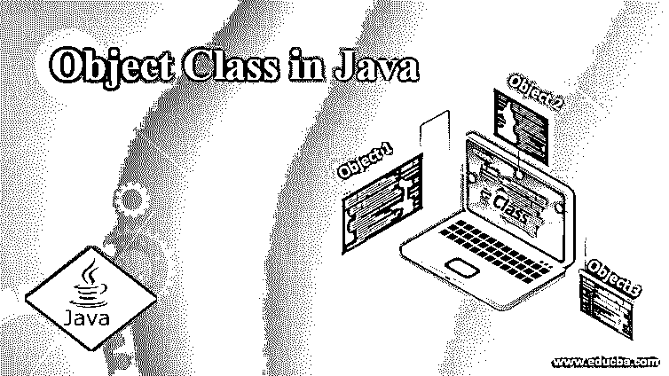
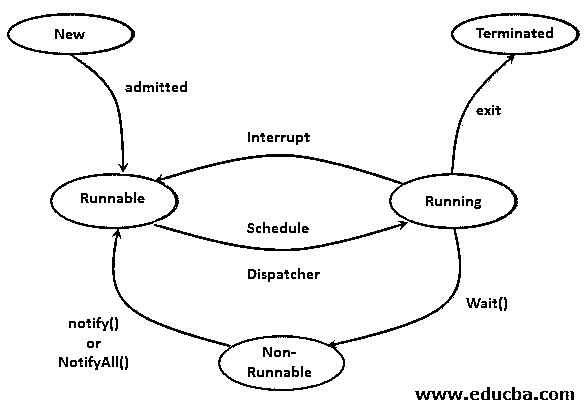

# Java 中的对象类

> 原文：<https://www.educba.com/object-class-in-java/>




## Java 中对象类的定义

对象类是自 JDK 1.0 以来存在的每个继承树中的根类。Java 中的每个类都直接或间接地继承对象类的属性和方法，也就是说，例如，在 C1 类扩展其他 C2 类的情况下，由于对象类是所有类的父类，C1 间接继承对象类，否则默认情况下，Java 中创建的每个类都默认扩展对象类。因此，Java 中的每个数据类型对象都是一种对象类对象；因此，object 类的对象可以包含任何类型的数据。

### Java 中的对象类是如何工作的？

java.lang 包中的对象类是类层次结构树中的顶层；因此，每个类都是这个类的直接或间接的后代。这意味着所有的类都从 Object 类继承实例方法，并且可以使用它们自己的对象来调用。但是要使用继承的方法，一个类需要在它们内部覆盖它们。

<small>网页开发、编程语言、软件测试&其他</small>

此外，对象类充当所有数据类型的容器类；因此，在一个对象的数据类型未知的情况下，可以容易地使用对象类的对象来引用它，因为父类对象可以容易地用于引用子类对象，这被称为向上转换。

### Java 中对象类的方法

下面是 Object 类中可用的实例方法列表:

#### 1.toString()

**语法:**

```
public String toString()
```

这个函数用于提取一个对象的字符串表示。这种字符串表示可以根据需要容易地修改，例如，如果有一个类 Office 需要在调用该函数时必须显示其分支的头和位置。因此，表示完全取决于对象，在调试时非常有用。

#### 2.哈希码()

**语法** **:**

```
public int hashCode()
```

这个函数返回对象内存地址的十六进制表示，这在两个对象相等的情况下很有用，因为只有当两个对象的 hashcode 匹配时，它们才相等，这是 object 类中的实现。但是如果一个方法覆盖了 Object 类的 equals()方法，那么对于该类的对象来说，super 实现将变得无效。

#### 3.等于(对象对象)

**语法:**

```
public boolean equals(Object obj)
```

此方法用于覆盖 equals 方法的默认实现，以使用 hashcode 比较两个对象，并相应地返回 true 或 false。如果您想实现自己的逻辑来比较类中的两个对象，您必须重写 equals 方法。

#### 4.getClass()

**语法:**

```
public final Class getClass()
```

这个方法返回一个类对象的引用，这个类对象有助于检索当前类的各种信息。下面是类的实例方法的例子

*   **getSimpleName():** 返回类的名称。
*   **getSuperClass():** 返回指定类的超类的引用。
*   **getInterfaces():** 返回在指定类中实现的所有接口的类类型的引用数组。
*   **isAnnotation():** 如果指定的类是注释，则返回 True，否则返回 false。
*   **getFields():** 返回指定类的字段列表。
*   **getMethods():** 返回该类的实例方法列表。

#### 5.最终确定()

**语法:**

```
protected void finalize() throws Throwable
```

每当 JVM 描述该对象不再有引用出口时，就会调用这个方法，以便可以执行垃圾收集。Object 类中的 finalize 函数中没有定义任何内容，并且不返回任何内容。因此，子类可以实现它来执行一些动作，但是不依赖于它何时被调用，因为调用它的线程不持有用户可见的认证锁。

finalize()停止执行时出现任何异常；因此，必须小心处理。

#### 6.克隆()

**语法:**

```
protected Object clone() throws CloneNotSupportedException
```

如果在子类中实现了 Cloneable 接口，那么 Object 类的这个方法意味着在子类中被覆盖，并且这个方法用于克隆，即使用 aobj.clone()语法，用成员变量中的值创建那个对象的副本。如果一个类没有实现 Cloneable 接口，就会抛出 CloneNotSupportedException。

默认情况下，该方法检查在这种情况下是否已经实现了 Cloneable 接口，但是如果您想根据自己的逻辑重写该方法，可以使用下面的语法很容易地做到这一点

```
protected Object clone() throws CloneNotSupportedException
```

或者

```
public Object clone() throws CloneNotSupportedException
```

**举例:**

```
package Try;
public class Desk implements Cloneable{
private int id;
private String Mid;
Desk(int id,String mid){
this.id=id;
this.Mid = mid;
}
@Override
public String toString()
{
return getClass().getName() + "@" + Integer.toHexString(hashCode());
}
@Override
public int hashCode()
{
return id;
}
public boolean equals(Desk dd){
return this.id == dd.id;
}
@Override
protected void finalize()
{
System.out.println("Lets call Fialize");
}
@Override
protected Desk clone() {
return this;
}
public static void main(String[] args){
Desk d1=new Desk(123,"344");
Desk d2=new Desk(234,"344");
System.out.println("toString Representation " + d1.toString());
System.out.println("HashCode for this object "+d1.hashCode());
System.out.println("Comparing 2 objects using equals method "+ d1.equals(d2));
Desk d3=d2.clone(); // cloning d2 object
System.out.println("Comparing clone object with original "+d2.equals(d3));
d1=d2=d3=null;
System.gc();
}
}
```

**输出**:


下面是 Object class 的三个方法，用于实现多线程行为和不同线程间同步的情况。




#### 7.等待()

此方法用于将当前线程置于等待状态，直到任何其他线程发出通知。需要在函数中以毫秒为单位指定恢复线程执行的时间。该功能有三种定义，如下所示:

*   公共最终无效等待()
*   公共最终无效等待(长超时)
*   公共最终 void 等待(长超时，int nanos)

**注意:**该方法抛出 InterruptedException。

#### 8.通知()

**语法:**

```
public final void notify()
```

#### 9.notifyAll()

这个方法用于唤醒所有在等待队列中等待的线程。

**语法:**

```
public final void notifyAll()
```

### 结论

在 Java 中，对象类位于每个类的层次结构的最顶端；因此，每个类都继承它的实例方法，并可以在根据场景重写它们之后使用它们。此外，它的对象可以用作每个使用向上转换概念的类对象的引用变量。

### 推荐文章

这是一个 Java 对象类的指南。在这里，我们讨论 java 中对象类的定义和工作方式，以及方法和例子。您也可以看看以下文章，了解更多信息–

1.  [Java 中的非访问修饰符](https://www.educba.com/non-access-modifiers-in-java/)
2.  [Java 中的匿名类](https://www.educba.com/anonymous-class-in-java/)
3.  [Java 中嵌套的 if 语句](https://www.educba.com/nested-if-statements-in-java/)
4.  [Java 中的动态数组](https://www.educba.com/dynamic-array-in-java/)


