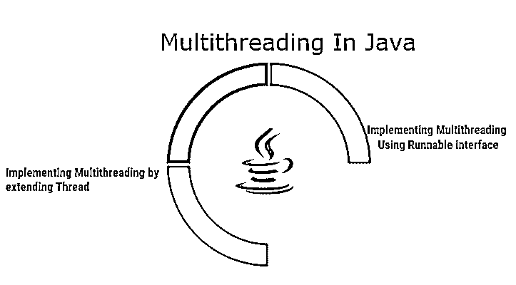
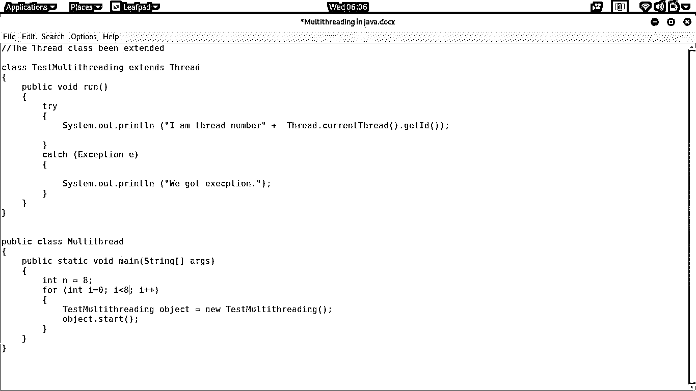
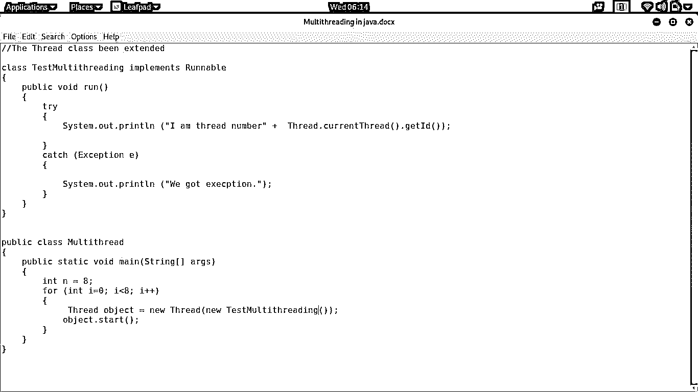
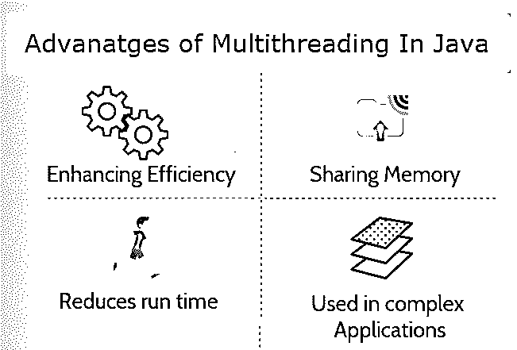

# 什么是 java 中的多线程？

> 原文：<https://www.educba.com/what-is-multithreading-in-java/>

## Java 多线程简介

Java 中的多线程也可以解释为一种特殊的功能，它通过线程来减少运行应用程序的时间。在复杂的程序中，线程的数量通常更多，它们的使用取决于程序的需求。为了生成预期的输出，线程必须相互协调。

在 Java 中，利用多线程特性来开发应用程序，在该应用程序中，任何程序的小部分都可以彼此并行运行。线程的同时执行使程序非常高效，并有助于优化其 CPU 的最佳利用率。根据函数的要求，一个线程可以等待另一个线程执行。

<small>网页开发、编程语言、软件测试&其他</small>

### 什么是多线程？

多线程可以被定义为编程语言同时执行不同任务的功能。这是一个有助于同时执行线程的常见特性。线程只是一个应该并发运行的小任务。

线程被分配了从 0 到 10 的数字。线程被分配了从 0 到 10 的数字。具有较高值的线程具有较高的优先级，反之亦然。值为 8 的线程将在优先级为 2 的线程之前执行。在这种情况下，值为 2 的线程必须等待，直到值为 8 的线程向优先级为 2 的线程显示绿色执行信号。

### 理解/实现多线程

让我们来探索如何在 Java 中实现多线程。为了实现它，我们必须使用 Thread 类或 runnable 接口。当我们打算通过扩展 Thread 类来实现它时，我们可以创建一个对象并调用 run 方法(我们将在后面看到)，如果我们必须使用 runnable 接口来实现它，线程必须被实例化。

实际上，它是使用 run 函数实现的。run 函数可以定义为启动线程执行的特殊函数。可以使用启动函数调用该函数，该函数必须与对象一起使用，以使线程进入执行状态。一旦线程启动，它将执行 run()下定义的所有任务。根据优先级，线程用来选择哪个必须运行，哪个必须等待。

### 使用多线程

在这一节中，我们将学习如何用 Java 编写代码来实现多线程。正如上一节所讨论的，我们将使用 run()和 start()函数来实现线程的多次执行。

下面的图片上写有应用多线程的代码。

#### 1.通过扩展线程实现多线程

如上所述，上面的示例开始创建线程 8 次，并确保分配给线程的数字应该从 8 开始。这个程序的输出如下。

**输出:**

我是 8 号线。

我是 9 号线。

我是 10 号线。

我是 11 号线程。

我是 12 号线程。

我是 13 号线程。

我是 14 号线程。

我是 15 号线。

#### 2.使用可运行接口引入

这个例子是通过实现 Runnable 接口设计的。它与上一个例子不同，因为我们必须创建一个线程类对象来使用 start 函数。输出将与前面的程序相同。下面是输出。

**输出:**

我是 8 号线。

我是 9 号线。

我是 10 号线。

我是 11 号线程。

我是 12 号线程。

我是 13 号线程。

我是 14 号线程。

我是 15 号线。

### java 中多线程的优势

当我们谈论任何程序的快速执行时，它只需要同时执行几个操作。当制作一个几乎不需要时间就能快速执行的高效程序时，这是非常有利的。

以下是一些常见的好处:

*   **提高效率–**通过充分利用 CPU，应用程序变得非常高效。我让线程在其他线程等待一些输出时有效地使用 CPU。
*   **共享内存–**多线程最棒的地方在于，它使用的线程不会占用内存，而是共享内存。因此，它还通过适当地共享内存来有效地利用内存。
*   **减少运行时间—**它通常减少应用程序运行特定程序所用的时间。线程节省的时间可以用于其他程序，以最大限度地减少程序执行时间。
*   **用于复杂的应用程序—**应用程序开发中的线程使得在应用程序中创建模块变得非常容易。它们被非常有效地用来简化设计和开发。

### java 中的多线程是如何让工作变得如此简单的？

在上几节中，我们了解了在任何应用程序中使用多线程来提高效率是多么有用。当开发一个应用程序来执行任何动作时，它使得工作变得非常容易。除了性能优势之外，它还允许应用程序以共享方式使用存储并节省内存。

每一个处理大量数据或必须执行大量计算的应用程序都应该使用该特性，以减少时间消耗并快速提供正确的输出。除了常见的优点之外，这个程序看起来有点复杂。另一方面，如果处理得当，它可以给应用程序带来超越其他非多线程软件的优势。

### 所需技能

我们已经在示例部分实现了多线程，并且我们知道如何编写任何使用多线程特性的程序。据我们所知，很明显这不是火箭科学，不需要很多技能来开发应用程序。要在任何应用程序中正确实现，都必须了解一些基本的 Java 技能。

Java 的基础知识对于使用线程是必不可少的。我们必须使用类线程或者必须实现 Runnable 接口来引入这个有效的特性，所以很明显，我们必须知道如何使用类和接口。这些是开发人员在着手开发基于线程的模块之前必须要擅长的事情。

### 为什么要在 java 中使用多线程？

虽然我们非常熟悉多线程的积极方面，但我们必须知道为什么我们应该在程序中使用它。据说在任何事情或任何行为的背后，一定存在着某种目的。因此，了解这种用法背后的确切目的至关重要。所以让我们看看让我们使用它的东西是什么。

它帮助我们开发一个非常有效地满足业务需求的应用程序。任何消耗较少资源的东西总是被欣赏的。同样，该功能提高了存储效率，帮助我们节省了资源。它还允许我们设计一个在执行中使用更少时间的程序，并使用户体验非常满意。

### java 范围内的多线程

在一个竞争激烈的时代，每个人都在争先恐后地节省时间，多线程最终会有所帮助。目前设计的程序或算法非常复杂，需要大量的资源和足够的时间来执行。通过在算法中引入这个选项，我们可以在减少计算量的同时节省时间。

随着应用程序的复杂性日益增加，具有使用线程的应用程序开发技能的开发人员将会大受欢迎。即使在当前时期，公司也像任何事情一样雇佣 Java 开发人员，了解线程是如何实现的可以增加你的技能优势。知道得越多，纠正得越好，这样它就可以在某个地方实现，多线程也是如此。

### 谁适合学习 java 技术中的多线程？

当学习额外的东西时，我们大多数人都希望收获更多。记住这一点，对学习 Java 感兴趣的人肯定是最好的观众。更具体地说，希望通过脱颖而出来开发应用程序的学生应该了解线程，因为它们可以用在应用程序中，使应用程序看起来和工作起来都非常出色。

就 Java 职业生涯而言，一个人必须学习多线程，而且它不应该是可选的。具有核心 java 工作经验的 Java 开发人员应该学习这个模块，因为当他们试图学习或探索高级 Java 时，它是至关重要的。当开发人员试图探索更多的包时，理解线程会使他们的工作更容易。

### 这项技术将如何帮助你的职业发展？

这是 Java 的优秀之处。由于它提供的最佳特性，它在开发人员中日益流行。这使得程序或应用程序非常有用。从中小型企业到跨国公司，所有人都在寻找在 Java 的各个领域有工作经验的 Java 开发人员，在这些领域多线程是必须的。

对于 Java 开发人员来说，它增加了他们的技能优势，使他们能够被雇佣。如果没有多线程的实践经验，你很难在 Java 中找到工作，所以如果你想在 Java 或任何其他编程语言领域发展自己的事业，那么你必须了解线程的工作原理以及如何从头开始实现它。

### 结论

总的来说，Java 中的多线程是每个 Java 开发人员都应该了解的重要部分。这对于提高程序效率和减少存储资源的使用非常有帮助。它使 CPU 得到最佳利用，无论其复杂程度如何，都能发挥出色的性能。如果你想探索更多关于线程的知识，你必须理解线程类和 Runnable 接口，因为它们都提供了一种方法，并使它在开发人员中流行。所以做你的研究，让我们知道我们是否能帮助你！

### 推荐文章

这是一本关于什么是 java 多线程的指南。这里我们讨论了什么是 java 中的多线程，以及实现、用途、所需的技能、优势和职业发展。您也可以浏览我们推荐的其他文章，了解更多信息——

1.  [什么是 SQL Server？](https://www.educba.com/what-is-sql-server/)
2.  [Java 多线程面试问题](https://www.educba.com/multithreading-interview-questions-in-java/)
3.  [JavaScript 是什么？](https://www.educba.com/what-is-javascript/)
4.  [操作系统中的多线程](https://www.educba.com/multithreading-in-operating-system/)

