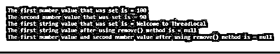

# Java 线程本地

> 原文：<https://www.educba.com/java-threadlocal/>


## Java ThreadLocal 简介

可以由同一线程读取和写入的变量可以使用 Java 中称为 ThreadLocal 类的类来创建，因此如果同一代码由两个线程执行并且该代码引用同一 ThreadLocal 的变量， 这两个线程看不到 ThreadLocal 的这些变量，因此可以通过使用 ThreadLocal 类使代码成为线程安全的，而如果不使用 ThreadLocal 类，代码将不是线程安全的，可以像使用 new 运算符在 java 中创建任何其他类的实例一样创建 ThreadLocal 类的实例。

### Java 中的 ThreadLocal 类是如何工作的？

线程本地变量由 java 中的 java.lang.ThreadLocal 类提供。这些变量不同于普通变量，因此每个线程都可以使用 get 或 set 方法来访问它们，这些线程是独立的，拥有变量的副本，并被初始化。除了编写不可变类之外，这基本上是实现线程安全的另一种方法。

<small>网页开发、编程语言、软件测试&其他</small>

不再有对象的共享，因此不需要通过同步来提高应用程序的性能和可伸缩性。Java 中的 ThreadLocal 类扩展了 class 对象。局部变量的扩展是对线程的限制，由 Java 中的 ThreadLocal 类提供。只有单个线程可以查看 ThreadLocal。彼此的线程看不到两个线程的 ThreadLocal 变量。ThreadLocal 变量属于私有字段，它在类中是静态的，状态在线程内部维护。

#### 在 Java 中创建 ThreadLocal

ThreadLocal 实例的创建方式类似于使用 new 运算符创建任何其他 java 对象实例的方式。考虑下面的语法在 Java 中创建一个 ThreadLocal:

```
private ThreadLocal variable_name = new ThreadLocal();
```

对于一个线程，创建 ThreadLocal 必须只进行一次。这些值可以由 ThreadLocal 中的多个线程设置和获取，只有由线程设置的值才能被它们自己看到。

#### 获取 Java 中的 ThreadLocal 值

可以使用 get()方法读取 ThreadLocal 中存储的值。考虑以下语法来获取 Java 中的 ThreadLocal 值:

```
String variable_name = (String) threadLocal.get();
```

#### 在 Java 中设置 ThreadLocal 值

创建后要存储在 ThreadLocal 中的值可以使用 set()方法设置。考虑使用以下语法在 Java 中设置 ThreadLocal 值:

```
threadLocal.set("value_that_needs_to_be_set");
```

#### 移除 Java 中的 ThreadLocal 值。

创建 ThreadLocal 后在其中设置的值可以删除。可以使用 ThreadLocal remove()方法移除 ThreadLocal 值。考虑以下语法来删除在 Java 中设置的 ThreadLocal 值:

```
threadLocal.remove();
```

### 实现 Java ThreadLocal 的示例

下面是提到的例子:

#### 示例#1

演示 ThreadLocal 类的 get()方法和 set()方法的程序:

**代码:**

```
//a class called demo is defined
public class Demo
{
//main method is called
public static void main(String[] args)
{
//an instance of the ThreadLocal is created for a number
ThreadLocal<Number> local = new ThreadLocal<Number>();
//an instance of the ThreadLocal is created for a string
ThreadLocal<String> val = new ThreadLocal<String>();
//setting the first number value using set() method
local.set(100);
//obtaining the current thread's value which returns a number using get() method
System.out.println("The number value that was set is = " + local.get());
//setting the second number value using set() method
local.set(90);
//obtaining the current thread's value which returns a numberusing get() method
System.out.println("The number value that was set is = " + local.get());
//setting the first string value using set() method
val.set("Welcome to ThreadLocal");
//obtaining the current thread's value which returns a stringusing get() method
System.out.println("The string value that was set is = " + val.get());
//setting the second string value using set() method
val.set("Learning is fun");
//obtaining the current thread's value which returns a stringusing get() method
System.out.println("The string value that was set is = " + val.get());
}
}
```

**输出:**


**说明:**在上面的程序中，定义了一个名为 demo 的类。然后定义主方法。然后为一个数字创建一个 ThreadLocal 实例。然后为字符串创建 ThreadLocal 的实例。然后使用 set()方法设置第一个数值。然后使用 get()方法获得返回一个数字的当前线程的值。然后使用 set()方法设置第二个数值。然后使用 get()方法获得返回一个数字的当前线程的值。然后使用 set()方法设置第一个字符串值。然后使用 get()方法获得返回字符串的当前线程的值。然后使用 set()方法设置第二个字符串值。然后使用 get()方法获得返回字符串的当前线程的值。程序的输出显示在上面的快照中。

#### 实施例 2

演示 ThreadLocal 类的 remove()方法的 Java 程序:

**代码:**

```
//a class called demo is defined
public class Demo
{
//main method is called
public static void main(String[] args)
{
//an instance of the ThreadLocal is created for a number
ThreadLocal<Number> local = new ThreadLocal<Number>();
//an instance of the ThreadLocal is created for a string
ThreadLocal<String> val = new ThreadLocal<String>();
//setting the first number value using set() method
local.set(100);
//obtaining the current thread's value which returns a number using get() method
System.out.println("The first number value that was set is = " + local.get());
//setting the second number value using set() method
local.set(90);
//obtaining the current thread's value which returns a number using get() method
System.out.println("The second number value that was set is = " + local.get());
//setting the first string value using set() method
val.set("Welcome to ThreadLocal");
//obtaining the current thread's value which returns a string using get() method
System.out.println("The first string value that was set is = " + val.get());
//Using remove() method to remove the first string value that was set using set() method
val.remove();
//obtaining the current thread's value which returns a string using get() method
System.out.println("The first string value after using remove() method is = " + val.get());
//Using remove() method to remove the first number value and second number value that was set using set() method
local.remove();
//obtaining the current thread's value using get() method
System.out.println("The first number value and second number value after using remove() method is = " + local.get());
}
}
```

**输出:**




**说明:**在上面的程序中，定义了一个名为 demo 的类。然后定义主方法。然后为一个数字创建一个 ThreadLocal 实例。然后为字符串创建 ThreadLocal 的实例。然后使用 set()方法设置第一个数值。然后使用 get()方法获得返回一个数字的当前线程的值。然后使用 set()方法设置第二个数值。然后使用 get()方法获得返回一个数字的当前线程的值。然后使用 set()方法设置第一个字符串值。

然后使用 remove()方法移除使用 set()方法设置的第一个字符串值。然后使用 get()方法获得当前线程的值，它返回 null，因为我们删除了使用 remove()方法设置的值。然后使用 remove()方法移除使用 set()方法设置的第一个数值和第二个数值。然后使用 get()方法获得当前线程的值，它返回 null，因为我们删除了使用 remove()方法设置的值。程序的输出显示在上面的快照中。

### Java 中 ThreadLocal 类的优势

*   ThreadLocal 类使多线程任务变得更容易，因为对象的状态不在线程间共享。
*   因为对象的状态不在线程间共享，所以不需要同步。
*   ThreadLocal 避免将一个对象暴露给多个线程。

### 结论

在本教程中，我们通过定义了解 ThreadLocal 类的概念，ThreadLocal 类的工作方式，并通过编程示例及其输出了解它们的方法。

### 推荐文章

这是 Java ThreadLocal 的指南。在这里我们讨论 Java ThreadLocal 的介绍，它是如何工作的，创建，优势和各自的例子。您也可以浏览我们的其他相关文章，了解更多信息——

1.  [java.net 套餐](https://www.educba.com/java-dot-net-package/)
2.  [Java 哈希码()](https://www.educba.com/java-hashcode/)
3.  [JavaScript 中的定时器](https://www.educba.com/timer-in-javascript/)
4.  Java 分区偏移


