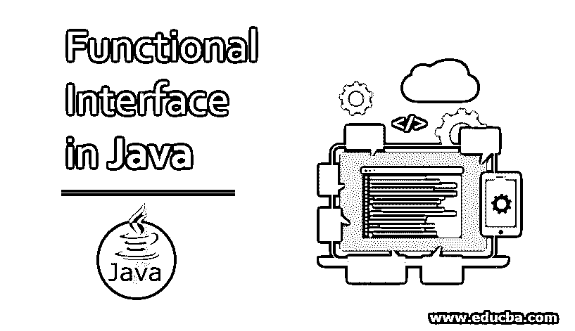
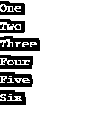

# Java 中的函数接口

> 原文：<https://www.educba.com/functional-interface-in-java/>




## Java 中的函数接口介绍

它最初是在 java 8 中引入的。函数接口可以被定义为具有单一抽象方法的接口。这意味着 java 中的函数接口只提供单一的基本功能。然而，除了一个抽象方法之外，一个函数接口可以包含静态和默认方法。java.util.function.Function、java.util.function.Predicate、UnaryOperator、BinaryOperator、Supplier、Consumer 都是 java 内置函数接口的例子。

### 功能接口的语法

下面给出了一个基本语法:

<small>网页开发、编程语言、软件测试&其他</small>

```
public interface MyFunctionalInterface(){
// abstract method
public void functionalMethod();
}
```

从上面的语法中，我们可以看到名为 MyFunctionalInterface 的接口只包含一个未实现的方法；这就是为什么它可以被认为是一个功能接口。它还可以包含静态和默认方法，如下所示:

```
public interface MyFunctionalInterface(){
public default void defaultMethod(){
// default method logic goes here
}
public static void staticMethod(){
// static method logic goes here
}
// abstract method
public void functionalMethod();
}
```

此外，可以使用 Lambda 表达式实现函数接口，如下所示:

```
MyFunctionalInterface functionalInterface = () ->{
// basic functionality logic goes here
}
```

我们还可以使用注释或者将接口声明为功能接口。下面是如何使用注释声明函数接口:

```
MyFunctionalInterface functionalInterface = () ->{
// basic functionality logic goes here
}
```

@ functional interface[是在 java 8](https://www.educba.com/whats-new-in-java-8/) 中引入的，用于在接口违反函数接口规则的情况下出现编译器级别的错误。使用@FunctionalInterface 注释声明一个接口会使一个接口具有功能性，如果使用了多个抽象方法，就会产生编译错误。

### 关于功能接口的要点

以下是一些要点:

*   一个函数接口中只允许一个抽象方法。如果@FunctionalInterface 注释没有与函数接口一起使用，那么可以声明不止一个抽象方法，但是在这种情况下，该接口将被认为是非功能性的。
*   @FunctionalInterface 批注的使用是可选的；它仅用于编译器级别的检查。
*   一个函数接口可以包含任意数量的静态和默认方法。
*   从父类重写方法不会破坏函数接口的规则。

**举例:**

```
@FunctionalInterface
public interface MyFunctionalInterface(){
// abstract method
public void functionalMethod();
@Override
public boolean equals(Object object);
//method overridden from parent class
}
```

由于上面的接口重写了父类的一个方法，并且没有声明多个抽象方法，所以可以认为它是一个函数接口。

### 实现功能接口的示例

现在我们将看到 java 代码示例，展示 java 函数接口的声明和用法。

#### 示例#1

在这个例子中，我们将展示如何使用内置函数接口 Java . util . function . function interface。下面是函数接口的声明。

**接口:**

```
package java.util.function;
public interface Function<T,R>{
public <R> apply(T inputparams);
}
```

为了使用上面的接口，我们需要在我们的类中实现它，如下所示。

**代码:**

```
import java.util.function.*;
public class FunctionalInterfaceDemo implements Function<Integer, Integer>{
@Override
public Integer apply (Integer n){
return n*n;
}
public static void main (String args[]){
FunctionalInterfaceDemo demo = new FunctionalInterfaceDemo ();
Integer sqroot= demo.apply(12);
System.out.println("Square root of 12 is " + sqroot);
}
}
```

**输出:**


#### 实施例 2

在这个例子中，我们将看到如何使用 lambda 表达式创建这些接口。

**代码:**

```
public class FunctionalInterfaceDemo{
public static void main (String args[]){
// creating functional Interface instance
Runnable r = () -> {System.out.println ("Executing Thread........");};
new Thread(r).start();
}
}
```

**输出:**


#### 实施例 3

在这个例子中，我们将看到使用另一个内置接口消费者来迭代一个列表。

**代码:**

```
import java.util.function.*;
import java.util.*;
public class FunctionalInterfaceDemo{
public static void main (String args[]){
List<String> list = new ArrayList<String>();
list.add("One");
list.add("Two");
list.add("Three");
list.add("Four");
list.add("Five");
list.add("Six");
// Iterate arraylist using consumer
list.forEach(new Consumer<String>(){
@Override
public void accept(String item){
System.out.println(item);
}
});
}
}
```

**输出:**




### 结论

上面的文章清楚地介绍了 java 中的函数接口。使用 java 8 函数接口的主要优势是对 lambda 表达式的支持，这消除了大量样板代码，从而导致开发出更小、更高效、更简洁的代码。

### 推荐文章

这是 Java 中函数接口的指南。这里我们讨论函数接口的语法和要点，以及例子和代码实现。你也可以看看下面的文章来了解更多-

1.  [Java 中的字符串缓冲类](https://www.educba.com/stringbuffer-class-in-java/)
2.  [Java 中的动态绑定](https://www.educba.com/dynamic-binding-in-java/)
3.  [Java 时期](https://www.educba.com/java-period/)
4.  [Java 流过滤器](https://www.educba.com/java-stream-filter/)


