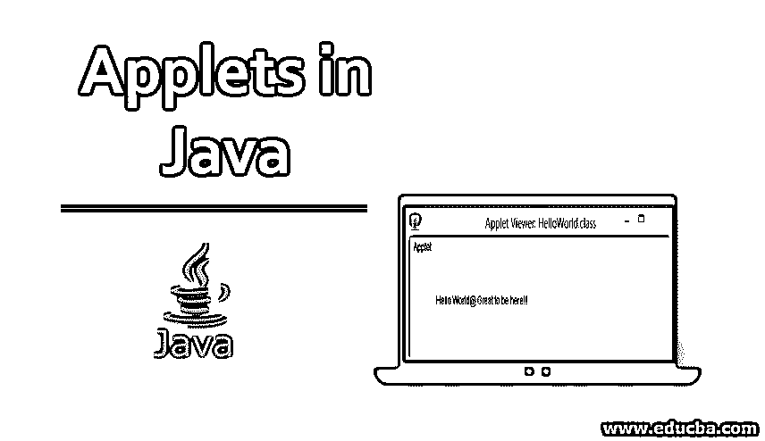
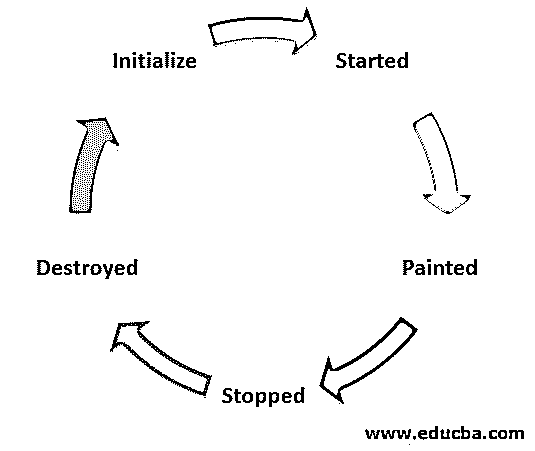
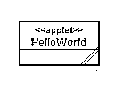
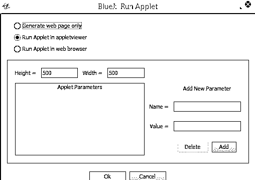
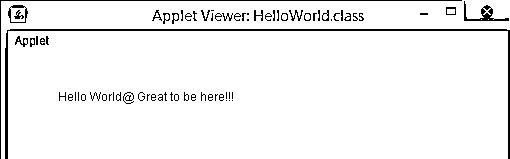
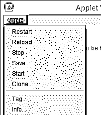
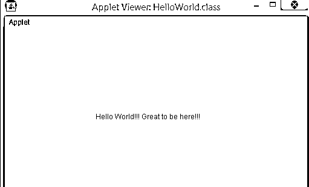

# Java 中的小程序

> 原文：<https://www.educba.com/applets-in-java/>




## Java 小程序简介

applet 是一个概念，可以在 Java 中很好地用于 web 浏览器和 web 页面的合并，以产生特定的输出。Java 中的小程序可以从简单的小程序到非常复杂的小程序。一个简单的 hello World applet 让人们看到一个基本的 Java applet 是如何工作的，并且可以在屏幕上显示出来。在本文中，我们将检查基本的 Java 小程序和另一个可以在 Java 中广泛使用的 Java 小程序，以解决现实生活中的几个问题。Java 小程序可以在现实生活中实现成其他几种编程语言，如 Python、Net 和其他代码。

### Java 小程序的生命周期

在这个阶段，我们将观察小程序的生命周期。

<small>网页开发、编程语言、软件测试&其他</small>

applet 的生命周期有五个基本阶段。




1.  初始化
2.  出发
3.  描画的
4.  停止
5.  破坏

让我们看看这 5 个阶段的作用:

*   小程序已初始化。在 init()的帮助下，用 applet 运行所需的所有变量初始化 applet。
*   小程序启动。在 Start()的帮助下，小程序被启动，在初始化阶段之后有小程序的执行。
*   小程序已绘制。使用 paint()，可以绘制和执行 applet 的基本功能。
*   小程序已停止。
*   小程序被销毁。它意味着所有的内容都从主存中移除，这是 destroy()的功能。

#### Java 小程序的工作

每当一个 applet 运行时，都有几个函数被顺序调用，以找到运行几个输出的 applet 的主要目标。

按顺序调用的函数有:

*   **Init()**= Init()是一个在程序开始时调用的函数，用来给程序分配不同的变量，并实时实现它们。
*   **Start()**–Start()通常在 init()之后调用，调用它是为了查看与 Java 代码一起出现的 HTML 屏幕。每当用户离开一个打开的 HTML 屏幕并返回时，他都从 start()开始，跳过 Init()。
*   **Paint()**–当 applet 开始执行程序时，调用 Paint()。paint()有一个称为 Graphics 的参数，Graphics g 帮助程序执行绘制不同的参数。
*   **Stop()**–当用户[离开 HTML](https://www.educba.com/what-is-html/) 文档并移动到 applet 时，Stop()被调用。Start()用于在 Stop()终止程序时重新启动它们，然后最终使程序生效。
*   **Destroy()**–当小程序必须从内存中完全删除时，调用 Destroy()。

### Java 中的小程序示例

下面是 Java 小程序的一些例子:

#### 示例#1

在编码示例中，我们将看到 Hello World 小程序的基本版本。在下图中，我们看到了一个基本的 Applet Hello World 是如何在 Bluej Java 编程平台中表示的。

[

](https://cdn.educba.com/academy/wp-content/uploads/2019/11/Applets-in-java.bmp) 

每当我们试图运行小程序时，小程序都会提供下面的屏幕，向我们显示许多选项，供我们从一系列选项中选择。在下面的屏幕中，我们可以生成一个网页，或者在 applet Viewer 中运行 Applet，或者在 web 浏览器中运行 Applet。这些是我们在 Bluej 编程平台上运行 applet 时给出的一些选项。小程序的高度和宽度也可以在框中提供，并且根据所提供的高度和宽度，小程序运行，使得不同的小程序为各种问题提供解决方案。

[

](https://cdn.educba.com/academy/wp-content/uploads/2019/11/applets-in-java1.bmp) 

现在我们来看一下示例编码和导入包的例子，以展示 Hello World 示例代码。在这个程序中，我们实现了 Applet 和 Graphics 之类的包。Graphics g 用于在 web 浏览器或所需的介质中绘制和提供输出。

**代码:**

```
import java.applet.Applet;
import java.awt.Graphics;
public class HelloWorld extends Applet
{
// Overriding paint() method
@Override
public void paint(Graphics g)
{
g.drawString("Hello World@ Great to be here!!!", 50, 50);
}
}
```

**输出:**

[

](https://cdn.educba.com/academy/wp-content/uploads/2019/11/applets-in-java2.bmp) 

示例中也给出了示例输出，在 Java applet 中，我们可以安装其他几个注释来产生其他几个输出。

**输出:**

[

](https://cdn.educba.com/academy/wp-content/uploads/2019/11/applets-in-java3.bmp) 

现在，我们可以在小程序上执行许多功能，如重启、重新加载、停止、保存启动和克隆。这些是小程序在不同阶段提供的功能。

#### 实施例 2

在下一个编码示例中，我们将看到 Java 小程序的更多方面，其中我们将看到 Java 小程序的基本功能。在下一个 Java 小程序中，我们改变了 Java 小程序的高度和宽度，并且在功能上做了一些基本的改变。写作更多地出现在中间。下面给出了一个代码示例，执行该示例以获得“Hello World”语句的打印结果。

**代码:**

```
import java.applet.Applet;
import java.awt.Graphics;
public class HelloWorld extends Applet
{
// Overriding paint() method
@Override
public void paint(Graphics g)
{
g.drawString("Hello World!!! Great to be here!!!", 150,150);
}
}
```

**输出:**

[

](https://cdn.educba.com/academy/wp-content/uploads/2019/11/applets-in-java4.bmp) 

### Java 小程序的优缺点

运行 Java 小程序有几个优点和缺点。

#### 优势

下面列出了一些优点:

*   applet 在客户端工作，因此响应时间非常短。
*   这个小程序非常安全和健壮。
*   它可以在许多操作系统下执行，如 Unix、Linux 和 macOS 操作系统。
*   applet 与 HTML、CSS 和 Javascript 相结合，为网页提供更多功能。
*   这个小程序非常容易构建，包含的冗余非常少。

#### 不足之处

小程序的一些缺点也可以在说明不使用这些小程序的支持的文档中显示。缺点是:

*   客户端需要插件来执行 applet。
*   如果没有合适的插件，就无法在客户端执行 applet。
*   制作复杂的小程序相当困难，因此是一个缺点。

### 结论

在这篇文章中，我们看到了 applet 的基本功能，applet 的生命周期，以及一些关于 applet 如何在 [Java 编程语言中运行的基本程序。](https://www.educba.com/java-programming-language-features/)可以使用 BlueJ 和其他 HTML 和 CSS 软件制作和实现非常复杂的小程序。我们更强调小程序的理论部分，而不是小程序的编程概念。

### 推荐文章

这是 Java 小程序的指南。这里我们讨论 Java 小程序的介绍、工作、生命周期以及优缺点。您也可以浏览我们推荐的其他文章，了解更多信息——

1.  Java 中的[对象](https://www.educba.com/object-in-java/)
2.  [在 Java 中覆盖](https://www.educba.com/overriding-in-java/)
3.  [Java 中的 JFrame](https://www.educba.com/jframe-in-java/)
4.  [小程序生命周期](https://www.educba.com/applet-life-cycle/)


