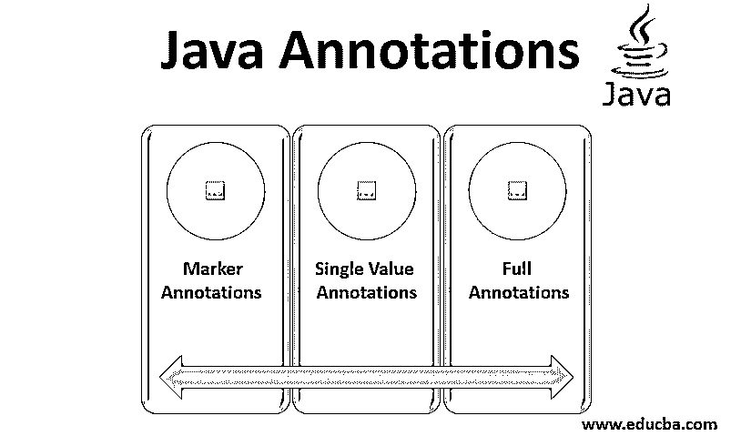
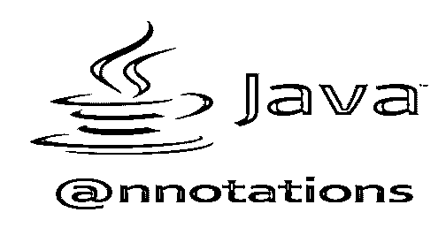
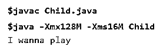
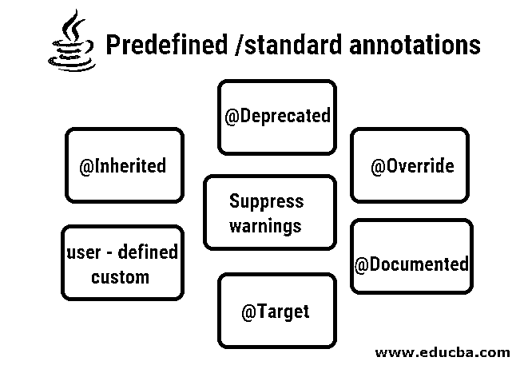
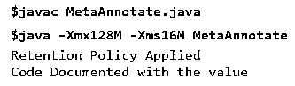
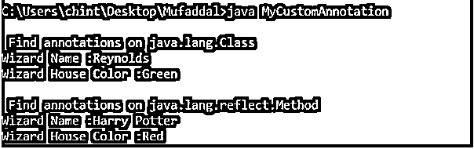

# java 注释

> 原文：<https://www.educba.com/java-annotations/>




## Java 注释简介

注释在 1.5 版本的 [Java 开发工具包](https://www.educba.com/what-is-jdk/) (JDK)中被引入或变得可用。Java 中的注释提供了关于代码结构中存在的数据的更多信息，即，它是关于数据的数据，也称为元数据。

### Java 中的注释是什么？

注释有助于以标准化的方式在代码中定义元数据。此外，注释有助于为 java 编译器提供编译 java 代码时需要遵循的指令。

<small>网页开发、编程语言、软件测试&其他</small>




当使用注释时，我们使用“@”符号，然后后跟注释的名称，这样编译器会将其视为注释。

需要注意的是，注释可以在以下操作之前添加:

*   类别声明
*   成员变量声明
*   构造函数声明
*   方法声明
*   参数声明
*   局部变量声明。

需要记住的要点是，所有注释都扩展了 Java . lang . annotation . annotation 接口。此外，注释不能包含任何扩展子句。

### 内置 Java 注释

在 Java 中，有一些内置的批注，如@Override、@Deprecated、@SuppressWarnings，它们是为特定的目的而设计的，用于上述情况之一，例如，仅用于类或仅用于方法等。

#### 示例# 1–覆盖

**代码:**

```
class Dad {
public void say() {
System.out.println("Do your homework");
}
}
public class Child extends Dad {
@Override
public void say(){
System.out.println("I wanna play");
}
public static void main(String args[]){
Dad daddy = new Child();
daddy.say();
}
}
```

**输出:**




#### 示例 2–已弃用

**代码:**

```
public class Outdated
{
@Deprecated
public void oldShow()
{
System.out.println("This Method is deprecated");  }
public static void main(String args[])
{
Outdated  od = new Outdated ();
od.oldShow();
}
}
```

**输出:**





### 元注释

有五种类型的元注释:

1.  **Documented–**它通知使用该注释的成员、变量或类需要由 Javadoc 或任何其他可用的类似工具进行记录。
2.  **Target–**用于指定使用哪种类型的注释。它通常与您的自定义注释一起使用。
3.  **Inherited–**它标记要被子类继承的注释。
4.  **Retention–**表示带注释类型的注释将保留多长时间。它采用保留策略参数，该参数的可能值为:SOURCE、CLASS 和 RUNTIME。
5.  **Repeatable–**这表明它注释的声明的注释类型是可重复的。

**示例–记录和保留**

**代码:**

```
import java.lang.annotation.*;
@Retention(RetentionPolicy.RUNTIME)
@interface RSample {
String rentent();
}
@Documented
@interface DSample {
String doc();
}
public class MetaAnnotate {
public static void main(String arg[])
{
new MetaAnnotate().rentent();
new MetaAnnotate().doc();
}
@RSample (rentent="Meta Info R")
public void rentent() {
System.out.println("Retention Policy Applied");
}
@DSample(doc="Meta Info D")
public void doc() {
System.out.println("Code Documented with the value");
}
}
```

**输出:**




**说明:**

*   保留策略。RUNTIME–该值指定注释值应该在运行时可用于通过 java 反射进行检查。
*   运行 Javadoc 命令查看代码的文档。

### 注释的类型

有三类注释，如下所示:

**1。标记注释–**这些类型的注释用作声明，通知开发人员下面的函数或类是关于什么的，例如，它共享关于该函数或类的额外信息，如该函数是否覆盖另一个函数或该函数是否被弃用等。@Override、@Deprecated 被视为标记注释。

**示例:** DemoAnnotation()

**2。单值注释–**这种注释接受 Value 来指定注释位于其前面的成员的值，因此不需要指定该成员的名称。

**示例:**演示注释(" custId123 ")

**3。完整注释—**这种注释接受多个值、对和成员。

**示例:**demo annotation(category = " Toys "，value=1500)

### 习惯

自定义注释是由用户界面创建的，后跟注释名称，我们将在下面的示例中看到。

**文件 1:自定义注释定义**

```
import java.lang.annotation.ElementType;
import java.lang.annotation.Retention;
import java.lang.annotation.RetentionPolicy;
import java.lang.annotation.Target;
@Target({ElementType.TYPE, ElementType.METHOD})
@Retention(RetentionPolicy.RUNTIME)
@interface Magicians
{
String Wizard() default "Reynolds";
String House() default "Green";
}
@Magicians
public class Magician
{
@Magicians(Wizard = "Harry Potter", House = "Red")
public String getString()  {  return null; }
}
```

**文件 2:调用自定义注释类**的主类

```
import java.lang.annotation.Annotation;
import java.lang.reflect.AnnotatedElement;
import java.lang.reflect.Method;
public class MyCustomAnnotation
{
public static void main(String[] args) throws NoSuchMethodException, SecurityException
{
new Magician();
Class<Magician> magic = Magician.class;
readAnnotationOn(magic);
Method method = magic.getMethod("getString", new Class[]{});
readAnnotationOn(method);
}
static void readAnnotationOn(AnnotatedElement element)
{
try
{
System.out.println("\n Find annotations on " + element.getClass().getName());
Annotation[] annotations = element.getAnnotations();
for (Annotation annotation : annotations)
{
if (annotation instanceof Magicians)
{
Magicians mData = (Magicians) annotation;
System.out.println("Wizard Name :" + mData.Wizard());
System.out.println("Wizard House Color :" + mData.House());
}
}
} catch (Exception e)
{
e.printStackTrace();
}
}
}
```

**输出:**




### 结论

在本文中，我们通过示例了解了什么是 java 注释及其类型，我们看到了 java 提供的内置注释的示例，并编写了我们的自定义注释。我们看到注释对标准化代码很有用，也有助于更好地理解代码及其结构。

### 推荐文章

这是 Java 注释指南。这里我们讨论基本概念，如何用给定的例子和输出内置 java 注释。您也可以看看以下文章，了解更多信息–

1.  [Java 中的变量](https://www.educba.com/variables-in-java/)
2.  [Java 中的模式](https://www.educba.com/patterns-in-java/)
3.  [最佳 Java 编译器](https://www.educba.com/best-java-compilers/)
4.  [Java 中的 instance of](https://www.educba.com/instanceof-in-java/)


