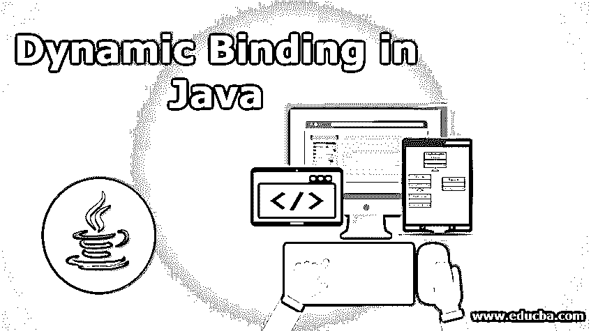
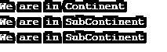

# Java 中的动态绑定

> 原文：<https://www.educba.com/dynamic-binding-in-java/>




## Java 动态绑定简介

“动态”是指“运行时”，“绑定”是指“关联”。因此术语动态绑定表示 java 虚拟机对[对象的运行时关联。这里我们将看到 Java 是如何在运行时实现动态绑定的，这意味着在代码最终运行之前，但在编译之后。](https://www.educba.com/java-virtual-machine/)

**语法:**对于 java 中的动态绑定，你要遵循 Java 的基本语法，带注释。您可以在这里使用@Override 注释来指出我们具体想要覆盖哪个方法。

<small>网页开发、编程语言、软件测试&其他</small>

### 动态绑定在 Java 中是如何工作的？

[运行时多态性通过方法覆盖在 Java](https://www.educba.com/runtime-polymorphism-in-java/) 中工作。[当对象拥有与其父类相同的方法名、参数和类型，但功能不同时，方法覆盖就会发生](https://www.educba.com/method-overriding-in-java/)。如果一个子类包含这种类型的方法，我们称之为覆盖方法。

#### 为什么叫动态绑定？

之所以这样命名，是因为该方法的功能是由 JVM 根据对象在运行时动态决定的。它也被称为“运行时多态性”。当我们通过子类的父类型引用来调用子类的被覆盖的方法时(这种现象在 java 中被称为“向上转换”)，那么对象的类型指示将调用哪个方法或功能。在编译代码之后，JVM 在运行时做出这个决定。因此，它被称为运行时多态性。它也被称为“后期绑定”，因为方法和对象的绑定，这意味着哪个对象的方法的功能将被显示，是后期决定的，即在编译之后。

**关于动态绑定的规则**

*   子类和父类的方法或函数必须具有相同的名称。
*   子类和父类的方法或函数必须有相同的参数。
*   继承关系是强制性的(IS-A 关系)。

**动态绑定的限制**

*   您不能重写父类的私有方法。
*   您不能重写 Final 方法。
*   您不能重写静态方法。

### 实现动态绑定的示例

我们将在这里讨论一些动态绑定的代码示例:

#### 示例#1

在这个例子中，我们将展示 locate()方法如何根据它所关联的对象类型显示不同的消息。当它与“大陆”类型相关联时，它显示来自父类的消息。当它与“次大陆”类型相关联时，它显示来自子类的消息。

**代码:**

```
class Continent {
public void locate () {
System.out.println("We are in Continent");
}
}
class SubContinent extends Continent {
@Override
public void locate () {
System.out.println("We are in SubContinent");
}
}
public class DynamicBinding {
public static void main(String args[]) {
Continent superObject = new Continent ();
superObject.locate(); //method of super class or parent class is called
SubContinent subObject = new SubContinent (); // upcasting
subObject.locate();//method of sub class or child class is called by Parent reference, this is called "Dynamic Binding"
SubContinent subObject2 = new SubContinent ();
subObject2.locate(); //method of sub class or child class is called
}
}
```

**输出:**




#### 实施例 2

让我们以[多级继承](https://www.educba.com/multilevel-inheritance-in-c-plus-plus/)的情况下的动态绑定为例。在这个例子中，我们考虑了两个层次的继承。在这个例子中，我们将展示方法 identifies()是如何根据它所关联的对象类型来显示不同的消息的。当它与“计算机”类型相关联时，它显示来自父类的消息。当它与“桌面”类型相关联时，它显示来自其子类的消息。同样，在第二级继承中，当与“Laptop”类型相关联时，它显示来自其父类“Desktop”的子类的消息。

**代码:**

```
class Computer {
void identify() {
System.out.println("This is Computer");
}
}
class Desktop extends Computer {
void identify (){
System.out.println("This is Desktop");
}
}
class Laptop extends Desktop {
void identify (){
System.out.println("This is Laptop");
}
}
public class DynamicBinding {
public static void main(String args[]){
Computer superObject=new Computer ();
Computer subObject=new Desktop (); // // upcasting : first level of heritance
Computer babyObject=new Laptop (); // // upcasting : second level of heritance
superObject.identify ();
subObject.identify (); //run time polymorphism happening in first level of heritance
babyObject.identify (); //run time polymorphism happening in second level of heritance
}
}
```

**输出:**


#### 实施例 3

让我们举另一个运行时多态性的例子，在多级继承的[情况下。在这个例子中，我们考虑了三个层次的继承。在这个例子中，我们将展示方法 feature()是如何根据它所关联的对象类型来显示不同的特性的。当它与“化妆品”类型相关联时，它显示来自父类的消息。当它与“香水”类型相关联时，它显示来自其子类的消息。同样，在继承的第二层，当与“Deo”类型相关联时，它显示来自其父类“香水”类的子类的消息。同样，在第三级继承中，当与“DeoStick”类型相关联时，它显示来自其父类“Deo”类的子类的消息。](https://www.educba.com/multilevel-inheritance-in-java/)

**代码:**

```
class Cosmetics{
void feature() {
System.out.println("Cosmetics are expensive");
}
}
class Perfume extends Cosmetics {
void feature(){
System.out.println("Perfume is soothing");
}
}
class Deo extends Cosmetics {
void feature(){
System.out.println("Deo is sometimes better than perfume");
}
}
class DeoStick extends Deo{
void feature(){
System.out.println("DeoStick is very handy");
}
}
public class RunTimePolymorphism {
public static void main(String args[]){
Cosmetics superObject=new Cosmetics ();
Cosmetics subObject=new Perfume(); // child object type : first level of heritance
Cosmetics sub2Object=new Deo(); // child object type : second level of heritance
Cosmetics sub3Object=new DeoStick(); // child object type : third level of heritance
superObject.feature();
subObject.feature(); //run time polymorphism happening in first level of heritance
sub2Object.feature(); //run time polymorphism happening in second level of heritance
sub3Object.feature(); //run time polymorphism happening in third level of heritance
}
}
```

**输出:**


### 结论

我们对主题“Java 中的动态绑定”的学习到此结束。在 java 编译器中自己编写上述[示例中提到的代码，并验证输出。如果你不自己写代码，对代码的学习将是不完整的。](https://www.educba.com/best-java-compilers/)

### 推荐文章

这是一个 Java 动态绑定的指南。这里我们讨论 java 中动态绑定的语法、规则、限制和例子。您也可以阅读以下文章，了解更多信息——

1.  [Java 中的静态构造函数](https://www.educba.com/static-constructor-in-java/)
2.  [Java 中的关联](https://www.educba.com/association-in-java/)
3.  [Java StringJoiner](https://www.educba.com/java-stringjoiner/)
4.  [Java URLConnection](https://www.educba.com/java-urlconnection/)


