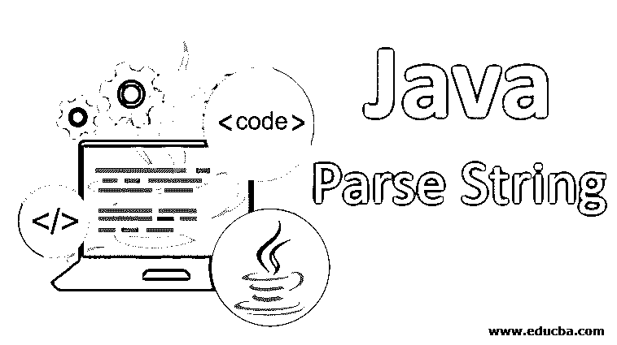
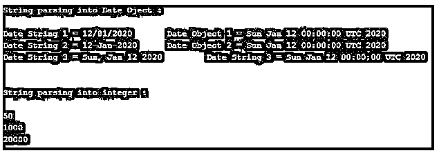
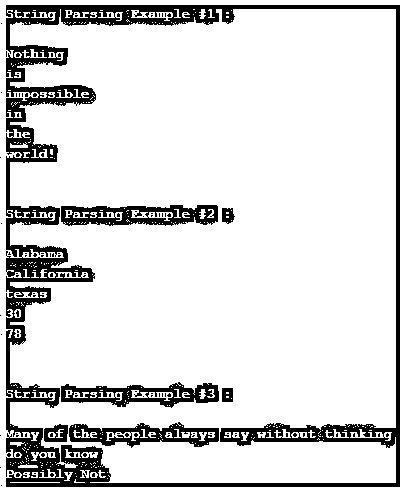
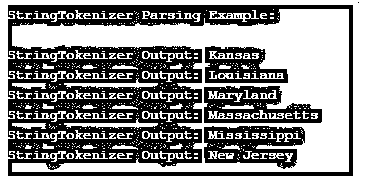

# Java 解析字符串

> 原文：<https://www.educba.com/java-parse-string/>




## Java 解析字符串简介

在 java 中解析字符串就是将文件、用户输入或某个网络中的数据转换成字符串格式。解析字符串是获取字符串格式所需信息的过程。java 中的字符串解析可以通过使用包装类来完成。使用 split 方法，通过将分隔符传递给 Split 方法，可以将字符串转换为数组。split 方法是包装类的方法之一。

字符串解析也可以通过 StringTokenizer 完成。StringTokenizer 类允许其构造函数将字符串分成标记。StringTokenizer 比其他类简单得多。StringTokenizer 是一个遗留类，所以每个人都必须避免使用这个类。

<small>网页开发、编程语言、软件测试&其他</small>

**语法**:

```
String strMsg    = "An Example of String";
String delims  = "[delimiters]+";
String tokenString = strMsg.split(delims);
```

在上面的语法中，可以在方括号内使用多个分隔符。括号后的“+”号将多个分隔符视为单个分隔符。

### 解析字符串的初始化

在 java 中，字符串可以转换成 char、Object、int、date、time 等。字符串解析由特定的 java 类方法根据所需的数据类型进行初始化。

#### 示例#1

在这个例子中，我们可以看到 String 是如何被解析成不同类型的格式，比如 date & integer。同样，我们可以使用其他方法将字符串转换成其他格式。

**代码:**

```
import java.text.SimpleDateFormat;
import java.util.Date;
public class StringParsingInDiffTypeExample {
public static void main(String[] args)throws Exception {
System.out.println("String parsing into Date Oject : \n");
String strDate1 = "12/01/2020";
String strDate2 = "12-Jan-2020";
String strDate3 = "Sun, Jan 12 2020";
//converting date format into the date object here
SimpleDateFormat strFormat1 = new   SimpleDateFormat("dd/MM/yyyy");
SimpleDateFormat strFormat2 = new SimpleDateFormat("dd-MMM-yyyy");
SimpleDateFormat strFormat3 = new SimpleDateFormat("E, MMM dd yyyy");
//date retrieving here after parsing through parse method
Date dateObj1 = strFormat1.parse(strDate1);
Date dateObj2 = strFormat2.parse(strDate2);
Date dateObj3 = strFormat3.parse(strDate3);
//printing here the date as a char
System.out.println("Date String 1 = " + strDate1 + "\t Date Object 1 = " + dateObj1);
System.out.println("Date String 2 = " + strDate2 + "\t Date Object 2 = " + dateObj2);
System.out.println("Date String 3 = " + strDate3 + "\t Date String 3 = " + dateObj3);
System.out.println("\n\nString parsing into integer : \n");
String strVal1 = "50";
String strVal2 = "1000";
String strVal3 = "20000";
//Converting String into int using parseInt()
int intValue1 = Integer.parseInt(strVal1);
int intValue2 = Integer.parseInt(strVal2);
int intValue3 = Integer.parseInt(strVal3);
//Printing integer value
System.out.println(intValue1);
System.out.println(intValue2);
System.out.println(intValue3);
}
}
```

**输出**:

上面给出的程序的输出如下:我们可以看到如何使用不同的方法将字符串转换成不同的数据类型。




#### 实施例 2

在这个例子中，使用 split 方法将字符串解析为数组格式。

**代码:**

```
public class SplitMethodExample{
public static void main(String args[]){
System.out.println("String Parsing Example #1 :\n");
//In this example one space character is used as a delimiter
String str1 = new String("Nothing is impossible in the world!");
String delimSpace = " ";
String[] arr1  = str1.split(delimSpace);
for (String uniqVal1 : arr1) {
System.out.println(uniqVal1);
}
System.out.println("\n\nString Parsing Example #2 :\n");
//In this example a comma is used as a delimiter
String str2 = new String("Alabama,California,texas,30,78");
String delimsComma = "[,]+";
String[] arr2  = str2.split(delimsComma);
for (String uniqVal2 : arr2) {
System.out.println(uniqVal2);
}
System.out.println("\n\nString Parsing Example #3 :\n");
//In this example multiple delimiter is used used as a delimiter
String str3 = new String("Many of the people always say without thinking ,do you know ?Possibly Not!");
String delims = "[.,?!]+";
String[] arr3  = str3.split(delims);
for (String uniqVal3 : arr3) {
System.out.println(uniqVal3);
}
}
}
```

**输出:**

上面给出的例子包含三个部分，所有这三个部分使用不同的分隔符来解析字符串。在下面给出的截图中，我们可以看到上面给出的程序的输出。




#### 实施例 3

在本例中，StringTokenizer 类用于解析。StringTokenizer 类的构造函数有两个参数:第一个是字符串，第二个是分隔符。这个类包含一些方法，比如 hasMoreElements()检查下一个索引是否包含任何值，而 nextElement()返回下一个索引的值。

**代码:**

```
import java.util.StringTokenizer;
public class StringTokenizerParsingExample {
public static void main(String[] args) {
System.out.println("StringTokenizer Parsing Example: \n");
String strText = "Kansas,Louisiana,Maryland,Massachusetts,Mississippi,New Jersey";
String delims = ",";
StringTokenizer stObj = new StringTokenizer(strText, delims);
//Iterating here for the next element
while (stObj.hasMoreElements()) {
System.out.println("StringTokenizer Output: " + stObj.nextElement());
}
}
}
```

**输出** **:**

上面的解析输出如下所示；我们可以看到逗号分隔的值是如何在下一列中列出的。



#### 实施例 4

这个例子展示了如何有效地使用 indexOf 方法来解析 java 中的任何字符串。在这个程序中，句子中间的一个字符串被转换成大写。

**代码:**

```
public class StringParsingExample{
public static void main(String args[]){
String strPara = "The Paragraph needs additional citations for [verification]";
int openIndex           = strPara.indexOf("[");
int closedIndex = strPara.indexOf("]");
// extracting here the String inside of the square bracket
String subString = strPara.substring(openIndex+1, closedIndex);
//converting substring in the uppercase which is inside of
subString= subString.toUpperCase();
// concating here all the substrings
String modifiedPara =  strPara.substring(0, openIndex + 1) +   subString  +  strPara.substring(closedIndex);
System.out.println(modifiedPara);
}
}
```

**输出** **:** 上述程序的输出如下。


#### 实施例 5

在这个例子中，我们可以看到一个字符串如何被转换成一个字符数组。

**代码:**

```
public class StringParsingCharExample {
public static void main(String[] args) {
String strText = "Australia";
char[] charArr = strText.toCharArray();
System.out.println(charArr.length);
char secondPosChar = strText.charAt(2);
System.out.println(secondPosChar);
char[] charSet = new char[9];
strText.getChars(0, 9, charSet, 0);
for (char uniqChar : charSet) {
System.out.println(uniqChar);
}
}
}
```

**输出:**
上述程序的输出如下。


在附加的输出截图中，我们可以看到如何使用方法 toCharArray()将字符串转换为字符数组。

### 结论–Java 解析字符串

在上面给出的文章中，我们已经讨论了解析、Java 中的字符串解析等等。split 方法如何在分析数据类型时发挥作用。还可以使用其他一些方法进行解析，比如 StringTokenizer。

### 推荐文章

这是一个 Java 解析字符串的指南。这里我们讨论 Java 解析字符串的语法和初始化。您也可以看看以下文章，了解更多信息–

1.  [Java 中的控制语句](https://www.educba.com/control-statement-in-java/)
2.  PHP 中的[字符串](https://www.educba.com/string-in-php/)
3.  [Java 本地时间](https://www.educba.com/java-localtime/)
4.  [JavaScript parseInt](https://www.educba.com/javascript-parseint/)


