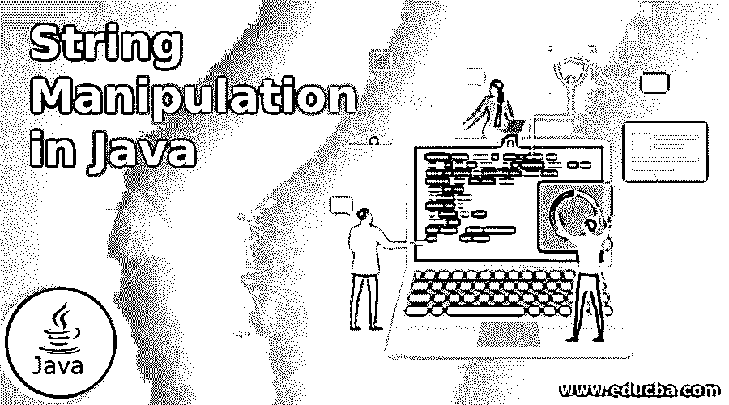
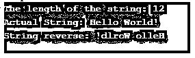

# Java 中的字符串操作

> 原文：<https://www.educba.com/string-manipulation-in-java/>




## Java 中的字符串操作简介

对于任何编程语言来说，字符串操作都是非常常见的事情。Java 是一种编程语言，其中我们可以看到大量的内置函数来实现我们的字符串操作目的。你可以在 Java 编程中做各种事情，比如获取字符串的长度、查找字符串中的字符、字符串连接、获取子字符串、字符串修改等等。我们也可以改变给定字符串的大小写；这也是字符串操作的一部分。我们有一些内置函数来处理这个问题。

### 它是如何工作的？

Java 编程语言提供了一个庞大的字符串操作函数列表，我们可以根据业务需求使用这些函数。我们可以用很多方法来操作一个字符串。

<small>网页开发、编程语言、软件测试&其他</small>

下面给出了操纵字符串的不同方法:

**1。字符串连接:**假设我们有两个单独的字符串。我们希望这两个字符串连接成一个。为此，我们可以简单地使用传统的方法(+操作符)。

```
String str1= "Hello";
String str2 = "India";
String finalResult = str1+" "+str2;
```

**2。改变给定字符串的大小写:**我们可以通过使用 toLowerCase()和 toUpperCase() Java 内置函数随时改变字符串的大小写。

**3。字符串内部的子字符串:**我们在 Java 中有一个 Contain()方法来处理字符串内部的字符串检查。我们可以使用这个函数来检查一个定义的字符串中的字符序列。我们也可以使用 Java 的 substring()。

**4。清理字符串中不需要的字符:**为此，我们可以使用 Java trim()函数。这个函数可以用来删除给定字符串开头和结尾的空格。

**5。字符串反转:**字符串反转也是字符串操作的一部分。这是关于从最后一个索引到第一个索引的字符串。例如，我们有“你好，世界！”，此字符串的反码将是“！dlroW olleH”。

**语法:**

**1。toLowerCase()**

```
public String toLowerCase();
```

这个函数将给定字符串的大小写改为小写。我们可以在 string 的时候使用这个函数来处理 compareTo()函数本身的忽略情况。

**2。toUpperCase()**

```
public String toLowerCase();
```

该函数与 toLowerCase()保持相同，但它将大小写改为大写。

**3。子串()**

```
String substring(int StartIndex, int LastIndex)
```

在示例代码区域，我们将看到这个函数的使用，它将索引作为输入，也作为输出。为此，我们需要一个字符串来执行这个操作。我们可以用我们想要的字符串的位置来代替 StartIndex，我们可以用我们想要的字符串的结束索引来代替 LastIndex。

**4。trim()**

```
public String trim()
```

同样，这是一个字符串操作函数，我们可以用它来删除给定字符串中不需要的空格。

### Java 中字符串操作的例子

下面是一些例子:

#### 示例#1

同时使用 toLowerCase()和 compareTo()。

这是 Java 编程语言中最基本的字符串比较功能之一。如果我们将有相同的字符串，但不同的情况下，它将不会被认为是平等的。为了用 compareTo()函数处理这个问题，我们可以使用 toLowerCase()函数在比较之前将两个字符串的大小写都改为小写。

**代码:**

```
public class StrCompare {
public static void main(String[] args) {
String string1 = "Hello";
String string2 = "hello";
String string3 = string1.toLowerCase();
String string4 = string2.toLowerCase();
int i = string3.compareTo(string4);//0 for both are equal
if(i==0){
System.out.println("Both strings are equal.");
}else{
System.out.print("Strings are not equal.");
}
}
}
```

**输出:**


#### 实施例 2

字符串连接——我们将使用+运算符来处理这个问题。

**代码:**

```
public class StrConcat {
public static void main(String[] args) {
String str1= "Hello";
String str2 = "World";
String result = str1+" "+str2;
System.out.print(result);
}
}
```

**输出:**


#### 实施例 3

获取字符串的长度，并以相反的顺序一个字符一个字符地打印出来。

有了长度之后，我们可以从字符串的最后一个位置到字符串的 0 位置逐字符读取字符串。换句话说，我们将看到给定字符串的反向字符串。

**代码:**

```
public class StrLenght {
public static void main(String[] args) {
String str1= "Hello World!";
System.out.println("The length of the string: "+ str1.length());
System.out.println("Actual String: "+str1);
System.out.print("String reverse: ");
for(int i = str1.length()-1; i>=0; i--){
System.out.print(str1.charAt(i));
}
}
}
```

**输出:**




#### 实施例 4

从给定的字符串中获取子字符串。

**代码:**

```
public class SubString {
public static void main(String[] args) {
String str1= "Lorem ipsum dolor sit amet, consectetur adipiscing elit.";
System.*out*.println(str1.substring(0,10)); // this will give the string from index 0 to 10
System.*out*.println(str1.substring(10)); // this will give the string from index 10 to the end of the string
}
}
```

**输出:**


### 结论

在 Java 编程中，我们可以使用 Java 编程中可用的工具和技术来执行各种字符串操作。最好使用内置函数。我们有一个庞大的内置函数列表来处理这个问题——replace()、replaceFirst()、toLowerCase()、toUpperCase()、split()、substring()、length()函数等等。

### 推荐文章

这是 Java 中字符串操作的指南。这里我们讨论介绍，它是如何工作的和例子。您也可以看看以下文章，了解更多信息–

1.  [Java 队列接口](https://www.educba.com/java-queue-interface/)
2.  [Java 中的快速排序](https://www.educba.com/quick-sort-in-java/)
3.  [Java 中的构造函数和析构函数](https://www.educba.com/constructor-and-destructor-in-java/)
4.  [Java 缓冲器](https://www.educba.com/java-bufferedreader/)


