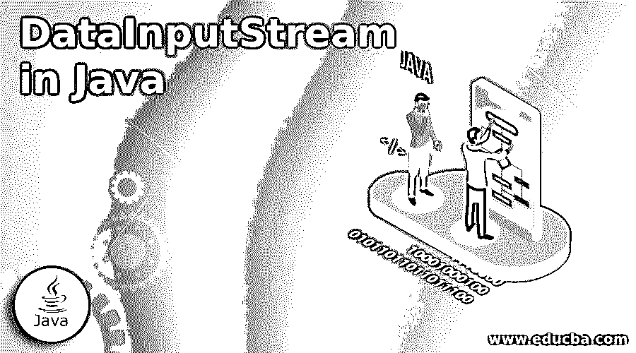
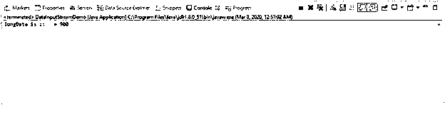
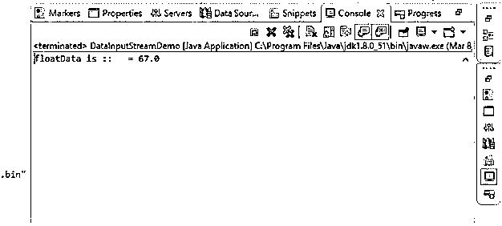
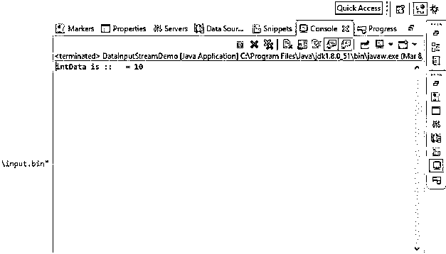
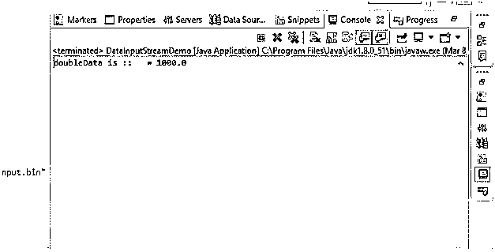
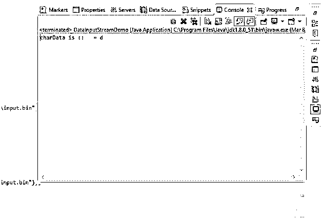

# Java 中的 DataInputStream

> 原文：<https://www.educba.com/datainputstream-in-java/>




## Java 中的 DataInputStream 简介

在 java 中，我们使用 dataInputsream 来读取原始数据类型。它读取数字而不是字节，这就是它被称为 dataInputstream 原因。在 java 中，它位于 Java.io 包中。我们的 java 原语类包括 int、long、float 等。，我们从输入流中读取这个原语。我们在 Java 中使用这个 DataInputStream 来读取 dataOutputStream 写入的数据。

**语法**

<small>网页开发、编程语言、软件测试&其他</small>

```
public class DataInputStream extends FilterInputStream implements DataInput{}
```

上面是 fordataInputsream 的类声明。它实现了各种类和接口。下面提到了由 dataInputsream 扩展和实现的各种类和接口:

**从父级到子级的顺序:**

*   目标
*   输入流
*   过滤器输入流
*   数据输入流

**各种接口如下:**

*   可自动关闭
*   数据输入
*   可关闭的

### DataInputStream 在 Java 中是如何工作的？

Java 中的 DataInputStream 有下面的构造函数，它有一个参数。这个参数就是我们要从中读取数据的 inputStream。下面是构造函数工作原理的详细信息:

*   DataInputStream(InputStream in):如果我们使用这个构造函数在 Java 对象中创建 DataInputStream，那么我们需要将 InputStream 作为参数传递。在 java 中，DataInputStream 扩展了 InputStream 类，因此它是 InputStream 的子类，因此 data InputStream 可以使用父类中所有可用的方法。

*   如果我们想使用 dataInpuutStream，我们首先需要为此创建对象:

```
DataInputStream dataInputStream = new DataInputStream(new FileInputStream("your_data"));
```

在上面的例子中，我们使用构造函数为 Java 中的 DataInputStream 创建了一个对象，在这里我们可以传递我们想要读取数据的 InputStream。

*   这个类有 readByte()方法，通过它我们可以读取数据。

```
DataInputStream ds = new DataInputStream(new FileInputStream("your_data"));
ds.readByte();
```

*   通过使用这个方法，我们可以从上面传递的 inputstream 中读取数据。下面是在 java 中使用 dataInputStream 的简单语法:

```
DataInputStreamdataInputStream = new DataInputStream(newFileInputStream("file_name"));
doubletoreadDouble = input.readDouble();
inttoread   = input.read();
float  toreadFloat  = input.readFloat();
inttoreadInt   = input.readInt();
input.close();
```

在上面的简单语法中，我们了解了如何使用这个类来读取 java 中的基本类型(int、float、long、double 等)。).第一步很简单，我们只需创建对象并传递我们的 inputStream，在构建方法中使用 java 来读取数据，如 int、float、double 和一个名为 read()的单独方法。Java 中的 DataInputStream 总是与 DataOuputStream 一起使用，因为它用于写入我们的数据。该类还包含用于将数据写入文件的各种方法。它有特定于 int、double、float 等的方法。反之亦然。我们也有从文件中读取原始类型数据的方法。

### 用 Java 实现 DataInputStream 的示例

它有各种方法从输入流中读取数据，以读取原始类型的对象，如 int，float，double，float，Boolean 等。下面举例说明这些方法:

#### 示例#1

LongreadLong():这个方法用于从 inpputstream 中读取 long 基本类型。

**代码:**

```
package com.cont.article;
import java.io.DataInputStream;
import java.io.DataOutputStream;
import java.io.FileInputStream;
import java.io.FileOutputStream;
import java.io.IOException;
public class DataInputStreamDemo {
public static void main(String[] args) throws IOException {
DataOutputStream dataOut =
new DataOutputStream(
new FileOutputStream("I:\\content_article\\MAR_2020\\file\\input.bin"));
// here we are writing long to file.
dataOut.writeLong(900);
// close file.
dataOut.close();
// To read data from file
DataInputStream dataInputStream =
new DataInputStream(
new FileInputStream("I:\\content_article\\MAR_2020\\file\\input.bin"));
long  longData    = dataInputStream.readLong();
dataInputStream.close();
System.out.println("longData is ::   = " + longData);
}
}
```

**输出:**




#### 实施例 2

float readFloat():这个方法用于从提供的输入流文件中读取 float 原语类型。

**代码:**

```
package com.cont.article;
import java.io.DataInputStream;
import java.io.DataOutputStream;
import java.io.FileInputStream;
import java.io.FileOutputStream;
import java.io.IOException;
public class DataInputStreamDemo {
public static void main(String[] args) throws IOException {
DataOutputStream dataOut =
new DataOutputStream(
new FileOutputStream("I:\\content_article\\MAR_2020\\file\\input.bin"));
// here we are writing float to file.
dataOut.writeFloat(67.00F);
// close file.
dataOut.close();
// To read data from file (float)
DataInputStream dataInputStream =
new DataInputStream(
new FileInputStream("I:\\content_article\\MAR_2020\\file\\input.bin"));
float floatData = dataInputStream.readFloat();
dataInputStream.close();
System.out.println("floatData is ::   = " + floatData);
}
}
```

**输出:**




#### 实施例 3

IntreadInt():这个方法用于从 inpputstream 文件中读取 int 值。

**代码:**

```
package com.cont.article;
import java.io.DataInputStream;
import java.io.DataOutputStream;
import java.io.FileInputStream;
import java.io.FileOutputStream;
import java.io.IOException;
public class DataInputStreamDemo {
public static void main(String[] args) throws IOException {
DataOutputStream dataOut =
new DataOutputStream(
new FileOutputStream("I:\\content_article\\MAR_2020\\file\\input.bin"));
// here we are writing int to file.
dataOut.writeInt(10);
// close file.
dataOut.close();
// To read data from file (int)
DataInputStream dataInputStream =
new DataInputStream(
new FileInputStream("I:\\content_article\\MAR_2020\\file\\input.bin"));
int intData = dataInputStream.readInt();
dataInputStream.close();
System.out.println("intData is ::   = " + intData);
}
}
```

**输出:**




#### 实施例 4

double readDouble():这个方法用于从输入流中读取 double 原语类型。

**代码:**

```
package com.cont.article;
import java.io.DataInputStream;
import java.io.DataOutputStream;
import java.io.FileInputStream;
import java.io.FileOutputStream;
import java.io.IOException;
public class DataInputStreamDemo {
public static void main(String[] args) throws IOException {
DataOutputStream dataOut =
new DataOutputStream(
new FileOutputStream("I:\\content_article\\MAR_2020\\file\\input.bin"));
// here we are writing double to file.
dataOut.writeDouble(1000);
// close file.
dataOut.close();
// To read data from file (double)
DataInputStream dataInputStream =
new DataInputStream(
new FileInputStream("I:\\content_article\\MAR_2020\\file\\input.bin"));
double doubleData = dataInputStream.readDouble();
dataInputStream.close();
System.out.println("doubleData is ::   = " + doubleData);
}
}
```

**输出:**




#### 实施例 5

char readChar():这个方法用于从 inpputstream 中读取 char 原语。请参见下面的示例:

**代码:**

```
package com.cont.article;
import java.io.DataInputStream;
import java.io.DataOutputStream;
import java.io.FileInputStream;
import java.io.FileOutputStream;
import java.io.IOException;
public class DataInputStreamDemo {
public static void main(String[] args) throws IOException {
DataOutputStream dataOut =
new DataOutputStream(
new FileOutputStream("I:\\content_article\\MAR_2020\\file\\input.bin"));
// here we are writing char to file.
dataOut.writeChar(100);
// close file.
dataOut.close();
// To read data from file (char)
DataInputStream dataInputStream =
new DataInputStream(
new FileInputStream("I:\\content_article\\MAR_2020\\file\\input.bin"));
char charData = dataInputStream.readChar();
dataInputStream.close();
System.out.println("charData is ::   = " + charData);
}
}
```

**输出:**




### 结论

Java 中的 DataInputStream 基本上是用来从输入流中读取数据的，我们将输入流作为参数作为文件传递给构造函数。它可以读取 java 中所有可用的原始数据类型。但是这不是线程安全的；为了提供线程安全，我们需要去寻找其他的。

### 推荐文章

这是一个 Java 中 DataInputStream 的指南。这里我们讨论 Java 中 DataInputStream 的介绍，它是如何工作的，以及代码和输出的例子。您也可以浏览我们的其他相关文章，了解更多信息——

1.  [Java 中的实例变量](https://www.educba.com/instance-variable-in-java/)
2.  [Java 中的非访问修饰符](https://www.educba.com/non-access-modifiers-in-java/)
3.  [Java 中的元组](https://www.educba.com/tuples-in-java/)
4.  [Java 中的文件处理](https://www.educba.com/file-handling-in-java/)


