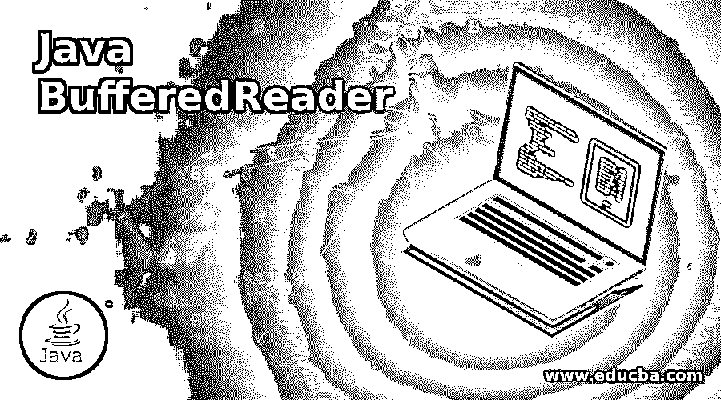
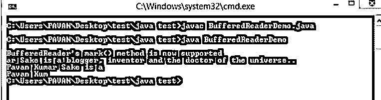
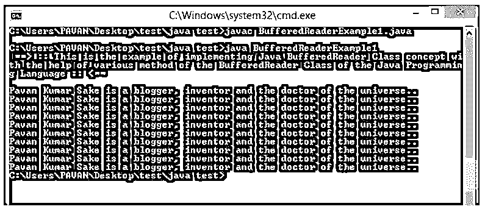

# java bufferedreader

> 原文：<https://www.educba.com/java-bufferedreader/>




## Java BufferedReader 简介

Java 编程语言的 Java BufferedReader 类涉及从字符输入流中读取文本；缓冲字符将提供最有效的字符读取、数组读取和行读取。对于读取器发出的每个读取请求，都会导致相应的请求读取，这需要由一些底层字符或一些字节流来完成。因此，现在建议在 Reader 周围包装一个 BufferedReader，reader 的 read()函数操作可能会像 inputStreamReaders 和 FileReaders 一样有一些开销。

**语法:**

<small>网页开发、编程语言、软件测试&其他</small>

```
Public class BufferedReader Extends Reader
```

### Java BufferedReader 类是如何工作的？

Java BufferedReader 类基本上只是通过读取字符输入流的文本和缓冲字符来工作，这将提供对数组、字符和行的有效读取。让 BufferedReader 类工作有几个要点。它们的缓冲区大小可以指定，也可以有一些默认的大小。它的默认大小对于大多数目的来说已经足够大了。实际使用 DataInputStream 进行某些文本输入的程序通过替换每个 data input stream 以及适当的 BufferedReader 来本地化。

### Java BufferedReader 的构造函数

下面给出了两种不同类型的构造函数:

*   BufferedReader(读入)
*   BufferedReader(Reader in，int sz)

**1。BufferedReader(Reader in):** 这个构造函数将创建一个缓冲字符输入流，它实际上被用作一个默认大小的输入缓冲区。

**2。BufferedReader(Reader in，int sz):** 这个构造函数将创建一个缓冲输入字符流，它实际上使用了某种特定大小的输入缓冲。

### Java BufferedReader 的方法

下面给出了一些方法:

**1。BufferedReader 类的 Void Close()方法:**void Close()方法将帮助关闭流或 stream，并释放实际与之关联的任何类型的系统资源。

**2。BufferedReader 类的 Void mark(int readAheadLimit)方法:**Void mark(int readAheadLimit)方法将帮助标记流中的当前位置/点。

**3。BufferedReader 类的 Boolean markSupported()方法:**Boolean mark supported()方法会告诉支持流 mark()函数操作，实际上也是这样做的。

**4。BufferedReader 的 Int read()方法:**int read()方法会读取单个字符。

**5。BufferedReader 类的 Int read(char[] cbuf，int off，int len)方法:**int read(char[]cbuf，int off，int len)方法会将字符读入某个数组部分。

**6。Java BufferedReader 类的 String readLine()方法:**string readLine()方法会根据需要读取文本行。

**7。Java BufferedReader 类的 Boolean ready()方法:**Boolean ready()方法实际上会判断特定的流是否已经准备好进行读取。

**8。Java BufferedReader 类的 Void reset()方法:**void reset()方法会这么轻松的重置流。

**9。Java BufferedReader 类的 Long skip(long n)方法:**Long skip(Long n)方法会轻松跳过字符。

### Java BufferedReader 示例

下面是提到的例子:

#### 示例#1

这是一个实现 Java BufferedReader 方法的例子。首先，使用 import 函数导入一些库。然后创建 main()来创建需要的程序。然后创建 fr1 FileReader 和 br1 BufferedReader。然后创建长度为 21 的字符数组，然后创建 IF 循环来说明 markSupported()函数/方法。同样，创建 IF 是为了说明 ready()方法。

br.skip()用于跳过 file1.txt 中文本的前 8 个字符。在 IF 循环中，演示了 readLine()方法和 read()。然后用 21 个长度创建 FOR 循环，作为打印这 21 个字符内的字符的条件。然后将打印换行符。然后举例说明 reset()方法。然后是 FOR 循环，用于说明 reset()和 read()方法。

**代码:**

```
import java.io.BufferedReader;
//importing bufferreader java library
import java.io.FileReader;
//importing FileReader java library
import java.io.IOException;
//importing IOException java library
public class BufferedReaderDemo
{
public static void main(String[] args) throws IOException
{
FileReader fr1 = new FileReader("file1.txt");
BufferedReader br1 = new BufferedReader(fr1);
char c1[]=new char[21];
if(br1.markSupported())
{
System.out.println("\nBufferedReader's mark() method is now supported");
br1.mark(101);
}
br1.skip(9);
if(br1.ready())
{
System.out.println(br1.readLine());
br1.read(c1);
for (int i = 0; i <21 ; i++)
{
System.out.print(c1[i]);
}
System.out.println();
br1.reset();
for (int i = 0; i <9 ; i++)
{
System.out.print((char)br1.read());
}
}
}
}
```

**输出:**




#### 实施例 2

这是一个实现 Java BufferedReader 类方法的例子。首先，这里包含了 java IO 函数库。然后创建一个名为“BufferedReaderExample1”的公共类，然后创建 main()函数来编写用户需要的抛出异常的代码。然后创建“fr1”变量用于文件读取(file1.txt)，然后创建“br1”变量，它是 fr1 的缓冲读取器。然后创建 int i1，再创建 WHILE 循环，实现条件不等于-1 的 read()方法/函数。在循环内部，system.out.println()用于打印 file1.txt 的所有字符。

**代码:**

```
import java.io.*;
public class BufferedReaderExample1 {
public static void main(String args[])throws Exception{
System.out.println(" ==> :: This is the example of implementing Java BufferedReader Class concept with the help of various method of the BufferedReader Class of the Java Programming Language :: <== \n");
FileReader fr1=new FileReader("file1.txt");
BufferedReader br1=new BufferedReader(fr1);
int i1;
while((i1=br1.read())!=-1){
System.out.print((char)i1);
}
br1.close();
fr1.close();
}
}
```

**输出:**




### 结论

在本文中，我们看到了 BufferedReader 类的定义及其语法、java BufferedReader 类的工作方式、java BufferedReader 类的构造函数、java BufferedReader 类的方法以及一些示例。

### 推荐文章

这是一个 Java BufferedReader 的指南。在这里，我们讨论介绍 java BufferedReader 类，以及构造函数、方法、工作原理和示例。您也可以看看以下文章，了解更多信息–

1.  [终于在 Java 中](https://www.educba.com/finally-in-java/)
2.  [Java 服务器套接字](https://www.educba.com/java-serversocket/)
3.  [Java 中的特殊数字](https://www.educba.com/special-number-in-java/)
4.  [Java 中的 Else-If 语句](https://www.educba.com/else-if-statement-in-java/)


