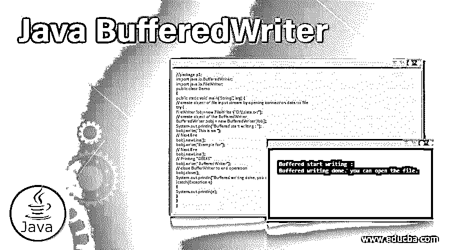
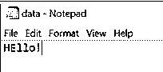
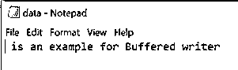
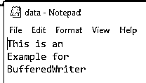

# Java BufferedWriter

> 原文：<https://www.educba.com/java-bufferedwriter/>




## Java BufferedWriter 简介

java BufferedWriter 是一个类，用于为向字符输出流写入文本提供缓冲。BufferedWriter 可以快速高效地写入字符、字符串和单个数组。BufferedWriter 类是 java 中的内置类，在 java.io.BufferedWriter 包中定义。

java.io.Writer 类是 BufferedWriter 的超类。可以指定也可以不指定缓冲区大小；如果没有指定缓冲区的大小，那么它的大小将是默认的大小，对于大多数用途来说已经足够大了。与 FileWriter 相比，BufferedWriter 写入大块数据，因此它用于使 Filewriter(低级类)更加高效和易于使用。

<small>网页开发、编程语言、软件测试&其他</small>

### 句法

以下是 java.io.BufferedWriter 类的声明。

```
public class BufferedWriter extends Writer
{
// Constructors and methods of the BufferedWriter class
}
```

以上是 BufferedWriter 的语法，这里扩展到了 Writer 类。

*   **BufferedWriter 类成员函数:**BufferedWriter 类包含构造函数和一些函数作为 buffered writer 类成员函数。

#### 构造器

*   **BufferedWriter(Writer out):**这个构造函数创建 buffered Writer 的一个实例，它使用输出缓冲区的默认大小。
*   **BufferedWriter( Writer out，int size):** 这个构造函数创建 BufferedWriter 的一个实例，它使用指定大小的输出缓冲区。

### BufferedWriter 类的函数

下面是提到的功能:

**1。write(int character):** 这个函数用来写单个字符。

**语法:**

```
public void writes (int character).
```

**2。write(char[] cbuf，int off，intlen):** 该函数用于将偏移量为 len bytes 的字符 cbufof 数组写入文件。

**语法:**

```
public void write(char[] cbuf, int off, intlen)
```

**3。write(String s，int off，intlen):** 这个函数用来将一个长度为 len 的字符串以偏移量 off 写入文件。

**语法:**

```
public void write(String s, int off, intlen)
```

**4。flush():** 该函数用于刷新输入流。

**语法:**

```
public void flush()
```

**5。这个函数用来写一个由系统属性 line.separator 定义的行分隔符。**

**语法:**

```
public void newLine()
```

**6。close():** 这个函数用来关闭文件，释放输入流资源。

**语法:**

```
public void close()
```

### 实现 Java BufferedWriter 的示例

工作和例子如下所述:

#### 示例#1

接下来，我们编写 java 代码来更清楚地理解 BufferedWriter 类。在下面的示例中，我们通过使用 BufferedWriter 类构造函数并传递文件名以写入字符来创建 BufferedWriter 对象，如下所示。

**代码:**

```
//package p1;
import java.io.BufferedWriter;
import java.io.FileWriter;
public class Demo
{
public static void main( String[] arg) {
// create object of file input stream by opening connection data.txt file
try {
FileWriter fobj=new FileWriter("D:\\data.txt");
// create object of the BufferedWriter
BufferedWriter bobj = new BufferedWriter(fobj);
System.out.println("Buffered start writing : ");
// Use write() function
bobj.write('H');
bobj.write('E');
// writing l
bobj.write(108);
bobj.write(108);
// writing o!
bobj.write('o');
bobj.write('!');
// Closing BufferWriter to end operation
bobj.close();
System.out.println("Buffered writing done. you can open the file.");
}catch(Exception e)
{
System.out.println(e);
}
}
}
```

上述代码的输出是


**Note:** While we are performing any write operations to the file, we should not keep open that file; if we do, then the file cannot be updated or written.

现在，如果我们打开 thedata.txt 文件，我们可以看到内容已写入，如下所示。




#### 实施例 2

接下来，我们编写 java 代码来更清楚地理解 BufferedWriter 类，其中我们创建了一个 BufferedWriter 对象来将字符串写入具有关联缓冲区的文件，如下所示。

**代码:**

```
//package p1;
import java.io.BufferedWriter;
import java.io.FileWriter;
public class Demo
{
public static void main( String[] arg) {
// create object of file input stream by opening connection data.txt file
try {
FileWriter fobj=new FileWriter("D:\\data.txt");
// create object of the BufferedWriter
BufferedWriter bobj = new BufferedWriter(fobj);
System.out.println("Buffered start writing : ");
int offs = 4;
String str = "This is an example for Buffered writer";
bobj.write(str,offs,str.length()-offs);
//CloseBufferWriter to end operation
bobj.close();
System.out.println("Buffered writing done. you can open the file.");
}catch(Exception e)
{
System.out.println(e);
}
}
}
```

上述代码的输出是:


当我们打开 data.txt 文件时，我们可以看到内容已写入，如下图所示:




#### 实施例 3

接下来，我们编写 java 代码来更清楚地理解 BufferedWriter 类，其中我们创建一个 BufferedWriter 对象来将字符串写入文件，并在写入时移动下一行；我们将使用 newLine()函数，如下所示。

**代码:**

```
//package p1;
import java.io.BufferedWriter;
import java.io.FileWriter;
public class Demo
{
public static void main( String[] arg) {
// create object of file input stream by opening connection data.txt file
try {
FileWriter fobj=new FileWriter("D:\\data.txt");
// create object of the BufferedWriter
BufferedWriter bobj = new BufferedWriter(fobj);
System.out.println("Buffered start writing : ");
bobj.write("This is an ");
// Next line
bobj.newLine();
bobj.write("Example for");
// Next line
bobj.newLine();
// Printing "GEEKS"
bobj.write("BufferedWriter");
// close BufferWriter to end operation
bobj.close();
System.out.println("Buffered writing done. you can open the file.");
}catch(Exception e)
{
System.out.println(e);
}
}
}
```

上述代码的输出是:


如果我们打开 data.txt 文件，我们可以看到内容已写入，如下所示:




### 结论

BufferedWriter 是 java 中的一个内置类，用于为将文本写入字符输出流提供缓冲。BufferedWriter 类是在 java.io.BufferedWriter 包中定义的。该类通常用于需要快速高效编写的应用程序中。

### 推荐文章

这是一个 Java BufferedWriter 的指南。在这里，我们讨论 Java BufferedWriter 的介绍，包括语法、构造函数、函数和示例，以便更好地理解。您也可以浏览我们的其他相关文章，了解更多信息——

1.  [Java 中的关联](https://www.educba.com/association-in-java/)
2.  [终于在 Java 中](https://www.educba.com/finally-in-java/)
3.  [Java 中的 copy()](https://www.educba.com/copy-in-java/)
4.  [JavaScript 中的 linked list](https://www.educba.com/linkedlist-in-javascript/)


