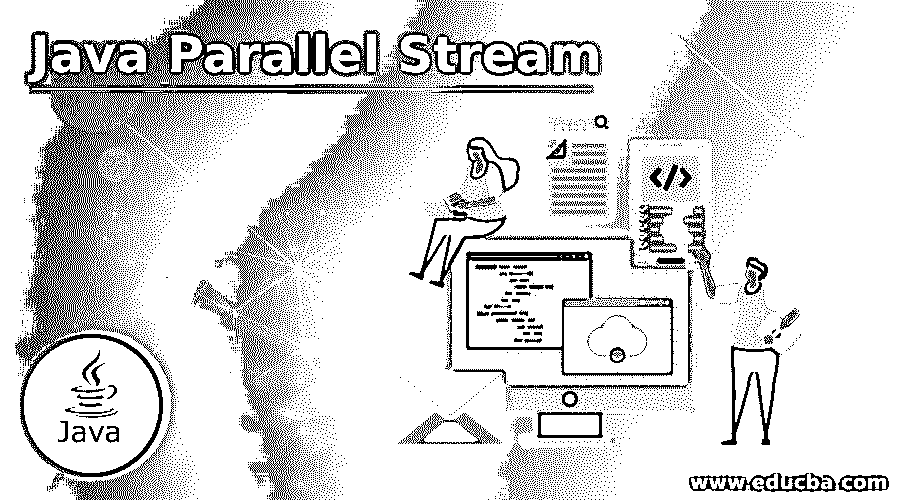
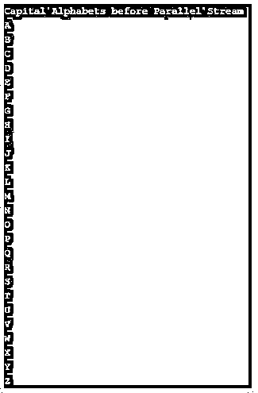
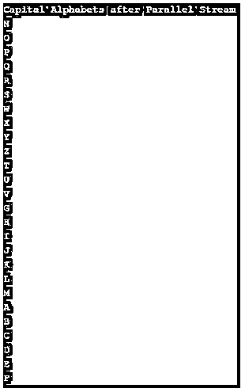
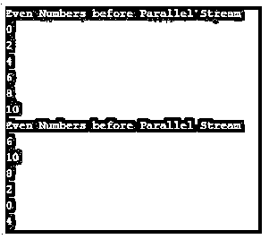
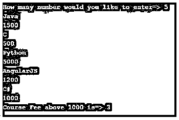
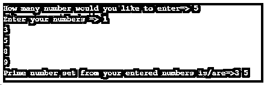

# Java 并行流

> 原文：<https://www.educba.com/java-parallel-stream/>




## Java 并行流简介

并行流是支持各种功能的对象的并行流，这些功能可以用来产生预期的输出。并行流不是一种允许用户从集合、数组、Java 输入和输出 API 输入的数据结构。并行流不会改变功能的实际行为，但它可以根据应用的过滤器(管道)提供输出。并行流是 Java 函数式编程的一部分，在 Java 8 <sup>th</sup> 版本之后出现。并行流是 Lambda 表达式的额外优势。

**用 Java 实现并行流的方法**

<small>网页开发、编程语言、软件测试&其他</small>

*   parallelStream()方法
*   parallel()方法

### Java 中的并行流是如何工作的？

它基于对集合应用的 parallelStream()方法或对流应用的 parallel()方法。

**语法:**

```
List<Object> list=new ArrayList<Object>();
list.parallelStream();
```

**说明:**

*   首先，我们创建一个数组列表集合。
*   在数组集合上应用了 paralleStream()方法。
*   我们得出结论，parallelStream()只适用于集合。

**语法:**

```
IntStream inStream=IntStream.rangeClosed(initialValue, finalValue);
inStream.parallel();
```

**说明:**

*   首先，我们创建一个 IntStream 流。
*   在流上应用 parallel()方法。
*   我们得出结论，parallel()只适用于流。

### 例子

下面是一些例子:

#### 示例#1

parallelStream()应用于大写字母。

**代码:**

```
import java.util.ArrayList;
import java.util.List;
public class ParalleStreamOnAlphabets {
public static void main(String[] args) {
System.out.println("Capital Alphabets before Parallel Stream");
// creating array list for adding alphabets
List<String> capitalAlphabets = new ArrayList<>();
int ascilCode = 65; // Ascii value of A=65 and Z=90
while (ascilCode <= 90) { // iterating ascii values
char alphabets = (char) ascilCode; // converting integer to character
capitalAlphabets.add(String.valueOf(alphabets)); // adding Capital alphabets to list
ascilCode++;// pre increment operator
}
// displaying initial Alphabets
capitalAlphabets.stream().forEach(System.out::println);
System.out.println("Capital Alphabets after Parallel Stream");
// inserting all elements to another list to apply parallelStream
// operation without modifying previous array list
List<String> captatlAlphabetsParalleStream = capitalAlphabets;
//applying parallelStream() on new array list
captatlAlphabetsParalleStream.parallelStream().forEach(System.out::println);
}
}
```

**输出:**







**说明:**

*   正如您在应用并行流之前看到的输出，我们得到了顺序输出。
*   但是当我们应用并行流时，我们得到的是并行输出的锯齿形方式。

#### 实施例 2

应用于偶数的 parallelStream()。

**代码:**

```
import java.util.ArrayList;
import java.util.List;
public class ParallelStreamEvenNumbers {
public static void main(String[] args) {
System.out.println("Even Numbers before Parallel Stream");
// creating array list for adding alphabets
List<Integer> evenNumbers = new ArrayList<Integer>();
for (int number=0;number<=10;number++) { // iterating numbers
if(number%2==0) //if number even go inside the condition
evenNumbers.add(number); //added all even numbers
}
// displaying initial even numbers
evenNumbers.stream().forEach(System.out::println);
System.out.println("Even Numbers before Parallel Stream");
// inserting all elements to another list to apply parallelStream
// operation without modifying previous array list
List<Integer> captatlAlphabetsParalleStream = evenNumbers;
// applying parallelStream() on new array list
captatlAlphabetsParalleStream.parallelStream().forEach(System.out::println);
}
}
```

**输出:**




**说明:**

*   正如您在应用并行流之前看到的输出，我们得到了顺序输出。
*   但是当我们应用并行流时，我们得到的是并行输出的锯齿形方式。

#### 实施例 3

parallelStream()应用于课程费用。

**代码:**

```
import java.util.ArrayList;
import java.util.List;
import java.util.Scanner;
import java.util.stream.Stream;
public class ParallelStreamCourseFee {
public static void main(String[] args) {
Scanner scanner = new Scanner(System.in);
System.out.print("How many number would you like to enter=>");
int inputNumber = scanner.nextInt(); // asking user for number count
List<Courses> courseWithFee = new ArrayList<Courses>();// creating array
String coursename = "";
int courseFee = 0;
for (int i = 0; i < inputNumber; i++) {
coursename = scanner.next();//taking course name input
courseFee = scanner.nextInt();//taking course fee input
courseWithFee.add(new Courses(coursename, courseFee));//adding course name and fee
}
//get the stream list which courses fee is >1000
Stream<Courses> list = courseWithFee.parallelStream().filter(e -> e.getCourseFee() > 1000);
//displaying courses count which is fee is >1000
System.out.println("Course Fee above 1000 is=> " + list.count());
scanner.close();
}
}
//courses class
class Courses {
String course;
int courseFee;
public Courses(String course, int courseFee) {
this.course = course;
this.courseFee = courseFee;
}
public String getCourse() {
return course;
}
public void setCourse(String course) {
this.course = course;
}
public int getCourseFee() {
return courseFee;
}
public void setCourseFee(int courseFee) {
this.courseFee = courseFee;
}
}
```

**输出:**




**说明:**

*   正如您在输出中看到的，我们必须考虑课程费用> 1000。

#### 实施例 4

parallel()应用于奇数计数。

**代码:**

```
import java.util.stream.IntStream;
public class Main {
public static void main(String[] args) {
// Taking InStream with range of 1 to 1000
//On rane() applied parallel method
//On parallel() method applied filter to decide whether given number odd or not
//after getting odd numbers we simply displaying odd numnbers count
int oddNumberCount = (int) IntStream.range(1, 1000).parallel().filter(value -> oddOrNot(value)).count();
//displaying odd number count
System.out.println("Count of Odd Number from 1-1000 range is => " + oddNumberCount);
}
public static boolean oddOrNot(int inputNumber) {
//checking first number >0 and then checking range from 1 tom 1000
//next checking odd number or not within nonMatch method
return inputNumber > 0
&& IntStream.rangeClosed(1, inputNumber).noneMatch(temp -> inputNumber % 2 == 0);
}
}
```

**输出:**


**说明:**

*   如您所见，并行方法只能应用于流。

#### 实施例 5

parallel()应用于质数。

**代码:**

```
import java.util.ArrayList;
import java.util.List;
import java.util.Scanner;
import java.util.function.IntPredicate;
import java.util.stream.Collectors;
import java.util.stream.IntStream;
public class ParallelPrimeNumber {
public static void main(String[] args) {
Scanner scanner = new Scanner(System.in);
System.out.print("How many number would you like to enter=>");
int inputNumber = scanner.nextInt(); //asking user for number count
System.out.print("Enter your numbers =>");
List<Integer> listNumbers = new ArrayList<Integer>();//creating array list
for (int i = 0; i < inputNumber; i++) {
listNumbers.add(scanner.nextInt());//adding user elements into an array
}
//checking the entered numbers are prime or not
//filter(ParallelCount::isPrime) ParallelCount is class name and primeNumberOrNot method
List<Integer> primeOut = listNumbers.stream().filter(ParallelPrimeNumber::primeNumberOrNot).collect(Collectors.toList());
System.out.print("Prime number set from your entered numbers is/are=>");
for (Integer i : primeOut) {
System.out.print(i+" ");//displaying prime numbers
}
scanner.close();
}
public static boolean primeNumberOrNot(int i) {
//IntPredicate checks the number whether even, odd, prime etc. based on condition
IntPredicate trueOrNot = index -> i % index == 0;
//return true if entered number is prime else returns false
return i > 1 && IntStream.range(2, i).noneMatch(trueOrNot);
}
}
```

**输出:**




**说明:**

*   在上面的代码中可以看到，即使是 streams 上的并行方法也执行素数、偶数、奇数等。，逻辑。

### Java 并行流的优势及应用

下面给出了优点和应用:

#### 优势

*   比普通过滤器更有效地提高 CPU 利用率。
*   并行流一次处理多个数据。

#### 应用程序

*   与聚合功能一起使用。
*   用于更大规模的集合框架。
*   与顺序流一起使用。

### 结论

这是通过集合上的 parallelStream()方法和流上的 parallel()方法实现的。并行流减少了处理时间，所以它大多使用大集合数据。

### 推荐文章

这是一个 Java 并行流的指南。在这里我们讨论 Java 中并行流的介绍、工作原理、例子、优点和应用。您也可以看看以下文章，了解更多信息–

1.  [Java 集合类](https://www.educba.com/java-collections-class/)
2.  [Java 中的 group layout](https://www.educba.com/grouplayout-in-java/)
3.  [Java 缓冲器](https://www.educba.com/java-bufferedreader/)
4.  [Java PrintWriter](https://www.educba.com/java-printwriter/)


