# 如何用 Java 创建 Webservice？

> 原文：<https://www.educba.com/how-to-create-webservice-in-java/>

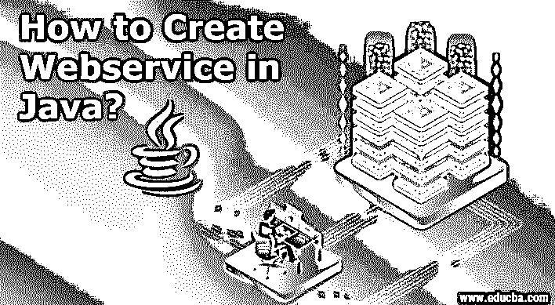


## Java web service 简介

如今，互联网已经成为我们生活中不可分割的一部分。我们通过网络服务从互联网上的不同网络应用程序获得服务。因此，webservice 对于运行互联网活动是不可避免的。在本文中，我们将讨论如何使用 java 编程语言创建 web 服务。在这个主题中，我们将学习如何用 Java 创建 Webservice。

### Java 中的 Webservice 是什么？

Web 服务主要负责不同编程语言之间的通信，这是通过网络实现的。例如，PHP 可以与。NET 通过 web 服务。基本上，它通过网络提供跨语言交流。因此，那些可以通过网络访问的服务就是 web 服务。

<small>网页开发、编程语言、软件测试&其他</small>

但是还有一个项目叫做 web 应用程序，用户也可以访问它。但是 web 应用程序在许多方面与 web 服务有很大的不同。可以使用 Web 浏览器访问 web 应用程序，并且应用程序采用简单、可读的格式。但是 web 服务可以访问 JSON 、XML 等格式的[数据。](https://www.educba.com/what-is-json/)

Web 服务使用 REST 或 [SOAP 协议](https://www.educba.com/what-is-soap/)，而 web 应用程序遵循 HTTPs/HTTP 协议。基本上，web 应用程序使用 Web 服务进行数据获取和操作。Web 应用程序是有状态的，这意味着它们可以存储用户会话，但是 web 服务不能。

总而言之，web 服务和 web 应用程序是两个不同的东西，服务于不同的目的。

### Java 中的 Web 服务类型

让我们看看不同类型的 web 服务:

#### 1.肥皂

这基本上是基于微软创造的 XML。因为一个长而简单的对象访问协议是设计和开发 web 服务的标准。XML 为 SOAP 提供了语言独立性。因此，客户端和服务器应用程序属于不同的语言；SOAP 可以提供无缝服务，确保客户端和服务器通信的顺畅操作。

#### 2.休息

它允许许多格式，如 JSON、XML 等。这个特性给了 REST 更好的灵活性。基于表述性状态转移(REST)的 web 服务因其简单性和与 web 客户端的更好集成而在当今得到广泛使用。因为 REST 支持 JSON，所以它提供了比 SOAP 更快更容易的解析。许多公司，如 Google、Amazon 和 Yahoo，都在他们的 web 服务中使用 REST。

### Java Web 服务

Java 内置了 SOAP 和 REST 的 APIs 您可以使用它们创建自己的 web 服务。对于 SOAP，java 有 JAX-WS。至于休息，java 有 JAX-RS。根据您的需求，您可以编写基于 JAS WS 或 JAX RS 的 web 服务。JAX-WS 和 [JAX-RS 都与标准 JDK 集成](https://www.educba.com/jax-rs/),因此你不需要外部 jar 来获得所需的库。Web 服务描述语言(WSDL)是 java web 服务与其他 web 服务或应用程序交互的语言。

#### 1.JAX 新闻

对于 XML Web Services (JAX-WS)，Java API 基本上是一个基于 SOAP 的 Web 服务，用 Java 编写，用于客户端-服务器应用程序。因为它基于 SOAP，所以它纯粹基于 XML。它使用各种注释来简化服务器中 web 服务的整体构建和部署。编写 JAX-WS 时你可以遵循两种风格:文档风格和 [RPC](https://www.educba.com/what-is-rpc/) 风格

#### 2.JAX 遥感中心

用于 RESTful Web 服务的 Java API 基本上是一个基于 REST 的 Web 服务，用 Java 编写，用于客户端-服务器应用程序。因为它基于 REST，所以它基于 JSON，XML。它还使用各种注释来简化服务器中 web 服务的整体构建和部署。编写 JAX-WS 时有两种风格可以遵循:RESTeasy 和 Jersey 风格。

### 如何用 Java 创建 Webservice？

这里我们将使用 Eclipse IDE 来实现这一点。您只需要按照下面提到的截图一步一步地用 java 创建一个简单的 web 服务。

**第一步:**打开月食>

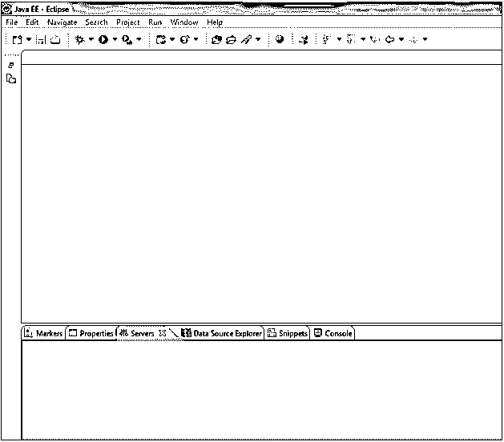


在 server 选项卡上，添加一个服务器(这里我使用的是 tomcat ),您将在其中运行您的 web 服务。

**第二步:**右键点击服务器标签>新建>服务器>选择 Apache tomcat 6 >完成。

之后，您可以看到服务器被创建为“停止”状态；我们将在运行应用程序之前启动服务器。

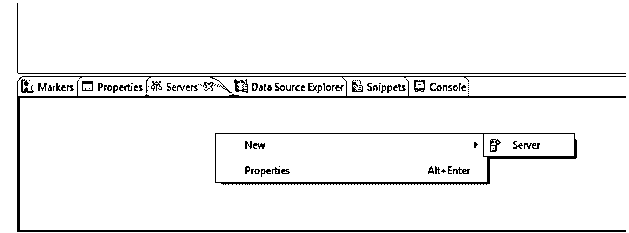


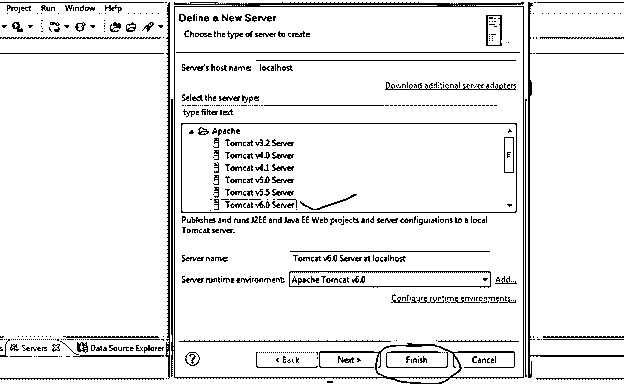


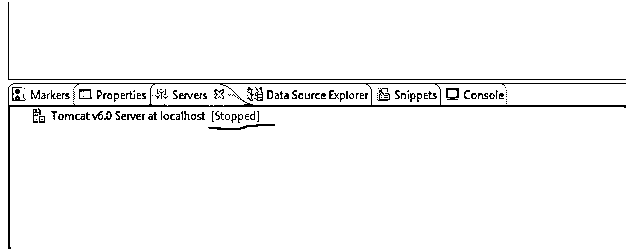


现在我们将启动我们的服务器。

第三步:右键点击 tomcat >开始

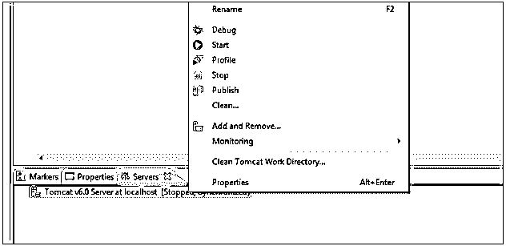


现在我们将打开 java EE 项目浏览器。

第四步:点击恢复>你会看到项目浏览器

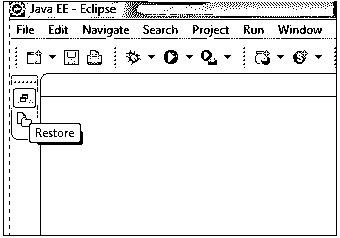


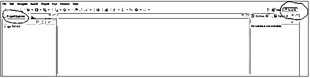


现在我们将创建我们的 web 服务。

**第五步:**文件>新建>动态网页项目

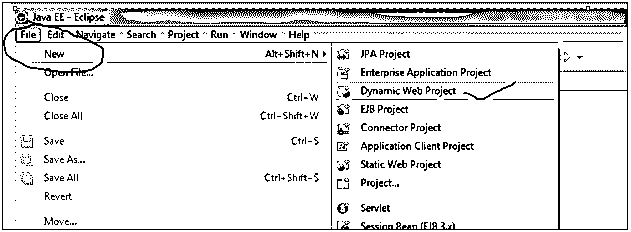


你能给它起个名字吗(这里，WebAdder)？按照下面的图片，做完全一样的事情。

**第六步:**点击下一步>完成

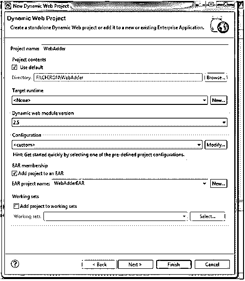


您将看到您的项目添加如下

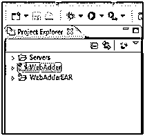


现在创建一个类。

**第七步:**右键点击【web adder】>新建>类

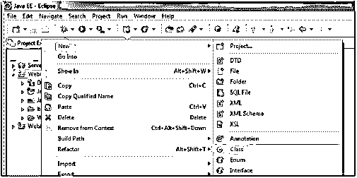


**第八步:**按照下图>完成，给它一个名称和包名。

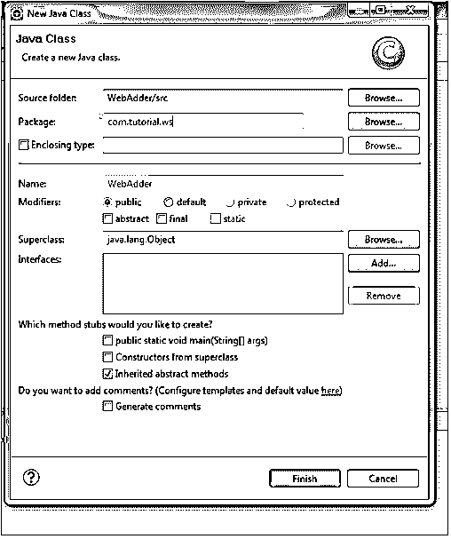


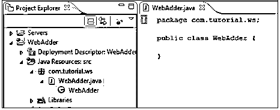


这个类将充当 web 服务，所以我们在这个类中编写的任何方法都将充当 web 服务方法。

**第九步:**下面是代码:

```
package com.tutorial.ws;
public class WebAdder {
public int addition (int nm1, int nm2){
return nm1+nm2;
}
// above method just doing addition
}
```

现在我们想把类和方法做成一个 web 服务；为此，我们需要做到以下几点:

**第十步:**右键点击 WebAdder 类>新建>其他> Webservice >接下来

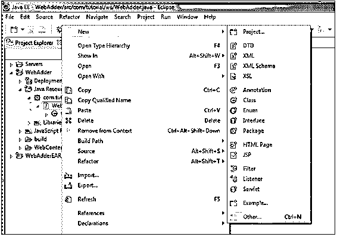


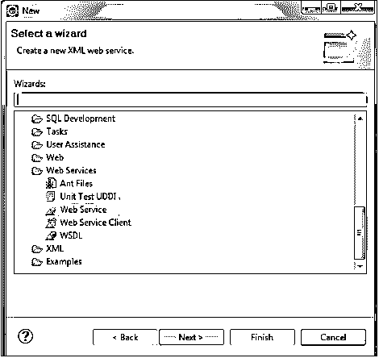


在下面的截图中，请注意突出显示的部分；我们在这里创建客户机也是为了测试我们的 web 服务。按照下面截图中突出显示部分提到的内容，点击“下一步”

第十一步:点击下一步>“完成”

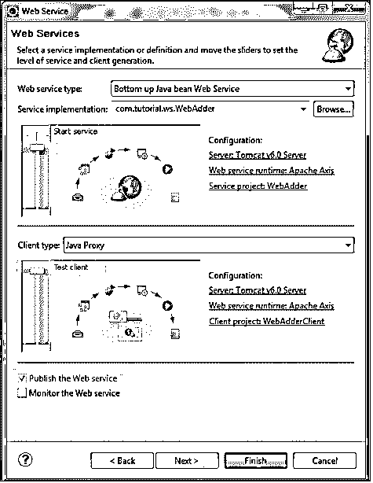


在下一页，如下面的截图所示，您可以看到，addition()方法变成了一个 web 服务方法，它将出现在 WSDL 文档中。

**步骤 12:** 现在你可以看到，你的客户端正在服务器上运行，在这里你需要点击你的 web 方法“addition”，

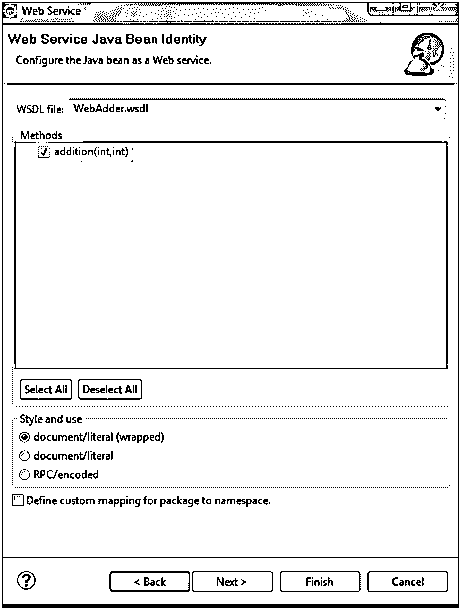


**步骤 13:** 然后，你会看到两个字段 num1 和 num2 来提供用户输入。参考下面的截图:

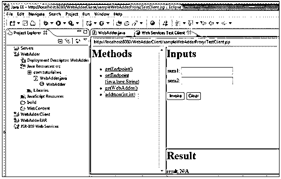


**步骤 14:** 给一些随机整数值得到结果

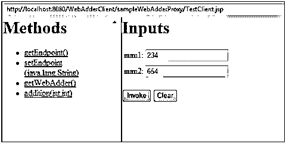


**第十五步:**点击“调用”按钮后，会看到结果。恭喜你，你已经完成了用 java 构建你的第一个 web 服务！

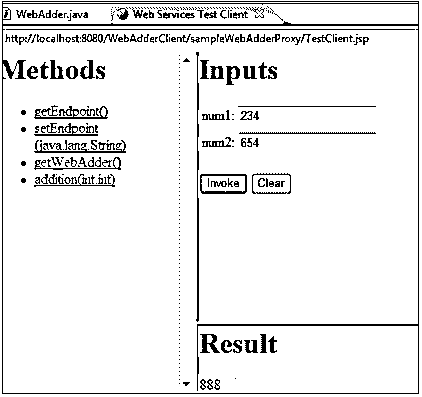


### 推荐文章

这是一个如何用 Java 创建 Webservice 的指南？这里我们讨论什么是 Java 中的 web 服务；在上面一步一步的例子中，我们已经展示了如何用 java 创建 web 服务。您也可以阅读以下文章，了解更多信息——

1.  [SOAP Web 服务面试问题](https://www.educba.com/soap-web-services-interview-questions/)
2.  [Web 服务面试问题](https://www.educba.com/web-services-interview-questions/)
3.  [网站服务](https://www.educba.com/website-services/)
4.  [网络服务的类型](https://www.educba.com/types-of-web-services/)


