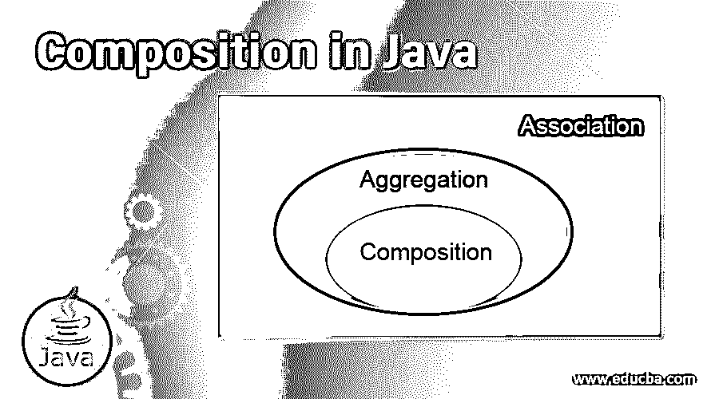
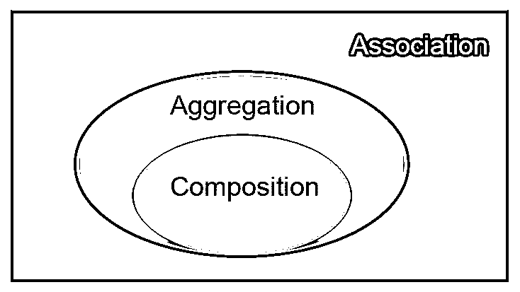
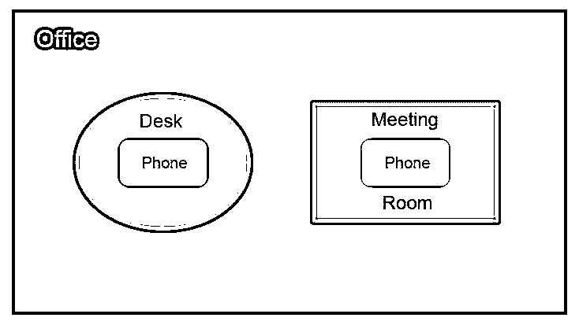
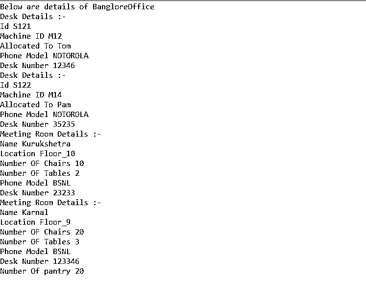

# Java 中的合成

> 原文：<https://www.educba.com/composition-in-java/>




## **Java 中组合的定义**

 **组合是一种关联类型，用于表示两个对象之间的“部分”关系。java 中的组合是另一种类型的关联聚合的受限形式，在这种情况下,“Has-a”关系中的两个实体有它们自己的存在，并且不相互依赖。在组合中，其中一个实体包含在其他实体中，不能单独存在。不像[继承用来](https://www.educba.com/inheritance-in-java/)表示的是-一种关系。

例如，有两个类汽车和引擎，汽车是由一个引擎对象组成的，没有汽车引擎实体就不存在。

<small>网页开发、编程语言、软件测试&其他</small>




******语法:******

 **```
class C1{
// A class represents the dependent entity
}
class C2{
//This class represents the entity that contains the dependent entity by declaring the object of the above class as one of its member variables.
private C1 a;
}
```

使用上述语法，我们能够建立上述两个实体之间的“部分”关系，其中 C1 依赖于另一个实体的存在。同样，可以说明依赖对象的存在是可选的。

### **为什么我们在 Java 中需要组合？**

 **当使用继承来表示两个实体时，我们可以看到，只有 IS-A 关系可以存在。但是如果两个实体之间包含 has-a 关系，那么就需要聚合。聚合有两种不同的类型:

#### **1。联合**

 **这用于表示这样的关系，其中两个实体存在 HAS-A 关系，但是其中一个实体的存在不依赖于其他实体。此外，它是一种单向类型的关联。例如，银行和雇员是两个实体，其中银行的单个实体可以与一个以上的雇员相关；因此，银行与雇员有一对多的关系，但不存在反过来的关系。

#### **2。作文**

 **这是一种限制性的关联类型，当两个实体中的一个在另一个容器实体中组合时使用。没有容器对象，组合实体就不能存在。但是可以有一个空的组合实体。因此，它被用来表示双向的部分关系；因此，这两个实体相互依赖。

### **Java 中的复合是如何工作的？**

 **因为组合用于实现两个实体之间的部分类型的关系，所以一个实体被称为容器，而另一个是组合的实体。合成的实体就像一个完整的容器对象，它有自己的属性和操作，从而为它制作了一个单独的实体。这也有助于代码重用，因为这个类可以作为一个组合实体在其他容器类中使用。例如，发动机是一个组合类，而汽车、二轮车等。，可以是它的容器类。

由于组合类是容器实体的一部分，两者相互依赖。但是，一个组合类可以是空的，比如汽车不需要强制安装引擎。这样，组合类的存在完全依赖于容器类。此外，由于组合是一种类型关联，因此部分关系也被称为 HAS-A 关系的子类。这样，组合有助于在不使用继承的情况下实现两个相互依赖的实体之间的关系。

### 用 Java 实现合成的示例

考虑由不同列表组成的办公室的情况，例如桌子、会议室。桌面对象进一步由电话对象组成，因为每张桌子都有一部桌面电话。




#### Phone.Java

**代码:**

```
package Try;
public class Phone {
private String Model;
private String contactNum;
Phone (String model, String num){
this.Model=model;
this.contactNum=num;
}
public void getPhoneDetails(){
System.out.println("Phone Model "+ this.Model);
System.out.println("Desk Number " + this.contactNum);
}
}
```

#### Desk.Java

**代码:**

```
package Try;
public class Desk {
private String id;
private String Mid;
private Phone deskNum;
private String personName;
Desk(String id,String mid,Phone contact,String name){
this.id=id;
this.Mid = mid;
this.deskNum=contact;
this.personName=name;
}
public void getDeskDetails(){
System.out.println("Desk Details :-");
System.out.println("Id " + this.id);
System.out.println("Machine ID "+ this.Mid);
System.out.println("Allocated To " + this.personName);
this.deskNum.getPhoneDetails();
}
}
```

#### 会见 Room.Java

**代码:**

```
package Try;
public class MeetingRoom {
private String name;
private Phone contact;
private String location;
private int numChairs;
private int numTables;
MeetingRoom(String name,Phone contact,String location,int nChairs, int nTables){
this.name=name;
this.contact=contact;
this.location=location;
this.numChairs=nChairs;
this.numTables=nTables;
}
public void getMeetingRoomDetails(){
System.out.println("Meeting Room Details :-");
System.out.println("Name " +this.name);
System.out.println("Location "+ this.location);
System.out.println("Number OF Chairs " + this.numChairs);
System.out.println("Number OF Tables "+this.numTables);
contact.getPhoneDetails();
}
}
```

#### Office.java

**代码:**

```
package Try;
import java.util.List;
public class Office {
private String offcName;
private List<Desk> deskList;
private List<MeetingRoom> roomList;
private int pantryNum;
public Office(String name , List<Desk> dList, List<MeetingRoom> mList,int pnum){
this.offcName = name;
this.deskList = dList;
this.roomList = mList;
this.pantryNum =pnum;
}
public void getDetails(){
System.out.println("Below are details of "+ offcName +"Office");
for(Desk a:deskList){
a.getDeskDetails();
}
for(MeetingRoom m:roomList){
m.getMeetingRoomDetails();
}
System.out.println("Number Of pantry " + pantryNum );
}
}
```

#### Demo.Java

**代码:**

```
package Try;
import java.awt.*;
import java.awt.event.*;
import java.awt.geom.*;
import java.util.ArrayList;
import java.util.List;
public class Demo extends Frame {
public static void main(String[] args){
List<Desk> dList =new ArrayList<Desk>();
List<MeetingRoom> mList =new ArrayList<MeetingRoom>();
Phone p1=new Phone("NOTOROLA","12346");
Phone p2=new Phone("NOTOROLA","35235");
Phone p3=new Phone("BSNL","23233");
Phone p4=new Phone("BSNL","123346");
Desk d1 =new Desk("S121","M12",p1,"Tom");
Desk d2 =new Desk("S122","M14",p2,"Pam");
dList.add(d1);
dList.add(d2);
MeetingRoom m1=new MeetingRoom("Kurukshetra",p3,"Floor_10",10, 2);
MeetingRoom m2=new MeetingRoom("Karnal",p4,"Floor_9",20, 3);
mList.add(m1);
mList.add(m2);
Office o1= new Office("Banglore" , dList,  mList,20);
o1.getDetails();
}
}
```

****输出:****




****解释:**** 在上面的程序中，办公对象由一列办公桌和会议室实体组成，其中更进一步的办公桌和会议室由一个电话实体组成。在这里，电话总是与桌子或会议室对象相关，因此不存在。此外，会议室和办公桌也依赖于办公用品。在这里，单个 Phone 类可以作为一个组合实体在桌子和会议室中使用，从而有助于实现代码的可重用性。

### 结论

它是一种限制性的聚合类型，用于实现两个实体之间的部分关系，这两个实体具有双向关系，并且具有没有容器实体就不存在的组合实体。这是有益的，因为在组合类中所做的任何更改都不会影响其余的代码和代码重用。

### 推荐文章

这是一个 Java 写作指南。在这里，我们讨论定义和为什么我们需要在 Java 中组合，以及一个例子和代码实现。您也可以看看以下文章，了解更多信息–

1.  [Java RuntimeException](https://www.educba.com/java-runtimeexception/)
2.  [Java 中的字符串类](https://www.educba.com/string-in-java/)
3.  [Java 时期](https://www.educba.com/java-period/)
4.  [Java 中的字符串类](https://www.educba.com/string-class-in-java/)


************